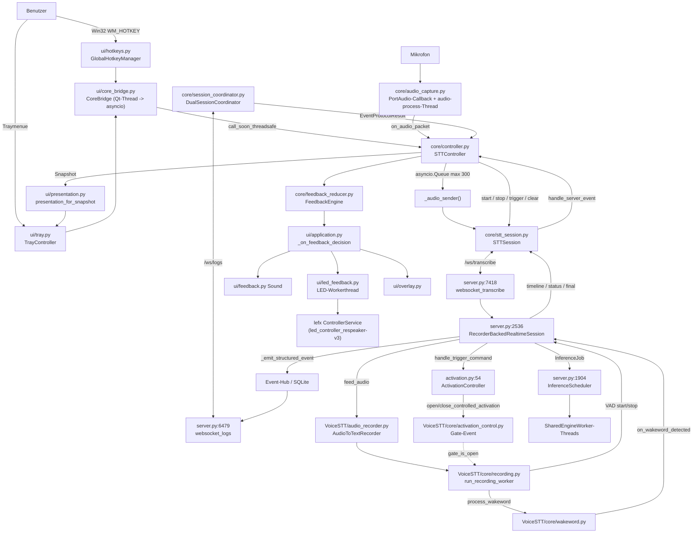

# CODE_ARCHITECTURE_BASELINE

**Phase A – Ist-Zustand ohne Sollbewertung.**
Quelle ist ausschließlich der Produktivcode im Working Tree, Branch
`feat/einheitliche-triggerarchitektur`. Tests wurden für dieses Dokument nicht
als Wahrheit verwendet.

> **Offenlegung.** Zielbildspezifikation und ein früherer Diagnosebericht waren
> aus einem vorangegangenen Auftrag bereits im Kontext des Analysierenden. Um
> die Code-Only-Regel dennoch einzuhalten, wurde in Phase A **jede** Aussage neu
> am Code belegt (Repo/Datei/Zeile/Funktion). Aussagen ohne Codebeleg sind
> ausdrücklich als `UNGEKLÄRT` markiert. Ein Befund dieser Aufnahme widerspricht
> dem früheren Bericht ausdrücklich (Wake-Word-Katalog, siehe §1.2 und
> `TARGET_MIGRATION_MAP.md`).

---

## 1. Gesamtsystem und Repository-Grenzen

### 1.1 voice-stt-client

**Fachliche Verantwortung:** Windows-Desktop-Client. Nimmt Mikrofonaudio auf,
überträgt es, empfängt Transkripte und fügt sie in das Zielfenster ein. Bietet
Tray, Overlay, globale Hotkeys, Verlauf, Sound- und LED-Feedback.

**Runtime-Verantwortung:** Drei kooperierende Ausführungswelten in einem
Prozess:

| Welt | Träger | Einstieg |
|---|---|---|
| Qt-GUI-Thread (Mainthread) | `QApplication` | `ui/application.py:666` `run_gui` |
| asyncio-Core-Thread | `threading.Thread(name="RealtimeSTT-AsyncCore", daemon=False)` | `ui/core_bridge.py:78-84`, Loop in `_thread_main` `ui/core_bridge.py:91-119` |
| Geräte-/Worker-Threads | Audio, Injection, LED | siehe `RUNTIME_FLOWS_AND_CONCURRENCY.md` §3 |

**Einstiegspunkte:**

* `app.py:143` `main(argv)` → `argparse`; ohne `--headless` Import und Aufruf
  von `ui.application.run_gui` (`app.py:153-155`).
* `app.py:104` `run_headless(config)` → `asyncio.run(client.run())`
  (`app.py:120`) mit `RealtimeSTTClient(STTController)` (`app.py:31`).
* `app.py:159` `multiprocessing.freeze_support()` für den PyInstaller-Build.

**Langfristig laufende Prozesse/Threads/Tasks:** vollständige Tabelle in
`RUNTIME_FLOWS_AND_CONCURRENCY.md` §3. Kurz: 1 Qt-Loop, 1 asyncio-Loop mit vier
Dauer-Tasks, 1 PortAudio-Callbackthread, 1 Audio-Verarbeitungsthread, 1
Injection-Workerthread (non-daemon), 1 LED-Workerthread, 3 QTimer.

**Zustandsbesitzer:**

| Zustand | Besitzer | Datei |
|---|---|---|
| Diktat-/Aufnahmezustand (clientseitig) | `STTController` | `core/controller.py:293-322` |
| Transport-/Sessionzustand | `STTSession` | `core/stt_session.py:496-530` |
| Eventstream-Generation und Token | `DualSessionCoordinator` | `core/session_coordinator.py:96-104` |
| Feedback-Schattenzustand | `FeedbackEngine` | `core/feedback_reducer.py:451-474` |
| Konfiguration zur Laufzeit | `STTController.config` | `core/controller.py:1285-1297` |
| Sichtbarer Trayzustand | `TrayController` | `ui/tray.py:126-132` |

**Relevante öffentliche Schnittstellen:**
`STTController` (`start_dictation`, `stop_dictation`, `toggle_dictation`,
`primary_dictation_action`, `extend_dictation_window`, `cancel_dictation`,
`apply_runtime_config`, `handle_server_event`, `run`, `shutdown`),
`CoreBridge` (Qt-Signale + threadsichere Kommandos, `ui/core_bridge.py:26-35`),
`STTSession` (`send_start`, `send_stop`, `send_clear`, `send_audio`,
`send_trigger`, `request_trigger`, `invalidate_connection`, `reconfigure`).

**Beziehungen:**
→ `voice-stt-server` über zwei WebSockets (`/ws/transcribe`, `/ws/logs`).
→ `led_controller_respeaker-v3` als **importierte Python-Bibliothek** (`lefx`)
im selben Prozess, nicht als Dienst: `core/led_controller.py:310`
`from lefx.interfaces import ControllerService`.

---

### 1.2 voice-stt-server

**Fachliche Verantwortung:** Aufnahme-, VAD-, Wake-Word-, Transkriptions- und
Activation-Autorität. Verwaltet Sessions, Modelle, Scheduler und den
Eventspeicher.

**Runtime-Verantwortung:** ASGI-Anwendung unter uvicorn mit einer Vielzahl
eigener Threads und pro Session einem Recorder samt Kindprozessen.

**Einstiegspunkte:**

* `api_fastapi_server/server.py:8119` `main(argv)` → `parse_args` →
  `settings_from_args` → `uvicorn.run(create_app(settings), …)`
  (`server.py:8136-8141`).
* `server.py:5876` `create_app(settings, scheduler_factory, recorder_factory)`
  baut `ConnectionManager` (`server.py:5902`) und `VoiceSTTService`
  (`server.py:5903-5908`); `lifespan` startet den Dienst
  (`server.py:5909-5913`).

**Langfristig laufende Threads:**

| Thread | Start | Datei |
|---|---|---|
| `VoiceSTTServerReady` | `VoiceSTTService.start` | `server.py:4553-4558` |
| `VoiceSTTModelIdleMonitor` | dito | `server.py:4560-4564` |
| `VoiceSTT-<name>-Inference` (je Engine-Lane) | `SharedEngineWorker.start` | `server.py:1777-1782` |
| `VoiceSTTSessionText-<sid>` (je Session) | Konstruktor | `server.py:2612-2617` |
| `VoiceSTTActivationTimeout-<sid>` (je Deadline) | `_arm_activation_timer_locked` | `server.py:3202-3208` |
| `VoiceSTTSessionWakeFollowup-<sid>` | `_start_wakeword_followup_window` | `server.py:3977-3982` |
| `VoiceSTTSessionForceFinalize-<sid>` | `_enforce_recording_duration` | `server.py:4289-4293` |
| Recorder: `run_recording_worker`, `run_realtime_worker`, `read_stdout_pipe` | `_start_worker_threads` | `VoiceSTT/core/initialization.py:649-678` |
| Recorder-Kindprozess Transkription | `start_recorder_worker` | `VoiceSTT/core/initialization.py:432-454`, `VoiceSTT/core/runtime.py:17-32` |

**Zustandsbesitzer:**

| Zustand | Besitzer | Datei |
|---|---|---|
| Activation-Lifecycle | `ActivationController` | `api_fastapi_server/activation.py:54-387` |
| Recorder-Gate | Recorderinstanz, Funktionen in | `VoiceSTT/core/activation_control.py:29-195` |
| Session-Status/Streaming/Segmente | `RecorderBackedRealtimeSession` | `server.py:2536-4354` |
| Aufnahme-/VAD-Entscheidung | `run_recording_worker` | `VoiceSTT/core/recording.py:34-469` |
| Sessionregister | `SessionStore` | `server.py:4355-4461` |
| Modelle/Scheduler | `VoiceSTTService`, `InferenceScheduler` | `server.py:4462`, `server.py:1904` |
| Eventspeicher/Replay | Event-Hub (`service.events`) | Aufrufe u. a. `server.py:4138-4164` |

**Relevante öffentliche Schnittstellen:** HTTP-API (`/health`, `/api/config`,
`/api/models*`, `/api/wake-word`, `/api/logs/*`, `/v1/audio/transcriptions`),
WebSockets `/ws/transcribe` (`server.py:7418`) und `/ws/logs`
(`server.py:6479`).

**Wake-Word-Katalog (wichtiger Einzelbefund):** Der Server veröffentlicht in
`hello.sessionCapabilities.wakeWord.availableWakeWords` einen **realen
Katalog** mit `id`, `label`, `availableFormats` und `default`
(`server.py:4943-4971`), gespeist aus
`VoiceSTT/core/openwakeword_catalog.py:210-236` (Manifest plus Verzeichnisscan).
Der Client speichert `sessionCapabilities` (`core/stt_session.py:1184-1186`),
liest daraus aber ausschließlich `activationTriggers`
(`core/stt_session.py:573-578`). Der Katalog wird also geliefert und nicht
konsumiert.

**Beziehungen:** Bedient `voice-stt-client` und den mitgelieferten
Browserclient (`app_browserclient/client.js`). Kennt das LED-Repository nicht.

---

### 1.3 led_controller_respeaker-v3

**Fachliche Verantwortung:** Ansteuerung des ReSpeaker-XVF3800-LED-Rings über
eine Effekt-/Preset-Engine (`lefx`).

**Runtime-Verantwortung:** Keine eigene. Läuft als Bibliothek im
Client-Prozess; die Renderschleife gehört `lefx.interfaces.ControllerService`,
instanziiert in `voice-stt-client/core/led_controller.py:303-338`.

**Einstiegspunkte aus Sicht des Clients:** `lefx.interfaces.ControllerService`
(`core/led_controller.py:310`), `lefx.interfaces.discovery.create_sink` /
`NullSink` (`core/led_controller.py:226, 240`),
`lefx.device.respeaker.registration.create_frame_sink` /
`reset_shared_transport` / `shared_transport` (`core/led_controller.py:232,
370, 477`), `lefx.device.respeaker.xvf` (`core/led_controller.py:231`),
Effektsätze `lefx.sets.core_set` und `lefx.sets.smartspeaker_set`
(`core/led_controller.py:192`).

**Trifft das LED-Repo fachliche Trigger-/Activation-Entscheidungen?**
Nein. Suche nach `hotkey|wake_word|wakeword|manual` über `packages/` und
`effects/` liefert ausschließlich USB-/Registerbegriffe (`_ring_mode` in
`packages/led-controller-version-3/src/lefx/device/respeaker/sink.py:29,61-69,104`
und die XVF-Registertabelle in `.../respeaker/xvf.py`). Das Repository ist auf
dem Branch unverändert (`git status` leer, HEAD `aa2f14b`).

**Grenze:** Der Client übersetzt kanonische Ereignisse in **sechs Verben**
(`core/led_controller.py:91-135`): `resolve`, `set_state`, `clear_state`,
`set_overlay`, `emit_event`, `set_output`, dazu `set_device_mute`,
`device_mute`, `close`. Welche Effekte gefahren werden, steht in
`voice-stt-client/config.yaml` unter `feedback_mappings`. **Die gesamte
Feedbackpolitik liegt im Client, nicht im LED-Repo.**

---

### 1.4 Gesamtschaubild (Ist)

---

## 2. Runtime-Start bis stabiler Idle-Zustand

### 2.1 Client

| # | Schritt | Datei / Funktion | erzeugt / Zustand | Hintergrundtasks |
|---|---|---|---|---|
| 1 | Prozessstart | `app.py:158-160` | `freeze_support()` | – |
| 2 | Argumente | `app.py:143-151` `main` → `build_argument_parser` `app.py:126` | `--headless` Auswertung | – |
| 3 | Config laden | `app.py:147` `AppConfig.load()` → `core/config.py:838-862` | Projekt-`config.yaml` + User-Override aus `%LOCALAPPDATA%/RealtimeSTT Client/config.yaml`, Deep-Merge, `validate()` (`core/config.py:955`) | – |
| 4 | Logging | `core/logging_setup.py` via `app.py` | Dateilogging | – |
| 5 | GUI-Start | `ui/application.py:666` `run_gui` | `SingleInstanceGuard.acquire()` (`ui/single_instance.py`), `QApplication`, Traycheck | – |
| 6 | Komposition | `ui/application.py:69-135` `DesktopApplication.__init__` | `CoreBridge`, `TranscriptOverlay`, `SoundFeedback`, `LedFeedback`, `TrayController`, `GlobalHotkeyManager` | `QTimer _led_watch` 10 s (`ui/application.py:121-125`); `led_feedback.watch_device_mute()` (`:128`) |
| 7 | LED-Katalogprüfung | `ui/application.py:98` `verify_targets(...)` | wirft `LedConfigurationError` → Exitcode 7 (`ui/application.py:705-712`) | – |
| 8 | Hotkeys | `ui/application.py:137-171` `_create_hotkey_manager` | **`enabled = config.hotkey.enabled and config.session.effective_manual_trigger_enabled`** (`:165-168`) | Qt Native Event Filter |
| 9 | Signale | `ui/application.py:173-189` `_wire_signals` | alle Bridge-Signale `QueuedConnection` | – |
| 10 | Start | `ui/application.py:191-205` `start()` | `tray.show()`, `hotkeys.register()`, `bridge.start()` | – |
| 11 | Core-Thread | `ui/core_bridge.py:70-89` `start` → `_thread_main` `:91` | neuer Eventloop, `STTController` erzeugt (`:97`), Callbacks auf Qt-Signale gelegt (`:100-104`) | Thread `RealtimeSTT-AsyncCore` (non-daemon) |
| 12 | Auto-Start optional | `ui/core_bridge.py:98-99` | nur bei `config.hotkey.auto_start` → `request_initial_auto_start()` (`core/controller.py:379-387`) | – |
| 13 | Core-Loop | `core/controller.py:2656-2678` `run()` | `start_queue()` (`:2662`) startet Injection-Workerthread (`core/text_injector.py:422-425`, **non-daemon**) | 4 Tasks: `session.run()`, `_audio_sender()`, `_auto_start_when_ready()`, `_maintain_wake_word_mode()` |
| 14 | WebSocket | `core/stt_session.py:940-1000` `_connect_and_run` | `_generation += 1`, frischer `ClientState`, URL aus `SessionConfig.build_url` (`core/config.py:424-436`), `hello` → `ready` | `_ping_task` (`:998`) |
| 15 | Eventstream | `core/controller.py:1710-1729` bei `hello` → `session_coordinator.adopt_hello(...)` | `EventStreamTransport` mit `logAccess` aus `hello` | Task `event-stream-generation-N` und `event-token-expiry-N` (`core/session_coordinator.py:241-251`) |
| 16 | Stabiler Zustand | – | `AvailabilityState.READY`, `DictationState.IDLE`, `DictationWindowPhase.INACTIVE`, Audio **nicht** laufend | – |

**Belegter Endzustand im Leerlauf:** `AudioCapture` wird erst in
`_begin_start_locked` gestartet (`core/controller.py:648`). Vor der ersten
Diktataktion läuft **kein** Mikrofonstream und es wird **kein** Audio gesendet.

### 2.2 Server

| # | Schritt | Datei / Funktion | erzeugt / Zustand | Hintergrundtasks |
|---|---|---|---|---|
| 1 | Prozessstart | `server.py:8144-8145` | – | – |
| 2 | Argumente | `server.py:8120-8121` `parse_args` / `settings_from_args` (`:7997`) | `ServerSettings` (`:348`) | – |
| 3 | App-Bau | `server.py:5876` `create_app` | persistierte Runtimewerte aus `RuntimeConfigStore` (`:5885-5897`), `__post_init__`, `enforce_cpu_model_policy` (`:5900-5901`) | – |
| 4 | Dienst | `server.py:5902-5908` | `ConnectionManager`, `VoiceSTTService` | – |
| 5 | Lifespan | `server.py:5909-5913` | `service.start(loop)` | – |
| 6 | Dienststart | `server.py:4536-4566` `VoiceSTTService.start` | `manager.bind_loop`, Event `server.starting`, `scheduler.start()` | Threads `VoiceSTTServerReady` (`:4553`), `VoiceSTTModelIdleMonitor` (`:4560`) |
| 7 | Modelle | `server.py:5609-5634` `_ready_worker` | `scheduler.wait_ready()` → `self.ready.set()`, Event `server.ready` | Engine-Threads je Lane (`:1777`) |
| 8 | Admission | `server.py:7418-7476` `websocket_transcribe` | `parse_session_wake_word_query` (`:583`), `parse_session_activation_query` (`:996`), `service.admit_session` (`:4588`) | – |
| 9 | Session | `server.py:4615-4621` → `RecorderBackedRealtimeSession.__init__` (`:2536`) | `recorder = _create_recorder()` (`:2602`); bei `activation_config.mode == "controlled"`: `recorder.set_activation_policy("controlled")` und `ActivationController` (`:2603-2611`) | Thread `VoiceSTTSessionText-<sid>` (`:2612`) |
| 10 | Recorder | `VoiceSTT/core/initialization.py` | Transkriptions-Kindprozess (`:432`), Threads `run_recording_worker`/`run_realtime_worker` (`:649-661`) | dauerhaft |
| 11 | hello | `server.py:7511-7519` | `settings`, `sessionConfig`, `activationConfig`, `sessionCapabilities`, `limits`, `runtimeSettings`, `logAccess` | – |
| 12 | ready | `server.py:7521-7526` | nur wenn `service.ready` gesetzt | – |
| 13 | Stabiler Zustand | – | `status="idle"`, `streaming=False`, Activation `phase="inactive"`, Gate geschlossen | – |

---

## 8. Serverseitiger ActivationController – vollständige Aufnahme

Datei: `voice-stt-server/api_fastapi_server/activation.py`.
Synchronisation: eigenes `threading.RLock` (`:99`). Zeitbasis: `time.monotonic`
(`:97`).

**Zwei Zähler (`:101-102`):** `generation` steigt **nur** beim Öffnen einer
neuen Activation (`:198`). `version` steigt bei **jeder** Zustandsänderung und
ist der Stale-Guard der Timer.

**Phasen (`:30-34`):** `inactive`, `waiting_first_speech`, `segment_active`,
`followup_wait`, `finalizing`.
`OPEN_WINDOW_PHASES = {waiting_first_speech, segment_active, followup_wait}`
(`:37-39`).

### 8.1 Methodenaufnahme

| Methode | Eingaben | erlaubte Ausgangszustände | Zustandsänderung | Rückgabe / Ablehnungsgründe |
|---|---|---|---|---|
| `activate(source)` `:164` | `source ∈ {manual, wake_word}` | jede | Quelle nicht freigeschaltet → keine. Phase in `OPEN_WINDOW_PHASES` → **Quelle wird an `sources` angehängt**, `version+1` (`:177-187`). Sonst (`inactive` **oder `finalizing`**) → neue `activation_id`, `primary_source=source`, Phase `waiting_first_speech`, `deadline = clock()+initial_speech_timeout`, `generation+1`, `version+1` (`:189-202`) | `trigger_disabled` (False) · `merged` (True, changed) · `already_active` (True, unchanged) · `activated` (True, changed) |
| `extend(source)` `:204` | dito | nur `OPEN_WINDOW_PHASES` | `segment_active` → `pending_extension += extension_seconds`; sonst `deadline = max(now, deadline) + extension_seconds`; `version+1` (`:216-224`) | `trigger_disabled` · `not_active` · `extended` |
| `finish(source)` `:262` | dito | nur `OPEN_WINDOW_PHASES` | `_close_window_locked("finished")` | `trigger_disabled` · `not_active` · `finished` |
| `cancel(source)` `:275` | dito | nur `OPEN_WINDOW_PHASES` | `_close_window_locked("cancelled", finalize=False)` → **immer** direkt nach `inactive` (`:286`) | `trigger_disabled` · `not_active` · `cancelled` |
| `expire(expected_version)` `:289` | erwartete `version` | nur `OPEN_WINDOW_PHASES` mit `deadline` | bei Übereinstimmung und fälliger Deadline `_close_window_locked("timed_out")` | `stale_timer` · `not_expirable` · `not_due` · `timed_out` |
| `recording_started()` `:229` | – | `OPEN_WINDOW_PHASES` | Phase `segment_active`, **`deadline=None`**, `segment_count+1`, `version+1` (`:239-242`) | `not_active` · `already_recording` (True, unchanged) · `recording_started` |
| `recording_ended()` `:247` | – | `OPEN_WINDOW_PHASES` | Phase `followup_wait`, `deadline = clock() + followup_timeout + pending_extension`, `pending_extension=0`, `version+1` (`:253-257`) | `not_active` · `followup_started` |
| `finalized()` `:312` | – | nur `finalizing` | `_clear_locked()` → `inactive` | `not_finalizing` · `finalized` |
| `reset()` `:322` | – | jede | `_clear_locked()` | `already_inactive` (True, unchanged) · `reset` |

**`_close_window_locked(reason, finalize=True)` `:338-365`:** Ist
`finalize=True` **und** `segment_count > 0`, wird Phase `finalizing` gesetzt und
die `activation_id` **behalten**; sonst `_clear_locked()`. Das Snapshot trägt
zusätzlich `closedActivationId`, `closedPrimarySource`, `closedSources`,
`closedSegments`, `closeReason`.

### 8.2 State Transition Table

| Von | Ereignis | Nach | Nebenwirkung |
|---|---|---|---|
| `inactive` | `activate(erlaubte Quelle)` | `waiting_first_speech` | Gate auf, Timer `initial_speech_timeout`, Event `activation_started` |
| `waiting_first_speech` | `activate(neue Quelle)` | `waiting_first_speech` | `sources` erweitert, `version+1`, Gate erneut `replace=True`, Event `activation_extended` |
| `waiting_first_speech` | `activate(bekannte Quelle)` | `waiting_first_speech` | keine (`already_active`, kein Event) |
| `waiting_first_speech` | `recording_started` | `segment_active` | Deadline gelöscht, Timergeneration erhöht |
| `waiting_first_speech` | `finish/cancel/expire` | `inactive` (keine Segmente) | Gate zu, Event `activation_closed` |
| `segment_active` | `recording_ended` | `followup_wait` | Timer `followup_timeout + pending_extension` |
| `segment_active` | `extend` | `segment_active` | nur `pending_extension` |
| `segment_active` | `finish/expire` | `finalizing` | Gate zu, Event `activation_closed` |
| `followup_wait` | `recording_started` | `segment_active` | zweites Segment |
| `followup_wait` | `expire/finish` | `finalizing` | Gate zu, Event `activation_closed` |
| beliebig | `cancel` | `inactive` | nie `finalizing` |
| `finalizing` | `activate` | `waiting_first_speech` | **neue** Activation, `generation+1` |
| `finalizing` | `finalized` | `inactive` | **kein Aufrufer im Serverpaket, siehe 8.4** |
| beliebig | `reset` | `inactive` | Gate `abort`, Event `activation_closed` mit Grund |

### 8.3 Command-Matrix

| Phase | `activate` | `extend` | `finish` | `cancel` | `recording_started` | `recording_ended` | `expire` | `finalized` |
|---|---|---|---|---|---|---|---|---|
| `inactive` | ✅ neu | ❌ `not_active` | ❌ `not_active` | ❌ `not_active` | ❌ `not_active` | ❌ `not_active` | ❌ `not_expirable` | ❌ `not_finalizing` |
| `waiting_first_speech` | ✅ merge / already | ✅ Deadline+ | ✅ schließt | ✅ verwirft | ✅ → `segment_active` | ❌ `not_active`* | ✅ bei Fälligkeit | ❌ |
| `segment_active` | ✅ merge / already | ✅ bankt | ✅ schließt | ✅ verwirft | ✅ `already_recording` | ✅ → `followup_wait` | ❌ kein `deadline` | ❌ |
| `followup_wait` | ✅ merge / already | ✅ Deadline+ | ✅ schließt | ✅ verwirft | ✅ → `segment_active` | ✅ erneut | ✅ bei Fälligkeit | ❌ |
| `finalizing` | ✅ **neue Activation** | ❌ `not_active` | ❌ `not_active` | ❌ `not_active` | ❌ `not_active` | ❌ `not_active` | ❌ `not_expirable` | ✅ → `inactive` |

\* `recording_ended` ist in `waiting_first_speech` formal erlaubt
(`OPEN_WINDOW_PHASES`) und würde direkt nach `followup_wait` führen.

### 8.4 Belegte Randbefunde (ohne Sollbewertung)

1. **`finalized()` hat keinen Aufrufer.** `grep -rn "\.finalized()"` über
   `voice-stt-server/api_fastapi_server/` liefert keinen Treffer; der einzige
   Fundort ist die Definition `activation.py:312`. Die Phase `finalizing` wird
   im Produktivpfad daher ausschließlich über `activate` (`:189-202`) oder
   `reset` (`:322-334`, aufgerufen aus `stop_streaming` `server.py:2735`,
   `close`, `clear` `server.py:2795`) verlassen.
2. **Kein `activation_finalized`-Event.** `_activation_event_name`
   (`server.py:3150-3164`) kennt nur `activation_started`,
   `activation_extended`, `activation_closed`.
3. **Der Wake-Word-Callback ruft `activate` direkt auf**
   (`server.py:4083-4090`), verwendet also denselben Merge-Zweig wie ein
   Clienttrigger.
4. **Gate-Kopplung:** `_apply_activation_decision_locked`
   (`server.py:3098-3148`) öffnet bei `windowOpen` mit `replace=True` und
   schließt sonst; der Timer wird über `_arm_activation_timer_locked`
   (`:3186-3208`) neu gesetzt. Ein Merge löst beides erneut aus.

---

## 15. LED-Controller-Grenze

**Vom Client tatsächlich benutzte öffentliche API** (Protokoll
`core/led_controller.py:88-135`, Implementierung `:390-513`):

| Verb | Zweck laut Code | Aufrufer |
|---|---|---|
| `resolve(target)` | Katalogprüfung eines Effekt-/Presetnamens | `LedFeedback.verify_targets`, `ui/application.py:98` |
| `set_state(target, …)` | dauerhafter Zustand, Slot `primary` | Feedbackregeln `config.yaml` |
| `clear_state(slot)` | Slot räumen | Feedbackregeln |
| `set_overlay(target, …)` | zeitlich begrenzte Überlagerung (Countdown) | `client.dictation.timeout_warning` |
| `emit_event(target, …)` | einmalige Meldung | u. a. `warn_event`, `success_event` |
| `set_output(…)` | Helligkeit/Stummschaltung | Mute-Pfad |
| `set_device_mute` / `device_mute` | XVF-Register `X0D30` | `ui/application.py:317-363` |

**Relevante Effekte/States/Events:** ausschließlich die in
`voice-stt-client/config.yaml` unter `feedback_mappings` genannten Namen
(`listening`, `thinking`, `waiting`, `ready_state`, `wakeword_detected`,
`warn_event`, `success_event`, `error_event`, `reject_event`,
`countdown_ring`). Sie werden gegen den Katalog geprüft
(`ui/application.py:98`); ein unbekannter Name verhindert den Programmstart
(Exit 7, `ui/application.py:705-712`).

**Fachliche Entscheidungen im LED-Repo:** keine. Der Ring ist reine
Darstellung; die Zuordnung Ereignis → Effekt liegt vollständig in
`voice-stt-client/config.yaml` und `core/feedback_mapping.py`.

---

## Vollständigkeitsstand dieses Dokuments

| Abschnitt des Auftrags | Status |
|---|---|
| 1 Repository-Grenzen | vollständig |
| 2 Runtime-Start | vollständig |
| 8 ActivationController | vollständig |
| 15 LED-Grenze | vollständig |
