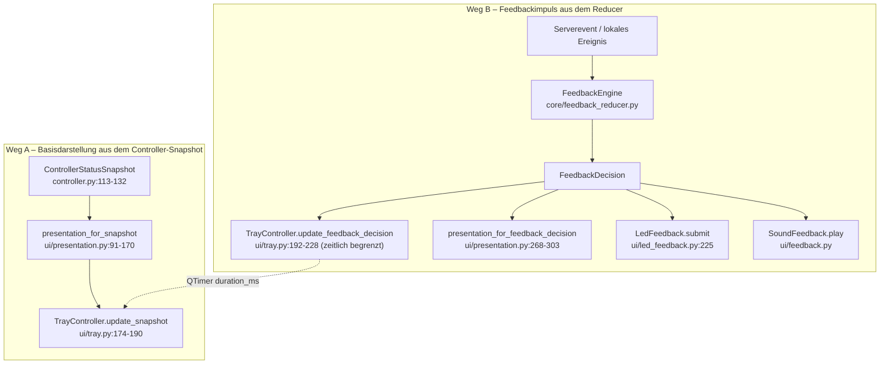

# CONFIG_UI_FEEDBACK_ATLAS

**Phase A – Ist-Zustand ohne Sollbewertung.** Auftragsabschnitte 13 und 14.

---

## 13. Config-Datenfluss

### 13.1 Kette

```
voice-stt-client/config.yaml                 (Projektdatei, im Repo)
  + %LOCALAPPDATA%/RealtimeSTT Client/config.yaml   (Nutzerdatei)
→ AppConfig.load()            core/config.py:838-862   Deep-Merge, unbekannte
                                                       Felder verwerfen die
                                                       gesamte Nutzerdatei
                                                       (:852-860)
→ AppConfig._from_dict()      core/config.py:912-956   Dataclasses + validate()
→ SETTING_DEFINITIONS         core/settings_metadata.py:82-324
→ SettingsDialog              ui/settings_dialog.py:110-159 (Aufbau)
                                                :266-309 (apply_changes)
→ build_candidate()           core/settings_metadata.py:72-79 (deepcopy + validate)
→ DesktopApplication._apply_settings  ui/application.py:509-546
     → candidate.save_user()  core/config.py:1008-1011  (Persistenz VOR Runtime)
     → bridge.apply_runtime_config
→ STTController.apply_runtime_config  core/controller.py:1141-1284
     → _install_runtime_config          :1285-1297
     → session_coordinator.update_config
     → feedback_engine.reconfigure_mapping
     → session.reconfigure(candidate.session, candidate.server)
→ SessionConfig.build_url()   core/config.py:424-436
→ SessionConfig.query_parameters()  core/config.py:394-422
→ /ws/transcribe?…            server.py:7418
→ parse_session_wake_word_query      server.py:583
   parse_session_activation_query    server.py:996
→ resolve_session_wake_word_config   server.py:692-901
   resolve_session_activation_config server.py:1039-1088
→ RecorderBackedRealtimeSession      server.py:2536-2611
```

### 13.2 Feldtabelle

| Feld | Quelle | Default | Migration | UI | Persistenz | Runtime Consumer | Serverwirkung |
|---|---|---|---|---|---|---|---|
| `session.mode` | `config.yaml` | `"hotkey"` (`core/config.py:276`) | – (das Feld **ist** die Migrationsquelle) | sichtbar, Gruppe „Legacy", Label „Legacy-Betriebsmodus" (`settings_metadata.py:145-152`) | ja, `save_user` | `effective_manual_trigger_enabled` (`config.py:301-303`), `effective_wake_word_trigger_enabled` (`:308-310`), `presentation_mode` (`:334-336`), `visible_when` fünf Definitionen, **`apply_runtime_config` `controller.py:1151-1160`** | **keine** – `query_parameters()` sendet `mode` nicht |
| `session.manual_trigger_enabled` | `config.yaml` | `None` (`config.py:277`) | wenn `None`: aus `mode` | Checkbox „Manueller Trigger" (`settings_metadata.py:153-158`); Anzeige des **effektiven** Werts (`ui/settings_dialog.py:176-177`) | ja | `effective_manual_trigger_enabled`; Hotkeyregistrierung (`ui/application.py:165-168`); `primary_dictation_action` (`controller.py:1031`); `extend_dictation_window` (`:1045`); `_client_owns_dictation_window` (`:691`); `_handle_timeline_event` (`:1792`, `:1803`) | Query `manualTriggerEnabled` → `resolve_session_activation_config` → `ActivationController.manual_trigger_enabled` |
| `session.wake_word_trigger_enabled` | `config.yaml` | `None` (`:278`) | wenn `None`: aus `mode` | Checkbox „Wake-Word-Trigger" (`:159-164`), Anzeige über `wake_word_enabled` (`settings_dialog.py:178-179`) | ja | `effective_wake_word_trigger_enabled`; `_maintain_wake_word_mode` (`controller.py:2636`); `_handle_timeline_event` (`:1778`); `presentation_mode` | Query `wakeWordTriggerEnabled` **und** `wakeWordEnabled` (`config.py:400-401`) |
| `session.wake_words` | `config.yaml` | `"hey_jarvis"` (`:280`) | – | `QLineEdit`, Gruppe „Wake Word", **`visible_when=("session.mode","wake_word")`** (`settings_metadata.py:165-170`) | ja | nur `query_parameters` | Query `wakeWords` (nur wenn `ww_enabled`); `_split_wake_word_ids` (`server.py:684`); `registry.resolve_openwakeword` |
| `session.wake_word_sensitivity` | `config.yaml` | `None` (`:282`) | – | `optional_float`, **`visible_when=("session.mode","wake_word")`** (`:171-178`) | ja | `query_parameters` | `wakeWordSensitivity` → `wake_words_sensitivity` (`server.py:508`) |
| `session.wake_word_backend`, `…_inference_framework`, `…_activation_delay`, `…_timeout`, `…_buffer_duration`, `…_followup_window` | `config.yaml` | `None` | – | **keine UI-Definition** | ja | `query_parameters` | jeweiliger Queryparameter (`server.py:497-512`) |
| `session.initial_speech_timeout` | `config.yaml` | `None` (`:287`) | – | **keine UI-Definition** | ja | `query_parameters` | `initialSpeechTimeout` → `ActivationController.initial_speech_timeout`; Serverdefault 15 s (`server.py:962`) |
| `session.followup_timeout` | `config.yaml` | `None` (`:288`) | – | keine | ja | `query_parameters` | `followupTimeout`, Default 3 s (`server.py:963`) |
| `session.extension_seconds` | `config.yaml` | `None` (`:289`) | – | keine | ja | `query_parameters` | `extensionSeconds`, Default **5 s** (`server.py:964`) |
| `dictation_window.initial_speech_timeout` | `config.yaml` | `15.0` (`config.py:443`) | – | sichtbar, Gruppe **„Hotkey-Diktatfenster"**, `visible_when=("session.mode","hotkey")` (`settings_metadata.py:179-185`) | ja | `_arm_dictation_window` (`controller.py:846`) – gegen Produktivserver ungenutzt | **keine** |
| `dictation_window.followup_timeout` | `config.yaml` | `3.0` (`:444`) | – | dito (`:186-192`) | ja | `controller.py:1831` | keine |
| `dictation_window.extension_seconds` | `config.yaml` | **`15.0`** (`:445`) | – | dito (`:193-199`) | ja | `extend_dictation_window` (`:1063`) | keine |
| `dictation_window.timeout_warning_seconds` | `config.yaml` | `3.0` (`:446`) | – | dito (`:200-206`) | ja | `_schedule_timeout_warning` (`:1399-1402`) | keine |
| `hotkey.enabled` | `config.yaml` | `True` | – | Checkbox (`settings_metadata.py:83-87`) | ja | `_create_hotkey_manager` (`ui/application.py:166`) | keine |
| `hotkey.toggle_key` | `config.yaml` | `Ctrl+Shift+Space` | `hotkey.key` als Altfeld (`config.py:508-513`) | Editor `hotkey`, Label **„Primäre Diktataktion"**, Beschreibung „…während eines Hotkey-Diktats wird die Frist verlängert." (`settings_metadata.py:88-93`) | ja, `key` wird beim Speichern entfernt (`config.py:968-971`) | `GlobalHotkeyManager` | keine |
| `hotkey.finish_key` | `config.yaml` | `None` | – | `optional_hotkey` (`:94-99`) | ja | `bridge.stop_dictation` | `trigger finish` |
| `hotkey.cancel_key` | `config.yaml` | `None` | – | `optional_hotkey` (`:100-105`) | ja | `bridge.cancel_dictation` | `trigger cancel` + `clear` |
| `hotkey.mode` (`toggle`/`actions`) | `config.yaml` | `"actions"` (`config.py:501`) | Altfeld aus AP06 | **keine UI-Definition** | ja | nur `HotkeyConfig.validate` (`:518-519`) | keine |
| `hotkey.auto_start` | `config.yaml` | `False` | – | keine UI | ja | `ui/core_bridge.py:98-99` → `request_initial_auto_start` | indirekt `start` + `trigger activate` |
| `feedback_mappings` | `config.yaml` (`:170`ff) | `default_feedback_mappings()` = leere Regeln (`core/feedback_mapping.py:492-497`) | Schemaversion 2 | keine UI | ja, eigene Serialisierung (`config.py:967`) | `FeedbackEngine`, `LedFeedback`, `SoundFeedback`, `presentation_for_feedback_decision` | keine |
| `feedback.sounds_enabled` und Sounddateien | `config.yaml` | `False`/`None` | – | sichtbar, `visible_when=("feedback.sounds_enabled", True)` | ja | `SoundFeedback` | keine |
| `led.*` | `config.yaml` | `enabled=True`, `sink="respeaker"` | – | teilweise sichtbar (`settings_metadata.py:303-323`) | ja | `LedFeedback`, `LefxLedController` | keine |
| `server.url` | `config.yaml` | `wss://stt.voice.marcosudau.com/ws/transcribe` | – | sichtbar (`:140-144`) | ja | `SessionConfig.build_url` | Zieladresse |

### 13.3 Stellen, an denen zwei Configfelder dieselbe fachliche Entscheidung beeinflussen

| Fachliche Entscheidung | Feld A | Feld B | Auflösung im Code |
|---|---|---|---|
| Darf der Hotkey eine Activation öffnen? | `session.manual_trigger_enabled` | `session.mode` | A gewinnt, **nur wenn A nicht `None` ist**; sonst entscheidet B (`config.py:301-303`). Im Auslieferungszustand ist A `None`, also entscheidet B. |
| Darf ein Wake Word eine Activation öffnen? | `session.wake_word_trigger_enabled` | `session.mode` | analog (`config.py:308-310`) |
| Wird der Wake-Word-Stream armiert? | `session.wake_word_trigger_enabled` (Schleifenbedingung `controller.py:2636`) | **`session.mode`** (Wert von `_wake_mode_desired`, `controller.py:1151-1160`) | **Beide müssen zusammenpassen.** Ist `wake_word_trigger_enabled=True`, aber `mode="hotkey"`, ergibt `apply_runtime_config` `candidate_wake_mode_desired = False` und der Maintainer armiert nie. |
| Sichtbarkeit der Wake-Word-Einstellungen | `session.mode` (`visible_when`) | `session.wake_word_trigger_enabled` (fachlich zuständig) | `mode` gewinnt (`settings_metadata.py:169, 176`) |
| Sichtbarkeit der Diktatfenster-Einstellungen | `session.mode` | – | `mode` allein (`:184, 191, 198, 205`) |
| Dauer bis zur ersten Sprache | `dictation_window.initial_speech_timeout` (15 s, lokal) | `session.initial_speech_timeout` (leer → Serverdefault 15 s) | Gegen einen Activation-Server gilt **B**; A wird nicht mehr scharf gestellt, ist aber weiterhin im Dialog sichtbar und heißt „Zeit bis zur ersten Sprache". |
| Nachsprechfenster | `dictation_window.followup_timeout` (3 s) | `session.followup_timeout` (→ 3 s) | wie oben |
| Verlängerungsdauer | `dictation_window.extension_seconds` (**15 s**) | `session.extension_seconds` (→ Serverdefault **5 s**) | wie oben; die beiden Zahlen sind **unterschiedlich** |
| Wake-Word-Erkennung überhaupt aktiv | `session.wake_words` + `session.wake_word_backend` (Client) | serverseitige `wake_words`/`wakeword_backend` (`server.py:492-493`) | `resolve_session_wake_word_config` (`server.py:692-901`) mit Vererbung und Fallback auf Serverdefaults |
| Anzeige „Wake-Word-Betrieb" | `session.mode` | `presentation_mode` aus den Triggerflags (`config.py:325-336`) | `presentation_mode` gewinnt in der UI; die Legacy-Combobox bleibt daneben sichtbar |
| Globale Hotkeys registriert | `hotkey.enabled` | `session.effective_manual_trigger_enabled` | UND-Verknüpfung (`ui/application.py:165-168`) |

### 13.4 Belegtes Verhalten des Dialogs bei Änderungen

`ui/settings_dialog.py:266-290` vergleicht für **jede** Definition den
Editorwert mit dem *effektiven* Wert:

```python
current_val = (self._config.session.effective_manual_trigger_enabled
               if path == "session.manual_trigger_enabled"
               else (self._config.session.wake_word_enabled
                     if path == "session.wake_word_trigger_enabled"
                     else get_config_value(self._config, path)))
if value != current_val:
    changes[path] = value
```

Folge, direkt aus dem Code: Bleibt die Checkbox „Manueller Trigger" auf ihrem
angezeigten (effektiven) Wert stehen, wird **kein** `changes`-Eintrag erzeugt;
`session.manual_trigger_enabled` bleibt `None`. Wird gleichzeitig
`session.mode` geändert, entscheidet danach wieder `mode`
(`core/config.py:301-303`).

Der `SESSION_RECONNECT`-Pfad ist in `ui/settings_dialog.py:292-300` mit einer
Rückfrage belegt; die Persistenz (`candidate.save_user()`,
`ui/application.py:530`) erfolgt **vor** der Laufzeitübernahme, ein Rollback
schreibt die alte Datei zurück (`ui/application.py:625-629`).

---

## 14. UI-/Tray-/Feedback-Datenfluss

### 14.1 Zwei unabhängige Darstellungswege



Weg B überlagert Weg A nur für `duration_ms` (`ui/tray.py:226-228`) und fällt
danach über `_restore_base_presentation` (`:252-255`) auf Weg A zurück.

### 14.2 Herkunft jedes sichtbaren Zustands

| Sichtbarer Zustand | Serverzustand? | Event? | Controllerfeld? | Presentation | Ausgabe | beruht auf |
|---|---|---|---|---|---|---|
| **„Wartet auf Hotkey"**, Farbe `DARK_GREEN` | nein | nein | `availability=READY`, `operating_mode != "wake_word"`, `dictation_state=IDLE` | `ui/presentation.py:122-123` | Tray-Text + Icon | **lokaler Clientwahrheit** |
| **„Wartet auf Wake Word"**, `DARK_BLUE` | nein | nein | `operating_mode == "wake_word"`, kein passender `server_status` | `ui/presentation.py:119-120` | Tray | `presentation_mode` (Triggerflags) |
| **„Wake Word pausiert"**, `GRAY` | nein | nein | `operating_mode == "wake_word"`, `dictation_state == IDLE` | `ui/presentation.py:100-101` | Tray | lokaler Clientwahrheit |
| **„Wartet auf Sprache"** + **weißer Ring** (`border_color="#ffffff"`) | im Wake-Word-Zweig ja (`server_status ∈ {LISTENING, WAKEWORD_DETECTED}`, `:105-116`) | nein | im Manual-Zweig: `dictation_state==ACTIVE` **und** `window_phase != SEGMENT_ACTIVE` (`:130-139`) | `ui/presentation.py:113-116` bzw. `:130-139` | Tray-Icon-Rand, gezeichnet in `create_status_icon` (`ui/tray.py:35-40`) | **Wake Word: Serverwahrheit · Manual: lokale Clientwahrheit** |
| **„Sprache wird aufgenommen"**, `BLUE`/`GREEN` | Wake-Word-Zweig: `server_status ∈ {VOICE, SILENCE, RECORDING}` (`:105-110`) | Weg B: `server.recording.started` → `indicator.recording` | Manual-Zweig: `window_phase == SEGMENT_ACTIVE` (`:124-129`) — gegen Produktivserver **nie wahr** | `ui/presentation.py:110` / `:129` / `:241-244` | Tray | gemischt |
| **„Transkribiert"** | Wake-Word-Zweig: `server_status == TRANSCRIBING` (`:117-118`) | Weg B: `server.transcription.started` → `indicator.finalizing` | – | `:117-118`, `:245-248` | Tray | Serverwahrheit |
| **„Diktat starten"** (Menüpunkt) | nein | nein | `dictation_state == IDLE` | `ui/presentation.py:141-150` | Traymenü | lokaler Clientwahrheit |
| **„Diktatzeit verlängern"** | nein | nein | `dictation_state ∈ {STARTING, ACTIVE}` und `operating_mode != "wake_word"` | `ui/presentation.py:147-148` | Traymenü | lokaler Clientwahrheit |
| **„Wake Word pausieren" / „Wake Word aktivieren"** | nein | nein | `operating_mode == "wake_word"` plus `dictation_state` | `ui/presentation.py:145-146` | Traymenü | `presentation_mode` + lokaler Clientwahrheit |
| **gelbes Warnblinken** `YELLOW` + Text **„Aktion derzeit nicht verfügbar"** | nein | ja: kanonisches `client.action.blocked` | ausgelöst aus `_emit_feedback_event` (`controller.py:472-497`), das **`ACTION_BLOCKED` und `DICTATION_START_FAILED` auf denselben kanonischen Typ abbildet** (`:485-489`) | Farbe: `indicator.warning` (`ui/presentation.py:254-258`); Text: Impulsabbildung `FeedbackImpulse.ACTION_BLOCKED` (`:297`) | Tray-Override, Overlay, LED `warn_event`, Sound `warning` (`config.yaml:216-219`) | **Feedbackimpuls** |
| **grüner Ring / grüne Farbe** | – | – | `operating_mode != "wake_word"` → `IndicatorColor.GREEN`/`DARK_GREEN` (`ui/presentation.py:27-34`, `:217-226`) | – | Tray-Icon-Füllung | `operating_mode` |
| **blauer Ring / blaue Farbe** | – | – | `operating_mode == "wake_word"` → `BLUE`/`DARK_BLUE` | – | Tray | `operating_mode` |
| **LED-Ring „waiting"** | – | `client.hotkey.accepted` oder `server.wakeword.detected` → `set_state: waiting` (`config.yaml:212-215`, `:175-178`) | – | – | LEFX-Zustandsslot `primary` | Feedbackimpuls |
| **LED-Ring zurück auf „ready_state"** | – | `server.transcription.completed` (`config.yaml:190-193`), `server.transcription.discarded/cancelled/rejected`, `client.microphone.recovered`, `client.lifecycle.started` | – | – | LEFX | Serverevent |

### 14.3 Belegte Asymmetrien

1. **Zwei Datenquellen für denselben Lebenszyklus.**
   `presentation_for_snapshot` liest im Zweig `operating_mode == "wake_word"`
   ausschließlich `snapshot.server_status` (`ui/presentation.py:105-120`), im
   `else`-Zweig ausschließlich `snapshot.dictation_state` und
   `snapshot.dictation_window_phase` (`:122-139`).
2. **Zwei Farbfamilien.** `presentation_for_mapped_action`
   (`ui/presentation.py:217-226`) wählt `mode_color`/`active_color` allein nach
   `operating_mode`; `operating_mode` stammt aus
   `SessionConfig.presentation_mode` (`core/config.py:325-336`), das wiederum
   aus den Triggerflags abgeleitet wird.
3. **`operating_mode` erreicht die UI auf zwei Wegen.** Über den Snapshot
   (`controller.py:430`) an `presentation_for_snapshot` und `ui/tray.py:208-212`,
   und über `self.config.session.presentation_mode` direkt in
   `ui/application.py:240-243`.
4. **LED kehrt zurück, Tray nicht.** Nach einer Activation *mit* Sprache setzt
   `server.transcription.completed` den Ring über
   `[{emit_event: success_event}, {set_state: ready_state}]` zurück
   (`config.yaml:190-193`). Nach einer Activation *ohne* Sprache existiert kein
   solches Ereignis; der zuletzt gesetzte Zustand `waiting` bleibt stehen. Die
   Trayanzeige kehrt in **keinem** der beiden Fälle zurück, weil sie an
   `dictation_state` hängt.
5. **`indicator.warning` ist nicht unterscheidbar.** `client.action.blocked`,
   `client.dictation.interrupted`, `client.transport.disconnected`,
   `client.microphone.lost`, `client.led.unavailable` und
   `client.sound.failed` verwenden alle `app: {action: indicator.warning}`; die
   Unterscheidung entsteht erst über die Impulsabbildung in
   `ui/presentation.py:288-298`.

### 14.4 Ereignisse ohne Feedbackregel

`config.yaml` enthält keine Einträge für `activation.started`,
`activation.extended` oder `activation.closed` — passend dazu kennt
`CanonicalEventType` (`core/event_models.py:71-105`) keine `activation.*`-Werte.
Der Activation-Lebenszyklus ist im Feedbackmodell also nicht abgebildet.

---

## Vollständigkeitsstand

| Auftragsabschnitt | Status |
|---|---|
| 13 Config-Datenfluss | vollständig |
| 14 UI-/Tray-/Feedback-Datenfluss | vollständig |
