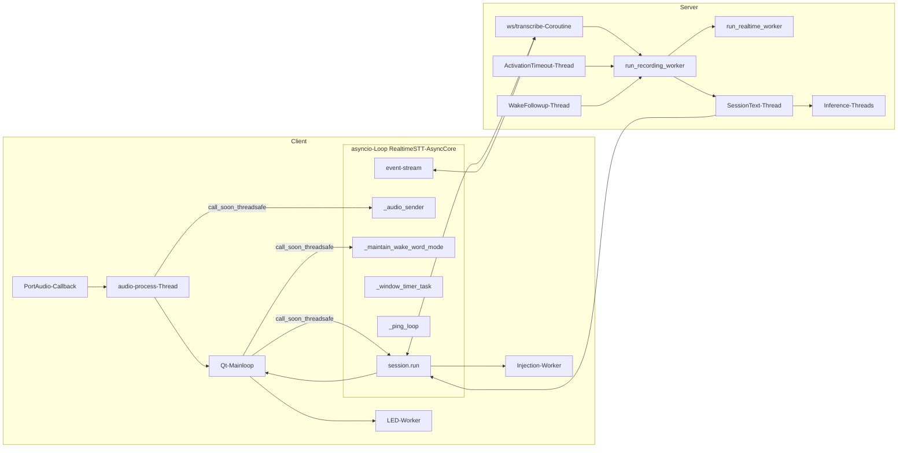
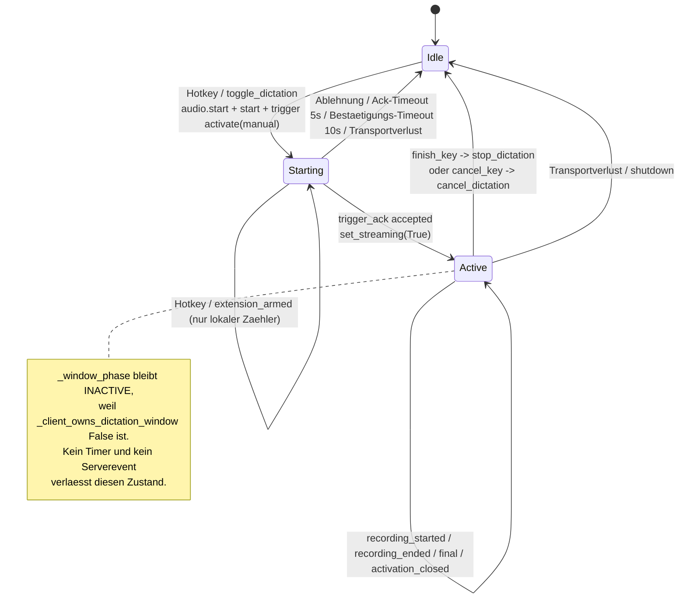
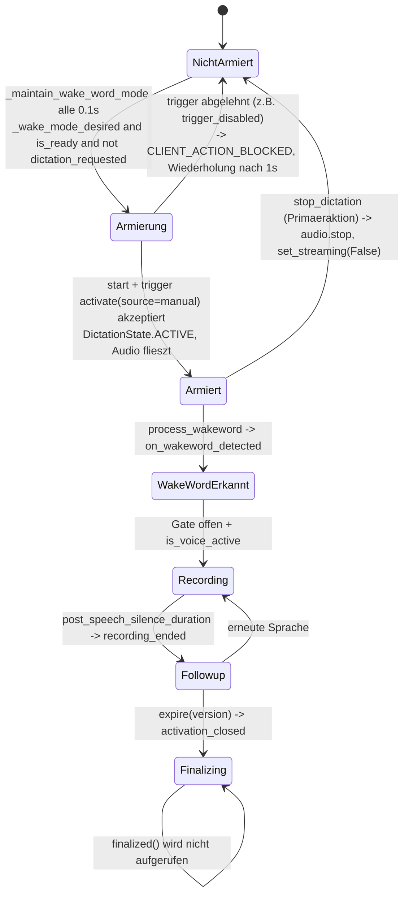
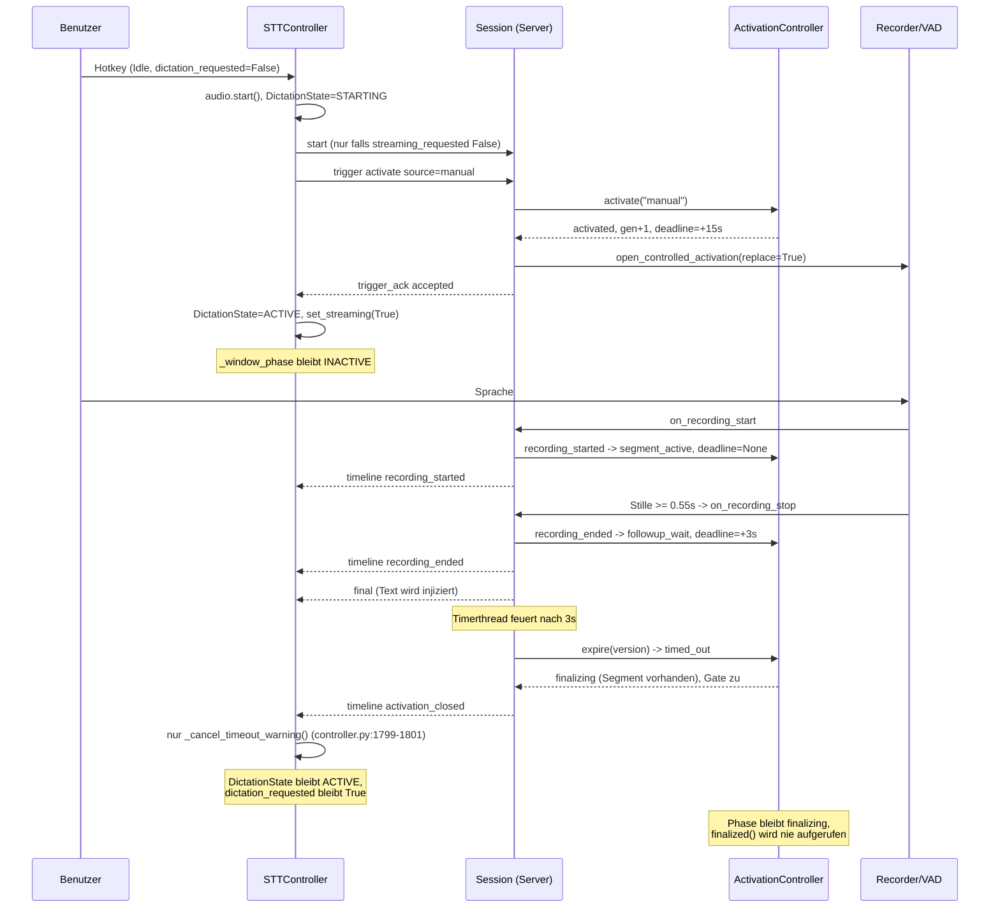

# RUNTIME_FLOWS_AND_CONCURRENCY

**Phase A – Ist-Zustand ohne Sollbewertung.** Alle Aussagen am Produktivcode
belegt. Auftragsabschnitte 3, 4, 5, 6, 7, 11, 12.

---

## 3. Concurrency Map

### 3.1 Tabelle

| Task/Thread/Loop | Repo | Start | Ende | Owner | liest Zustand | schreibt Zustand | kommuniziert mit |
|---|---|---|---|---|---|---|---|
| Qt-Mainloop | client | `ui/application.py:726` `application.exec()` | `application.quit()` | `QApplication` | Snapshots, FeedbackDecisions | Tray, Overlay, Dialog | CoreBridge über `QueuedConnection` |
| `RealtimeSTT-AsyncCore` (Thread, **non-daemon**) | client | `ui/core_bridge.py:78-84` | `stop()` `:382-413` | `CoreBridge` | – | eigener Eventloop | Qt-Signale, `call_soon_threadsafe` |
| Task `session.run()` | client | `core/controller.py:2664` | Loopende | `STTSession` | `_state`, `_generation` | Transport, Session, Trigger | WebSocket `/ws/transcribe` |
| Task `_audio_sender()` | client | `core/controller.py:2667` | Cancel im `finally` `:2716` | `STTController` | `_dictation_state`, `session.is_streaming`, `generation` | – | `_audio_send_queue` → `session.send_audio` |
| Task `_auto_start_when_ready()` | client | `core/controller.py:2670` | einmalig `return` `:2627` | `STTController` | `_initial_auto_start_*`, `session.is_ready` | Diktatzustand | `start_dictation` |
| Task `_maintain_wake_word_mode()` | client | `core/controller.py:2673-2677` | Cancel | `STTController` | `_wake_mode_desired`, `effective_wake_word_trigger_enabled`, `dictation_requested`, `session.is_ready` | Diktatzustand über `start_dictation` | Server: `start` + `trigger` |
| Task `_ping_loop()` | client | `core/stt_session.py:998` | Verbindungsende | `STTSession` | `_ping_pending`, `_consecutive_misses` | Backoff, Transport | WebSocket |
| Task `event-stream-generation-N` | client | `core/session_coordinator.py:241-245` | `_detach_transport` | `DualSessionCoordinator` | `EventProtocolProcessor` | `SessionContext` | WebSocket `/ws/logs` |
| Task `event-token-expiry-N` | client | `core/session_coordinator.py:249-251` | dito | dito | `expiresAt` | `SessionContext` | – |
| Tasks `_window_timer_task`, `_timeout_warning_task` | client | `core/controller.py:1463`, `:1403` | Token-Invalidierung | `STTController` | `_window_timer_token`, `_dictation_state` | Fensterphase, Warnung | `stop_dictation`, Feedback |
| Task je `send_trigger`/`start` (`_StartAttempt.send_task`) | client | `core/controller.py:631-633` | Ack/Timeout/Cancel | `STTController` | Session | `_last_accepted_trigger` | WebSocket |
| PortAudio-Callbackthread | client | `core/audio_capture.py:171-178` (`sd.InputStream.start`) | `stop()` `:207-227` | PortAudio | – | `_audio_queue` (max 200) | `_process_loop` |
| Thread `audio-process` (daemon) | client | `core/audio_capture.py:180-185` | `stop()` | `AudioCapture` | `_muted`, `_running` | – | `on_audio_packet` → Controller |
| Thread Injection-Worker (**non-daemon**) | client | `core/text_injector.py:422-425` | `queue.stop()` | `TextInjectionQueue` | Queue | Zwischenablage, Tastatur | Zielfenster |
| Thread `RealtimeSTT-LED` (daemon) | client | `ui/led_feedback.py:303-305` | `shutdown()` | `LedFeedback` | Auftragswarteschlange | LEFX-Renderloop | `lefx.ControllerService` |
| `QTimer _led_watch` (10 s) | client | `ui/application.py:121-125` | Programmende | `DesktopApplication` | LED-Verfügbarkeit | Trayangebot | Tray |
| `QTimer _feedback_timer` | client | `ui/tray.py:130-132` | – | `TrayController` | – | Rückfall auf Basisdarstellung | Tray |
| `QTimer _fade_timer`, `_alert_timer` | client | `ui/overlay.py:55-58` | – | `TranscriptOverlay` | – | Overlaysichtbarkeit | – |
| uvicorn-Eventloop | server | `server.py:8136` | Prozessende | uvicorn | – | – | alle WebSockets/HTTP |
| Coroutine je `/ws/transcribe` | server | `server.py:7418` | Disconnect | FastAPI | Session | Session, Activation | Client |
| Coroutine je `/ws/logs` | server | `server.py:6479` | Disconnect | FastAPI | Event-Hub | Cursor | Client |
| Thread `VoiceSTTServerReady` | server | `server.py:4553-4558` | `stop()` join 5 s | `VoiceSTTService` | Scheduler | `service.ready` | Sessions |
| Thread `VoiceSTTModelIdleMonitor` | server | `server.py:4560-4564` | dito | dito | Aktivitätszeitstempel | Modellentladung | Scheduler |
| Threads `VoiceSTT-<lane>-Inference` | server | `server.py:1777-1782` | `stop()` join 10 s | `SharedEngineWorker` | `FairInferenceQueue` | Ergebnisse | `InferenceScheduler` |
| Thread `VoiceSTTSessionText-<sid>` | server | `server.py:2612-2617` | Sessionende | Session | Textterminals | `final`/`realtime` | ConnectionManager |
| Thread `VoiceSTTActivationTimeout-<sid>` | server | `server.py:3202-3208` | einmalig | Session | `_activation_timer_generation`, `version` | `ActivationController.expire` | Timeline, Status |
| Thread `VoiceSTTSessionWakeFollowup-<sid>` | server | `server.py:3977-3982` | einmalig | Session | `_wakeword_followup_generation` | Recorder-Gate (legacy) | Timeline |
| Thread `VoiceSTTSessionForceFinalize-<sid>` | server | `server.py:4289-4293` | einmalig | Session | `recording_sample_count` | Recorder-Flush | Scheduler |
| Thread `run_recording_worker` (daemon) | server | `VoiceSTT/core/initialization.py:649-654` | `is_running=False` | Recorder | `audio_queue`, Gate-Event, VAD | `is_recording`, `frames` | Session-Callbacks |
| Thread `run_realtime_worker` (daemon) | server | `VoiceSTT/core/initialization.py:656-661` | dito | Recorder | `frames` | Realtime-Text | Session |
| Thread `read_stdout_pipe` (daemon) | server | `VoiceSTT/core/initialization.py:674-678` | Shutdown-Event | Recorder | Pipe | Logs | – |
| **Prozess** Transkriptionsworker | server | `VoiceSTT/core/initialization.py:432-454` über `runtime.py:17-32` (`mp.Process` auf Windows, `Thread` auf Linux) | Shutdown-Event | Recorder | Pipe | Transkripte | Recorder |

### 3.2 Was kann gegeneinander laufen



**Belegte Gleichzeitigkeiten mit gemeinsamem Zustand:**

1. `_maintain_wake_word_mode` (Loop) und ein Hotkey aus dem Qt-Thread rufen
   beide `start_dictation()` auf. Serialisierung über
   `STTController._get_transition_lock()` (`core/controller.py:356-359`,
   benutzt in `:555`, `:968`, `:1020`, `:819`, `:898`, `:1585`, `:2604`).
2. `run_recording_worker` (Recorderthread), `VoiceSTTActivationTimeout` und die
   WebSocket-Coroutine greifen alle auf denselben `ActivationController` zu;
   dieser synchronisiert sich selbst über `RLock` (`activation.py:99`).
3. `_on_recording_start`/`_on_recording_stop` laufen im Recorderthread und
   nehmen `self.lock` der Session (`server.py:3812`, `:3853`); Events werden
   bewusst **nach** Freigabe des Locks publiziert
   (`server.py:3098-3104` Kommentar, Umsetzung `:3089-3091`).
4. PortAudio-Callback → `queue.Queue(maxsize=200)` → `audio-process`-Thread →
   `call_soon_threadsafe` → `asyncio.Queue(maxsize=300)` → `_audio_sender`.
   Zwei Verwerfungspunkte: `audio_capture.py:253-255` (Queue voll) und
   `controller.py:2559-2562` (`QueueFull` → `pass`).

---

## 4. Vollständiger Audio-Datenpfad

### 4.1 Kette

| # | Ort | Datei / Funktion | Verhalten |
|---|---|---|---|
| 1 | Mikrofon | `core/audio_capture.py:171-178` | `sd.InputStream(blocksize=chunk_frames, dtype=int16, callback=_audio_callback)`; `chunk_frames = rate * chunk_duration_ms/1000` (`:150-152`), Default 40 ms (`core/config.py:472`) |
| 2 | PortAudio-Callback | `:230-258` | `indata.tobytes()` → `_audio_queue.put_nowait`; bei `queue.Full` **verworfen** (`:256-257`) |
| 3 | Verarbeitungsthread | `:264-295` | Bei `self._muted` wird das Paket **gezogen und verworfen** (`:279-282`); sonst `on_audio_packet(pcm, rate, channels, frames)` |
| 4 | Controller-Brücke | `core/controller.py:2519-2541` `_on_audio_packet_from_thread` | **Verwirft**, wenn `not session.is_streaming` **oder** `_dictation_state != ACTIVE` (`:2528-2532`); sonst `call_soon_threadsafe(_enqueue_audio_packet, …)` mit `generation` |
| 5 | Loop-Queue | `:2543-2562` `_enqueue_audio_packet` | prüft dieselben Bedingungen erneut plus Generationsgleichheit; `asyncio.Queue(maxsize=300)`; `QueueFull` → verworfen |
| 6 | Sender | `:2572-2593` `_audio_sender` | prüft ein drittes Mal (`ACTIVE`, `is_streaming`, `generation`) und ruft `session.send_audio` |
| 7 | Session | `core/stt_session.py:~747ff` `send_audio` | sendet nur bei `self._streaming and self._ws_is_open()` |
| 8 | Serverempfang | `server.py:7529-7534` | Binärnachricht → `decode_audio_packet` → `session.ingest_audio_packet` |
| 9 | Session-Ingest | `server.py:2824-2855` | `samples = packet_to_server_samples(packet)`; **wenn `not self.streaming`: Ablehnung** mit Text „Der Audiostream ist gestoppt; sende vor Audiopaketen einen Startbefehl." (`:2829-2831`); sonst `recorder.feed_audio(samples, original_sample_rate=16000)` (`:2833`) |
| 10 | Recorder | `VoiceSTT/audio_recorder.py` `feed_audio` → `recorder.audio_queue` | – |
| 11 | Aufnahmeworker | `VoiceSTT/core/recording.py:70-72` | `data = self.audio_queue.get(timeout=0.01)` |
| 12 | Wake Word | `:180-207` | nur wenn `use_wake_words and wake_word_activation_delay_passed`; `process_wakeword` (`VoiceSTT/core/wakeword.py`); bei Treffer `wakeword_detected=True` + Callback `on_wakeword_detected` |
| 13 | **Gate** | `:211-216` | `recording_activation_gate_is_open(self, …)` → `VoiceSTT/core/activation_control.py:173-195`. In `controlled`: **ausschließlich** `_controlled_activation_event.is_set()` (`:185-186`); `wakeword_detected` wird dort bewusst nicht ausgewertet |
| 14 | VAD-Start | `:221-244` | `is_voice_active(self)` → `self.start()`, Preroll-Frames werden vorangestellt (`:232, 239-240`) und Silero-Zustand zurückgesetzt |
| 15 | Preroll | `:457-460` `append_to_pre_recording_buffer` | gefüllt, solange **nicht** aufgenommen wird; Länge `pre_recording_buffer_duration` (`server.py:2684`) |
| 16 | VAD-Ende | `:285-411` | `stop_recording_on_voice_deactivity`; Stille zählt ab `speech_end_silence_start` (`:319-324`); Abbruch bei `post_speech_silence_duration` (`:373-375`, Default 0.55 s) unter Beachtung von `min_length_of_recording` (Default 0.2 s); dann `self.frames.append(data)` und `self.stop()` (`:394-395`) |
| 17 | Frühe Transkription | `:333-351` | optional bei `early_transcription_on_silence` |
| 18 | Session-Callbacks | `server.py:3812-3847` `_on_recording_start`, `:3849-3889` `_on_recording_stop` | melden dem `ActivationController` `recording_started()` / `recording_ended()` und publizieren `recording_started` / `recording_ended` |
| 19 | Transkription | `server.py:3891-3911` `_on_transcription_start` → `InferenceJob` → Scheduler | Status `transcribing` |
| 20 | Final | Textthread `VoiceSTTSessionText-<sid>` (`server.py:2612`) | `final`-Nachricht an den Client |

### 4.2 `start` und `stop` technisch

* **Client → `start`:** `core/stt_session.py:727-734` sendet `{"type":"start"}`
  und setzt `state.streaming_requested = True`.
* **Server `start`:** `server.py:7581-7582` → `RecorderBackedRealtimeSession.start_streaming`
  (`server.py:2719-2728`): `self.streaming = True`, Status `wakeword_wait` oder
  `listening`. **Keine** Activation.
* **Client → `stop`:** `core/stt_session.py:736-742` setzt
  `streaming_requested = False`.
* **Server `stop`:** `server.py:7583-7584` → `stop_streaming`
  (`server.py:2730-2745`): `streaming=False`, Status `idle`,
  `_reset_activation_locked("stream_stopped")` — **eine laufende Activation
  wird verworfen**.
* **`set_streaming` im Client:** `core/stt_session.py:612-615` setzt **beide**
  Felder `_streaming` und `state.streaming_requested`. Aufrufer:
  `controller.py:838` (True nach bestätigtem Start), `:916`, `:993`, `:1993`,
  `:2485` (jeweils False).

### 4.3 Manual gegen Wake Word bis zum ersten gemeinsamen Punkt

**Manual:**
```
ui/hotkeys.py WM_HOTKEY
→ ui/application.py:144-148 on_toggle = bridge.primary_dictation_action
→ ui/core_bridge.py:210-213 _submit_coroutine
→ core/controller.py:1029 primary_dictation_action
→ core/controller.py:1018 toggle_dictation → :562 _begin_start_locked
→ core/controller.py:648 audio.start()          <-- Mikrofon startet HIER
→ core/controller.py:631-633 _begin_stream_and_trigger(source="manual")
→ core/stt_session.py send_start (nur wenn nicht streaming_requested)
→ core/stt_session.py request_trigger(action="activate", source="manual")
→ server.py:7599-7601 handle_trigger_command
→ server.py:3072-3073 ActivationController.activate("manual")
→ server.py:3116-3128 recorder.open_controlled_activation(...)
```

**Wake Word:**
```
Mikrofonaudio (nur wenn eine "Diktation" armiert ist, siehe §6)
→ server.py:2833 recorder.feed_audio
→ VoiceSTT/core/recording.py:184 process_wakeword
→ recording.py:204-207 on_wakeword_detected
→ server.py:4078-4090 _on_wakeword_detected
→ server.py:4087 ActivationController.activate("wake_word")
→ server.py:4088 _apply_activation_decision_locked
→ recorder.open_controlled_activation(...)
```

**Antwort auf die Auftragsfrage:**

```text
Gemeinsamer Codepfad beginnt tatsächlich hier:
api_fastapi_server/activation.py :: ActivationController.activate(source)
bzw. unmittelbar danach
api_fastapi_server/server.py :: RecorderBackedRealtimeSession._apply_activation_decision_locked
```

Ab diesem Punkt sind Gate, VAD, Recording, Follow-up, Transkription und
Finalisierung nachweislich identisch: `run_recording_worker` kennt die
Triggerquelle nicht, sondern nur das Gate-Event
(`VoiceSTT/core/activation_control.py:185-186`).

**Einschränkung, ebenfalls belegt:** *Vor* diesem Punkt ist der Pfad nicht
gemeinsam, und zwar nicht nur im Eingang: Der Wake-Word-Pfad setzt voraus, dass
überhaupt Audio fließt. Audio fließt nur, wenn `_dictation_state == ACTIVE`
ist (`controller.py:2528-2532`) und das Mikrofon läuft (`:648`). Beides
entsteht ausschließlich über `start_dictation()`. Wake Word ist damit im
heutigen Code **kein vom Manual unabhängiger Eingang**, sondern setzt eine
zuvor geöffnete Client-„Diktation" voraus, die `_maintain_wake_word_mode`
dauerhaft aufrechterhält (§6).

---

## 5. Hotkey – vollständiger Ist-Ablauf

### 5.1 Eintritt

`ui/hotkeys.py:25-29` definiert genau fünf IDs: `TOGGLE`, `REINSERT_LAST`,
`FINISH`, `CANCEL`, `OVERLAY_TOGGLE`. **Ein Hotkey für Wake-Word-Pause
existiert nicht.**

Verdrahtung `ui/application.py:137-171`:

| Hotkey | Callback |
|---|---|
| `toggle_key` | `bridge.primary_dictation_action` (`:144-148`) |
| `finish_key` | `bridge.stop_dictation` (`:150-152`) |
| `cancel_key` | `bridge.cancel_dictation` (`:153-159`) |
| `reinsert_last_key` | `bridge.reinsert_last` |
| `overlay_toggle_key` | `overlay.toggle_visibility` |

Registrierung nur bei
`config.hotkey.enabled and config.session.effective_manual_trigger_enabled`
(`:165-168`).

### 5.2 Entscheidungsbaum des normalen Hotkeys

`core/controller.py:1029-1041`:

```python
async def primary_dictation_action(self) -> CommandResult:
    if not self.config.session.effective_manual_trigger_enabled:
        if self.dictation_requested:
            self._wake_mode_desired = False
            return await self.stop_dictation()      # "Wake Word pausieren"
        self._wake_mode_desired = True
        return await self.start_dictation()         # "Wake Word aktivieren"
    if self.dictation_requested:
        return self.extend_dictation_window()       # zweite Bedeutung
    return await self.toggle_dictation()
```

`extend_dictation_window` (`:1043-1086`):

```python
if not effective_manual_trigger_enabled: -> ("manual_trigger_disabled")
if _dictation_state not in {STARTING, ACTIVE} or not _dictation_requested:
                                          -> (False, "not_active")
if state == STARTING:                     -> _pending_window_extension += ext, "extension_armed"
if phase == SEGMENT_ACTIVE:               -> _pending_window_extension += ext, "extension_armed"
if phase in {WAITING_FIRST_SPEECH, FOLLOWUP_WAIT}:
                                          -> _arm_dictation_window(...), zusätzlich
                                             trigger(extend, manual) falls _server_owns_activation
                                          -> (True, "extended")
sonst                                     -> (False, "not_active", "Dictation window is inactive")
```

Entscheidend ist `_client_owns_dictation_window` (`:683-693`):

```python
return (self.config.session.effective_manual_trigger_enabled
        and not self._server_owns_activation)
```

`_server_owns_activation` (`:677-680`) ist wahr, sobald der Server
`sessionCapabilities.activationTriggers.supported == true` meldet — und das tut
er bedingungslos (`server.py:4976-4983`). Folge, rein aus dem Code:
`_arm_dictation_window` wird gegen den Produktivserver **nie** aufgerufen,
`_window_phase` bleibt `INACTIVE` (Initialwert `controller.py:308`).

### 5.3 Verhalten je Zustand (Produktivserver, `activationTriggers.supported = true`)

| Clientzustand | `dictation_requested` | `_window_phase` | Ergebnis des Hotkeys | Beleg |
|---|---|---|---|---|
| Idle | False | INACTIVE | `toggle_dictation` → `_begin_start_locked` → `audio.start()`, `start` (falls nötig), `trigger activate/manual` | `:1041`, `:1018-1027`, `:631-648` |
| Start läuft (`STARTING`) | True | INACTIVE | `extend_dictation_window` → `state == STARTING` → nur `_pending_window_extension += extension_seconds`, Rückgabe `extension_armed`; **kein** Servercommand | `:1064-1069` |
| Activation offen, Recording aktiv | True | INACTIVE | `extend_dictation_window` → keiner der Phasenzweige greift → `CommandResult(False, "not_active", "Dictation window is inactive")` | `:1086` |
| Follow-up | True | INACTIVE | identisch `not_active` | `:1086` |
| Server finalisiert / Activation geschlossen | True (unverändert) | INACTIVE | identisch `not_active` | `:1799-1801` ändert den Zustand nicht |
| Transport verloren | False (durch `_handle_dictation_interrupted` `:2473-2482`) | INACTIVE | `toggle_dictation` → `_begin_start_locked` → `blocked_availability` → `ACTION_BLOCKED`, Rückgabe `transport_not_ready` | `:576-603` |
| Wake-Word-only (`manual=false`) | – | – | Hotkeys sind gar nicht registriert (`ui/application.py:165-168`); der Codezweig `:1031-1038` ist über Tray/Bridge dennoch erreichbar | – |

Zusätzliche Abhängigkeiten, die im Zweig auftauchen: `mode` nur indirekt über
`effective_manual_trigger_enabled` (`core/config.py:291-303`),
`streaming_requested` in `_begin_stream_and_trigger` (`:701`), Server-Capability
in `_server_owns_activation` (`:677-680`).

### 5.4 Ist-State-Diagramm Hotkey



---

## 6. Wake Word – vollständiger Ist-Ablauf

### 6.1 Clientseitige Armierung

* `_wake_mode_desired` Startwert:
  `config.session.effective_wake_word_trigger_enabled`
  (`core/controller.py:317-319`).
* `_maintain_wake_word_mode()` (`:2629-2650`):

```python
while True:
    await asyncio.sleep(0.1)
    if is_closing or _wake_maintenance_suspended or not effective_wake_word_trigger_enabled:
        continue
    if _wake_mode_desired and session.is_ready and not dictation_requested:
        result = await self.start_dictation()
        if not result.success:
            await asyncio.sleep(1.0)
```

* `start_dictation` sendet **immer** `source="manual"`
  (`:631-633` → `_begin_stream_and_trigger(source="manual")`; `:695` hat den
  Defaultwert `"manual"`, ein anderer Aufrufer existiert nicht).
* Weitere Schreibstellen von `_wake_mode_desired`: `:1032-1038`
  (Primäraktion in der Wake-Word-only-Konfiguration), `:1141-1160`
  (`apply_runtime_config`, abgeleitet aus **`session.mode`**), `:1294`
  (`_install_runtime_config`).

### 6.2 Serverseitiger Ablauf

```
recording.py:180  use_wake_words and wake_word_activation_delay_passed
recording.py:184  process_wakeword(self, data)      (VoiceSTT/core/wakeword.py)
recording.py:197-207  wakeword_index >= 0 -> wakeword_detected = True
                       + on_wakeword_detected
server.py:4078-4090   _on_wakeword_detected
                       _wakeword_voice_window = True
                       ActivationController.activate("wake_word")
                       _apply_activation_decision_locked("activate", ...)
server.py:3116-3128   recorder.open_controlled_activation(id, replace=True, generation)
recording.py:211-216  Gate offen -> VAD darf starten
recording.py:221-244  is_voice_active -> self.start() (+ Preroll)
server.py:3812-3847   _on_recording_start -> activation.recording_started()
recording.py:373-395  post_speech_silence_duration -> self.stop()
server.py:3849-3889   _on_recording_stop -> activation.recording_ended()
                       (Legacy-Follow-up nur wenn self._activation is None, :3883-3888)
server.py:3210-3243   _activation_timeout_worker -> activation.expire(version)
                       -> activation_closed
```

`use_wake_words` stammt aus der Recorderkonfiguration; das Wake-Word-Profil
wird pro Session in `resolve_session_wake_word_config`
(`server.py:692-901`) aufgelöst, `wake_word_enabled()` ist
`bool(wakeword_backend and wake_words)` (`server.py:492-493`).

### 6.3 Deaktivierung

* Client: `primary_dictation_action` in der Wake-Word-only-Konfiguration setzt
  `_wake_mode_desired = False` und ruft `stop_dictation()` (`:1034-1036`).
  `stop_dictation` sendet gegen einen Activation-Server `trigger finish/manual`
  (`:997-1003`), **nicht** `stop`, stoppt aber `audio` (`:992`) und setzt
  `set_streaming(False)` (`:993`) — womit der Audiofluss endet und damit auch
  jede weitere Wake-Word-Erkennung.
* Server: keine gesonderte Pausierung; die Erkennung hängt allein am
  eintreffenden Audio und an `use_wake_words`.

### 6.4 Ist-State-Diagramm Wake Word



---

## 7. Manual gegen Wake Word – struktureller Vergleich

| Phase | Manual heute | Wake Word heute | gemeinsam? |
|---|---|---|---|
| Streamaufbau | `_begin_stream_and_trigger` sendet `start`, falls `streaming_requested` falsch (`:701`) | identisch, ausgelöst durch `_maintain_wake_word_mode` | **ja**, gleicher Code |
| Mikrofonstart | `audio.start()` in `_begin_start_locked` (`:648`) | derselbe Aufruf über `start_dictation` | **ja**, gleicher Code, aber in beiden Fällen an die „Diktation" gebunden |
| Trigger | `trigger activate source=manual`, ausgelöst durch Tastendruck | **ebenfalls** `trigger activate source=manual` zum Armieren; der eigentliche Wake-Word-Trigger entsteht serverintern über `activate("wake_word")` (`server.py:4087`) | **nein**, zwei verschiedene Eingänge |
| Activation | `ActivationController.activate("manual")` | `ActivationController.activate("wake_word")` | **ja**, dieselbe Methode |
| Gate | `open_controlled_activation` aus `_apply_activation_decision_locked` | identisch | **ja** |
| VAD | `run_recording_worker` (`recording.py:211-249`) | identisch | **ja** |
| Recording | `recording.py:233 self.start()` | identisch | **ja** |
| Recording-Ende | `recording.py:373-395` `post_speech_silence_duration` | identisch | **ja** |
| Follow-up | `ActivationController.recording_ended()` → `followup_wait` + Timerthread | identisch; der Legacy-Wake-Follow-up (`server.py:3924-3982`) ist im Controlled-Modus abgeschaltet (`:3883-3888`) | **ja** |
| Finalisierung | `_close_window_locked` → `finalizing`; `finalized()` ohne Aufrufer | identisch | **ja** |
| UI-State | `presentation_for_snapshot` `else`-Zweig aus `dictation_state` + `dictation_window_phase` (`ui/presentation.py:121-139`) | `if operating_mode == "wake_word"`-Zweig aus `snapshot.server_status` (`ui/presentation.py:99-120`) | **nein**, zwei getrennte Zweige mit **verschiedenen Datenquellen** |
| Feedback | LED/Sound identisch über `feedback_mappings`; Tray/Overlay-Farbe modusabhängig (`ui/presentation.py:217-226`) | dito | **teilweise** |
| Cleanup | `stop_dictation` → `trigger finish` + `audio.stop` + `set_streaming(False)` | identisch | **ja** |

---

## 11. Vollständiger Ablauf eines echten Diktats

Alle Diagramme geben den heutigen Code wieder. `AC` = ActivationController.

### A. Manual – normaler Ablauf



**Erreichter Endzustand:** Client `ACTIVE`/`INACTIVE`-Phase, Server
`finalizing`, Gate geschlossen, Audio läuft weiter (Mikrofon wurde nicht
gestoppt, `set_streaming` steht noch auf True), Activation-ID bleibt gesetzt.

### B. Wake Word – normaler Ablauf

Vorbedingung: `_maintain_wake_word_mode` hat armiert, also identischer
Clientzustand wie in A nach dem `trigger_ack`. Ab `on_wakeword_detected`
(`server.py:4078`) ist der Ablauf zeichengleich zu A, mit
`primarySource="wake_word"`. Der Client erhält zusätzlich
`timeline wakeword_detected`, das über `_TIMELINE_FALLBACK_EVENTS`
(`core/event_normalizer.py:85`) zu `wakeword.detected` normalisiert wird.

### C. Manual ohne Sprache

`activate` setzt `deadline = +initial_speech_timeout` (Server-Default 15 s,
`server.py:930`). `_activation_timeout_worker` ruft `expire(version)`;
`_close_window_locked("timed_out")` findet `segment_count == 0` und geht über
`_clear_locked()` direkt nach `inactive` (`activation.py:353-358`). Event
`activation_closed`. **Clientzustand unverändert `ACTIVE`.**

### D. Wake Word ohne Sprache

Identisch zu C, zusätzlich `wakeword_timeout` nach `wake_word_timeout`
(`recording.py:434-442`) und `_on_wakeword_timeout` (`server.py:4100-4110`),
das `_wakeword_voice_window = False` setzt.

### E. Hotkey während laufender Manual-Activation

```
primary_dictation_action -> dictation_requested True
 -> extend_dictation_window
 -> _window_phase == INACTIVE
 -> CommandResult(False, "not_active", "Dictation window is inactive")
```
**Kein Command an den Server.** Serverzustand unverändert.

### F. Hotkey während Wake-Word-Activation

Identisch zu E, sofern `manual_trigger_enabled` wahr ist. Ist nur der
Wake-Word-Trigger aktiv, sind die Hotkeys nicht registriert
(`ui/application.py:165-168`); über das Traymenü führt derselbe Aufruf zu
`stop_dictation()` (`:1034-1036`) und damit zu `trigger finish/manual` sowie
`audio.stop()`.

### G. Wake Word während Manual-Activation

```
server.py:4087 activate("wake_word")
activation.py:177-187 Phase in OPEN_WINDOW_PHASES
 -> "wake_word" not in sources -> sources.append, version+1, changed=True
 -> accepted=True, reason="merged"
server.py:3116-3128 open_controlled_activation(..., replace=True) erneut
server.py:3142 _arm_activation_timer_locked(snapshot)
server.py:3154 Event "activation_extended"
```
Zusätzlich `_wakeword_voice_window = True` (`server.py:4081`), was
`_waiting_state_locked` (`server.py:3913-3922`) von `wakeword_wait` auf
`wakeword_detected` umstellt.

### H. Zweites Wake Word während Wake-Word-Activation

`activation.py:178` `changed = source not in self._sources` → `False` →
`reason="already_active"`, `accepted=True`, **kein** `version`-Anstieg, kein
Event. `_apply_activation_decision_locked` läuft dennoch durch und ruft
`open_controlled_activation` sowie `_arm_activation_timer_locked` erneut
(`server.py:3110-3142`), da nur `decision.accepted` geprüft wird.

### I. Manual und Wake Word nahezu gleichzeitig

Beide Wege enden in `ActivationController.activate` unter demselben `RLock`
(`activation.py:171`). Der erste Aufruf erzeugt die Activation
(`reason="activated"`), der zweite merged (`reason="merged"`). Ergebnis: **eine**
Activation-ID, **eine** `generation`, `sources=[erste, zweite]`, zwei
`accepted=True`-Antworten, ein zusätzliches `activation_extended`.

### J. Reconnect während laufender Activation

```
Client core/stt_session.py:944-946  _discard_pending_triggers("connection_restarted")
       :947 _generation += 1, frischer ClientState (streaming_requested = False)
       :1051 _discard_pending_triggers("connection_closed") beim Verbindungsende
Controller :2387-2390 invalidate_generation, :2438-2439 _handle_dictation_interrupted
           -> DictationState.IDLE, dictation_requested False, audio.stop()
Server     Disconnect -> server.py:7615 service.remove_session -> session.close()
           -> server.py:2747ff close(): generation+1, streaming False, status "closed"
           Activation wird über _reset_activation_locked verworfen
           (Aufrufer: stop_streaming :2735, clear :2795)
```
**Nachgeprüft und belegt:** `close()` ruft
`self._reset_activation_locked("session_closed")` (`server.py:2761`) und
anschließend `self.recorder.shutdown()` (`server.py:2773`), was über
`shutdown_controlled_activation_gate` (`VoiceSTT/audio_recorder.py:796-801`)
das Gate dauerhaft schließt. `clear()` ruft
`_reset_activation_locked("client_clear")` (`server.py:2795`) und publiziert
das resultierende `activation_closed` (`server.py:2797-2799`). Eine Activation
überlebt einen Reconnect damit nachweislich nicht.

---

## 12. Timer- und Timeout-Inventar

| Timer | Repo | Owner | Startbedingung | Deadline | Callback | Cancel-Bedingung | Generation Guard |
|---|---|---|---|---|---|---|---|
| Start-Bestätigung | client | `_await_start_attempt` `controller.py:727-744` | jeder Startversuch | `server.start_confirmation_timeout` 10 s (`config.py:125`) | `_fail_start_attempt` + `invalidate_connection` | Ack oder Fehler | `attempt.generation` (`:822-824`) |
| Trigger-Ack | client | `request_trigger` `stt_session.py` | jeder Trigger | 5 s Default | `TriggerAck(accepted=False, reason="ack_timeout")` | Ack | `pending.generation` |
| `initial_speech_timeout` (lokal) | client | `_arm_dictation_window` `controller.py:1450-1474` | nur wenn `_client_owns_dictation_window` | 15 s (`config.py:443`) | `stop_dictation` (`:1497`) | Tokenwechsel | Token + Generation + SessionId (`:1487-1493`) |
| `followup_timeout` (lokal) | client | dito | dito | 3 s (`config.py:444`) | dito | dito | dito |
| `timeout_warning_seconds` | client | `_schedule_timeout_warning` `:1392-1412` | Follow-up-Phase oder `wakeword_followup_started` | 3 s vor Ablauf (`config.py:446`) | `CLIENT_DICTATION_TIMEOUT_WARNING` | `_cancel_timeout_warning` | Token + Generation + SessionId |
| Ping | client | `_ping_loop` `stt_session.py:998` | Verbindung READY | `ping_interval` 10 s, `ping_timeout_count` 3 | Verbindungsabbau | Verbindungsende | `_ping_generation` |
| Reconnect-Backoff | client | `stt_session.py:653-664` | Verbindungsverlust | 0,5 s → 30 s, Jitter 0,3; `server_busy_min_delay` 10 s | erneuter Verbindungsversuch | `stop()`/`invalidate` | `_generation` |
| Eventstream-Backoff | client | `event_stream.py:131-144` | Verbindungsverlust | 0,5 s → 30 s | Neuverbindung | `stop()` | Binding |
| Handshake | client | `hello_timeout` 5 s, `ready_timeout` 180 s (`config.py:126-127`) | Verbindungsaufbau | – | Fehlschlag | – | – |
| Tokenablauf | client | `_expire_at` `session_coordinator.py:249` | `hello.logAccess.expiresAt` | serverseitig | Transport verwerfen | neues `hello` | Binding |
| Wake-Word-Maintainer | client | `_maintain_wake_word_mode` `:2631-2650` | dauerhaft | 0,1 s Takt, 1,0 s nach Fehlschlag | `start_dictation` | `is_closing` | – |
| Auto-Start-Poll | client | `_auto_start_when_ready` `:2597-2598` | dauerhaft bis einmalig erledigt | 0,05 s | `start_dictation` | `_initial_auto_start_done` | – |
| Reconfigure-Wartefrist | client | `_wait_for_reconfigured_session` `:1305-1319` | Settings Apply | `hello_timeout + ready_timeout + 5` = 190 s | Rollback | Generationswechsel | Generation |
| LED-Verfügbarkeit | client | `QTimer` `ui/application.py:121-125` | Start, falls Simulator möglich | 10 s | `_review_led_availability` | – | – |
| Trayfeedback | client | `QTimer` `ui/tray.py:130-132` | jede Feedbackdarstellung mit `duration_ms` | 700–1400 ms je Regel | `_restore_base_presentation` | neue Darstellung | – |
| Overlay | client | `ui/overlay.py:55-58` | Anzeige | `overlay.fade_after` 2 s | Ausblenden | – | – |
| Activation-Deadline | server | `_arm_activation_timer_locked` `server.py:3186-3208` | jede Zustandsänderung mit `deadline` | `initial_speech_timeout` 15 s bzw. `followup_timeout` 3 s (+ `pending_extension`) | `expire(version)` → `activation_closed` | jede neue Zustandsänderung (`_activation_timer_generation`) | **`version`** (`activation.py:296-300`) und Timergeneration (`server.py:3217`) |
| Legacy-Wake-Follow-up | server | `_start_wakeword_followup_window` `server.py:3924-3982` | nur wenn `self._activation is None` (`:3883-3888`) | `wake_word_followup_window` | Recorder-Gate zurücksetzen | `_wakeword_followup_generation` | Generation |
| Wake-Word-Timeout | server | `recording.py:434-442` | nach Erkennung | `wake_word_timeout` 5 s | `on_wakeword_timeout` | Sprachbeginn | – |
| Wake-Word-Aktivierungsverzögerung | server | `recording.py:141-157` | Zuhörbeginn | `wake_word_activation_delay` 0 s | `on_wakeword_timeout` | – | – |
| VAD-Stilleende | server | `recording.py:373-375` | laufende Aufnahme | `post_speech_silence_duration` 0,55 s, frühestens nach `min_length_of_recording` 0,2 s | `self.stop()` | erneute Sprache (`:357-368`) | – |
| Force-Finalize | server | `_enforce_recording_duration` `server.py:4280-4293` | Aufnahme überschreitet `max_audio_queue_seconds_per_session` | konfigurierbar | Recorder-Flush | – | – |
| Modell-Leerlauf | server | `_model_idle_worker` `server.py:4851-4860` | Dienststart | `model_idle_timeout_seconds` 3600 s | Modelle entladen | Aktivität | – |

### 12.1 Welcher Zustand kann unbegrenzt bestehen bleiben?

Geprüft anhand **aller** Exitpfade, nicht anhand von Namen.

| Zustand | Exitpfade im Code | unbegrenzt? |
|---|---|---|
| Client `DictationState.ACTIVE` | `stop_dictation` (`:966`), `cancel_dictation` (`:1088`), `_handle_dictation_interrupted` (`:2473`, nur Transportverlust/Serverfehler), `_do_shutdown` (`:1585-1593`), `_dictation_window_timeout` (`:1476`, **nur wenn `_client_owns_dictation_window`**) | **JA.** Gegen einen Server mit `activationTriggers` existiert kein zeit- oder ereignisgesteuerter Exit. `activation_closed` ändert den Zustand nicht (`:1795-1801`). |
| Client `DictationState.STARTING` | Ack, `ack_timeout` 5 s, `start_confirmation_timeout` 10 s | nein |
| Client `_window_phase` | Timer, `_cancel_dictation_window` | nein (wird gegen Produktivserver nie gesetzt) |
| Server `waiting_first_speech` | `expire` 15 s, `finish`, `cancel`, `reset` | nein |
| Server `segment_active` | `recording_ended`, `finish`, `reset`; **`deadline = None`** (`activation.py:240`), also **kein** Timer | **JA, wenn der Recorder-`stop`-Callback ausbleibt.** Absicherung liegt allein im Recorder (`recording.py:373-395`) und im Force-Finalize (`server.py:4280-4293`). |
| Server `followup_wait` | `expire`, `recording_started`, `finish`, `reset` | nein |
| Server `finalizing` | `finalized()` (**kein Aufrufer**), `activate` (öffnet neue Activation), `reset()` über `stop_streaming`/`clear`/`close` | **JA** im regulären Ablauf |
| Recorder-Gate | `close_controlled_activation`, `abort_controlled_activation`, `shutdown_controlled_activation_gate` | nein |

---

## Vollständigkeitsstand

| Auftragsabschnitt | Status |
|---|---|
| 3 Concurrency Map | vollständig |
| 4 Audio-Datenpfad | vollständig |
| 5 Hotkey-Ist-Ablauf | vollständig |
| 6 Wake-Word-Ist-Ablauf | vollständig |
| 7 Vergleichstabelle | vollständig |
| 11 Sequenzdiagramme A–J | vollständig; ein `UNGEKLÄRT` bei J (`close()` und Gate) |
| 12 Timer-Inventar | vollständig |
