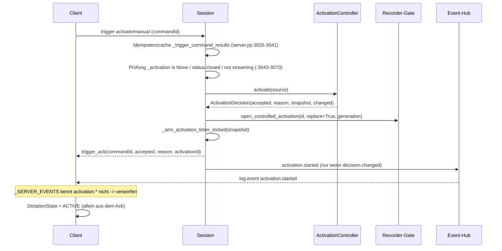

# STATE_EVENT_COMMAND_ATLAS

**Phase A – Ist-Zustand ohne Sollbewertung.** Auftragsabschnitte 9 und 10.

---

## 9. Clientseitige State Machines – vollständiges Inventar

### 9.1 Einzelaufnahme

#### `DictationState` (`core/controller.py:77-83`)

* **Werte:** `idle`, `starting`, `active`.
* **Owner:** `STTController`, geschützt durch `self._lock`
  (`threading.Lock`, `:285`).
* **Schreibstellen:** `:297` (Init `IDLE`), `:457` (`_update_dictation_state`),
  `:587` (Transport nicht bereit → `IDLE`), `:642` (`STARTING`), `:653`
  (Audiostart fehlgeschlagen → `IDLE`), `:831` (`ACTIVE` nach Bestätigung),
  `:906` (`_fail_start_attempt` → `IDLE`), `:981` (`_stop_dictation_locked` →
  `IDLE`), `:1590` (Shutdown → `IDLE`), `:1984` (`_reject_start_from_server_error`
  → `IDLE`), `:2480` (`_handle_dictation_interrupted` → `IDLE`).
* **Lesestellen:** `:399`, `:405`, `:453`, `:606`, `:615`, `:823`, `:1053`,
  `:1431`, `:1492`, `:1807`, `:1854`, `:1887`, `:1981`, `:2438`, `:2476`,
  `:2530`, `:2554`, `:2585`.
* **Zweck:** Steuert, ob Audio gesendet werden darf, welche Bedeutung der
  Hotkey hat und wie der Tray aussieht.
* **Quelle der Wahrheit:** ausschließlich lokal. Es gibt keine Schreibstelle,
  die aus einem Serverevent des Activation-Lifecycles gespeist wird.
* **Lebensdauer:** von `_begin_start_locked` bis zu einem der oben genannten
  `IDLE`-Übergänge.
* **Resetpfade:** Transportverlust (`:2438-2439`), Serverfehler
  (`:1895`, `:1905`, `:1915`, `:1938`, `:1953`, `:1965`), expliziter Stop,
  Cancel, Shutdown.

#### `_dictation_requested` (`core/controller.py:293`)

* **Owner/Schutz:** wie oben.
* **Schreibstellen:** `:293`, `:386` (`request_initial_auto_start`), `:455`,
  `:588`, `:643`, `:654`, `:832`, `:907`, `:979`, `:1591`, `:1985`, `:2481`.
* **Lesestellen:** `:377` (Property `dictation_requested`), `:532`, `:1055`,
  `:1430`, `:1492`, `:1039` (**Hotkeyverzweigung**), `:1179`, `:1329`, `:2642`.
* **Zweck:** „Der Benutzer will diktieren." Faktisch identisch mit
  `DictationState != IDLE`, aber getrennt geführt.
* **Quelle der Wahrheit:** lokal.

#### `DictationWindowPhase` / `_window_phase` (`core/controller.py:85-91`, `:308`)

* **Werte:** `inactive`, `waiting_first_speech`, `segment_active`,
  `followup_wait`.
* **Schreibstellen:** `:308` (Init), `:1374` (`_cancel_dictation_window`),
  `:1461` (`_arm_dictation_window`), `:1817` (`SEGMENT_ACTIVE` in
  `_handle_timeline_event`).
* **Lesestellen:** `:431` (Snapshot), `:1061`, `:1489`, `:1825`;
  UI: `ui/presentation.py:126-138`.
* **Entscheidend:** `_arm_dictation_window` wird nur unter
  `_client_owns_dictation_window` (`:683-693`) aufgerufen (`:840-848`), und
  `:1817` ist durch `if self._server_owns_activation: … return` (`:1795-1801`)
  gegen den Produktivserver unerreichbar. **Gegen den Produktivserver bleibt
  der Wert dauerhaft `INACTIVE`.**

#### `AvailabilityState` / `_availability_state` (`core/controller.py:62-74`, `:296`)

* **Schreibstellen:** `:296`, `:439` (`_update_availability`), `:1659`
  (Shutdown → `STOPPED`).
* **Aufrufer von `_update_availability`:** `:1564` (Shutdown), `:1738`
  (`ready.ok == false`), `:1873` (`READY` nach Status), `:1890`, `:1901`,
  `:1911`, `:1920`, `:1933`, `:1948`, `:1960` (Serverfehler), `:2393`, `:2395`,
  `:2416`, `:2426`, `:2432` (Transport).
* **Lesestellen:** `:393`, `:404`, `:437`, `:576` (**blockiert Starts**),
  `:1863`, `:2398`.
* **Quelle der Wahrheit:** Transportzustand und Serverfehler, also serverseitig
  abgeleitet.

#### `_wake_mode_desired` (`core/controller.py:317-319`)

* **Init:** `config.session.effective_wake_word_trigger_enabled`.
* **Schreibstellen:** `:1035` (`False`, Primäraktion pausiert), `:1037`
  (`True`, Primäraktion aktiviert), `:1294` (`_install_runtime_config`).
* **Berechnung beim Apply (`:1151-1160`):** ausschließlich aus
  `candidate.session.mode` und `mode_changed`, **nicht** aus
  `wake_word_trigger_enabled`.
* **Lesestellen:** `:1145`, `:2640` (**Schleifenbedingung des Maintainers**).
* **Quelle der Wahrheit:** lokal, abgeleitet aus dem Legacy-Feld `mode`.

#### `_start_attempt` / `_StartAttempt` (`core/controller.py:183-194`, `:303`)

* Felder: `token`, `generation`, `session_id`, `future`, `send_task`,
  `command_sent`, `pending_confirmation`.
* Schreibstellen: `:641`, `:651`, `:905`, `:983`, `:1587`, `:1983`, `:2479`.
* Zweck: genau ein laufender Startversuch je Controller; Auflösung über
  `future` mit den Resolutions `confirmed`, `failed`, `stopped`, `shutdown`,
  `interrupted`, `command_error`, `cancelled` (`:945-964`).

#### `_discard_finals` (`core/controller.py:316`)

* `True` in `cancel_dictation` (`:1090`), `False` nach bestätigtem Start
  (`:839`); gelesen in `handle_server_event` (`:1756`). Verwirft
  `final`-Ereignisse nach einem Abbruch.

#### `_last_accepted_trigger` (`core/controller.py:320`)

* Gesetzt in `_begin_stream_and_trigger` (`:712`), gelesen in
  `_manual_accept_correlation` (`:721`). Dient nur der Idempotenz des
  „manuell akzeptiert"-Feedbacks.

#### `TransportState` (`core/stt_session.py`)

* Werte u. a. `CONNECTING`, `ADMITTED`, `READY`, `DISCONNECTED`, `ERROR`.
* Owner `STTSession`; Callback `_handle_transport_change`
  (`core/controller.py:2373-2456`).

#### `ClientState.streaming_requested` (`core/stt_session.py:108`)

* Schreibstellen: `:615` (`set_streaming`, setzt **beide** Felder), `:696`
  (`invalidate_connection`), `:733` (`send_start` → True), `:741`
  (`send_stop` → False), sowie implizit bei jedem Verbindungsaufbau durch den
  frischen `ClientState` (`:947-952`).
* **Einzige Lesestelle im Produktivcode:** `core/controller.py:701` in
  `_begin_stream_and_trigger` — entscheidet, ob `start` gesendet wird.

#### `ClientState.server_status` / `SessionState`

* Vom Server über `status`-Nachrichten gesetzt
  (`core/controller.py:1848` `SessionState.from_server`).
* Gelesen in `get_snapshot` (`:432`) und in `ui/presentation.py:105-120`
  (**nur im Wake-Word-Zweig**).

#### `SessionContext` (`core/session_coordinator.py:34-57`)

* Felder `generation`, `session_id`, `log_access`, `event_state`,
  `token_expires_at`, `unavailable_code`, `unavailable_reason`.
* Owner `DualSessionCoordinator`; Lebensdauer eine STT-Generation.

#### `FeedbackReducerState` (`core/feedback_reducer.py`)

* Felder u. a. `visible_state`, `source`, `event_state`, `fallback_state`,
  `local_fault`, `seen_event_ids`, `seen_correlations`, `revision`,
  `uncertain`.
* Owner `FeedbackEngine` mit eigenem Lock (`:460`).
* Quelle der Wahrheit: Eventstream, mit STT-Fallback; lokale Ereignisse
  überlagern nur sichtbar, ohne den Serverzustand zu löschen
  (`:296-310`).

#### `_pending_triggers` (`core/stt_session.py:526`)

* `dict[commandId, _PendingTrigger]`; gefüllt in `send_trigger`, geleert in
  `_resolve_trigger_ack` und `_discard_pending_triggers`
  (Verbindungswechsel: `:944-946`, `:1051`).

### 9.2 Authority Matrix

| Information | Server hält Zustand | Client hält Zustand | UI liest | Wer gewinnt bei Widerspruch? |
|---|---|---|---|---|
| Activation offen / geschlossen | **ja** (`ActivationController.phase`) | **ja** (`DictationState`) | `DictationState` (`ui/presentation.py:122-144`) | **Client** – der Serverzustand erreicht `DictationState` über keinen Codepfad |
| Activation-ID | ja (`activation_id`) | nein | – | Server (aber nur in Events, nicht in der UI) |
| primäre Triggerquelle | ja (`primary_source`) | nein | – | Server, nirgends ausgewertet |
| Trigger-Lock | **nein** (Konzept existiert im Code nicht) | **nein** | – | – |
| Recording läuft | ja (`segment_active`, `recorder.is_recording`) | teilweise (`_window_phase`, gegen Produktivserver ungenutzt) | Wake-Word-Zweig: `server_status`; Manual-Zweig: `_window_phase` | **gemischt, je Betriebsart verschieden** |
| Follow-up läuft | ja (`followup_wait` + Timerthread) | teilweise (`FOLLOWUP_WAIT`, ungenutzt) | Manual-Zweig | gemischt |
| Stream läuft | ja (`session.streaming`) | ja (`_streaming`, `streaming_requested`) | nein | Client entscheidet über `start`; Server lehnt Audio ohne `start` ab (`server.py:2829-2831`) |
| Aufnahmeende | **ja** (VAD in `recording.py:373-395`) | nein (kein lokales VAD im Client vorhanden) | – | Server |
| Verfügbarkeit / Fehler | ja (Fehlerevents) | ja (`AvailabilityState`) | ja | Server als Quelle, Client als Ableitung |
| Wake Word erkannt | ja | nur als Feedbackimpuls | ja | Server |
| Wake-Word-Armierung | nein | **ja** (`_wake_mode_desired`) | Tray-Text | Client |
| Sichtbarer Feedbackzustand | ja (Eventstream) | ja (`FeedbackReducerState`) | ja | Server, mit lokaler Überlagerung |
| Fensterzeiten (15/3/x s) | ja (`SessionActivationRequest`, Defaults 15/3/5) | ja (`DictationWindowConfig`, 15/3/15) | ja (Dialog) | **beide, unabgeglichen** (siehe `CONFIG_UI_FEEDBACK_ATLAS.md` §13.3) |

**Belegte doppelte Wahrheiten:**

1. `DictationState`/`_dictation_requested` gegen `ActivationController.phase`.
2. `DictationWindowPhase` gegen `ActivationController.phase` (der lokale
   Zwilling ist gegen den Produktivserver deaktiviert, wird aber weiterhin von
   der UI gelesen).
3. `DictationWindowConfig` gegen `SessionActivationRequest` (zwei Zahlenwerke
   für dieselben Fristen).
4. `_wake_mode_desired` gegen `activation_config.wake_word_enabled`.

---

## 10. Event- und Command-Architektur

### 10.1 Client → Server (Haupt-WebSocket `/ws/transcribe`)

| Nachricht | Sender | wann gesendet | erforderlicher Zustand | Ack | Side Effects |
|---|---|---|---|---|---|
| `{"type":"start"}` | `stt_session.send_start` `:727-734` | in `_begin_stream_and_trigger` `:701-702`, **nur wenn `streaming_requested` falsch** | `is_ready` sonst `ConnectionError` `:729-732` | keines; indirekt `status` | Server `streaming=True`, Status `listening`/`wakeword_wait` (`server.py:2719-2728`); Client setzt `streaming_requested=True` |
| `{"type":"stop"}` | `send_stop` `:736-742` | nur wenn **kein** Activation-Contract (`controller.py:1004-1005`) | offener Socket | keines | Server `streaming=False`, Status `idle`, **`_reset_activation_locked("stream_stopped")`** (`server.py:2730-2745`) |
| `{"type":"clear"}` | `send_clear` `:744-748` | in `cancel_dictation` `:1098` | offener Socket | keines | Server verwirft Turn und Activation (`server.py:2778-2800`) |
| `{"type":"trigger","action":"activate","source":"manual","commandId":…}` | `send_trigger` / `request_trigger` | `_begin_stream_and_trigger` `:705` — **auch beim Armieren des Wake-Word-Streams** | Socket offen; Server verlangt `streaming` (`server.py:3062-3070`) | **`trigger_ack`** | `ActivationController.activate` |
| `trigger action=extend source=manual` | `controller.py:1082-1084` | nur wenn `_window_phase ∈ {WAITING_FIRST_SPEECH, FOLLOWUP_WAIT}` → gegen Produktivserver **nie** | dito | `trigger_ack` | `ActivationController.extend` |
| `trigger action=finish source=manual` | `controller.py:1001-1003` | in `stop_dictation`, wenn Activation-Contract | dito | `trigger_ack` | `ActivationController.finish` |
| `trigger action=cancel source=manual` | `controller.py:1095-1097` | in `cancel_dictation` | dito | `trigger_ack` | `ActivationController.cancel` |
| `{"type":"ping"}` | `_ping_loop` | alle `ping_interval` | READY | `pong` | Backoffreset beim ersten gültigen Pong |
| `{"type":"metrics"}` | – | im Clientcode nicht verwendet | – | `metrics` | – |
| Binärpaket Audio | `send_audio` | aus `_audio_sender` | `_streaming and _ws_is_open` | keines; bei Ablehnung `warning` | `recorder.feed_audio` |

**Nicht vom Client gesendet, aber serverseitig unterstützt:** `metrics`.

### 10.2 Server → Client (Haupt-WebSocket)

| Nachricht | Quelle | Inhalt | Clientverbrauch |
|---|---|---|---|
| `hello` | `server.py:7511-7519` | `clientId`, `sessionId`, `settings`, `sessionConfig`, `activationConfig`, `sessionCapabilities`, `limits`, `supportedEngines`, `runtimeSettings`, `logAccess` | `stt_session.py:1184-1186` speichert `sessionCapabilities`; `controller.py:1710-1729` startet den Eventstream |
| `ready` | `server.py:7521-7526` | `ok`, Modelle | `controller.py:1736-1743` |
| `status` | `publish_status(...)` | `state ∈ {idle, listening, wakeword_wait, wakeword_detected, recording, transcribing, …}` | `_handle_status_event` `:1834-1877`, Startbestätigung und `SessionState` |
| `timeline` | `_publish_timeline_event` `server.py:4166-4197` | siehe 10.3 | `_handle_timeline_event` `:1770-1832` |
| `final` | Textthread | `sessionId`, `segmentId`, `text` | `process_raw_final_event` `:2007` |
| `realtime`/Zwischentext | Textthread | – | `on_text` |
| `trigger_ack` | `handle_trigger_command` `server.py:3084-3091` | `commandId`, `accepted`, `reason`, `activationId`, `sessionId` | `_resolve_trigger_ack` `stt_session.py:842-880` |
| `error` | diverse | `where ∈ {admission, main_engine, realtime_engine, recorder, command, session_config, audio_packet, audio}` | `_handle_error_event` `:1879-1974` |
| `warning` | u. a. `server.py:2851-2854`, `:3820-3823` | Text | **kein Handler in `handle_server_event`** (`:1694`, `:1710-1753`) |
| `pong` | `server.py:7588-7592` | – | Ping-Logik |
| `metrics` | `server.py:7594-7598` | – | ungenutzt |

### 10.3 Timeline-Ereignisse (Haupt-WebSocket) und Strukturereignisse (`/ws/logs`)

`_publish_timeline_event` (`server.py:4166`) sendet den Timeline-Namen auf dem
Haupt-Socket **und** übersetzt ihn in einen Strukturnamen für den Eventstream
(`server.py:4199-4211`), immer auf dem Kanal `"transcription"`
(`server.py:4212-4224`).

| Timeline-Name | Strukturname (`/ws/logs`) | Clientverbrauch Timeline | Clientverbrauch Eventstream |
|---|---|---|---|
| `activation_started` | `activation.started` | **keiner** | **keiner** (`_SERVER_EVENTS` kennt ihn nicht, `core/event_normalizer.py:31-82`) |
| `activation_extended` | `activation.extended` | **keiner** | **keiner** |
| `activation_closed` | `activation.closed` | nur `_cancel_timeout_warning()` (`controller.py:1799-1801`) | **keiner** |
| `recording_started` | `transcription.recording_started` | `:1811-1822` (nur ohne Activation-Contract) | `SERVER_RECORDING_STARTED`, Impuls `RECORDING_STARTED` |
| `recording_ended` | `transcription.recording_ended` | `:1823-1832` (nur ohne Activation-Contract) | `SERVER_RECORDING_ENDED`, Impuls `RECORDING_ENDED` |
| `transcription_started` | `transcription.started` | – | `SERVER_TRANSCRIPTION_STARTED` |
| `wakeword_detected` | `wakeword.detected` | – | `SERVER_WAKE_WORD_DETECTED` |
| `wakeword_followup_started` | `wakeword.followup_started` | `:1779-1789` Warnungscountdown | **keiner** |
| `wakeword_followup_timeout` | `wakeword.followup_timeout` | `:1790-1791` Warnung löschen | **keiner** |
| `wakeword_timeout` | `wakeword.timeout` | – | **keiner** |
| `wakeword_wait_started` | `wakeword.wait_started` | – | **keiner** |
| `wakeword_wait_ended` | `wakeword.wait_ended` | – | **keiner** |
| `final_transcript` | `transcription.completed` | Fallback `:89` | `SERVER_TRANSCRIPTION_COMPLETED` |
| `final_transcript_discarded` | `transcription.discarded` | Fallback `:90` | `SERVER_TRANSCRIPTION_DISCARDED` |

### 10.4 Kanäle

| Kanal | Endpunkt | Inhalt | Client |
|---|---|---|---|
| Haupt-WebSocket | `/ws/transcribe` (`server.py:7418`) | Kommandos, `hello`/`ready`/`status`/`timeline`/`final`/`error`/`warning`/`trigger_ack` | `STTSession` |
| Eventstream | `/ws/logs` (`server.py:6479`) | `log.hello`, `log.subscribed`, `log.event`, `log.replay_completed`, `log.gap`, `log.error`, `log.pong`, `log.keepalive` (`core/event_models.py:58-65`) | `EventStreamTransport` + `EventProtocolProcessor` |
| Replay | `/ws/logs`, `origin=REPLAY` | historische Ereignisse, Cursorpersistenz (`core/event_cursor_store.py`) | Impulse werden bei Replay unterdrückt (`event_normalizer.py:157`) |
| STT-Fallback | Haupt-WebSocket | `status`/`timeline`/`final`/`error` als Ersatz, wenn `/ws/logs` fehlt | `normalize_stt_fallback` `:183-253` |

### 10.5 Command → Ack → Transition → Event → Clientwirkung

### 10.6 Produziert, aber nicht konsumiert

| Ereignis / Feld | Produzent | Beleg für fehlenden Konsumenten |
|---|---|---|
| `activation.started` | `server.py:4200` | `core/event_normalizer.py:31-82` ohne Eintrag |
| `activation.extended` | `server.py:4201` | dito |
| `activation.closed` | `server.py:4202` | dito; Timeline-Variante nur `_cancel_timeout_warning` |
| `timeline activation_started` | `server.py:3153` | `_handle_timeline_event` `:1795-1801` behandelt nur `activation_closed` |
| Felder `activationId`, `primarySource`, `sources` an allen Timeline-Events | `server.py:4189-4193` | im Client kein Lesezugriff (`grep activationId` → nur `stt_session.py:859`) |
| `hello.sessionCapabilities.wakeWord.availableWakeWords` | `server.py:4958-4966` | Client liest nur `activationTriggers` (`stt_session.py:573-578`) |
| `hello.activationConfig` | `server.py:7514` | im Client kein Lesezugriff |
| `warning`-Nachrichten | `server.py:2851-2854`, `:3820-3823` | `handle_server_event` hat keinen Zweig `:1694-1753` |
| `wakeword.timeout`, `wakeword.wait_started`, `wakeword.wait_ended` | `server.py:4206-4209` | nicht in `_SERVER_EVENTS` |
| `metrics` | `server.py:7593-7598` | kein Clientaufruf |

### 10.7 Clientseitig erwartete Zustände ohne Serverereignis

| Erwartung im Client | fehlendes Ereignis |
|---|---|
| „Activation ist vollständig abgeschlossen, System ist wieder Idle" | Es existiert kein `activation_finalized`. `activation_closed` wird bei Phase `finalizing` gesendet, ohne dass eine spätere Meldung folgt; `finalized()` hat keinen Aufrufer. |
| „Ein Trigger wurde unterdrückt" | Es gibt keinen Zustand, in dem der Server unterdrückt: `activate` antwortet mit `merged` oder `already_active`, beide `accepted=True`. |
| Trayanzeige „Sprache wird aufgenommen" im Manual-Pfad | benötigt `_window_phase == SEGMENT_ACTIVE`; die einzige Schreibstelle `:1817` ist gegen den Produktivserver unerreichbar. |
| Anzeige der Wake-Word-Auswahl im Dialog | Katalog ist vorhanden, wird aber nicht abgerufen (siehe 10.6). |

---

## Vollständigkeitsstand

| Auftragsabschnitt | Status |
|---|---|
| 9 Clientseitige State Machines + Authority Matrix | vollständig |
| 10 Event- und Command-Architektur | vollständig |
