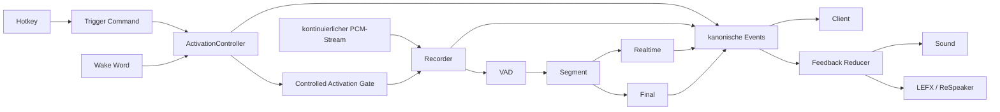

# Verbindlicher Ausführungsauftrag  
## Einheitliche serverseitige Triggerarchitektur über STT-Server, Desktop-Client und LED/Feedback-System

---

# 0. Charakter dieses Auftrags

Dieser Auftrag ist **kein Untersuchungsauftrag und keine Sammlung von Empfehlungen**.

Die Grundarchitektur wurde bereits untersucht und fachlich festgelegt. Du übernimmst einen teilweise begonnenen Architekturumbau und sollst ihn **vollständig implementieren, integrieren, validieren, dokumentieren und in einen eindeutig abnahmefähigen Zustand bringen**.

Arbeite grundsätzlich selbstständig vom aktuellen Stand bis zum Abschluss.

Du wartest **nicht nach jedem Arbeitspaket auf Benutzerfreigabe**.

Stattdessen besitzt jedes Arbeitspaket ein verbindliches technisches Gate.

Ein Gate gilt ausschließlich dann als bestanden, wenn:

1. alle dort geforderten Implementierungen tatsächlich vorhanden sind;
2. alle vorgeschriebenen Positiv-, Negativ-, Race- und Regressionstests ausgeführt wurden;
3. keine ungeklärte rote Testabweichung besteht;
4. die betroffenen Verträge gegen Producer **und** Consumer geprüft wurden;
5. die Dokumentation den tatsächlich implementierten Zustand beschreibt;
6. die Nachweise in `VALIDATION.md` festgehalten wurden;
7. `STATUS.md` den aktuellen Stand vollständig wiedergibt.

**Wenn ein Gate nicht bestanden ist, darf das nächste davon abhängige Arbeitspaket nicht begonnen werden.**

Ein fehlender Testnachweis ist kein bestandener Test.

Eine Codeinspektion ersetzt keinen vorgesehenen Laufzeittest.

Ein isoliert grüner neuer Test ersetzt keine Regression.

Eine scheinbar kompatible Schnittstelle gilt nicht als kompatibel, solange Producer und Consumer nicht gemeinsam geprüft wurden.

---

# 1. Zielzustand

Die bisherige Produktsemantik mit zwei Betriebsmodi wird vollständig aufgehoben.

Es gibt zukünftig **keinen Hotkey-Modus und keinen Wake-Word-Modus mehr**.

Stattdessen existieren:

- genau eine STT-Session pro Clientverbindung;
- genau ein kontinuierlicher Audiostream;
- genau eine serverseitige Aktivierungszustandsmaschine;
- genau eine Recorder-/VAD-/Transkriptionspipeline;
- zwei unabhängig aktivierbare Triggerquellen:
  - `manual`;
  - `wake_word`.

Zulässige Konfigurationen:

| Manual | Wake Word | Gültig |
| --- | --- | --- |
| an | aus | ja |
| aus | an | ja |
| an | an | ja |
| aus | aus | **nein** |

Die Kombination `false / false` muss bereits auf Konfigurationsebene eindeutig abgelehnt werden.

---

# 2. Verbindliche Triggersemantik

## 2.1 Manual / Hotkey

Der Hotkey ist kein Push-to-talk.

Die bestehende Bedienlogik bleibt erhalten:

1. erster Hotkeydruck öffnet eine Activation;
2. ein weiterer Druck während derselben Activation verlängert sie;
3. ein optionaler Finish-Hotkey beendet den aktiven Turn kontrolliert;
4. ein optionaler Cancel-Hotkey verwirft den aktiven Turn.

Der Tastendruck selbst ist zunächst **nur eine lokale Benutzerabsicht**.

Er darf fachliches Feedback erst auslösen, nachdem der Server den Trigger akzeptiert hat.

---

## 2.2 Wake Word

Ein erkanntes Wake Word öffnet dieselbe Art von Activation.

Ab der Aktivierung dürfen Manual und Wake Word nicht mehr unterschiedliche Aufnahme-, Timer-, Recorder-, Transkriptions- oder Feedbackpfade besitzen.

---

## 2.3 Kollisionssemantik

Der erste Trigger eröffnet die Activation und wird deren `primarySource`.

Beispiel:

```text
Manual
  ↓
Activation A42
primarySource = manual
sources = [manual]
```

Kommt innerhalb derselben Activation zusätzlich ein Wake Word:

```text
Activation A42
primarySource = manual
sources = [manual, wake_word]
```

Es darf dabei **nicht** entstehen:

- eine zweite Activation;
- ein zweiter Recorderpfad;
- ein zweites Segment;
- ein zweites Final;
- eine zweite Schedulerbelegung;
- ein paralleler Follow-up-Timer.

Dasselbe gilt in umgekehrter Reihenfolge.

---

# 3. Zielarchitektur



Zwei getrennte Lebenszyklen sind ausdrücklich beizubehalten:

### Stream-Lifecycle

```text
connect
→ ready
→ start
→ streaming
→ stop
→ disconnect
```

### Activation-Lifecycle

```text
inactive
→ waiting_for_voice
→ recording
→ followup_wait
→ finalizing
→ inactive
```

`start` und `stop` bleiben ausschließlich Streambefehle.

Manual-Trigger erhalten einen eigenen Vertrag und dürfen nicht auf Streambefehle umgebogen werden.

---

# 4. Verbindliche Quellenhierarchie

Bei Widersprüchen gilt folgende Priorität:

1. explizite aktuelle Benutzerentscheidungen;
2. aktueller produktiver Code und aktuelle erfolgreiche Tests;
3. `2026-08-12_untersuchungsbericht_einheitliche_serverseitige_triggerarchitektur.md`;
4. dieser Ausführungsauftrag;
5. `2026-08-12_implementierungsplan_einheitliche_serverseitige_triggerarchitektur.md`;
6. bisheriger Chatverlauf;
7. `Fehler_Änderungen.md`;
8. ältere DeepSeek-Voranalyse ausschließlich als historische Quelle.

Der ältere DeepSeek-Bericht ist **nicht normativ**.

Historische Dokumentation darf aktuellen Produktcode nicht überstimmen.

---

# 5. Betroffene Projekte

Es sind drei Verträge gemeinsam zu betrachten.

## Server

```text
marcosudau-vps/voice-stt-server
```

Bekannte Baseline des begonnenen Worktrees:

```text
13c162950b944dc715fdd81983a7465f8eb0fd79
```

---

## Client

```text
marcosudau-vps/voice-stt-client
```

Der ursprüngliche Triggerplan basierte noch auf:

```text
467a6b699b470df4a7bb15e1c81126c37036facd
```

Dieser Stand ist überholt.

Mindestens folgender Feedback-Fix gehört inzwischen zur verbindlichen Clientbasis:

```text
178d32bdf17d4709307e7a2a944888d2cf294e42
fix(feedback): debug LED and sound feedback
```

Vor Clientarbeit ist trotzdem der **tatsächlich aktuelle `main`** zu bestimmen.

---

## LED/LEFX

```text
marcosudau-vps/led_controller_respeaker-v3
```

Bekannter Referenzstand:

```text
aa2f14bd13dd75bce2221fdcadd50b38a5c8c1b0
```

Produktcodeänderungen im LED-Projekt sind derzeit **nicht vorgesehen**.

Falls sie dennoch notwendig erscheinen, muss vor einer Änderung belegt werden, warum der bestehende Vertrag nicht ausreicht.

---

# 6. Vorhandene angefangene Arbeit

Der vorhandene Server-Worktree enthält bereits Arbeit des vorherigen Agenten.

Insbesondere:

```text
VoiceSTT/audio_recorder.py
VoiceSTT/core/activation_control.py
VoiceSTT/core/initialization.py
VoiceSTT/core/recording.py
tests/unit/test_recorder_activation_control.py

api_fastapi_server/activation.py
api_fastapi_server/server.py
tests/unit/test_server_activation_controller.py
```

sowie Plan-/Archivdokumentation.

Dieser Zwischenstand darf **weder blind übernommen noch pauschal verworfen** werden.

Vor der nächsten Implementierung muss für jede Änderung eindeutig entschieden werden:

```text
BEHALTEN
KORRIGIEREN
VERWERFEN
```

Diese Entscheidung ist kurz zu begründen.

---

# 7. Bereits bekannte notwendige Korrekturen

Diese Punkte sind keine optionalen Verbesserungsvorschläge.

Sie müssen vor Abschluss des jeweiligen Arbeitspakets geprüft und korrekt umgesetzt sein.

## 7.1 Controlled Gate ist alleinige Recorder-Autorität

Im `controlled`-Modus darf keine zweite Autorität wie:

```python
recorder.wakeword_detected
```

die Aktivierung des Recorders unabhängig vom zentralen Gate ermöglichen.

Ziel:

```text
Wake Word
    ↓
ActivationController
    ↓
Activation-ID
    ↓
Controlled Gate
    ↓
Recorder/VAD
```

und:

```text
Manual Trigger
    ↓
ActivationController
    ↓
dieselbe Gate-Mechanik
```

Der Recorder kennt im Controlled-Modus nicht die Triggerquelle.

Er kennt ausschließlich:

```text
Gate offen
Gate geschlossen
```

---

## 7.2 Monotone Timer

Alle internen Deadlines und Timeoutberechnungen verwenden eine monotone Zeitquelle.

Geeignet:

```python
time.monotonic()
```

Nicht geeignet als interne Deadlinebasis:

```python
time.time()
```

Wallclock-Zeit darf zusätzlich für Logs oder öffentliche Zeitstempel benutzt werden.

---

## 7.3 Primary Source

Jede Activation besitzt mindestens:

```text
activationId
generation
primarySource
sources
state
```

`primarySource` bleibt über die gesamte Activation unverändert.

---

## 7.4 Keine falschen Capabilities

Eine Capability darf erst als unterstützt angekündigt werden, wenn der dazugehörige Vertrag vollständig funktioniert.

Insbesondere darf der Server nicht behaupten:

```text
activationTriggers.supported = true
```

solange beispielsweise:

- `trigger` nicht verarbeitet wird;
- `trigger_ack` fehlt;
- `commandId` nicht idempotent ist;
- die Activation nicht mit dem Recorder verbunden ist.

---

# 8. Verbindliche laufende Arbeitsdokumentation

Für diese Aktion ist folgende Struktur anzulegen beziehungsweise konsistent weiterzuführen:

```text
zusammenarbeit/
└── aktionen/
    └── einheitliche-triggerarchitektur/
        ├── STATUS.md
        ├── PLAN.md
        ├── CONTRACTS.md
        ├── DECISIONS.md
        ├── VALIDATION.md
        └── REPORT.md
```

Der Ordnername bleibt stabil.

**Keine Datumsordner für den laufenden Arbeitsvorgang.**

Datum und Uhrzeit stehen in den Dokumenten.

---

# 9. STATUS.md – permanenter Recovery-Checkpoint

`STATUS.md` ist kein später Abschlussbericht.

Es muss während der gesamten Arbeit den vollständigen aktuellen Übergabestand enthalten.

Ein neuer Agent ohne Chatverlauf muss ausschließlich anhand dieser Datei feststellen können:

- welches Ziel verfolgt wird;
- welche Repositories beteiligt sind;
- welche Worktrees benutzt werden;
- welche Branches aktiv sind;
- welche Baselines gelten;
- welche eigenen und fremden Änderungen existieren;
- welches Arbeitspaket aktuell läuft;
- was bereits vollständig umgesetzt wurde;
- was nur teilweise umgesetzt wurde;
- welche Tests tatsächlich gelaufen sind;
- welche Tests fehlgeschlagen sind;
- welche Vertragsänderungen bereits gelten;
- welche Entscheidungen getroffen wurden;
- welche Risiken offen sind;
- welcher **konkrete nächste technische Schritt** auszuführen ist.

Nicht ausreichend:

> „AP2 weiterführen.“

Ausreichend:

> „`RecorderBackedRealtimeSession` an `ActivationController.activate(source="wake_word")` anbinden. Anschließend Tests für Wake-Word-only, Manual→WakeWord-Kollision und genau ein Segment ausführen.“

---

# 10. Aktualisierungspflicht für STATUS.md

`STATUS.md` wird verpflichtend aktualisiert:

1. unmittelbar vor der ersten Codeänderung;
2. nach jedem abgeschlossenen Arbeitspaket;
3. nach jeder wesentlichen Architekturentscheidung;
4. nach jedem fehlgeschlagenen Gate;
5. nach jedem bestandenen Gate;
6. vor Build und Deployment;
7. nach Build und Deployment;
8. unmittelbar vor Commit;
9. unmittelbar nach Commit;
10. vor Push;
11. nach Push;
12. **vor jedem Arbeitsstopp**.

Falls Token-, Zeit-, Tool- oder Nutzungslimits knapp werden:

**Codearbeit stoppen und zuerst STATUS.md aktualisieren.**

Die Übergabefähigkeit hat dann Vorrang vor einem weiteren halbfertigen Implementierungsschritt.

---

# 11. CONTRACTS.md – verbindliche Cross-Repository-Matrix

`CONTRACTS.md` wird **vor** dem eigentlichen Umbau mit dem Istzustand gefüllt und anschließend bei Änderungen mitgeführt.

Für jeden Vertrag:

```text
Contract:
Producer:
Consumer:
Transport:
Schema/Datentyp:
Pflichtfelder:
Optionale Felder:
IDs/Korrelation:
Lifecycle:
Fehlersemantik:
Replay:
Deduplizierung:
Legacyverhalten:
Tests Producer:
Tests Consumer:
Cross-Project-Test:
Status:
```

Mindestens folgende Vertragsgruppen sind vollständig zu erfassen.

---

## 11.1 Session-/WebSocket-Vertrag

- URL;
- Queryparameter;
- `hello`;
- `ready`;
- Capability-Aushandlung;
- `start`;
- `stop`;
- `trigger`;
- `trigger_ack`;
- Errors;
- Close Codes;
- Reconnect.

---

## 11.2 ID-Vertrag

Mindestens:

```text
sessionId
generation
segmentId
activationId
commandId
eventId
cursor
```

Für jede ID muss eindeutig dokumentiert sein:

- Producer;
- Scope;
- Lebensdauer;
- Invalidierung;
- Replayverhalten;
- Deduplizierung;
- Reconnectverhalten.

---

## 11.3 Eventvertrag

Mindestens prüfen:

```text
client.lifecycle.*
transport.*
wakeword.*
activation.*
recording.*
transcription.*
followup.*
timeout.*
```

Bestehende Eventnamen nicht ohne zwingenden Grund verändern.

Bestehende Consumer ausdrücklich suchen und prüfen.

---

## 11.4 Feedbackvertrag

Die gesamte Kette muss nachvollziehbar sein:

```text
Server Event
→ Client Normalizer
→ Canonical Event
→ Feedback Reducer
→ Feedback Mapping
→ Sound / LEFX
```

Bei jedem neuen oder geänderten Event muss geprüft werden:

1. Erzeugt der Server es korrekt?
2. Akzeptiert der Client es?
3. Normalisiert der Client es korrekt?
4. Löst Replay keinen erneuten Impuls aus?
5. Dedup funktioniert?
6. Reducer interpretiert es korrekt?
7. Mapping existiert?
8. Sound/LED-Ziel existiert?

---

## 11.5 LED-/LEFX-Vertrag

Explizit prüfen:

- Verbnamen;
- Effects;
- Presets;
- Overlays;
- State Restore;
- Shutdown;
- Katalogauflösung;
- Simulator;
- echter ReSpeaker.

---

## 11.6 Konfigurationsvertrag

Alt:

```text
mode=hotkey
mode=wake_word
```

Neu:

```text
manual_trigger_enabled
wake_word_trigger_enabled
```

Migration:

```text
hotkey
→ manual=true
→ wake_word=false
```

```text
wake_word
→ manual=false
→ wake_word=true
```

Keine implizite Migration zu `true / true`.

---

# 12. Allgemeine Gate-Regel

Nach jedem Arbeitspaket sind zwingend vier Prüfschichten auszuführen:

### Schicht 1 – fokussierte Funktionstests

Tests der konkret geänderten Komponente.

### Schicht 2 – Negativ-, Race- und Lifecycle-Tests

Nicht nur Happy Path.

### Schicht 3 – Regression

Bestehende relevante Tests des Projekts.

### Schicht 4 – Contractprüfung

Producer und Consumer der berührten Schnittstellen.

Erst danach kann ein Gate auf `PASS` gesetzt werden.

Jedes Gate bekommt in `VALIDATION.md` explizit:

```text
GATE:
STATUS: PASS / FAIL
EVIDENCE:
OPEN FAILURES:
DECISION:
```

---

# 13. AP0 – Recovery, Baseline und Ist-Verträge

## Aufgabe

Bevor weiterer Produktcode geändert wird:

1. Worktrees aller beteiligten Repositories identifizieren;
2. Branch und HEAD bestimmen;
3. `git status --short` sichern;
4. fremde Dirty Changes erkennen;
5. Serverzwischenstand gegen Baseline diffen;
6. bestehende 10 Änderungen klassifizieren;
7. aktuellen Client-`main` bestimmen;
8. aktuellen LED-`main` bestimmen;
9. aktive Contractstellen über gezielte Symbolsuche identifizieren;
10. `STATUS.md`, `PLAN.md` und `CONTRACTS.md` anlegen beziehungsweise aktualisieren.

Keine großflächige Repositorylektüre.

Benutze:

```text
git diff
→ Symbolsuche
→ Producer
→ Consumer
→ Tests
```

---

## Pflichtnachweise AP0

In `STATUS.md` müssen pro Repository stehen:

```text
Repository
Worktree
Branch
HEAD
Baseline
dirty/clean
eigene Änderungen
fremde Änderungen
```

Für jede vorhandene Agentenänderung:

```text
Datei
Änderungszweck
BEHALTEN/KORRIGIEREN/VERWERFEN
Begründung
```

---

## GATE 0 – Baseline verstanden

PASS nur wenn:

- keine fremden Änderungen versehentlich im Scope liegen;
- jede bestehende Agentenänderung klassifiziert ist;
- aktuelle Producer/Consumer der wesentlichen Verträge identifiziert sind;
- Contract-Iststand dokumentiert ist;
- Baseline-Tests oder dokumentierte Baseline-Nachweise vorhanden sind.

**Bei FAIL keine weitere Implementierung.**

---

# 14. AP1 – Recorder Activation Gate vollständig fertigstellen

## Ziel

Der Recorder erhält eine saubere Trennung zwischen:

```text
legacy policy
controlled policy
```

Legacy bleibt vollständig kompatibel.

Controlled besitzt genau eine Aktivierungsautorität.

---

## Pflichtimplementierung

Mindestens:

- thread-sicheres Gate;
- Activation-/Generation-Bindung;
- Open;
- Extend soweit Recorder relevant;
- Finish;
- Cancel;
- Abort;
- Shutdown;
- idempotentes Schließen;
- alte Generation darf neue Activation nicht schließen;
- Wake Word kann Controlled Gate nicht umgehen;
- laufende Aufnahme wird durch einen zusätzlichen Trigger nicht dupliziert.

---

## Pflichtfälle AP1

Automatisiert testen:

1. Controlled + Gate geschlossen + Sprache → keine Aufnahme.
2. Controlled + Gate offen + Sprache → Aufnahme.
3. Legacy + bisheriger Pfad → unverändert.
4. Wake Word ohne geöffnetes Controlled Gate → keine Aufnahme.
5. Gate A offen.
6. Activation B ersetzt A.
7. spätes Close(A) → B bleibt offen.
8. Cancel → Gate geschlossen.
9. Finish → Gate kontrolliert geschlossen.
10. Abort → deterministischer Zustand.
11. Shutdown während offenem Gate.
12. zweiter Trigger während Recording → keine zweite Aufnahme.
13. Gateöffnung gleichzeitig mit VAD.
14. Gateclose gleichzeitig mit VAD.
15. mehrfaches Close → kein Fehler und keine Fremdwirkung.

Tests mit realitätsnahen Recorder-/Lifecycle-Pfaden ergänzen; reine `SimpleNamespace`-Tests allein reichen nicht als AP1-Abnahme.

---

## GATE 1 – Recorderautorität bewiesen

PASS nur wenn:

- alle neuen fokussierten Tests grün;
- relevante bestehende Recorder-Suite grün;
- Legacyverhalten bewiesen unverändert ist;
- kein direkter Wakeword-Bypass im Controlled-Modus vorhanden ist;
- Racefälle wiederholt stabil sind;
- `git diff --check` grün ist;
- Recorderdokumentation aktualisiert ist;
- `STATUS.md` und `VALIDATION.md` aktualisiert sind.

Bei Race-/Timingtests mindestens mehrere Wiederholungen durchführen.

Ein einmalig grüner Race-Test ist kein ausreichender Nachweis.

---

# 15. AP2 – ActivationController vervollständigen

## Ziel

Eine serverseitige Zustandsmaschine wird die einzige fachliche Autorität für Aktivierungsfenster.

---

## Zustände

Mindestens logisch:

```text
inactive
waiting_for_voice
recording
followup_wait
finalizing
```

Andere interne Namen sind zulässig, wenn Semantik eindeutig bleibt.

---

## Pflichtimplementierung

Activation enthält mindestens:

```text
activationId
generation
primarySource
sources
state
createdAt
monotonicDeadline
```

Operationen:

```text
activate
extend
recording_started
recording_ended
finish
cancel
expire
reset
```

Eigenschaften:

- thread-/async-sicher gemäß tatsächlicher Verwendung;
- monotone Deadlines;
- keine alte Timerwirkung auf neue Generation;
- deterministische ungültige Transitionen;
- Kollisionssemantik;
- eindeutige Sourceaggregation.

---

## Pflichtfälle AP2

1. Manual aktiviert aus `inactive`.
2. Wake Word aktiviert aus `inactive`.
3. Manual → Manual verlängert.
4. Wake Word → Wake Word verlängert entsprechend Vertrag.
5. Manual → Wake Word bleibt gleiche Activation.
6. Wake Word → Manual bleibt gleiche Activation.
7. nahezu simultane Trigger → eine Activation.
8. `primarySource` bleibt erster Trigger.
9. `sources` enthält beide Trigger maximal einmal.
10. Recording Start.
11. Recording End → Follow-up.
12. erneuter Trigger während Follow-up → Verlängerung.
13. Timeout → Abschluss.
14. Finish.
15. Cancel.
16. doppelte Finish-/Cancel-Aufrufe.
17. alter Timer nach neuer Generation.
18. Systemzeitänderung darf internen Timeout nicht beeinflussen.
19. Reset.
20. Reconnect-/Session-Close-Semantik.

---

## GATE 2 – Zustandsmaschine deterministisch

PASS nur wenn:

- sämtliche Transitionen getestet;
- ungültige Transitionen explizit getestet;
- Collisions getestet;
- Timer monotonic;
- Generation-Races getestet;
- keine doppelte Activation entsteht;
- keine bekannte Transition undefiniert bleibt;
- Zustandsdiagramm dokumentiert wurde;
- `VALIDATION.md` vollständige Ergebnisse enthält.

---

# 16. AP3 – WebSocket-Triggervertrag

## Neuer Command

Fachlich mindestens:

```json
{
  "type": "trigger",
  "action": "activate",
  "source": "manual",
  "commandId": "UUID"
}
```

Actions:

```text
activate
extend
finish
cancel
```

---

## Ack

Jeder syntaktisch gültige Command erhält genau eine deterministische Antwort.

Mindestens:

```json
{
  "type": "trigger_ack",
  "commandId": "...",
  "accepted": true,
  "activationId": "...",
  "sessionId": "..."
}
```

Ablehnungen müssen ebenfalls korrelierbar sein.

---

## commandId-Idempotenz

Derselbe `commandId` darf nicht zweimal fachliche Wirkung auslösen.

Pflicht:

- begrenzte Historie;
- deterministisches Wiederholungs-Ack;
- kein erneuter Timer;
- kein erneutes Event;
- kein zweites Segment.

---

## Pflichtnegativtests

- fehlendes `commandId`;
- falscher Datentyp;
- unbekannte Action;
- ungültige Source;
- Trigger vor Streamstart;
- Trigger nach Streamstop;
- Trigger nach Close;
- Trigger in unzulässigem Zustand;
- doppelte `commandId`;
- gleicher `commandId` mit anderem Payload;
- malformed JSON;
- Legacyclient sendet niemals Trigger und funktioniert weiterhin.

---

## GATE 3 – Netzwerkvertrag vollständig

PASS nur wenn:

- Trigger und Ack implementiert;
- Idempotenz bewiesen;
- Negativfälle getestet;
- Capability exakt dem tatsächlichen Funktionsstand entspricht;
- `hello`/`ready` nicht unbeabsichtigt gebrochen;
- bestehende `start`/`stop`-Tests grün;
- Legacyclientvertrag grün;
- Browserclientvertrag grün;
- Contractschemas dokumentiert.

---

# 17. AP4 – Serverintegration: Trigger → Gate → Recording

Jetzt erst werden die zuvor getrennt getesteten Bestandteile produktiv zusammengeschaltet.

---

## Pflichtverdrahtung

```text
Manual trigger ─┐
                ├→ ActivationController
Wake Word ──────┘
                       ↓
                Controlled Gate
                       ↓
                   Recorder/VAD
```

Rückwärts:

```text
Recorder recording_started
→ ActivationController.recording_started

Recorder recording_ended
→ ActivationController.recording_ended
```

Außerdem:

- Finish;
- Cancel;
- Timeout;
- Close;
- Reconnect;
- Stream Stop.

---

## Serverevents

Mindestens fachlich darstellen:

```text
activation.manual_accepted
activation.extended
activation.closed
```

Bestehendes Wakewordevent bleibt erhalten.

Recording-/Transkriptionsereignisse erhalten soweit fachlich sinnvoll:

```text
activationId
primarySource
sources
```

Keine zweite konkurrierende Eventautorität schaffen.

---

## GATE 4 – Server-E2E

Pflicht-E2E-Tests:

### Manual only

```text
start
→ trigger manual
→ Sprache
→ Recording
→ Realtime
→ Final
→ Follow-up
→ Timeout
```

### Wake Word only

gleiche fachliche Pipeline ab Activation.

### Beide aktiv

Testen:

```text
Manual → Wake Word
Wake Word → Manual
nahezu gleichzeitig
```

Für jeden Kollisionsfall zwingend beweisen:

```text
Activations = 1
Segments = 1
Finals = 1
Scheduler allocations = 1
```

Zusätzlich:

- Finish;
- Cancel;
- Reconnect;
- Event Replay;
- Streamstop während Activation;
- Serverclose während Activation.

PASS nur wenn gesamte relevante Serversuite anschließend grün ist.

---

# 18. AP5 – Serverdokumentation und kompatibler Rollout

Vor Clientumbau muss der Server einen vollständigen, dokumentierten und abwärtskompatiblen Vertrag bereitstellen.

Dokumentiere:

- Trigger;
- Ack;
- Capabilities;
- Activationzustände;
- IDs;
- Timer;
- Kollisionssemantik;
- Legacyverhalten;
- Migration;
- Rollback;
- Privacy-Auswirkung kontinuierlichen Streamings.

---

## GATE 5 – Server bereit für alten und neuen Client

Vor Fortsetzung beweisen:

1. aktueller Legacy-Desktopclient funktioniert gegen neuen Server;
2. Browserclient funktioniert;
3. `start`/`stop` unverändert;
4. neue Capability ist korrekt;
5. Triggervertrag ist tatsächlich funktionsfähig;
6. bestehende Eventstream-/Replay-Verträge funktionieren;
7. Server-Regressionssuite grün;
8. produktionsnaher Smoke-Test grün.

Erst danach darf AP6 beginnen.

---

# 19. AP6 – Clientkonfiguration und Migration

Clientarbeit nur von aktuellem `main`.

Vor erster Änderung:

```text
git status
git log
aktueller Feedback-Fix vorhanden
```

---

## Migration

Alt:

```text
mode=hotkey
mode=wake_word
```

Neu:

```text
manual_trigger_enabled
wake_word_trigger_enabled
```

Verbindlich:

```text
hotkey
→ true / false
```

```text
wake_word
→ false / true
```

Nicht:

```text
true / true
```

ohne Benutzerentscheidung.

---

## Pflichtfälle Migration

- alte Hotkeyconfig;
- alte Wakewordconfig;
- fehlendes Feld;
- ungültiger alter Wert;
- neue Config;
- beide true;
- beide false → Fehler;
- persistiertes Userfile;
- Source-Run;
- PyInstaller/frozen Pfadauflösung soweit betroffen.

---

## GATE 6 – Konfigurationsmigration

PASS nur wenn:

- keine alte gültige Config unbrauchbar wird;
- keine stille Bedeutungsänderung eintritt;
- beide Trigger separat steuerbar sind;
- `false/false` eindeutig abgelehnt wird;
- UI und Backend gleiche Regel anwenden;
- Config-Regression grün.

---

# 20. AP7 – Client-Lifecycle vereinheitlichen

Der Client soll danach nur noch:

1. verbinden;
2. Capability prüfen;
3. Stream starten;
4. kontinuierlich Audio senden;
5. Manualtrigger als Commands senden;
6. serverseitige Events konsumieren;
7. Reconnect ausschließlich als Transport-/Streamproblem behandeln.

---

## Zu entfernen oder zu ersetzen

Explizit suchen und bewerten:

- Hotkey-Mode-Maintainer;
- Wakeword-Mode-Maintainer;
- `_dictation_requested`-ähnliche fachliche Modusschalter;
- clientseitige Activation-/Follow-up-Autorität;
- Moduswechsel-Reconnect;
- lokale „Hotkey wurde akzeptiert“-Annahme.

Lokale UI-Timer dürfen nur verbleiben, wenn sie **reine Darstellung serverseitiger Autorität** sind.

---

## Triggercommand

```text
Hotkey
→ commandId erzeugen
→ pending
→ trigger senden
→ trigger_ack
→ accepted/rejected
```

Kein fachliches Accepted-Feedback vor Ack.

---

## GATE 7 – Client-Lifecycle

Pflichttests:

- Manual-only;
- Wakeword-only;
- beide;
- Hotkeyregistrierung nur wenn Manual aktiv;
- Wakeword-only darf nicht an Hotkeykonflikt scheitern;
- Trigger vor Ready;
- Trigger nach Disconnect;
- Pending Command während Disconnect;
- doppelte Ack;
- Ack nach Reconnect;
- alte Ack aus alter Generation;
- Server ohne Triggercapability;
- Reconnect ohne alte Activation fortzusetzen.

Danach vollständige relevante Clientsuite.

---

# 21. AP8 – Events, Feedback und LEFX

Hier gilt besondere Vorsicht, weil der Feedbackbereich kurz zuvor umfangreich repariert wurde.

Der bestehende Feedback-Fix ist verbindlicher Bestand.

---

## Verbindlicher Ablauf Manual

```text
Hotkey gedrückt
→ pending

Server trigger_ack accepted
→ canonical manual accepted event
→ Feedback Reducer
→ Mapping
→ LED/Sound
```

---

## Verbindlicher Ablauf Wake Word

```text
Wake Word erkannt
→ Serverevent
→ Canonical Wakeword Event
→ Wakeword Feedback
→ gleiche Activation
```

Danach laufen beide Quellen über gemeinsame Recording-/Transkriptionsereignisse.

---

## Pflicht-Contractprüfung

Für jedes relevante Event:

```text
Server produziert?
Client parst?
Normalizer mappt?
Replay unterdrückt Impuls?
Dedupe korrekt?
Reducer behandelt?
Mapping vorhanden?
LEFX-Ziel vorhanden?
Sound vorhanden?
```

---

## GATE 8 – Cross-Project Feedbackvertrag

Automatisiert oder mit überprüfbaren Fixtures beweisen:

- Manual-Accepted genau einmal;
- doppeltes Ack erzeugt keinen Doppelimpuls;
- Replay erzeugt keinen Impuls;
- Wakeword während Manualactivation erzeugt Wakewordimpuls, aber keine zweite Recordingsequenz;
- Manual während Wakewordactivation entsprechend;
- Recording/Thinking/Success bleiben unverändert;
- Timeout-Tick/Countdown funktionieren weiterhin;
- LED-Katalogauflösung vollständig;
- bestehende Sounds vollständig;
- Simulator funktioniert.

Anschließend relevante LED-Suite beziehungsweise definierte Contracttests ausführen.

---

# 22. AP9 – Vollständige Cross-Repository-Regressionsabnahme

Jetzt nicht nur fokussierte Tests.

## Server

Vollständige vorgesehene Testsuite.

## Client

Vollständige vorgesehene Testsuite.

Kritische Race-/Reconnecttests mehrfach.

## LED

Vollständige vorgesehene Suite beziehungsweise dokumentierte Standard-CI-Suite.

---

## CONTRACTS.md erneut vollständig prüfen

Jede Zeile erhält:

```text
PASS
FAIL
N/A mit Begründung
```

Kein:

```text
wahrscheinlich kompatibel
sollte funktionieren
nicht betroffen
```

ohne Nachweis.

---

## GATE 9 – Softwareabnahme

PASS nur wenn:

- alle drei Projektverträge konsistent;
- keine ungeklärte rote Regression;
- keine nicht erklärte Schemaabweichung;
- Eventnamen Producer/Consumer identisch;
- IDs durchgängig;
- Legacyserververtrag erhalten;
- Feedback-Fix erhalten;
- `git diff --check` grün;
- komplette Testergebnisse dokumentiert.

---

# 23. AP10 – Build- und reale E2E-Abnahme

Automatisierte Tests allein reichen für diesen Architekturumbau nicht.

Es ist ein echter Clientbuild zu erzeugen.

---

## Pflichtmatrix

| Manual | Wake Word | Test |
| --- | --- | --- |
| an | aus | Pflicht |
| aus | an | Pflicht |
| an | an | Pflicht |

---

## Pflichtszenarien

Mindestens:

1. Hotkey → Sprache → Final.
2. Hotkey → Follow-up → erneut Hotkey → Sprache.
3. Hotkey Finish.
4. Hotkey Cancel.
5. Wake Word → Sprache.
6. Wake Word → Follow-up.
7. Manual während Wakewordactivation.
8. Wake Word während Manualactivation.
9. nahezu gleichzeitige Trigger.
10. dabei jeweils genau ein Final.
11. Timeout.
12. Countdown-Ring.
13. Timeout-Sound.
14. Reconnect im Idle.
15. Reconnect während Activation.
16. Eventstream-Reconnect.
17. Serverneustart.
18. Mute/Unmute.
19. Textinjektion.
20. History/Reinsert soweit betroffen.
21. LED-Simulator.
22. echter ReSpeaker.
23. alle relevanten Sounds.
24. Clientstart und Shutdown.
25. Legacyclient gegen neuen Server.

---

## Bei Kollisionsfällen zwingend protokollieren

Mindestens:

```text
activationId
primarySource
sources
segmentId
Anzahl Recording Starts
Anzahl Finals
```

Nur visuelles „es sah richtig aus“ ist nicht ausreichend.

---

## GATE 10 – reale Abnahme

PASS nur wenn:

- alle drei Triggerkombinationen real funktionieren;
- echte Audioeingabe geprüft;
- realer Serverpfad geprüft;
- Build geprüft;
- ReSpeaker geprüft;
- kein Doppelturn bei Kollision;
- Reconnect keine alte Activation wiederbelebt;
- Dokumentation mit realem Verhalten übereinstimmt.

---

# 24. AP11 – Dokumentation, Git und Abschluss

Dokumentation darf bereits während der Arbeit entstanden sein.

Jetzt wird sie abschließend gegen den tatsächlichen Code geprüft.

---

## Pflichtdokumentation

Mindestens:

- Zielarchitektur;
- Recorder-Gate;
- ActivationController;
- WebSocket-Triggervertrag;
- Ack und Idempotenz;
- Activation-Lifecycle;
- Stream-Lifecycle;
- IDs;
- Events;
- Replay;
- Reconnect;
- Configmigration;
- Client-Lifecycle;
- Feedback;
- LEFX;
- Legacykompatibilität;
- Troubleshooting.

Komplexe Abläufe durch Mermaid-Diagramme erklären.

---

## REPORT.md

Der Abschlussbericht enthält keine Absichtserklärungen, sondern ausschließlich tatsächlichen Iststand:

```text
Was wurde umgesetzt?
Was wurde bewusst nicht umgesetzt?
Welche Abweichungen gab es?
Welche Dateien wurden geändert?
Welche Commits entstanden?
Welche Tests liefen?
Welche Builds wurden geprüft?
Welche Hardwaretests liefen?
Welche Verträge änderten sich?
Welche Legacyverträge blieben erhalten?
Welche offenen Risiken existieren?
Was wurde gepusht/deployt?
```

---

## GATE 11 – Veröffentlichungsfähigkeit

Vor dem finalen Push:

```text
git status
git diff --check
Tests
Build
STATUS.md
CONTRACTS.md
VALIDATION.md
REPORT.md
```

prüfen.

Nach Push:

- Remote-Commit verifizieren;
- CI prüfen;
- Commit-ID dokumentieren;
- `STATUS.md` auf abgeschlossen setzen.

Wenn Deployment Teil des verfügbaren Workflows ist:

- Deploymentstand ebenfalls verifizieren und dokumentieren.

---

# 25. Harte Stop-Regeln

Du musst die Arbeit unterbrechen, wenn:

### A

Ein Gate nicht bestanden werden kann und keine eindeutig lokale technische Korrektur mehr möglich ist.

### B

Eine Produktentscheidung benötigt wird, die nicht aus Vorgaben ableitbar ist.

### C

Fremde Änderungen nicht sicher von deinen Änderungen getrennt werden können.

### D

Ein bestehender Cross-Repository-Vertrag nur durch eine Breaking Change lösbar wäre, die nicht bereits beschlossen wurde.

### E

Ein Deployment den Legacyclient oder Browserclient nachweislich brechen würde.

### F

Token-, Zeit- oder Nutzungslimit so knapp wird, dass kein sauberer nächster Arbeitsschritt mehr abgeschlossen werden kann.

In Fall F:

1. keine neue Implementierung beginnen;
2. aktuellen Testzustand sichern;
3. `STATUS.md` vollständig aktualisieren;
4. `VALIDATION.md` aktualisieren;
5. offene Diffs und nächsten konkreten Schritt dokumentieren;
6. erst danach stoppen.

---

# 26. Was ausdrücklich nicht erlaubt ist

Nicht:

- Betriebsmodus nur in `hybrid` umbenennen;
- zwei Recorderpfade behalten;
- Hotkey auf `start`/`stop` abbilden;
- zweite lokale Aktivierungszustandsmaschine im Client bauen;
- Trigger ohne Ack als akzeptiert behandeln;
- Wake Word am Controlled Gate vorbeiführen;
- `time.time()` für interne Deadline-Semantik verwenden;
- Capabilities zu früh veröffentlichen;
- neue Eventnamen einführen, ohne Consumer zu prüfen;
- bestehende Event-/Feedbackverträge stillschweigend brechen;
- alte Konfiguration stillschweigend zu beiden Triggern migrieren;
- rote Tests als „unabhängig“ markieren, ohne Ursache zu belegen;
- Tests nur deshalb abschwächen, damit sie grün werden;
- Dokumentation erst am Ende aus dem Gedächtnis rekonstruieren;
- komplette historische Verzeichnisse ohne konkrete Fragestellung einlesen;
- fremde Worktreeänderungen anfassen;
- Force-Push;
- pauschalen Reset;
- erfolgreiche bestehende Feedbackarbeit zurückbauen.

---

# 27. Effiziente Analysepflicht

Das Projekt enthält viele historische beziehungsweise nicht mehr aktive Dateien.

Arbeite deshalb gezielt.

Reihenfolge:

```text
git status
→ git diff
→ relevante Symbole
→ direkte Imports
→ Producer
→ Consumer
→ Tests
→ Dokumentation
```

Erst wenn damit eine konkrete Frage nicht beantwortet werden kann, weitere Dateien lesen.

Keine vollständigen Repository-Dumps in den Kontext laden.

---

# 28. Definition of Done

Der Auftrag ist ausschließlich abgeschlossen, wenn alle folgenden Aussagen nachweisbar wahr sind:

- Der Begriff Betriebsmodus besitzt keine aktive fachliche Bedeutung mehr.
- Manual und Wake Word sind unabhängige Triggerflags.
- `false/false` wird abgelehnt.
- Alte Config wird korrekt migriert.
- Eine Session besitzt einen Stream.
- Eine Session besitzt einen ActivationController.
- Eine Session besitzt einen Recorderpfad.
- Manual und Wake Word öffnen dieselbe Activation.
- Kollidierende Trigger erzeugen exakt eine Activation.
- Kollidierende Trigger erzeugen exakt ein Segment.
- Kollidierende Trigger erzeugen exakt ein Final.
- `primarySource` bleibt stabil.
- `sources` dokumentiert zusätzliche Trigger.
- `activationId` ist durchgängig korrelierbar.
- Generation schützt gegen alte Timer und alte Aktionen.
- interne Timer sind monoton.
- `commandId` ist idempotent.
- `trigger_ack` ist deterministisch.
- `start`/`stop` bleiben Streambefehle.
- Legacyclient funktioniert.
- Browserclient funktioniert.
- neuer Client erkennt Serverfähigkeit korrekt.
- Eventstream und Replay funktionieren.
- Replay wiederholt keine Feedbackimpulse.
- bestehende Feedbackreparatur bleibt erhalten.
- LED/LEFX-Vertrag ist validiert.
- Soundvertrag ist validiert.
- Reconnect belebt keine alte Activation wieder.
- Serverregression ist grün.
- Clientregression ist grün.
- LEDregression ist grün beziehungsweise echte unabhängige Abweichungen sind belastbar nachgewiesen.
- echter Clientbuild funktioniert.
- echte Audio-E2E-Tests sind erfolgt.
- echter ReSpeaker wurde geprüft, sofern verfügbar.
- Dokumentation entspricht dem Code.
- `STATUS.md` war während der Arbeit übernahmefähig.
- `CONTRACTS.md` enthält den finalen Vertragsstand.
- `VALIDATION.md` enthält tatsächliche Nachweise.
- `REPORT.md` beschreibt den finalen Iststand.
- Git-/CI-/Deploymentstand ist eindeutig dokumentiert.

Wenn auch nur einer dieser Punkte offen ist, lautet der Abschlussstatus nicht `DONE`, sondern:

```text
PARTIAL / BLOCKED
```

mit konkreter Begründung.

---

# 29. Abschlussantwort

Die finale Antwort soll kompakt sein, weil alle Details in den Arbeitsdokumenten stehen.

Sie enthält:

## Ergebnis
DONE / PARTIAL / BLOCKED

## Server
Commit, Tests, Deployment.

## Client
Commit, Tests, Build.

## LED/LEFX
Validierung und Hardwarestatus.

## Verträge
Contract-Gate-Status.

## Live-Abnahme
durchgeführte Szenarien.

## Dokumentation
Pfade zu:

```text
STATUS.md
CONTRACTS.md
DECISIONS.md
VALIDATION.md
REPORT.md
```

## Offene Punkte
Nur tatsächlich verbliebene Punkte.

Behaupte keinen Abschluss, solange ein verbindliches Gate nicht bestanden ist.