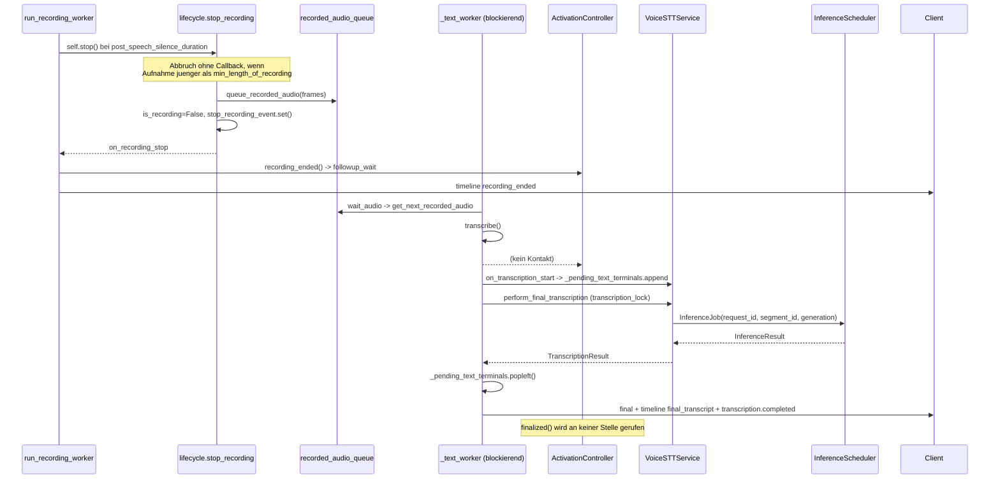

# LETZTE ARCHITEKTURKLÄRUNGEN VOR PLAN v1 FREEZE

> **Status 2026-08-24: IST-ANALYSE, ENTSCHEIDUNGSSTATUS TEILWEISE
> AKTUALISIERT.** Die Codebefunde bleiben Evidence. Neuere fachliche
> Entscheidungen stehen in `../ENTSCHEIDUNGEN_UND_OFFENE_PUNKTE.md` und
> ersetzen widersprechende Empfehlungen oder damalige offene Punkte.

**Auftrag:** `.claude/2026-08-14_Prompt_LetzteGezielteArchitekturklärungVorPlanFreeze.md`
**Primäre Ist-Quelle:** ausgeführter Produktivcode. Tests nur ergänzend.
**Arbeitsregeln eingehalten:** keine Produktcode-, Test-, Config- oder
Dokumentationsänderung in den drei Repositories; kein Commit, Push, Merge,
Rebase, Tag oder PR. Diese Datei liegt im Analyseordner der Aktion, nicht in
einem Produkt-Repository.

---

# 1. FINALIZATION OWNERSHIP

## 1.1 Ist-Zustand: der vollständige Verarbeitungspfad ab `recording_ended`

Der Pfad ist **strikt seriell und FIFO**. Das ist der wichtigste Einzelbefund
dieses Auftrags, weil er die Finalisierungsfrage erheblich vereinfacht.

| # | Übergang | Repo/Datei | Klasse/Funktion | erzeugte IDs | Queue/Task | Terminal-/Fehlerzustand |
|---|---|---|---|---|---|---|
| 1 | VAD-Stille überschreitet `post_speech_silence_duration` | server `VoiceSTT/core/recording.py:373-395` | `run_recording_worker` | – | Recorderthread | – |
| 2 | `self.stop()` | server `VoiceSTT/core/lifecycle.py:85-139` | `stop_recording` | – | – | **Stiller Abbruch**, wenn `time.time() - recording_start_time < min_length_of_recording` (`:99-104`): kein `is_recording=False`, **kein Callback** |
| 3 | Frames werden eingereiht | `lifecycle.py:111-116` | `queue_recorded_audio` | – | `recorder.recorded_audio_queue` | Queue kann durch `_trim_recorded_audio_queue` beschnitten werden |
| 4 | `is_recording=False`, `stop_recording_event.set()` | `lifecycle.py:118-131` | dito | – | – | – |
| 5 | Callback `on_recording_stop` | `lifecycle.py:136-137` | `run_callback` | – | Recorderthread | – |
| 6 | Session reagiert | server `api_fastapi_server/server.py:3849-3889` | `RecorderBackedRealtimeSession._on_recording_stop` | `segment_id` | Session-`lock` | `activation.recording_ended()` → `followup_wait`; Timeline `recording_ended` |
| 7 | Textschleife holt Aufnahme | `server.py:3316-3322` | `_text_worker` → `recorder.text()` | – | **blockierender Thread** `VoiceSTTSessionText-<sid>` | Exception → `transcription.failed` + `error where=recorder` |
| 8 | Warten und Laden | server `VoiceSTT/core/transcription_api.py:22-44` → `VoiceSTT/audio_recorder.py:658-662` → `VoiceSTT/core/lifecycle.py:152-207` | `text` → `wait_audio` → `wait_for_recorded_audio` | – | `get_next_recorded_audio` aus `recorded_audio_queue` | blockiert bis `interrupt_stop_event` |
| 9 | Transkription anstoßen | `transcription_api.py:47-59` | `transcribe` | – | – | `on_transcription_start` darf abbrechen (`abort_value`) |
| 10 | Session registriert Terminal | `server.py:3891-3911` | `_on_transcription_start` | `segment_id`, `generation` | **`self._pending_text_terminals` (deque)** | Rückgabe `rejected` bricht ab |
| 11 | Finale Transkription | `transcription_api.py:72-142` | `perform_final_transcription` | – | `recorder.transcription_lock` | Exception wird propagiert |
| 12 | Job an den Scheduler | server `VoiceSTT/core/transcription.py:193-228` | `submit_transcription_request` | – | Thread `VoiceSTTExternalFinalTranscription`, Ergebnis in `recorder._external_transcription_results` | – |
| 13 | Executor | `server.py:2051-2065` | `SchedulerTranscriptionExecutor.transcribe` | – | – | – |
| 14 | Jobmodell | `server.py:5371-5407` | `VoiceSTTService.transcribe_for_recorder` | **`request_id` (uuid4)**, `segment_id`, `generation` | `InferenceJob` → `submit_inference_job` | `submit_result.accepted == False` → `RuntimeError` |
| 15 | Scheduler/Worker | `server.py:1904` `InferenceScheduler`, `:1745` `SharedEngineWorker`, `:1559` `FairInferenceQueue` | – | – | Threads `VoiceSTT-<lane>-Inference` | `on_job_dropped` mit `coalesced`/`stale`/`cancelled` (`server.py:2863-2869`) |
| 16 | Ergebnis zurück | `server.py:5441-5447` | `complete_pending_recorder_transcription` | `request_id` | `holder["event"].set()` | unbekannte `request_id` → `False` |
| 17 | Wartende Seite | `server.py:5411-5437` | `transcribe_for_recorder` (Warteschleife) | – | Poll 0,1 s | Sessionwechsel/Generationswechsel → leerer Text |
| 18 | Text zurück in die Schleife | `server.py:3345-3357` | `_text_worker` | – | `_pending_text_terminals.popleft()` | `terminal is None` → `continue`; `rejected` → `continue` |
| 19 | Veröffentlichung | `server.py:3411-3495` `_publish_final_text` bzw. `:3370-3409` `_publish_discarded_empty_final` | – | `segment_id = segment_state.final()` | – | Generations- und Segmentprüfung, sonst `False` |
| 20 | Events | `server.py:3446-3452`, `:3479-3493` | `_publish_timeline_event("final_transcript")`, `_emit_structured_event("transcription.completed")` | – | Haupt-WS + `/ws/logs` | – |

### Sequenzdiagramm (heutiger Code)



## 1.2 ID-Zuordnung

| Objekt/ID | entsteht wo | weitergereicht an | verfügbar beim Transkriptionsabschluss? |
|---|---|---|---|
| `sessionId` | `server.py:7445` `uuid.uuid4().hex` | Session, alle Payloads, `InferenceJob.session_id` | **ja** |
| `segmentId` | `SegmentState` (`server.py:1156`), fortgeschrieben in `_on_recording_start` | Terminaltupel, `InferenceJob.segment_id`, `final`-Payload | **ja** |
| `generation` (Session) | `RecorderBackedRealtimeSession.generation`, erhöht in `close()`/`clear()` | Terminaltupel, `InferenceJob.generation`, Prüfung in `_publish_final_text` | **ja** |
| `request_id` | `server.py:5379` `uuid.uuid4().hex` | `_pending_recorder_results`, `InferenceJob.request_id`, `InferenceResult.request_id` | **ja**, aber nur innerhalb `transcribe_for_recorder` |
| `commandId` | Client `core/stt_session.py` `f"cmd-{uuid4().hex[:12]}"` | `trigger` → `_trigger_command_results` → `trigger_ack` | endet beim Ack, für die Transkription irrelevant |
| **`activationId`** | `activation.py:191` `_id_factory()` beim Öffnen | `_activation_correlation()` (`server.py:2973-2990`) → **nur Timeline-/Struktur-Events**, zum Zeitpunkt des Publizierens frisch aus dem Controller gelesen | **NEIN, nicht zuverlässig** |
| `generation` (Activation) | `activation.py:198` | Gate-Bindung, Eventfelder | wie `activationId` |

### Antwort auf die ausdrückliche Frage

> Ist `activationId` heute bereits zuverlässig bis zum Abschluss des
> Transkriptionsjobs verfügbar?

**Nein.** Belege:

1. Die `final`-Nachricht wird in `_publish_final_text` (`server.py:3427-3441`)
   als eigenes Dictionary gebaut und enthält `activationId` **nicht**.
2. Der `InferenceJob` (`server.py:1450`) besitzt kein Activationfeld;
   `transcribe_for_recorder` (`server.py:5389-5406`) setzt keines.
3. Das Terminaltupel in `_pending_text_terminals` ist
   `(generation, segment_id, rejected)` (`server.py:3896-3898`) — ohne
   Activationbezug.
4. `_activation_correlation()` liest **zum Publikationszeitpunkt** den aktuellen
   Controllerzustand (`server.py:2979-2990`). Damit gilt:
   * Ist die Activation nach `_clear_locked()` beendet (Cancel, oder Schließen
     ohne Segmente), liefert die Korrelation `{}` — der Bezug fehlt.
   * Ist inzwischen eine **neue** Activation geöffnet (heute ab `finalizing`
     jederzeit möglich, `activation.py:189-202`), trägt das Final die
     **falsche** `activationId`.

### Technisch saubere Ergänzungsstelle

Die minimale und einzige Stelle, an der die Bindung entstehen muss, ist der
Punkt, an dem das Terminal registriert wird:

```text
api_fastapi_server/server.py :: RecorderBackedRealtimeSession._on_transcription_start
    (server.py:3891-3898)

heute:  self._pending_text_terminals.append((generation, segment_id, rejected))
noetig: self._pending_text_terminals.append(
            (generation, segment_id, rejected, activation_id)
        )
```

`activation_id` ist dort verfügbar, weil `_on_transcription_start` unter
`self.lock` läuft und `self._activation` erreichbar ist. Alternativ – und
robuster gegen den Fall „Activation schloss zwischen Recording-Ende und
Transkriptionsstart" – wird die Bindung bereits in `_on_recording_start`
(`server.py:3830-3838`) gebildet und über eine `segment_id → activation_id`-Map
geführt. Diese frühere Bindung ist vorzuziehen, weil `recording_started` der
Moment ist, in dem der Controller das Segment selbst zählt
(`activation.py:241`).

## 1.3 Mehrere Segmente innerhalb einer Activation

| Frage | Antwort | Beleg |
|---|---|---|
| Können mehrere Segmente **gleichzeitig** in Verarbeitung sein? | **Nein.** `_text_worker` ist eine blockierende Schleife über `recorder.text()`; `perform_final_transcription` hält zusätzlich `recorder.transcription_lock`. | `server.py:3316-3322`, `transcription_api.py:77` |
| Können Jobs in **anderer Reihenfolge** fertig werden? | **Nein** für Finals derselben Session: es ist immer nur einer unterwegs. Der Scheduler ist zwar fair und mehrlanig, sieht aber pro Session nur einen Final-Job zur Zeit. | `transcription_api.py:87-108` |
| Kann `final` für Segment 1 eintreffen, während Segment 2 verarbeitet wird? | **Nein.** Segment 2 wird erst geholt, wenn Segment 1 publiziert ist. | `server.py:3345-3369` |
| Wo wird gezählt, welche Segmente **offen** sind? | Drei unabhängige Stellen, **keine davon activationbezogen**: `ActivationController._segment_count` (`activation.py:241`), `recorder.recorded_audio_queue` (Tiefe), `_pending_text_terminals` (Länge). | – |
| Gibt es bereits einen geeigneten Pending-/Reference-Count? | **Nein.** `_pending_text_terminals` ist sessionweit und enthält immer 0 oder 1 Eintrag; `_segment_count` zählt nur aufwärts und wird beim Schließen als `closedSegments` mitgegeben (`activation.py:346, 362`). | – |
| Wie erkennt das System heute, dass **alle** Arbeiten für Activation A beendet sind? | **Gar nicht.** Es existiert keine Bedingung, kein Zähler und kein Ereignis dafür. | – |

### Eine wichtige, günstige Eigenschaft des heutigen Codes

`queue_recorded_audio` läuft in `stop_recording` **vor** dem Callback
`on_recording_stop` (`lifecycle.py:111-116` gegen `:136-137`). In dem Moment, in
dem der `ActivationController` `recording_ended()` sieht, liegt die Aufnahme
bereits in `recorded_audio_queue`. **Es gibt also kein Zeitfenster, in dem eine
Aufnahme fertig gemeldet, aber noch nirgends sichtbar ist.** Das macht eine
zählerbasierte Finalisierung sicher.

### Die entscheidende Frage

> Welches reale Ereignis beziehungsweise welche Kombination von Bedingungen
> bedeutet sicher: „Diese Activation ist vollständig finalisiert"?

Aus dem Code ableitbar, **ohne** neue Semantik zu erfinden:

```text
(1) Das Activationfenster ist geschlossen
    phase == finalizing            (activation.py:353-356)
UND
(2) Fuer jedes Segment dieser Activation wurde ein Terminal veroeffentlicht
    veroeffentlichte Terminals == closedSegments
    Terminal = final_transcript ODER final_transcript_discarded
               ODER transcription.failed ODER rejected-Abbruch
```

Bedingung (2) ist heute nicht messbar, weil die Terminals keinen
Activationbezug tragen (§1.2). Mit der dort beschriebenen Bindung wird sie es.

Eine rein zustandsbasierte Alternative ohne Zähler wäre

```text
phase == finalizing
UND recorded_audio_queue.qsize() == 0
UND len(_pending_text_terminals) == 0
```

Diese ist **nicht sicher**: `_pending_text_terminals.popleft()`
(`server.py:3347-3350`) geschieht **vor** `_publish_final_text`
(`server.py:3361-3368`). Zwischen beiden ist die Deque leer, obwohl das Final
noch nicht veröffentlicht wurde. Der Zähler ist die belastbare Variante.

## 1.4 Finish / Cancel / Timeout – Abschlussarten

| Abschlussart | vorhandene Segmente? | Transkription läuft? | Result abwarten? | gewünschter Finalized-Punkt |
|---|---|---|---|---|
| reguläres VAD-Ende (`recording.py:373-395`) | ja | ja, seriell | **ja** | wenn alle Terminals der Activation veröffentlicht sind |
| explizites `finish` (`activation.py:262-273`) | evtl. ja | evtl. ja | **ja** – der Zielbildtext §6.2 verlangt reguläre Finalisierung, keinen harten Abbruch | wie oben |
| `cancel` (`activation.py:275-287`) | evtl. ja | evtl. ja | **kein Nutzresultat abwarten** – Ziel: unveröffentlichte Resultate serverseitig unterdrücken/verwerfen; bereits veröffentlichter oder eingefügter Text bleibt bestehen | nach korrektem Cancel-Ereignis und verwerfendem Terminal für jedes angenommene Segment; intern nicht sicher abbrechbare Inferenz darf fertiglaufen, aber nichts mehr veröffentlichen |
| Initial-Speech-Timeout (`expire`, keine Segmente) | **nein** (`segment_count == 0`) | nein | nein | sofort; `_close_window_locked` geht bereits über `_clear_locked` direkt nach `inactive` (`activation.py:353-358`) — **hier ist heute schon alles richtig** |
| Follow-up-Timeout (mit Segmenten) | ja | evtl. ja | **ja** | wie regulär |
| Fehler der Transkription (`_text_worker` Exception, `server.py:3320-3343`) | ja | nein mehr | – | Fehler ist ein Terminal: `transcription.failed` muss den Zähler ebenso senken wie ein Final |
| verworfener Job (`on_job_dropped`, `server.py:2863-2869`; `_trim_recorded_audio_queue`, `server.py:4321-4353`) | ja | nein | – | **FACHLICH ENTSCHIEDEN**: Das verworfene Segment benötigt einen eigenen verwerfenden terminalen Ausgang; heutiges Fehlen bleibt Implementierungsdefekt. |
| Worker-/Schedulerfehler (`submit_result.accepted == False` → `RuntimeError`, `server.py:5409`) | ja | nein | – | Die Exception erreicht `_text_worker` und erzeugt `transcription.failed` (`server.py:3320-3343`) — also ein Terminal. Zu prüfen bleibt, ob dabei das Terminal aus der Deque entfernt wird: **heute nicht**, `popleft` steht erst nach dem `try` (`server.py:3345-3350`). Das ist ein eigener Defekt (siehe §9). |

### `FACHLICH ENTSCHIEDEN / UMSETZUNG AUSSTEHEND`

1. **Verworfene Segmente.** `_trim_recorded_audio_queue` wirft Aufnahmen heute
   stillschweigend weg. Ziel: Jedes angenommene, später verworfene Segment
   erhält ein eigenes verwerfendes Terminal; der Finalisierungszähler hängt
   nicht an einer impliziten Queue-Tiefe.
2. **`cancel` mit laufender Transkription.** Ab Annahme des Cancel wird jedes
   noch unveröffentlichte Final serverseitig unterdrückt. Bereits zuvor
   veröffentlichter oder eingefügter Text wird nicht zurückgenommen.

## 1.5 Ergebnis Frage 1

```text
Empfohlener Finalisierungspunkt:

    api_fastapi_server/server.py ::
        RecorderBackedRealtimeSession._publish_final_text
        RecorderBackedRealtimeSession._publish_discarded_empty_final
        sowie der Fehlerzweig in _text_worker

    Genauer: ein gemeinsamer Nachbereitungsschritt
        _settle_activation_terminal(activation_id)
    der am Ende JEDES Terminals genau einmal laeuft und
    ActivationController.finalized() ruft, sobald
        phase == finalizing UND ausstehende Terminals dieser Activation == 0.

Begründung:

  * Der Verarbeitungspfad ist strikt seriell (ein Final je Session zur Zeit,
    transcription_lock, FIFO-Deque). Ein einfacher Zaehler genuegt; es braucht
    keine Nebenlaeufigkeitsbehandlung ueber mehrere gleichzeitige Jobs.
  * Die Aufnahme liegt bereits in recorded_audio_queue, bevor
    recording_ended den Controller erreicht. Es gibt also kein Zeitfenster,
    in dem Arbeit unsichtbar waere.
  * finalized() ist bereits vorhanden, korrekt implementiert und prueft
    selbst, dass es nur aus finalizing heraus wirkt (activation.py:312-320).
  * Der Alternativpunkt "Timeline final_transcript" waere zu frueh, weil
    Discard- und Fehlerfaelle dort nicht auftauchen.

Erforderliche minimale Verdrahtung:

  1. Activationbindung je Segment:
     _on_recording_start (server.py:3830-3838) haelt segment_id -> activation_id;
     _on_transcription_start (server.py:3891-3898) traegt die activation_id
     in das Terminaltupel ein.
  2. Ausstehende Terminals je Activation:
     ActivationController zaehlt bereits _segment_count hoch; ergaenzend ein
     Herunterzaehlen ueber eine neue Methode, z. B.
     ActivationController.segment_settled(activation_id).
  3. Aufruf von finalized() im gemeinsamen Nachbereitungsschritt.
  4. Neues Event activation_finalized in _activation_event_name
     (server.py:3150-3164) und in structured_events (server.py:4199-4211).
  5. Hard-Timeout fuer finalizing, damit ein verlorenes Terminal die
     Activation nicht dauerhaft haelt.

Risiken:

  * R1 Verworfene Segmente (_trim_recorded_audio_queue) erzeugen heute kein
    Terminal. Ohne die oben genannte Entscheidung bleibt der Zaehler stehen.
    Der Hard-Timeout ist dagegen die Rueckfallebene, nicht die Loesung.
  * R2 Der Fehlerzweig in _text_worker (server.py:3320-3343) entfernt das
    Terminal heute NICHT aus _pending_text_terminals. Dadurch verschiebt sich
    die Zuordnung aller folgenden Segmente um eins. Das ist ein bestehender
    Defekt, der mit der Zaehlung sichtbar und wirksam wird.
  * R3 stop_recording bricht still ab, wenn die Aufnahme juenger als
    min_length_of_recording ist (lifecycle.py:99-104). Dann wird ein Segment
    gezaehlt (recording_started), aber nie beendet.
  * R4 Die Activationbindung muss den Fall ueberstehen, dass die Activation
    bereits geschlossen ist, wenn das Terminal erscheint. Deshalb die Bindung
    an recording_started, nicht an den Publikationszeitpunkt.
```

**Klassifikation: `DECISION REQUIRED`** – der technische Weg ist vollständig
geklärt; offen sind die zwei Produktentscheidungen aus §1.4.

---

# 2. RUNTIME CONTROL PLANE / STATE SYNC

## 2.1 Nachrichtenfluss-Inventar

| Information/Event | erzeugt Server wo | `/ws/transcribe` | `/ws/logs` | Client konsumiert heute | Reliability/Reconnect |
|---|---|:---:|:---:|---|---|
| Activation startet | `server.py:3153` `activation_started` | ✔ `timeline` | ✔ `activation.started` | **nein** (`core/event_normalizer.py:31-82` kennt sie nicht) | Timeline: at-most-once, kein Replay · Logs: Replay über Cursor |
| Waiting-for-Speech | implizit über `status` (`listening`/`wakeword_wait`) | ✔ | ✖ | `_handle_status_event` (`core/controller.py:1834`) | at-most-once |
| Recording Start | `server.py:3840-3846` | ✔ | ✔ `transcription.recording_started` | **ja**, beide Wege | Fallback vorhanden |
| Recording End | `server.py:3875-3882` | ✔ | ✔ `transcription.recording_ended` | **ja** | Fallback vorhanden |
| Follow-up | nur `activation_closed`/Timer; separat `wakeword_followup_started` (Legacy) | teilweise | teilweise | nur Warnungscountdown (`controller.py:1779-1791`) | – |
| Finish | `activation_closed` mit `reason="finished"` | ✔ | ✔ | nur `_cancel_timeout_warning` (`controller.py:1799-1801`) | – |
| Cancel | `activation_closed` mit `reason="cancelled"` | ✔ | ✔ | wie oben | – |
| Timeout | `activation_closed` mit `reason="timed_out"` | ✔ | ✔ | wie oben | – |
| Finalizing | **kein eigenes Event**; nur `phase` im Feld des `activation_closed` | teilweise | teilweise | nein | – |
| Finalized/Closed | **existiert nicht** | ✖ | ✖ | – | – |
| Trigger suppressed | **existiert nicht** (heute `merged`/`already_active`, beide `accepted=true`) | ✖ | ✖ | – | – |
| Trigger Ack | `server.py:3084-3091` | ✔ `trigger_ack` | ✖ | **ja**, mit Generationsprüfung (`stt_session.py:842-880`) | Command-korreliert, idempotent über `commandId` (`server.py:3025-3041`) |
| Serverstatus | `publish_status` | ✔ `status` | ✖ | ja | at-most-once |
| Session Ready | `server.py:7521-7526` | ✔ `ready` | ✖ | ja (`controller.py:1736-1743`) | – |
| Session Close | Transportende | ✔ (Disconnect) | ✖ | ja (`_handle_transport_change`) | – |

## 2.2 `/ws/transcribe` als Control Plane

**Nachrichtenreihenfolge.** Ein einziger WebSocket, alle Nachrichten über
`manager.publish_session`. Innerhalb einer Verbindung ist die Reihenfolge durch
TCP garantiert. Die Timeline-Events werden bewusst **nach** Freigabe des
Session-Locks publiziert (`server.py:3089-3091`, Kommentar `:3100-3103`), was
die Reihenfolge relativ zum Zustandswechsel geringfügig lockert, aber die
Reihenfolge der Events untereinander erhält.

**Verbindungslifetime.** Genau eine Session je Verbindung
(`session_id = uuid4()` bei jedem Connect, `server.py:7445`). Bei Disconnect
`service.remove_session` → `session.close()` (`server.py:7615`), das
`_reset_activation_locked("session_closed")` ruft (`server.py:2761`) und das
Gate über `recorder.shutdown()` dauerhaft schließt
(`VoiceSTT/audio_recorder.py:795-802`). **Eine Activation überlebt einen
Reconnect nachweislich nicht.**

**Commands und Acks.** Ausreichend geordnet: jeder `trigger` erhält genau ein
`trigger_ack` mit `commandId`; Wiederholungen liefern dasselbe Ack aus dem
Cache (`server.py:3025-3041`, Historie 200 Einträge, `server.py:920`).
Clientseitig sind Generationsprüfung und Verwerfen bei Verbindungswechsel
implementiert (`stt_session.py:842-880`, `:944-946`, `:1051`).

**Was bereits vorliegt.** `hello.activationConfig` (`server.py:7514`) mit
`mode`, `manualTriggerEnabled`, `wakeWordTriggerEnabled`,
`wakeWordProfileEnabled`, `initialSpeechTimeout`, `followupTimeout`,
`extensionSeconds`. `trigger_ack` mit `activationId`. Alle Timeline-Events mit
`activationId`, `primarySource`, `sources`, `phase`
(`server.py:3166-3184`, angehängt in `_publish_timeline_event`
`server.py:4189-4193`).

**Was fehlt.**

```text
1. activation_finalized          Rueckkehr nach Idle
2. activation_suppressed         unterdrueckter Trigger (Zielbild §7, rein diagnostisch)
3. Ein Zustandssnapshot          aktueller Activationstand bei Connect/Resync
```

### Antwort

> Könnte `/ws/transcribe` mit einer kleinen, sauberen Ergänzung allein genügend
> autoritative Lifecycleinformation liefern?

**Ja.** Der Kanal transportiert bereits `activation_started`,
`activation_extended` und `activation_closed` samt aller Korrelationsfelder;
der Client ignoriert sie lediglich. Es fehlen genau die drei oben genannten
Punkte. Zwei davon sind neue Eventnamen im vorhandenen `timeline`-Format, der
dritte ist ein Feld in einer bereits existierenden Nachricht (`hello`).

## 2.3 `/ws/logs` als Runtime-Abhängigkeit

**Ursprünglicher Zweck.** Ein *sessiongebundener Beobachtungskanal*: Der
Zugriff kommt aus `hello.logAccess` mit Token und Ablaufzeit
(`server.py:7519`, Client `core/session_coordinator.py:200-251`), das Protokoll
kennt `log.hello`, `log.subscribed`, `log.event`, `log.replay_completed`,
`log.gap`, `log.error`, `log.pong`, `log.keepalive`
(`core/event_models.py:58-65`). Der Name, der Kanalname `transcription` für
**alle** Strukturereignisse (`server.py:4212-4224`) und die Existenz von
Replay/Cursor (`core/event_cursor_store.py`) weisen es eindeutig als
Observability-Kanal aus.

**Ausfallverhalten.** Eigener Backoff 0,5–30 s (`core/event_stream.py:131-144`),
eigener Zustandsautomat `CONNECTING → SUBSCRIBING → REPLAYING → LIVE`
(`event_stream.py:228-258`), Zustand `DEGRADED`, Token kann ablaufen
(`session_coordinator.py:249`).

**Hängt der FeedbackController heute funktional davon ab?** **Nein, nicht
zwingend.** Es existiert ein vollständiger STT-Fallback über den
Haupt-WebSocket: `handle_stt_fallback` für `status`, `timeline`, `final`,
`error` (`core/controller.py:1694-1708`, Normalisierung
`core/event_normalizer.py:183-253`). Der Reducer führt beide Quellen
zusammen und unterdrückt Doppelimpulse (`core/feedback_reducer.py:94-114`).
Das ist eine bewusst gebaute Redundanz und funktioniert.

### Bewertung der ausdrücklichen Frage

> Wäre es architektonisch sinnvoll, dass ein Ausfall der
> Logging-/Eventstream-Verbindung die Bedienlogik des Clients unbrauchbar
> macht?

**Nein.** Drei Gründe, alle am Code belegbar:

1. **Zweckverfehlung.** `/ws/logs` ist tokenbasiert, replayfähig und
   cursorgeführt — Eigenschaften eines Auditkanals. Ein Bedienzustand braucht
   Aktualität, kein Replay. Ein Replayereignis würde beim Wiederverbinden einen
   längst beendeten Activationzustand erneut setzen; genau deshalb unterdrückt
   der Normalizer bei `origin=REPLAY` bereits die Impulse
   (`event_normalizer.py:157`) — die Zustandsrekonstruktion bliebe aber wirksam.
2. **Zusätzliche Ausfallfläche.** Der Kanal hat einen eigenen Token mit
   Ablaufzeit, einen eigenen Backoff und einen eigenen Cursorspeicher auf der
   Platte. Jede dieser drei Komponenten würde bei einem Fehler die
   Bedienbarkeit des Diktats kosten, obwohl der Diktatkanal selbst steht.
3. **Der Contract hängt ohnehin am anderen Kanal.** `trigger` und
   `trigger_ack` laufen über `/ws/transcribe`. Ein Bedienzustand, dessen
   Kommandos über Kanal A und dessen Wahrheit über Kanal B liefe, hätte zwei
   unabhängige Verbindungsschicksale für einen Vorgang.

## 2.4 State Snapshot / Resync

**Existiert bereits ein autoritativer Snapshot?**

* `RecorderBackedRealtimeSession.activation_snapshot()` (`server.py:2967-2971`)
  liefert exakt das Gewünschte — und hat **keinen Aufrufer**
  (`grep -rn "activation_snapshot"` findet nur die Definition und das
  gleichnamige Recorder-Gate-Snapshot). Die Primitive ist also vorhanden und
  ungenutzt.
* `hello` enthält `activationConfig` (Konfiguration), **nicht** den Laufzeitstand.
* `snapshot()` (`server.py:3273-3315`), das über das `metrics`-Kommando
  erreichbar ist (`server.py:7593-7598`), enthält `state`, `streaming`,
  `recording`, `currentSegmentId` — aber **kein** Activationfeld.
* Eine gesonderte Statusabfrage für die Activation existiert nicht.

**Kosten eines expliziten Snapshots.** Sehr gering: `activation_snapshot()`
existiert, ist lockgeschützt und liefert ein einfaches Dictionary. Der Einbau
in `hello` ist ein zusätzlicher Schlüssel; ein `activation_state`-Kommando wäre
ein weiterer Zweig in der bestehenden Befehlskette (`server.py:7581-7608`).

**Fallbetrachtung**

| Fall | Wie kann der Client danach sicher die Serverwahrheit kennen? |
|---|---|
| **Connect** | `hello` müsste den Activationstand mitliefern. Heute steht in `hello` nur die Konfiguration. Da bei jedem Connect eine **neue** Session mit `phase=inactive` entsteht (`server.py:7445`, `:2596`), ist der Stand nach einem Connect allerdings trivial bekannt: Idle. **Kein Zusatzbedarf.** |
| **Reconnect** | Identisch zu Connect: neue `sessionId`, neue Session, Activation `inactive`, Gate geschlossen. Der Client muss lediglich seinen Spiegel hart zurücksetzen. **Kein Zusatzbedarf** — der teure Resync-Fall existiert hier nicht, weil Sessions nicht über Verbindungen hinweg fortbestehen. |
| **Event verloren** | Der eigentliche Bedarfsfall. `/ws/transcribe` liefert Timeline-Events at-most-once ohne Sequenznummer. Ein verlorenes `activation_closed` liefe heute in ein Hängen. Abhilfe: (a) ein `activation_state`-Snapshotkommando, das der Client bei Verdacht anfordert, oder (b) das Mitführen des Activationstands in den ohnehin regelmäßig gesendeten `status`-Nachrichten. **(b) ist deutlich billiger** und macht jeden Statuswechsel selbstheilend. |
| **`/ws/logs` getrennt** | Für die Bedienlogik irrelevant, sobald der Spiegel auf `/ws/transcribe` steht. Das Feedbackmodell fällt bereits heute auf den STT-Fallback zurück. |
| **`/ws/transcribe` getrennt** | Session endet serverseitig, Client geht über `_handle_dictation_interrupted` (`controller.py:2438-2439`) nach Idle. Bereits korrekt. |
| **Settings Apply** | `reconfigure` erzwingt eine neue Verbindung und damit eine neue Session; danach gilt der Connect-Fall. Der Client muss Pending Commands verwerfen — das tut er bereits (`stt_session.py:944-946`). |

## 2.5 Ergebnis Frage 2

```text
Empfohlene Runtime-Control-Plane:

    /ws/transcribe

    Begruendung: Kommandos und Acks laufen bereits dort; die Activationevents
    werden dort bereits gesendet; die Session ist an genau diese Verbindung
    gebunden, sodass Verbindungsschicksal und Activationschicksal identisch
    sind. Der Client ignoriert die Events heute nur.

Rolle von /ws/logs:

    Ausschliesslich Observability. Audit, Historie, Diagnose, spaeteres
    Client-Logging. KEINE Bedienlogik, KEIN Lifecyclezustand.
    Der bestehende STT-Fallback bleibt als Feedbackredundanz erhalten.
    Ein Ausfall darf hoechstens die Anzeigequalitaet mindern
    (EventConnectionState.DEGRADED), nie die Bedienbarkeit.

Empfohlener State-Sync:

    Primaer:   Der Activationstand wird in die ohnehin gesendete
               status-Nachricht aufgenommen (activationId, phase,
               primarySource, locked). Damit ist jeder Statuswechsel ein
               impliziter Resync und ein verlorenes Timeline-Event heilt
               von selbst.
    Sekundaer: Ein Waechtertimer im Client, der einen nichtterminalen
               Spiegelzustand nach einer grosszuegigen Obergrenze nach Idle
               zwingt und das diagnostisch meldet.
    Nicht noetig: ein eigener Snapshot-Request beim Connect, weil ein
               Reconnect serverseitig immer eine frische Session mit
               phase=inactive erzeugt.

Erforderliche Protokolländerungen:

    1. Neues Timeline-/Strukturereignis  activation_finalized
    2. Neues Timeline-/Strukturereignis  activation_suppressed  (diagnostisch)
    3. status-Nachricht um den Activationstand erweitern
       (Quelle vorhanden: RecorderBackedRealtimeSession.activation_snapshot,
        server.py:2967-2971, heute ohne Aufrufer)
    4. Clientseitig: activation.* in _SERVER_EVENTS und CanonicalEventType

Vorteile:
  + eine Verbindung, ein Schicksal, keine geteilte Wahrheit
  + Kommando und Wirkung auf demselben Kanal, damit natuerlich geordnet
  + kein Replay im Bedienpfad, also keine Zustandswiederbelebung
  + /ws/logs darf ausfallen, ohne die Bedienung zu kosten

Nachteile:
  - /ws/transcribe hat kein Replay und keine Sequenznummern; ein verlorenes
    Event heilt erst mit dem naechsten status. Das ist der Preis fuer die
    Einfachheit und wird durch (3) und den Waechtertimer abgefedert.
  - Der Statusverkehr waechst geringfuegig.
```

**Klassifikation: `RESOLVED`**

---

# 3. WAKE WORD PAUSE ON CONTINUOUS STREAM

## 3.1 Was heute bestimmt, ob ein Wake Word ausgewertet wird

Sechs voneinander unabhängige Bedingungen, alle am Code belegt:

| # | Bedingung | Ort | Ebene | zur Laufzeit änderbar? |
|---|---|---|---|---|
| 1 | Es fließt überhaupt Audio | `core/controller.py:2528-2532` (Client verwirft, wenn `_dictation_state != ACTIVE`) und `server.py:2829-2831` (Server lehnt ohne `start` ab) | Client + Session | ja, aber nur über den Diktatzustand |
| 2 | `settings.wake_word_enabled()` = `bool(wakeword_backend and wake_words)` | `server.py:492-493` | Session-Settings, aufgelöst in `resolve_session_wake_word_config` (`server.py:692-901`) | **nein**, bei Admission fixiert |
| 3 | `recorder.use_wake_words` | gesetzt in `VoiceSTT/core/initialization.py:257-260` | Recorderinstanz | **ja** – einfaches Bool-Attribut, in der Schleife bei jedem Durchlauf frisch gelesen (`recording.py:180`) |
| 4 | `wake_word_activation_delay_passed` | `recording.py:141-144` | Recorder | zeitabhängig |
| 5 | `activation_config.wake_word_enabled` → `ActivationController.wake_word_trigger_enabled` | `server.py:1080-1088`, `activation.py:85` | **pro Session**, geprüft in `_source_enabled` (`activation.py:135-140`) | **ja** – schlichtes Attribut |
| 6 | Kein Aufnahmezustand: der Erkenner läuft nur in `if not self.is_recording` | `recording.py:135, 180` | Recorder | – |

## 3.2 Vorhandene Runtime-Schnittstellen

| Fund | global/Session | persistent/runtime | Kanal | wirkt auf laufende Sessions? | Stream/Recorder betroffen? | geeignet? |
|---|---|---|---|---|---|---|
| `GET/PUT /api/wake-word` (`server.py:6132-6216`) | **global** | persistent über `update_settings` | HTTP, adminauthentifiziert | **nein** – Antwort deklariert selbst `"appliesTo": "new_sessions"` (`server.py:6152`) | erst bei neuer Session | **nein** |
| `service.update_settings` (`server.py:5070`) | global | persistent | HTTP | `wake_words`, `wakeword_backend` u. a. stehen in `NEW_SESSION_RUNTIME_SETTINGS` (`server.py:176-207`), `wake_words_sensitivity`/`timeout` zusätzlich in `STARTUP_ONLY_SETTINGS` (`server.py:290-308`) | nein | **nein** |
| Query `wakeWordEnabled` / `wakeWordTriggerEnabled` | pro Session | nur bei Verbindungsaufbau | WebSocket-URL | nur durch Reconnect | ja, kompletter Neuaufbau | **nein** – genau der zu vermeidende Weg |
| `trigger`-Kommando | pro Session | runtime | `/ws/transcribe` | ja | nein | Vorbild für den Mechanismus, aber `TRIGGER_ACTIONS` (`server.py:2947`) kennt nur `activate/extend/finish/cancel` |
| Clientseitig `_wake_mode_desired` + `stop_dictation` | pro Client | runtime | – | – | **stoppt den Stream** (`controller.py:992-993`) | **nein**, genau der alte Mechanismus |

**Ergebnis:** Es existiert **keine** geeignete Schnittstelle. Alles Vorhandene
ist entweder global, wirkt erst auf neue Sessions oder stoppt den Stream.

## 3.3 Minimal sauberer Mechanismus

**Wo gehört die Information hin?** Nicht auf den Recorder
(`recorder.use_wake_words` wäre technisch änderbar, steuert aber zusätzlich die
Recorder-Zustandsnamen `recording.py:162-167` und den Preroll-Zuschnitt) und
nicht in die Session-Settings (bei Admission aufgelöst, mit dem Wake-Word-Profil
verwoben). Der fachlich richtige Ort ist die Stelle, die bereits heute
entscheidet, ob eine Quelle eine Activation eröffnen darf:

```text
ActivationController.wake_word_trigger_enabled      (activation.py:85)
    geprueft in _source_enabled                     (activation.py:135-140)
    als erste Bedingung in activate()               (activation.py:171-175)
```

Konzeptioneller Entwurf, bewusst ohne Implementierung:

```text
Client
  → Wake-Word-Pause-Aktion über dritten separat konfigurierbaren Hotkey
    (darf ungebunden bleiben; Tray optional zusätzlich)
  → neues Kommando auf /ws/transcribe, z. B.
        {"type":"session_control","action":"wake_word_pause"|"wake_word_resume",
         "commandId":"..."}
  → Server: RecorderBackedRealtimeSession setzt am ActivationController
        wake_word_trigger_enabled = False | True
  → Antwort: session_control_ack mit commandId und dem neuen Zustand
  → activate("wake_word") liefert danach ActivationDecision(False,
    "trigger_disabled") und aendert KEINEN Zustand
```

Prüfung gegen die geforderten Eigenschaften:

| Anforderung | erfüllt | Begründung am Code |
|---|:---:|---|
| per Session | ✔ | `ActivationController` ist pro Session instanziiert (`server.py:2605-2611`) |
| kein Stream-Neustart | ✔ | Es wird kein `start`/`stop` berührt |
| keine neue Activation | ✔ | Ein Ablehnungspfad, der bereits existiert |
| laufende Activation unbeeinflusst | ✔ | `_source_enabled` wird nur in `activate`, `extend`, `finish`, `cancel` geprüft; ein laufendes Recording läuft über das Gate weiter |
| Manual Trigger unbeeinflusst | ✔ | separates Feld `manual_trigger_enabled` |
| reconnect-sicher | ✔ mit Einschränkung | Ein Reconnect erzeugt eine neue Session. Der gewünschte Pausenzustand muss bei Admission bzw. vor Freigabe der Wake-Word-Erkennung übernommen werden; ein nachträgliches Setzen mit aktivem Zwischenfenster genügt nicht. |
| Status auslesbar | ✔ | Über den in §2.5 empfohlenen Activationstand in `status` bzw. `hello.activationConfig` |
| idempotent | ✔ | Setzen eines Bools; zusätzlich greift der vorhandene `commandId`-Cache (`server.py:3025-3041`), wenn das Kommando dieselbe Idempotenzmechanik nutzt |

**Ein Rest bleibt.** `_on_wakeword_detected` (`server.py:4078-4090`) setzt
`self._wakeword_voice_window = True` **vor** dem `activate`-Aufruf und ändert
damit `_waiting_state_locked` (`server.py:3913-3922`) und die publizierten
`status`-Nachrichten. Bei pausiertem Wake Word würde also weiterhin
`wakeword_detected` als Status und `timeline wakeword_detected` gesendet. Für
eine saubere Pause muss dieser Seiteneffekt an dieselbe Bedingung gebunden
werden. Während der Pause darf es kein akzeptiertes Detection-Ereignis, kein
Wake-Word-Statussignal und keinen Activation-Versuch geben. Ob ein Backend
intern weiter Scores berechnet oder zur Ressourcenschonung ausgesetzt wird,
ist eine Implementierungsentscheidung ohne fachliche Außenwirkung.

## 3.4 Sonderfälle

| Fall | Verhalten mit dem vorgeschlagenen Mechanismus | Bemerkung |
|---|---|---|
| Pause-Aktion im Idle | `wake_word_trigger_enabled = False`; nur Manual kann noch aktivieren | wenn Manual ebenfalls aus: bewusster Zustand ohne effektiven Trigger |
| Pause-Aktion während Recording | laufende Activation läuft unverändert weiter; nur künftige Wake Words sind gesperrt | `_source_enabled` wirkt nicht auf das Gate |
| Pause-Aktion während Finalizing | wie Idle | – |
| Reconnect bei pausiertem Wake Word | **ENTSCHIEDEN:** Pause übersteht automatische Reconnects während derselben Client-Laufzeit | gewünschter Pausenzustand muss ohne unbeabsichtigtes Aktivierungsfenster in die neue Session übernommen werden |
| Settings Apply | erzwingt Reconnect; identisch zum Reconnect-Fall | – |
| `wake_word_trigger_enabled=false` konfiguriert | Pause-Aktion ist fachlich wirkungslos | genaue UI-/Binding-Darstellung noch offen |
| Pause bei `manual=false` und `wake_word=true` | Ergibt eine Session **ohne effektive Activation-Triggerquelle** | **ENTSCHIEDEN:** als bewusster Laufzeit-Pausenzustand erlaubt |

## 3.5 Ergebnis Frage 3

```text
Heutiger Mechanismus:
    Clientseitig: _wake_mode_desired = False + stop_dictation(), was
    audio.stop() und set_streaming(False) ausloest
    (core/controller.py:1034-1036, :992-993).
    Serverseitig: keiner. /api/wake-word ist global und wirkt laut eigener
    Antwort nur auf neue Sessions (server.py:6152).

Wiederverwendbar:
    NEIN. Der Clientmechanismus stoppt genau den Stream, der im Zielmodell
    kontinuierlich bleiben soll. Der Serverendpunkt hat die falsche
    Granularitaet.

Empfohlener per-Session Mechanismus:
    Ein neues, idempotentes Sessionkommando auf /ws/transcribe, das
    ActivationController.wake_word_trigger_enabled umschaltet.
    Die Ablehnung "trigger_disabled" existiert bereits und aendert
    nachweislich keinen Zustand (activation.py:171-175).

Betroffene Komponenten:
    server:  api_fastapi_server/server.py  Befehlszweig (:7581-7608),
             TRIGGER_ACTIONS bzw. neuer Kommandotyp,
             _on_wakeword_detected (:4078-4090) wegen _wakeword_voice_window,
             activation_snapshot fuer die Rueckmeldung (:2967-2971)
    server:  api_fastapi_server/activation.py  Setter plus Snapshotfeld
    client:  core/config.py       konfigurierbares Action-/Binding-Modell
    client:  ui/hotkeys.py        dritter optional belegbarer Pause-Hotkey
    client:  ui/application.py    Registrierung und Callback
    client:  core/stt_session.py  Senden und Ack-Korrelation
    client:  core/controller.py   Zustand und Weitergabe an die UI

Benötigte Contract-Erweiterung:
    1. Kommando  session_control(action=wake_word_pause|wake_word_resume,
                                 commandId)
    2. Ack       session_control_ack(commandId, accepted, wakeWordTriggerEnabled)
    3. Sichtbarkeit des Zustands in hello.activationConfig und in status
    4. Reconnect-/Admission-Uebergabe, damit die Pause ohne aktives
       Zwischenfenster beibehalten wird
```

**Klassifikation: `SEMANTIK UND BEDIENSTRUKTUR ENTSCHIEDEN / CONTRACT
OFFEN`** – Reconnect-Persistenz innerhalb der Client-Laufzeit, der erlaubte
Null-Trigger-Laufzeitzustand und der dritte optional belegbare Pause-Hotkey
sind entschieden. Exakte Nachricht, Ownerabbildung, konkrete Taste und
Konfliktregeln werden beim Contract-Freeze festgelegt.

---

# 4. SEGMENT_ACTIVE / FORCE FINALIZE SAFETY

## 4.1 Recorder-/VAD-Abschluss

```text
recording_started
  VoiceSTT/core/recording.py:233   self.start()  (Gate offen + is_voice_active)
  VoiceSTT/core/lifecycle.py:74-80 is_recording=True, on_recording_start
  server.py:3832-3838              activation.recording_started() -> segment_active
                                   deadline = None  (activation.py:240)

Speech End
  recording.py:288-302   is_speech-Ermittlung (Silero oder WebRTC)
  recording.py:319-324   speech_end_silence_start gesetzt
  recording.py:373-375   Stille >= post_speech_silence_duration (0,55 s)
  recording.py:394-395   frames.append(data); self.stop()

Recorder Stop
  lifecycle.py:99-104    ABBRUCH ohne Callback, wenn Aufnahme juenger als
                         min_length_of_recording (0,2 s)
  lifecycle.py:111-116   queue_recorded_audio  (VOR dem Callback)
  lifecycle.py:118-131   is_recording=False, stop_recording_event.set()
  lifecycle.py:136-137   on_recording_stop

recording_ended callback
  server.py:3868-3872    activation.recording_ended() -> followup_wait
                         deadline = followup_timeout + pending_extension
```

## 4.2 ForceFinalize im Detail

| Frage | Antwort | Beleg |
|---|---|---|
| Wer startet den Timer? | **Es gibt keinen Timer.** ForceFinalize ist ein **Mengenschwellwert**, ausgelöst beim Eintreffen von Audio. | `server.py:4265-4293` |
| Wann? | In `_on_recorded_chunk`, sobald `recording_sample_count >= max_audio_queue_seconds_per_session * 16000`. Ersatzweise in `_enforce_recording_duration` (`server.py:4244-4262`), solange der `on_recorded_chunk`-Callback noch nie gesehen wurde (`_recorded_chunk_callback_seen`). | `server.py:4265-4287` |
| Welche Deadline? | Keine zeitliche. Eine Datenmenge. | – |
| Welche Generation/Session/Activation schützt ihn? | **Keine.** Nur `self.lock` und das Flag `_force_finalize_in_progress`. Es gibt keine Prüfung gegen `generation` oder `activationId`. | `server.py:4277-4287` |
| Welche Funktion? | `_force_finalize_after_limit` → `recorder.flush_buffered_audio()` → `_trim_recorded_audio_queue()` | `server.py:4295-4300` |
| Stoppt er nur den Recorder? | `flush_buffered_audio` ruft `recorder.stop()`, **wenn** `is_recording` (`VoiceSTT/core/recording_buffers.py:108-110`); sonst reiht es den Vorpuffer ein. | – |
| Erzeugt er garantiert `recording_ended`? | **Nein.** `stop_recording` bricht still ab, wenn die Aufnahme jünger als `min_length_of_recording` ist (`lifecycle.py:99-104`) — ohne `is_recording=False` und ohne Callback. `flush_buffered_audio` meldet dem Aufrufer trotzdem `True` (`recording_buffers.py:108-110`). | – |
| Wird der ActivationController sicher aus `segment_active` bewegt? | **Nein**, aus zwei Gründen: dem eben genannten stillen Abbruch, und weil ForceFinalize nur feuert, **solange weiter Audio eintrifft**. | – |
| Was passiert bei verlorenem Callback? | `segment_active` bleibt bestehen; es gibt dort keine Deadline. | `activation.py:240` |
| Was, wenn der Recorder bereits beendet wurde? | `flush_buffered_audio` findet `is_recording=False`, prüft den Puffer, gibt ggf. `False` zurück; `_force_finalize_after_limit` bricht ab. | `server.py:4308-4310` |
| Idempotent? | Ja, über `_force_finalize_in_progress` (`server.py:4281-4287`), im `finally` zurückgesetzt (`server.py:4302-4307`). | – |
| Races mit normalem VAD-Ende? | Möglich: Beide rufen `recorder.stop()`. Der zweite Aufruf findet `is_recording=False` und läuft ins Leere; `recording_ended()` am Controller wird nur einmal wirksam, weil der zweite Aufruf `not_active` erhält, sobald die Phase gewechselt hat. **Praktisch abgesichert.** | `activation.py:249-251` |

## 4.3 Failure Matrix

| Ausfall | heutiger Schutz | Ergebnis | kann Activation hängen? |
|---|---|---|---|
| VAD erkennt Ende nie, Audio fließt weiter | ForceFinalize bei `max_audio_queue_seconds_per_session` | Segment wird zwangsweise beendet, `recording_ended` folgt | **nein** |
| VAD erkennt Ende nie, **Audio versiegt** (Mikrofon weg, Netz still, Client eingefroren) | **keiner** — `_on_recorded_chunk` feuert nicht mehr, `segment_active` hat keine Deadline | Activation bleibt in `segment_active` | **JA** |
| Recorder-Stop-Callback fehlt | keiner | `recording_ended()` erreicht den Controller nie | **JA** |
| ForceFinalize feuert | siehe oben | in der Regel korrekt | nein |
| ForceFinalize schlägt fehl (Aufnahme jünger als `min_length_of_recording`) | keiner; `finalized`-Zähler wird trotzdem erhöht | `is_recording` bleibt `True`, kein Callback | **JA** (schmales Zeitfenster von 0,2 s, aber real) |
| ForceFinalize-Exception | `try/except` mit Debuglog (`server.py:4299-4301`) | stiller Fehlschlag | **JA** |
| Session schließt | `close()` → `_reset_activation_locked("session_closed")` (`server.py:2761`) + `recorder.shutdown()` → Gate dauerhaft zu | Activation verworfen | nein |
| Client disconnected | `service.remove_session` → `session.close()` (`server.py:7615`) | wie oben | nein |
| Server-Worker-Exception im Recordingthread | `run_recording_worker` re-raised (`recording.py:462-466`); der Thread endet | Kein Callback mehr; Activation bleibt stehen, bis die Session endet | **JA** |
| Textworker-Exception | `except` → `transcription.failed` + `error`, Schleife läuft weiter; **`_pending_text_terminals` wird nicht geleert** (`server.py:3320-3343` vor `:3347`) | Zuordnung aller Folgesegmente verschiebt sich | für die Finalisierung nach §1: **JA** |

## 4.4 Ergebnis Frage 4

```text
segment_active ist ausreichend abgesichert:
    TEILWEISE
```

Abgesichert ist der Fall „Sprache hört nicht auf, Audio fließt weiter".
Nicht abgesichert sind sämtliche Fälle, in denen **kein weiteres Audio**
eintrifft oder der Callbackweg unterbrochen ist. ForceFinalize ist ein
Mengen-, kein Zeitschutz und deshalb strukturell blind für Stillstand.

**Minimal nötige zusätzliche Absicherung**

```text
Eine zeitliche Obergrenze fuer segment_active im ActivationController.

Warum dort:
  * Der Controller ist bereits die Instanz mit monotonen Deadlines,
    Versionsguard und Timerthread (server.py:3186-3243). Ein weiterer
    Zustand mit Deadline fuegt sich ohne neue Mechanik ein.
  * Der Recorder darf diese Verantwortung nicht bekommen: er ist die Instanz,
    die gerade ausgefallen sein koennte.
  * Der Session-Lifecycle ist zu grob: er greift erst beim Verbindungsende.

Wie:
  recording_started() setzt heute deadline = None (activation.py:240).
  Stattdessen eine grosszuegige max_segment_seconds mit zehn Minuten Default,
  die deutlich ueber jeder normalen Aeuszerung liegt. VAD darf sie nicht
  resetten; ein explizites Hotkey-Refresh gilt als menschliches
  Anwesenheitssignal und startet nur diese Frist neu. 30 Sekunden vor Ablauf
  ist ein Warnereignis vorgesehen. Bei Ablauf wird die gesamte Activation
  geschlossen und nicht in followup_wait zurueckgefuehrt. Das bis dahin
  erfasste Segment wird wie bei Finish regulär verarbeitet. Damit schützt der
  Watchdog vor Daueraufnahme, ohne bereits investierte Sprechzeit des
  Anwenders ohne dessen Entscheidung zu verwerfen.

Ergaenzend, aber nachrangig:
  * flush_buffered_audio sollte den tatsaechlichen Erfolg zurueckgeben statt
    True, sobald is_recording gesetzt war (recording_buffers.py:108-110).
  * Der Fehlerzweig in _text_worker muss das Terminal aus der Deque nehmen
    (server.py:3320-3343).
```

**Klassifikation: `RESOLVED`** – Ort, Default, Warnzeit und Abschlusswirkung
sind fachlich entschieden; Wertebereiche bleiben Teil des Settings-Contracts.

---

# 5. HOTKEY REGISTRATION IN WAKE-WORD-ONLY

## 5.1 Ist-Zustand

**Wo wird registriert?** `ui/application.py:137-171` `_create_hotkey_manager`
baut den `GlobalHotkeyManager`; `ui/application.py:195` ruft `register()` in
`DesktopApplication.start()`; bei Settings-Änderungen mit
`ApplyPolicy.HOTKEY_REREGISTER` wird der Manager neu gebaut
(`ui/application.py:519-528`).

**Wovon hängt die Registrierung ab?**

```python
enabled=(
    config.hotkey.enabled
    and config.session.effective_manual_trigger_enabled
)                                        # ui/application.py:165-168
```

und in `GlobalHotkeyManager.register()`:

```python
def register(self) -> bool:
    if not self.enabled:
        return True                      # ui/hotkeys.py:194-195
```

**Konsequenz, exakt:** `enabled` ist ein **Alles-oder-nichts-Schalter für den
gesamten Manager**. Bei `manual_trigger_enabled=false` wird **kein einziger**
Hotkey registriert — auch nicht `finish_key`, `cancel_key`,
`reinsert_last_key` oder `overlay_toggle_key`. `register()` meldet dabei
`True`, und `is_registered` liefert ebenfalls `True` (`ui/hotkeys.py:190-192`),
sodass der Aufrufer den Unterschied nicht bemerkt.

Damit gilt heute: In der Konfiguration `manual=false, wake_word=true` gibt es
**keine Tastenbedienung überhaupt**. Weder das im Zielbild §6.2 geforderte
`finish` noch der in §9 geforderte Pause-Hotkey wären erreichbar.

**Zusätzlich** hat der Dispatchpfad heute die falsche Semantik: Wäre der Hotkey
registriert, liefe er in `primary_dictation_action` in den
Wake-Word-Zweig (`core/controller.py:1031-1038`) und würde „Wake Word
pausieren/aktivieren" auslösen, nicht `finish`.

## 5.2 Kann ein registrierter Hotkey im Idle sauber als „keine Aktion" behandelt werden?

**Ja.** Der Dispatch ist bereits vollständig zentralisiert: Der Manager ordnet
`HOTKEY_ID_TOGGLE` genau einem Callback zu (`ui/hotkeys.py:157-160`) und ruft
ihn ohne weitere Logik auf. Die gesamte Bedeutungsentscheidung liegt in
`STTController.primary_dictation_action`. Ein Idle-No-Op ist dort ein
zusätzlicher Zweig und braucht keine Änderung am Hotkeysystem.

Wichtig ist nur, dass ein No-Op **kein** `CLIENT_ACTION_BLOCKED` erzeugt —
sonst entsteht bei jedem Tastendruck eine gelbe Warnung. Der heutige Code
würde genau das tun, weil `_begin_start_locked` bei blockiertem Start
`ACTION_BLOCKED` emittiert (`core/controller.py:590-595`).

## 5.3 Minimale Struktur für die geforderte Semantik

```text
Registrierung:
    enabled = config.hotkey.enabled
              and (effective_manual_trigger_enabled
                   or effective_wake_word_trigger_enabled)

    Das ist praktisch "immer", weil mindestens eine Triggerquelle aktiv sein
    muss (core/config.py:386-392). Die Kopplung an manual entfaellt.

Dispatch in primary_dictation_action, ausschliesslich gegen den
ActivationMirror, nicht gegen die Triggerkonfiguration:

    if mirror.activation_open:
        return trigger(finish, source=manual)        # unabhaengig von primarySource
    if config.session.effective_manual_trigger_enabled:
        return trigger(activate, source=manual)
    return CommandResult(True, "ignored_manual_disabled", None)   # stiller No-Op

Eigenschaften:
  * Idle + Manual aus  -> kein Activate, keine Warnung, kein Serverkommando
  * laufende Activation -> Finish, unabhaengig von primarySource
  * Zielbild §6.2 und §17 sind damit woertlich erfuellt
  * der sekundaere Pause-Hotkey (§3) bekommt eine eigene ID und ist von
    diesem Zweig vollstaendig unabhaengig
```

**Serverseitige Gegenprobe.** `finish("manual")` prüft
`_source_enabled("manual")` (`activation.py:262-267`). Bei
`manual_trigger_enabled=false` würde der Server das `finish` mit
`trigger_disabled` **ablehnen**. Damit die geforderte Semantik funktioniert,
muss serverseitig zwischen *Activation eröffnen* und *laufende Activation
beenden* unterschieden werden: Die Quellenprüfung gehört nur an `activate`,
nicht an `finish`.

**Das ist ein Befund, der über die Clientseite hinausgeht und in den Plan
gehört** — ohne diese Serveränderung ist Frage 5 clientseitig nicht lösbar.

**Klassifikation: `RESOLVED`** – die Struktur ist eindeutig bestimmbar; der
Serveranteil (`_source_enabled` nicht mehr an `finish`) ist Teil der Antwort.

---

# 6. LOGGING OBSERVATION HOOKS

Der Entwurf unter `.plan/.unverbindlich_ungeprueft/ErsterEntwurf_Logging.md`
wurde gelesen und **nicht** als Soll übernommen. Er trennt `source`, `channel`,
`level`, `type` und sieht `LocalLogAdapter` plus `ServerEventAdapter` vor einem
gemeinsamen `LogNormalizer` vor. Die folgende Tabelle nennt nur die während
dieser vier Untersuchungen natürlich aufgefallenen Beobachtungspunkte.

| Beobachtungspunkt | Repo/Komponente | vorhandene Daten | möglicher Client-Logging-Channel | darf Verhalten beeinflussen? |
|---|---|---|---|---|
| Verbindungsaufbau, Generationswechsel | client `core/stt_session.py:940-1000` | `generation`, Ziel-URL, `hello`/`ready`-Zeiten | `Connection` | **OBSERVATION ONLY** |
| Backoff und Wiederverbindung | client `core/stt_session.py:653-664` | Versuch, Verzögerung, `last_failure_reason` | `Connection` | **OBSERVATION ONLY** |
| Ping/Pong und Verlustzählung | client `core/stt_session.py:998` | `_consecutive_misses`, `ping_generation` | `Connection` | **OBSERVATION ONLY** |
| Audiopaket verworfen (Zustand) | client `core/controller.py:2528-2532` | `_dictation_state`, `is_streaming` | `Audio` | **OBSERVATION ONLY** – heiße Schleife, nur aggregiert zählen |
| Audioqueue voll | client `core/audio_capture.py:256-257`, `core/controller.py:2559-2562` | Queuegröße | `Audio` | **OBSERVATION ONLY** |
| Mute-Zustand | client `core/audio_capture.py:71-84`, `ui/application.py:317-344` | `muted`, `reached_device` | `Audio` | darf Zustand **lesen**, nie setzen |
| Trigger gesendet | client `core/stt_session.py` `send_trigger` | `commandId`, `action`, `source`, `generation` | `Trigger` | **OBSERVATION ONLY** |
| Trigger-Ack empfangen/verworfen | client `core/stt_session.py:842-880` | `commandId`, `accepted`, `reason`, `activationId`, Verwerfungsgrund | `Trigger` | **OBSERVATION ONLY** |
| Pending Trigger verworfen | client `core/stt_session.py:944-946`, `:1051` | Anzahl, Grund | `Trigger` | **OBSERVATION ONLY** |
| Activation-Events | server `server.py:3150-3164`, Client künftig `ActivationMirror` | `activationId`, `phase`, `primarySource`, `reason` | `Activation` | **OBSERVATION ONLY** |
| Activation-Timer scharf/abgelaufen | server `server.py:3186-3243` | `version`, `deadline`, Timergeneration | `Activation` | **OBSERVATION ONLY** |
| Gate geöffnet/geschlossen/abgelehnt | server `VoiceSTT/core/activation_control.py:62-158` | Rückgabewert, `activation_id`, `generation` | `Activation` | **OBSERVATION ONLY** – heute werden Fehler hier still verschluckt (`server.py:3119-3140`); ein Log macht sie erst sichtbar |
| Recording Start/Ende | server `server.py:3812-3889` | `segment_id`, `durationSeconds`, `endReason` | `Recording` | **OBSERVATION ONLY** |
| VAD-Entscheidung | server `VoiceSTT/core/recording.py:288-411` | `is_speech`, `speech_end_silence_start` | `Recording` | **OBSERVATION ONLY** – sehr hohe Frequenz, nur Übergänge |
| Stiller Stop-Abbruch | server `VoiceSTT/core/lifecycle.py:99-104` | Dauer seit `recording_start_time` | `Recording` | **OBSERVATION ONLY** – heute nur `logger.info`, für Frage 4 zentral |
| ForceFinalize | server `server.py:4265-4320` | `recording_sample_count`, `finalized` | `Recording` | **OBSERVATION ONLY** |
| Terminal registriert/abgeräumt | server `server.py:3891-3898`, `:3345-3350` | `generation`, `segment_id`, `rejected` | `Transcription` | **OBSERVATION ONLY** – Grundlage der Finalisierungszählung |
| Inference-Job eingereiht/abgelehnt | server `server.py:5389-5409`, `:2863-2869` | `request_id`, `kind`, `accepted`, `reason` | `Transcription` | **OBSERVATION ONLY** |
| Final veröffentlicht/verworfen | server `server.py:3370-3495` | `segment_id`, Zeichenzahl, Latenzen | `Transcription` | **OBSERVATION ONLY** |
| Verworfene Segmente bei Rückstau | server `server.py:4321-4353` | `dropped` | `Transcription` | **OBSERVATION ONLY** – heute nur eine `warning`, die der Client nicht auswertet |
| Eventstream-Zustandswechsel | client `core/event_stream.py:228-258`, `core/session_coordinator.py` | `EventConnectionState`, Replaydauer, Cursor | `EventStream` | **OBSERVATION ONLY** |
| Cursor-Persistenz | client `core/event_cursor_store.py` | Pfad, letzte ID | `EventStream` | **OBSERVATION ONLY** |
| Settings Apply | client `ui/application.py:509-546`, `core/controller.py:1141-1284` | Änderungsmenge, Policies, Ergebnis, Rollback | `Config` | darf **lesen**; Rollback bleibt beim Controller |
| Config-Nutzerdatei verworfen | client `core/config.py:852-860` | Liste unbekannter Felder | `Config` | **OBSERVATION ONLY** – heute nur `logger.error`, für den Nutzer unsichtbar |
| Feedback-Entscheidung | client `ui/application.py:266-299` (`_log_feedback_decision`) | vollständige Entscheidung inkl. LED-/Soundregel | `Feedback` | **bereits vorhanden**, OBSERVATION ONLY |
| LED-Auftrag/Fehlschlag | client `ui/led_feedback.py:225-240`, `_on_led_failure` | Verben, Ziele, `live` | `Feedback` | **OBSERVATION ONLY** |
| Transiente Blockierung | client `core/controller.py:472-497` | `reason`, `action` | `Errors` | **OBSERVATION ONLY** – Frequenzbegrenzung nötig, sonst spiegelt das Log den Warnloop |
| Serverfehler klassifiziert | client `core/controller.py:1879-1974` | `where`, Zählerstand | `Errors` | **OBSERVATION ONLY** |
| Serverseitige `warning`-Nachrichten | server `server.py:2851-2854`, `:3820-3823`, `:4311-4319` | Text | `Errors` | **OBSERVATION ONLY** – heute clientseitig ohne jeden Handler |
| Start-/Ack-Latenzen | client `core/controller.py:726-744` | Fristen, tatsächliche Dauer | `Performance` | **OBSERVATION ONLY** |
| Serverseitige Latenzen | server `server.py:3453-3477` (`performance.event`) | `utteranceToFinalMs`, `speechEndToFinalMs` | `Performance` | **bereits vorhanden**, OBSERVATION ONLY |
| Queue-Tiefen | server `server.py:4232-4243` | Recorderqueues | `Performance` | **OBSERVATION ONLY** |

**Übergreifende Anmerkung.** Sämtliche Punkte sind als `OBSERVATION ONLY`
markiert. Zwei Stellen verdienen im Logging-Design besondere Beachtung, weil
sie in heißen Pfaden liegen und ein synchroner Sink dort das Laufzeitverhalten
verändern würde: die VAD-Entscheidung (`recording.py`, je Audiochunk) und das
Verwerfen von Audiopaketen (`controller.py:2528-2532`, je Paket). Für beide
gilt: nur Zustandsübergänge, keine Einzelereignisse.

**Klassifikation: `RESOLVED`** – Integrationspunkte sind ermittelt; das Design
bleibt bewusst offen.

---

# 7. REQUIRED ARCHITECTURE DECISIONS

| # | Entscheidung | Kontext | Auswirkung, wenn offen |
|---|---|---|---|
| **E5** | Konkreter Zahlenwert für die neue `max_segment_seconds`-Obergrenze in `segment_active` | §4.4 | Nur ein Wert, aber er muss über jeder realistischen Äußerung liegen |
| **E6** | Wird der Activationstand in jede `status`-Nachricht aufgenommen (empfohlen) oder über ein eigenes Snapshotkommando abgefragt? | §2.5 | Bestimmt, wie schnell ein verlorenes Event heilt |

**Nicht mehr offen:** E3 – Pause übersteht automatische Reconnects derselben
Client-Laufzeit, aber keinen App-Neustart; E4 – null effektive Trigger durch
bewusste Wake-Pause sind erlaubt; E1 – jedes angenommene Segment erhält auch
bei Queue-Verwurf oder Cancel ein Terminal; E2 – Cancel unterdrückt bzw.
verwirft alle noch nicht veröffentlichten Nutzresultate, nimmt bereits
veröffentlichten oder eingefügten Text aber nicht zurück. Ebenfalls nicht mehr
offen sind der
Finalisierungsort (§1.5), der Control-Plane-Kanal (§2.5), der Ort des
Pausenschalters (§3.5), der dritte optional belegbare Pause-Hotkey und der
Besitzer der `segment_active`-Absicherung (§4.4). Konkrete Taste und
Konfliktregeln bleiben offen.

---

# 8. PLAN UPDATES REQUIRED

Diese Untersuchung ergibt sieben Punkte, die der bestehende Plan noch nicht
enthalten kann, weil die Information erst jetzt vorliegt.

| # | Planänderung | Grund |
|---|---|---|
| **P1** | Das Arbeitspaket „Server: Finalisierung" braucht **drei** Teilschritte statt einem: Activationbindung je Segment, Terminalzähler, `finalized()`-Aufruf. Die Bindung ist Voraussetzung. | §1.2, §1.5 |
| **P2** | Activation-Control-Aktionen dürfen nicht allein wegen der deaktivierten Manual-Triggerquelle abgewiesen werden. Sonst kann ein Hotkey eine durch Wake Word gestartete Activation nicht steuern. | §5.3 |
| **P3** | Neuer Punkt: **zeitliche Obergrenze für `segment_active`** im `ActivationController`. ForceFinalize ist ein Mengenschutz und deckt Stillstand nicht ab. | §4.4 |
| **P4** | Zwei bestehende Defekte im Transkriptionspfad aufnehmen, die mit der Finalisierungszählung wirksam werden: der Fehlerzweig in `_text_worker` räumt das Terminal nicht ab (`server.py:3320-3350`), und `flush_buffered_audio` meldet Erfolg, obwohl `stop_recording` still abbrach (`recording_buffers.py:108-110` gegen `lifecycle.py:99-104`). | §1.5 R2/R3, §4.2 |
| **P5** | Der bestehende Serverkatalog ist eine Basis, aber die aktuelle Planung verlangt zusätzlich Build-Inhalt, globales Disable, kanonische IDs/Aliase und resolved Sessionauswahl. Client- und möglicher Server-/Contract-Anteil sind beim Plan-Freeze neu zu bestimmen. | bestehende Capability plus aktuelle Entscheidung WW-01/WW-02 |
| **P6** | Der Client-`ActivationMirror` wird auf **`/ws/transcribe`** gebaut, nicht auf den Eventstream. `/ws/logs` bleibt Observability. Das ändert die Verdrahtung im entsprechenden Arbeitspaket. | §2.5 |
| **P7** | Neues, kleines Contract-Paket: **Sessionkommando für die Wake-Word-Pause** samt Ack und Sichtbarkeit im Zustand. Es hängt nicht am Finalisierungspaket und kann parallel geplant werden. | §3.5 |

---

# 9. IMPLEMENTATION BLOCKERS

Echte Blocker, also Punkte, an denen eine Implementierung ohne vorherige
Klärung falsch würde:

| # | Blocker | blockiert | Auflösung |
|---|---|---|---|
| **B1** | `activationId` ist beim Transkriptionsabschluss nicht verfügbar | jede Form von `finalized()` | Bindung an `recording_started` einziehen (§1.2) — technisch geklärt, kein Entscheidungsbedarf |
| **B2** | Verworfene Segmente erzeugen heute kein Terminal | Terminalzähler | eigenes verwerfendes Terminal gemäß entschiedener E1-Semantik implementieren |
| **B3** | Serverseitiges `finish` scheitert bei `manual_trigger_enabled=false` | Zielbild §6.2 in der Wake-Word-only-Konfiguration | **P2** umsetzen |
| **B4** | Der Fehlerzweig in `_text_worker` verschiebt die Terminalzuordnung | Terminalzähler und Segmentzuordnung allgemein | **P4** umsetzen, vor der Zählung |
| **B5** | Wake-Word-Pause über Reconnect | Contract und Implementierung | Semantik entschieden; atomare Reconnect-/Admission-Übergabe festlegen |

**Keine Blocker**, obwohl offen: **E5** und **E6** — sie ändern Details, nicht
die Struktur, und können während der Umsetzung entschieden werden. E2 ist
fachlich entschieden; nur Wire-Namen/-felder sind technische Contractarbeit.

---

# Abschlussklassifikation

| Frage | Klassifikation | offene Information |
|---|---|---|
| **1 – Finalisierungszeitpunkt** | `FACHLICH RESOLVED / WIRE-CONTRACT OFFEN` | Finish wartet reguläre Terminals ab; Cancel unterdrückt/verwirft unveröffentlichte Resultate und nimmt bereits ausgegebenen Text nicht zurück; jedes angenommene Segment erhält einen terminalen Ausgang. Phase und Retry-/Exactly-once-Semantik sind eingefroren, nur Wire-Namen/-felder bleiben technische Contractarbeit. |
| **2 – Runtime Control Plane / State Sync** | `RESOLVED` | – |
| **3 – Wake-Word-Pause** | `SEMANTIK UND BEDIENSTRUKTUR ENTSCHIEDEN / CONTRACT OFFEN` | Reconnect-Persistenz, null effektive Trigger und dritter optional belegbarer Hotkey sind entschieden; Nachricht/Ownerabbildung, konkrete Taste und Konfliktregeln bleiben offen. |
| **4 – `segment_active`-Absicherung** | `RESOLVED` | Antwort: **TEILWEISE abgesichert**; die Absicherung gehört in den `ActivationController`. Nur der Zahlenwert (E5) ist offen. |
| **5 – Hotkey-Registrierung Wake-Word-only** | `RESOLVED` | – ; enthält den Zusatzbefund, dass die Serverseite (`_source_enabled` an `finish`) mit geändert werden muss. |
| **6 – Logging-Beobachtungspunkte** | `RESOLVED` | – ; alle Punkte sind `OBSERVATION ONLY`. |

Kein Punkt trägt `FURTHER CODE INVESTIGATION REQUIRED`. Alle sechs Fragen
konnten am Produktivcode beantwortet werden.

**Keine Implementierung begonnen.**
