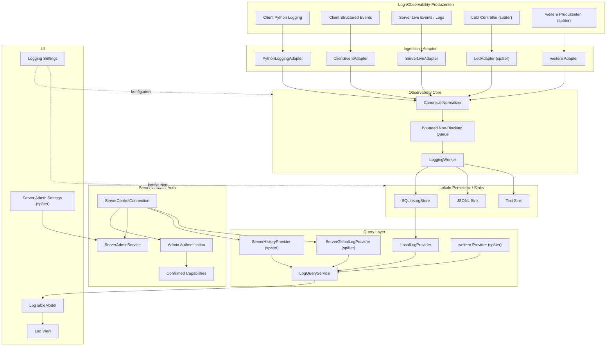

# Logging-/Observability-Zielarchitektur – Gesamtspezifikation

**Status:** Erster Entwurf / noch nicht freigegeben  
**Zweck:** Verbindliches Zielbild für die langfristige Logging-, Observability-, Query- und Admin-Integration des Desktop-Clients und angrenzender Komponenten  
**Geltungsbereich:** primär `voice-stt-client`, mit definierten Integrationsgrenzen zu `voice-stt-server`, `led_controller_respeaker-v3` und zukünftigen Produzenten/Providern

---

# 1. Ziel und Grundgedanke

Die Logging-Infrastruktur wird als **strikt beobachtende, fachlich nicht autoritative Infrastruktur** ausgelegt.

Sie soll langfristig:

- lokale Client-Logs strukturiert erfassen;
- Server-Events und Server-Logs strukturiert übernehmen;
- später Logs weiterer Komponenten wie des LED-Controllers anbinden;
- Logdaten lokal persistent speichern;
- optionale Datei-Sinks bereitstellen;
- Live- und historische Daten über eine einheitliche Query-Schicht anzeigen;
- serverseitige historische und globale Logs nach Admin-Authentifizierung abfragen;
- serverweite Admin-Funktionen über eine separate Control-/Auth-Schicht integrieren;
- Korrelation über Session, Activation, Segment, Command und Event hinweg ermöglichen;
- Diagnose und forensische Rekonstruktion verteilter Abläufe erleichtern.

Die Logging-Infrastruktur darf **keine fachliche Runtime-Autorität** besitzen.

---

# 2. Zentrale Architekturregel

## 2.1 Logging ist Beobachter, nicht Vermittler

Kein fachlich notwendiger Laufzeitpfad darf durch Logging hindurchgeführt werden.

Nicht zulässig:

```text
Server Event
→ Logging
→ FeedbackController
```

Nicht zulässig:

```text
Hotkey
→ Logging
→ Controller
```

Zulässig:

```text
Server Event
        ├──→ FeedbackController
        └──→ LoggingIngress
```

Zulässig:

```text
Hotkey erkannt
        ├──→ fachlicher Controllerpfad
        └──→ strukturierter Observability Record
```

Logging ist damit ein **Fan-out-Konsument**.

---

# 3. Fehlerisolation als harte Invariante

Die Anwendung muss fachlich weiterlaufen, wenn:

- Logging vollständig deaktiviert ist;
- SQLite nicht beschreibbar ist;
- ein File-Sink fehlschlägt;
- die Logging-Queue voll ist;
- der LoggingWorker abstürzt;
- ein einzelner LogRecord fehlerhaft ist;
- ein Remote-Log-Provider nicht erreichbar ist;
- Admin-Authentifizierung fehlschlägt;
- historische Serverlogs nicht verfügbar sind.

> Ein Fehler der Logging-/Observability-Infrastruktur darf Audio, WebSocket-Control-Plane, Trigger, Activation, Hotkeys, Feedback, UI-Basiszustand oder Session-Lifecycle nicht blockieren oder verändern.

---

# 4. Langfristiges Gesamtbild



---

# 5. Vier getrennte Verantwortungsbereiche

## 5.1 Producers

Erzeugen Beobachtungsdaten.

Beispiele:

- Client Python Logging;
- strukturierte Client-Lifecycle-/Transport-/UI-Observability-Events;
- Server Live Events;
- Server Logs;
- später LED-Controller-Logs;
- weitere Prozesse.

## 5.2 Ingestion

Nimmt Live-Daten entgegen und normalisiert sie.

Beispiele:

- `PythonLoggingAdapter`;
- `ClientEventAdapter`;
- `ServerLiveAdapter`;
- später `LedAdapter`.

## 5.3 Query Providers

Liefern historische oder externe Daten auf Anfrage.

Beispiele:

- lokales SQLite;
- historische Serverlogs;
- globale Serverlogs;
- später weitere Quellen.

## 5.4 Control / Auth

Verwaltet privilegierte Serverkommunikation.

Beispiele:

- Admin-Authentifizierung;
- bestätigte Capabilities;
- serverweite Einstellungen;
- globaler Serverstatus;
- Zugriff auf privilegierte Log-Historie.

**Logging nutzt diese Schicht, besitzt sie aber nicht.**

---

# 6. Canonical Log Record

Alle live ingestierten oder per Query geladenen Records werden für Anzeige und Filterung in ein gemeinsames kanonisches Modell überführt.

```text
record_id

source_timestamp
received_at
monotonic_ns

producer_kind
producer_id
host
instance_id
process_id

channel
level
type
component

session_id
generation
activation_id
segment_id
command_id
event_id
correlation_id

scope

message
details
raw

replayed
```

Nicht jedes Feld muss für jeden Record gesetzt sein.

---

# 7. Herkunft, Scope und Identität

## 7.1 `producer_kind`

Beispiele:

```text
client
server
led
other
```

## 7.2 `producer_id`

Beispiele:

```text
voice-stt-client
voice-stt-server
respeaker-led-controller
```

## 7.3 `instance_id`

Unterscheidet mehrere Instanzen desselben Produzenten.

## 7.4 `scope`

Beispiele:

```text
session
instance
global
```

Damit sind auch Serverlogs möglich, die keiner Client-Session zugeordnet sind.

---

# 8. Zeitmodell

Server und Client können unterschiedliche Systemuhren besitzen.

Darum werden getrennt:

- `source_timestamp` – Zeitstempel des Erzeugers;
- `received_at` – Zeitpunkt des lokalen Empfangs;
- `monotonic_ns` – lokale monotone Reihenfolge innerhalb eines Prozesses.

Verteilte Ereignisse dürfen nicht allein anhand von Wall-Clock-Zeitstempeln als streng total geordnet interpretiert werden.

Für belastbare Reihenfolgen sind IDs, Cursor, Sequenzen und Generationen vorzuziehen.

---

# 9. Channel-, Level- und Type-Modell

Die existierenden Server-Channels bleiben als fachliche Kategorien erhalten:

```text
System
Audit
Transcription
Performance
```

Neue Produzenten dürfen dieselben Channels verwenden, sofern semantisch passend.

Herkunft (`producer_kind`) und Channel bleiben getrennte Dimensionen.

Beispiel:

```text
producer_kind = client
channel = Audit
level = INFO
type = hotkey.pressed
```

`channel`, `level` und `type` werden nicht miteinander vermischt.

---

# 10. Strukturierte Client-Observability-Events

Normales Python-Logging bleibt erhalten.

Zusätzlich sollen wichtige Abläufe strukturiert beobachtbar sein.

Beispiele:

```text
client.hotkey.pressed
client.trigger.sent
client.trigger.ack_received
client.activation_mirror.changed
client.audio.stream_started
client.audio.stream_stopped
client.websocket.connected
client.websocket.disconnected
client.reconnect.started
client.reconnect.completed
client.settings.apply_started
client.settings.apply_completed
client.feedback.dispatched
```

Kritische Diagnosedaten dürfen nicht aus menschenlesbaren Textmeldungen zurückgeparst werden müssen.

---

# 11. Python-Logging-Integration

Bestehender Code darf normales Python-Logging weiterverwenden.

```text
Python logging
→ UnifiedLogHandler
→ PythonLoggingAdapter
→ Canonical Normalizer
→ LoggingIngress
```

Strukturierte Zusatzfelder werden über definierte `extra`-Felder oder eine gleichwertige Adaptergrenze transportiert.

---

# 12. Server Live Events / Logs

Die bestehende Server-Event-/Logging-Verbindung liefert Live-Daten.

```text
Server WebSocket
→ ServerLiveAdapter
→ Canonical Record
→ LoggingIngress
```

Dabei gilt:

- Feedbackpfad bleibt parallel bestehen;
- Logging ist keine Voraussetzung für Feedback;
- Originalstruktur des Serverevents bleibt erhalten;
- Event-ID und Replay-Metadaten bleiben erhalten.

---

# 13. Raw Event vs. Presentation

Forensische Speicherung und menschenlesbare Darstellung werden getrennt.

Der originale strukturierte Payload darf gespeichert werden:

```text
type=activation.started
raw={...}
```

Die UI darf daraus eine lesbare Darstellung erzeugen.

Ziel:

- kein Informationsverlust;
- keine unnötige Doppelhaltung;
- kein Textparsing als Datenquelle.

---

# 14. Replay und Deduplizierung

Serverevents können bei Reconnect erneut geliefert werden.

Daher wird eine stabile Dedupe-Strategie vorgesehen, z. B.:

```text
producer_id + instance_id + event_id
```

Anforderungen:

- Replay erzeugt keine unkontrollierten doppelten Persistenzeinträge;
- Replay-Information bleibt diagnostisch verfügbar;
- lokale Client-Records erhalten eigene `record_id`.

---

# 15. Lokale Persistenz

## 15.1 Standard

SQLite ist der bevorzugte lokale Standard für die Desktopanwendung.

## 15.2 Abstraktion

```text
LogStore
→ SQLiteLogStore
```

Spätere mögliche Implementierungen:

```text
MySQLLogStore
PostgresLogStore
RemoteCollectorSink
```

Diese werden in der ersten Implementierungsstufe nicht vorausgesetzt.

---

# 16. SQLite-Schema – konzeptionell

Mindestens:

```text
logs
----
id
record_id
source_timestamp
received_at
producer_kind
producer_id
instance_id
channel
level
type
component
scope
message
details_json
raw_json
session_id
generation
activation_id
segment_id
command_id
event_id
correlation_id
replayed
```

Indizes mindestens auf:

```text
source_timestamp
received_at
producer_kind
channel
level
type
session_id
activation_id
segment_id
event_id
```

Das endgültige Schema wird migrationsfähig angelegt.

---

# 17. Memory Buffer

Zusätzlich zur Persistenz kann ein begrenzter Live-Ringbuffer gehalten werden.

Zweck:

- schnelle Liveanzeige;
- geringe DB-Leselast;
- direkte UI-Aktualisierung.

Die Größe ist konfigurierbar.

---

# 18. Optionale File Sinks

Datei-Logging ist unabhängig von SQLite konfigurierbar.

Formate:

```text
Text
JSONL
```

JSONL ist bevorzugt für strukturierte maschinelle Weiterverarbeitung.

File-Sink-Ausfälle dürfen keinen Runtimepfad blockieren.

---

# 19. Queue und Worker

Persistenz-/File-I/O läuft außerhalb kritischer Threads.

```text
Producer
→ non-blocking enqueue
→ bounded Queue
→ LoggingWorker
→ Batch Writes
```

Audio-, WebSocket- und UI-Threads dürfen nicht auf Logging-I/O warten.

---

# 20. Backpressure

Drei Ziele können nicht gleichzeitig absolut garantiert werden:

```text
bounded memory
niemals blockieren
niemals Records verlieren
```

Priorität:

1. Runtime nie blockieren.
2. Speicher bounded halten.
3. möglichst hochwertige Records erhalten.

Strategie:

- DEBUG/PERFORMANCE zuerst droppen;
- Reserve/Priorisierung für WARNING/ERROR/AUDIT;
- im katastrophalen Überlastfall dürfen auch wichtige Records verloren gehen;
- Drop-Counter und Health-State führen;
- nach Recovery `logging.records_dropped` erzeugen.

---

# 21. Logging-interne Fehlerdomäne

Der Logger darf seine eigenen Fehler nicht rekursiv durch sich selbst loggen.

Logging-interne Fehler laufen in eine separate Health-/Emergency-Domäne:

```text
LoggingInternalHealth
```

Mögliche Ausgaben:

- Counter;
- Status;
- `stderr`;
- optional Emergency-Sink.

Sie werden nicht wieder über denselben UnifiedLogHandler eingespeist.

---

# 22. Query Layer

Die UI kennt weder SQLite noch Remote-APIs direkt.

Zentrale Abstraktion:

```text
LogQueryService
```

V1:

```text
LocalLogProvider
```

Später:

```text
ServerHistoryProvider
ServerGlobalLogProvider
weitere Provider
```

---

# 23. Remote Server History

Historische und serverweite Logs werden perspektivisch über eine privilegierte Server-Schnittstelle abrufbar.

Sie müssen nicht vollständig in die lokale SQLite repliziert werden.

```text
UI
→ LogQueryService
→ ServerHistoryProvider
→ ServerControlConnection
→ Server
```

Server bleibt dabei originäre Quelle.

---

# 24. Lokale Beobachtung vs. serverseitige Historie

Ein Serverevent kann gleichzeitig existieren als:

1. originäres serverseitiges Event;
2. lokal empfangene Kopie in SQLite.

Das ist gewollt.

Beispiel:

```text
Serverhistorie: activation.finalized vorhanden
Clienthistorie: activation.finalized fehlt
```

→ möglicher Transport-/Clientempfangsfehler.

---

# 25. Server Control / Admin Architecture

Die zweite Serververbindung ist langfristig nicht nur ein Logging-WebSocket, sondern eine **Control-/Observability-Verbindung**.

Mögliche Funktionen:

```text
Session Events
Session Logs
Control/Status
Admin Authentication
serverweite Config
serverweiter Runtime-Status
globale Logs
historische Logs
```

---

# 26. Admin-Authentifizierung

Admin-Status wird nicht aus einem lokal vorhandenen Key abgeleitet.

Beispielzustände:

```text
UNAUTHENTICATED
AUTHENTICATING
AUTHENTICATED
AUTH_FAILED
EXPIRED
```

Maßgeblich sind vom Server bestätigte Capabilities.

---

# 27. Capability-Modell

Beispiel:

```text
sessionEvents
sessionLogs
serverConfigRead
serverConfigWrite
serverRuntimeRead
globalLogsRead
historyLogsRead
```

UI-Funktionen richten sich nach den bestätigten Capabilities.

---

# 28. Security

Der Admin-Key wird außerhalb des Logging-Cores verwaltet.

Verantwortung:

```text
ServerControlConnection / Authentication Service
```

Harte Regeln:

- Admin-Key niemals loggen;
- Tokens/Passwörter niemals loggen;
- sensible Header redigieren;
- Secrets vor Speicherung entfernen;
- Raw Payloads vor Persistenz redigieren.

---

# 29. ServerAdminService

Serverweite Konfiguration wird über einen eigenen Dienst konsumiert.

Beispiele:

```text
get_server_config()
update_server_config(...)
get_runtime_status()
get_loaded_model()
```

Die Settings-UI spricht nicht direkt mit dem WebSocket.

---

# 30. Drei Konfigurationsklassen

## 30.1 Client-lokal

Beispiele:

- Hotkeys;
- UI;
- Logging-Retention;
- File-Sinks.

## 30.2 Session-spezifisch

Beispiele:

- Triggerquellen;
- Wake Words;
- Sensitivity;
- Session-Timings.

## 30.3 Serverweit / Admin

Beispiele:

- geladenes Modell;
- serverweite Defaults;
- Runtime-Parameter;
- globale Serverkonfiguration.

Diese Kategorien bleiben organisatorisch und fachlich getrennt.

---

# 31. UI-Zielbild

## 31.1 Logging Settings

Reine lokale Logging-Konfiguration.

## 31.2 Log View

Query-/Darstellungsschicht mit mindestens:

- Live;
- Historie;
- Producer;
- Channel;
- Level;
- Type;
- Component;
- Freitext;
- Session;
- Activation;
- Segment;
- Detailansicht;
- Raw JSON.

## 31.3 Admin-UI

Nach bestätigter Capability zusätzlich:

- Servereinstellungen;
- globaler Runtime-Status;
- globale Serverlogs;
- Serverhistorie.

---

# 32. Provider-Zustände

Provider können Zustände liefern wie:

```text
AVAILABLE
AUTH_REQUIRED
UNAVAILABLE
ERROR
```

Beispiel:

```text
LocalLogProvider = AVAILABLE
ServerHistoryProvider = AUTH_REQUIRED
```

Nach Admin-Authentifizierung:

```text
ServerHistoryProvider = AVAILABLE
```

---

# 33. LED-Controller als zukünftiger Produzent

Der LED-Controller soll später per Adapter integrierbar sein.

```text
LED Source
→ LedAdapter
→ CanonicalLogRecord
```

Die spätere Transportart bleibt offen.

Der Logging-Core bleibt transportagnostisch.

---

# 34. Datenschutz / sensible Inhalte

Transcription-Logs können Nutzinhalte enthalten.

Daher konfigurierbar:

```text
store_transcription_content: true/false
store_raw_payloads: true/false oder granular
```

Bei deaktivierter Inhaltsablage können Metadaten erhalten bleiben, während Inhalte redigiert werden.

---

# 35. Retention

Lokale Historie erhält konfigurierbare Grenzen:

- Retention Days;
- Max Entries;
- optional Max DB Size.

Cleanup läuft außerhalb kritischer Runtimepfade.

Serverseitige Retention bleibt Verantwortung des Servers.

---

# 36. Filtermodell

Mindestens:

- Producer;
- Channel;
- Level;
- Type;
- Component;
- Freitext;
- Zeitbereich;
- Session;
- Activation;
- Segment;
- Command;
- Event.

Kontextaktionen:

```text
nur diese Session
nur diese Activation
nur dieses Segment
nur diesen Eventtyp
```

---

# 37. Große Datenmengen

Die UI lädt nicht alle Datensätze und filtert lokal.

Filter und Pagination werden providerseitig ausgeführt.

---

# 38. Threading / Qt-Grenze

Der Logging-Core besitzt keine fachliche PySide-Abhängigkeit.

Qt-spezifische Komponenten liegen im UI-/Model-Layer.

---

# 39. Modulstruktur – Zielbild

```text
core/
└── observability/
    ├── models.py
    ├── normalizer.py
    ├── ingress.py
    ├── manager.py
    ├── health.py
    ├── worker.py
    ├── adapters/
    │   ├── python_logging.py
    │   ├── client_events.py
    │   ├── server_live.py
    │   └── led.py                   # später
    ├── storage/
    │   ├── base.py
    │   └── sqlite.py
    ├── query/
    │   ├── base.py
    │   ├── local.py
    │   ├── service.py
    │   └── server_history.py        # später
    └── sinks/
        ├── text_file.py
        └── jsonl_file.py

core/
└── server_control/
    ├── connection.py
    ├── auth.py
    ├── capabilities.py
    └── admin_service.py             # später

ui/
├── logs/
│   ├── log_page.py
│   ├── log_table_model.py
│   ├── log_filter_bar.py
│   └── log_detail_view.py
└── settings/
    ├── logging_settings.py
    └── server_admin_settings.py     # später
```

Die tatsächliche Ordnerstruktur wird vor Implementierung an den realen Client-Baum angepasst.

---

# 40. Abgrenzung zur Triggerarchitektur

Die Observability-Infrastruktur darf Trigger-/Activation-Abläufe beobachten, aber nicht definieren.

Beobachtbare Punkte können sein:

```text
hotkey pressed
trigger sent
ack received
activation started
recording started
recording ended
final received
activation finalized
client mirror changed
ui presentation changed
```

Ein LoggingRecord darf niemals Quelle einer fachlichen Transition sein.

---

# 41. Abgrenzung zum FeedbackController

FeedbackController und Logging konsumieren relevante Ereignisse parallel.

```text
Event
├── Feedback
└── Logging
```

Keiner ist Voraussetzung für den anderen.

---

# 42. Abgrenzung zur Runtime-Control-Plane

Autoritative Activation-/Session-Zustände gehören in die dafür vorgesehene Control Plane.

Observability-Events dürfen nicht zur alleinigen fachlichen Zustandsquelle des Clients werden.

---

# 43. Future Extensions

Architektonisch vorgesehen, aber nicht zwingend V1:

- ServerHistoryProvider;
- globale Serverlogs;
- Admin-Settings;
- LED Adapter;
- MySQL/Postgres;
- Remote Collector;
- Export;
- gespeicherte Filter;
- Statistiken;
- Charts;
- externe Debug-App;
- REST-/CLI-Zugriff;
- Multi-Client-/Multi-Host-Aggregation.

---

# 44. Nichtziele

Nicht Ziel des Logging-Cores:

- Businesslogik ausführen;
- Activation-State besitzen;
- Events korrigieren;
- Commands retryen;
- Serverkonfiguration selbst besitzen;
- Feedback rendern;
- Runtime-Control-Plane ersetzen.

---

# 45. Architektur-Invarianten

- **O-1 Beobachterprinzip:** Logging beeinflusst fachliches Verhalten nicht.
- **O-2 Non-Blocking:** Kein kritischer Runtime-Thread wartet auf Log-Persistenz.
- **O-3 Bounded Memory:** Logging kann den Prozessspeicher nicht unbegrenzt wachsen lassen.
- **O-4 Failure Isolation:** Store-/Sink-/Providerfehler bleiben innerhalb der Observability-Domäne.
- **O-5 Struktur:** Kritische Diagnosedaten bleiben strukturiert.
- **O-6 Korrelation:** Session-/Activation-/Segment-/Command-/Event-Zusammenhänge bleiben filterbar.
- **O-7 Source Preservation:** Herkunft bleibt getrennt von Channel/Level/Type.
- **O-8 Replay Safety:** Replay erzeugt keine unkontrollierten Duplikate.
- **O-9 Security:** Secrets werden nie persistiert.
- **O-10 Query Independence:** UI kennt keine Storage-/Transportdetails.
- **O-11 Extensibility:** Neue Producer und Query Provider sind per Adapter/Schnittstelle ergänzbar.
- **O-12 Admin Separation:** Logging nutzt privilegierte Provider, besitzt aber keine Admin-Authentifizierung.

---

# 46. Offene Entscheidungen vor Freigabe

- [ ] endgültiger Name `logging` vs `observability`;
- [ ] exakte Client-Channels;
- [ ] endgültiges CanonicalRecord-Schema;
- [ ] event_id/Dedupe-Schlüssel des Serverstreams;
- [ ] lokale DB-Datei und Ablageort;
- [ ] SQLite-Schema-Versionierung/Migration;
- [ ] Queue-Größe und Priorisierung;
- [ ] Retention-Defaults;
- [ ] ob Text- und JSONL-Sinks bereits in V1 enthalten sind;
- [ ] Datenschutz-Default für Transkriptinhalte;
- [ ] wie strukturierte Clientevents emittiert werden;
- [ ] genaue Adaptergrenze zum bestehenden Server-Eventstream;
- [ ] genaue Auth-/Capability-Schnittstelle des Servers;
- [ ] ob ServerHistoryProvider optional cached;
- [ ] exakter UI-Ort der Logansicht;
- [ ] exakter UI-Ort der Logging-Konfiguration;
- [ ] Verhalten bei Logging-internem Fatal-Fehler;
- [ ] Metriken/Health für gedroppte Records.

---

# 47. Abschlussbild

Das langfristige Ziel ist eine Observability-Infrastruktur, in der:

- Live-Daten verschiedener Produzenten normalisiert werden;
- lokale Historie performant gespeichert wird;
- Remote-Historien über Provider eingebunden werden;
- Adminrechte zusätzliche Datenquellen und Serverfunktionen freischalten;
- dieselbe UI lokale und entfernte Daten über einheitliche Query-Verträge anzeigen kann;
- spätere Komponenten wie der LED-Controller ohne Kernumbau ergänzt werden können;
- die gesamte Infrastruktur strikt beobachtend bleibt;
- spätere Erweiterungen keine grundlegende Neustrukturierung des V1-Cores erfordern.

Diese Spezifikation beschreibt bewusst den **Endzustand** und nicht nur die erste Implementierungsstufe.
