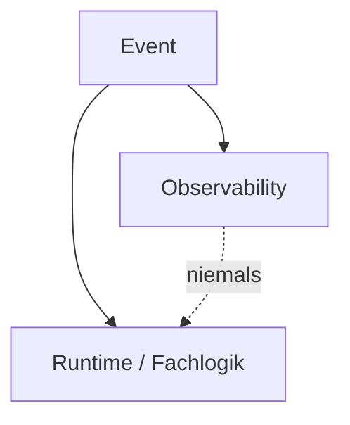
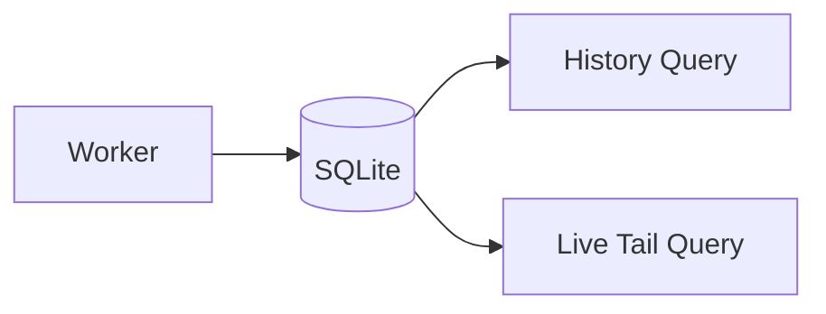
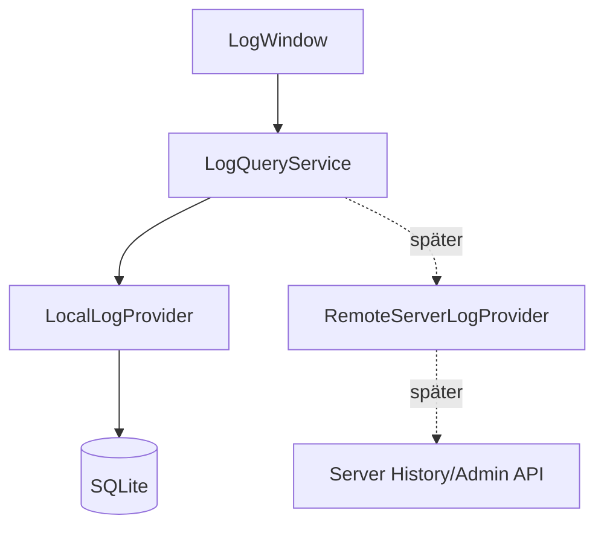

# Logging & Observability V1 – Architektur und Entscheidungen

**Produktdokumentation – VoiceSTT Client

## 1. Architekturziele

V1 wurde nicht als „mehr Logging“ entworfen, sondern als **separate Beobachtungsinfrastruktur**.

Die Architektur muss gleichzeitig vier Ziele erfüllen:

1. **diagnostische Tiefe** – lokale und serverseitige Vorgänge korrelierbar machen;
2. **Failure Isolation** – Logging darf das Produkt nicht kaputtmachen;
3. **begrenzte Kosten** – Hot Paths dürfen nicht durch I/O oder ungebremste Record-Fluten belastet werden;
4. **Erweiterbarkeit** – spätere Serverhistorie, weitere Producer und Forensik sollen ergänzt werden können, ohne V1 neu zu bauen.

---

## 2. Nicht verhandelbare Invarianten

### A. Observability Only

Observability besitzt keine Runtime-/Lifecycle-Autorität.

Sie darf:

- beobachten,
- normalisieren,
- persistieren,
- zählen,
- filtern,
- anzeigen.

Sie darf nicht:

- Recording starten oder stoppen,
- Triggerzustände bestimmen,
- Sessionzustände rekonstruieren und als Wahrheit verwenden,
- Feedbackentscheidungen übernehmen,
- Reconnects erzwingen.

### B. Fan-out

Ein Event wird parallel an Fachlogik und Observability verteilt.



### C. Non-Blocking

Producer-Threads warten nicht auf:

- SQLite;
- JSONL;
- Retention;
- UI;
- Query;
- Netzwerk für Observability.

Der Übergabepunkt ist `put_nowait`.

### D. Bounded Memory

Backpressure wird nicht durch unbegrenzte Puffer „gelöst“. Die Queue ist begrenzt und besitzt eine definierte Verwerfungsstrategie.

### E. Struktur statt Textparsing

Kritische Korrelation wird über Felder wie `session_id`, `command_id`, `event_id` und `correlation_id` abgebildet – nicht durch Parsing menschenlesbarer Meldungen.

### F. Source Preservation

Producer, Channel, Level, Typ und Komponente bleiben voneinander unabhängig.

### G. Replay Safety

Replay darf nicht unkontrolliert dieselben Serverevents erneut persistieren.

### H. Query Independence

Die UI kennt weder SQLite-Details noch WebSocket-/Admin-Transportverträge.

---

## 3. Warum `core/observability/` ein eigenes Paket ist

Der Paketname `observability` trennt die neue Infrastruktur vom vorhandenen klassischen `logging`.

Das bestehende `core/logging_setup.py` bleibt die Integration mit Python-Logging; das neue Paket enthält dagegen das kanonische Modell, Ingress, Persistenz, Query und Health.

Das verhindert, dass zwei unterschiedliche Bedeutungen von „logging“ vermischt werden:

```text
klassisches Python-Logging
    └─ Text-/JSON-Datei und Console

Observability
    └─ strukturierte Records, Korrelation, Store, Query, UI
```

---

## 4. Drei Normalizer-Eingänge

V1 besitzt drei klar getrennte Eingänge:

```text
Python LogRecord
        │
        ├──> from_log_record(...)
        │
Server EventProtocolResult
        ├──> from_server_result(...)
        │
strukturierte Client-Observation
        └──> from_client_event(...)
                         │
                         ▼
                CanonicalLogRecord
```

Der Normalizer ist I/O-frei und darf nicht zur zweiten Runtime-State-Machine werden.

### Python-Logs

Der Python-Loggername wird als `component` erhalten. Zusätzliche IDs werden nur aus explizit mitgegebenen `extra`-Feldern übernommen.

Der Handler fragt **nicht** den aktuellen Controller-/Sessionzustand ab. Der Grund ist bewusst technisch und architektonisch:

- Logger laufen auf unterschiedlichen Threads;
- eine zentrale State-Abfrage würde Locking oder Race-Risiken erzeugen;
- sie würde das Logging an die Runtime koppeln;
- sie könnte historische Records nachträglich mit „aktuellem“ statt tatsächlichem Kontext versehen.

### Serverevents

Serverpayloads behalten ihre serverseitige Identität. `event_id`, Cursor und Replay-Metadaten können damit sauber persistiert und dedupliziert werden.

### Strukturierte Client-Observations

Für fachlich interessante Clientpunkte wird nicht auf freien Logtext vertraut. Stattdessen werden Typ, Channel, Komponente, Details und IDs explizit erzeugt.

---

## 5. Entscheidung: kein Memory-Ringbuffer

### Ausgangsidee

Frühe Entwürfe sahen einen zusätzlichen Memory-Ringbuffer für die Live-Ansicht vor.

### Entscheidung

Der Ringbuffer wurde gestrichen. Live liest dieselbe persistente Wahrheit wie History.



### Gründe

#### Weniger Zustände

Mit Ringbuffer gäbe es zwei Wahrheiten:

```text
1. bereits im RAM sichtbar
2. bereits wirklich persistiert
```

Bei einem Worker-/Storefehler könnte die Oberfläche Records zeigen, die nie im Store angekommen sind.

#### Gleiche Provider-Abstraktion

Live und History nutzen denselben `LogProvider`.

#### Weniger Kopplung

Die UI braucht kein Record-Signal vom Worker und keine Synchronisation mit einem RAM-Puffer.

#### Überschaubare Last

Die Tail-Abfrage arbeitet auf dem Primärschlüssel und SQLite läuft im WAL-Modus. Für den lokalen Client ist der zusätzliche Polling-Read akzeptabel.

---

## 6. Entscheidung: eine Queue statt zweier Prioritätsqueues

### Ausgangsidee

Eine frühere Variante sah High- und Low-Priority-Queues mit gegenseitiger Verdrängung vor.

### Entscheidung

V1 verwendet eine Queue mit fester Wasserstandsregel.

```text
queue_size = 8192

unter 75 %:
  HIGH und LOW werden angenommen

ab 75 %:
  LOW wird verworfen
  HIGH bleibt zulässig

voll:
  Record wird verworfen
```

### Warum?

Zwei Queues hätten zusätzliche Buchführung und Cross-Queue-Manipulation im Producerpfad benötigt, ohne einen entscheidenden diagnostischen Vorteil zu bringen.

Replayte Records werden unter Überlast bewusst niedriger priorisiert, weil ihre stabile Serveridentität eine spätere Deduplizierung erlaubt und sie typischerweise keine neue Live-Information darstellen.

---

## 7. Entscheidung: SQLite als lokale Wahrheit

SQLite erfüllt V1 besser als ein reiner Memory-Store:

- persistiert über Neustarts;
- unterstützt Filter und Pagination;
- kann Dedupe über einen Unique-Index erzwingen;
- erlaubt Retention;
- kann von der UI read-only gelesen werden;
- ist lokal und benötigt keinen zusätzlichen Dienst.

### Schreibmodell

Der Worker besitzt die Schreibverbindung und schreibt Batches in einer Transaktion.

### Lesemodell

Der lokale Provider benutzt eigene kurzlebige Read-only-Verbindungen. Die Query-Schicht wird dadurch nicht zum Teil des Workers.

### Wichtiger Dedupe-Index

```sql
CREATE UNIQUE INDEX ux_logs_producer_event
ON logs (producer_id, event_id)
WHERE event_id IS NOT NULL;
```

Die Bedingung `event_id IS NOT NULL` ist wichtig: Lokale Clientrecords ohne Serverevent-ID dürfen nicht gegeneinander kollidieren.

---

## 8. Entscheidung: bestehendes `client.log` bleibt

V1 ersetzt das bestehende Logging absichtlich nicht.

Das klassische Log ist:

- bekannte Rückfallebene;
- unabhängig vom neuen Worker;
- hilfreich, falls genau die Observability-Infrastruktur ausfällt.

Die Doppelung ist zeitweise gewollt. Erst nach längerem Realbetrieb kann entschieden werden, ob der klassische Pfad reduziert wird.

---

## 9. Entscheidung: JSONL optional, nur ein Format

Der optionale File-Sink schreibt JSONL.

V1 besitzt keine Format-Auswahl, weil eine Konfigoption mit nur einer echten Option unnötig wäre.

Ein zweites Sink-/Formatmodell ist bewusst in einen späteren Ausbau verschoben.

---

## 10. Entscheidung: `max_db_bytes` ist Warnsignal

`retention_days` und `max_entries` sind die aktiven Retention-Grenzen.

`max_db_bytes` ist dagegen ein Beobachtungs-/Warnwert. V1 führt bei Überschreitung nicht automatisch `VACUUM`, `auto_vacuum` oder spontane Policy-Änderungen aus.

Der Grund: Eine zusätzliche selbsttätige Speichersteuerung wäre ein weiterer Fehlerpfad in genau der Infrastruktur, die möglichst passiv bleiben soll.

---

## 11. Privacy-Entscheidungen

### Transkriptinhalt

Default:

```yaml
store_transcription_content: false
```

Das System darf Transkriptionsereignisse diagnostisch erfassen, ohne zwangsläufig den gesprochenen Inhalt zu speichern.

### Raw Payload

Raw ist ein optionales Diagnosefeld. Es unterliegt derselben Redaction-Grenze und wird in Listen nicht unnötig geladen.

### Secrets

Redaction ist zentraler Bestandteil der Normalisierung. Sie soll nicht davon abhängen, ob ein einzelner Producer „daran gedacht hat“.

---

## 12. Hot-Path-Entscheidungen

Audio-nahe Pfade dürfen nicht pro Paket/chunk Observability-Records erzeugen.

Stattdessen gilt:

- keine Einzelrecord-Flut aus dem Audio-Callback;
- Aggregation/Zähler für hochfrequente technische Werte;
- Eventstream-Realtime-Daten werden nicht blind als strukturierter Vollstrom gespiegelt;
- Level-Filter wirken möglichst früh.

Das verhindert, dass das Diagnosewerkzeug selbst zum Performanceproblem wird.

---

## 13. Query-Schicht als Erweiterungspunkt

Die UI fragt:

```text
LogQueryService
    ↓
LogProvider
```

Heute ist der wichtigste Provider lokal:

```text
LocalLogProvider → SQLite
```

Später kann daneben ein Remote-Provider stehen, ohne dass Tabellenmodell und Filterlogik neu erfunden werden müssen:



Das ist einer der wichtigsten Gründe, warum die LogView niemals direkt SQL ausführt.

---

## 14. Settings-Ownership

Die Settings-UI besitzt nicht den Worker. Sie ändert Konfiguration; die Runtime-Komposition entscheidet, wie die Observability-Komponenten reagieren.

Grundregel:

> Eine reine Observability-Änderung darf keinen STT-Reconnect und keinen Audio-Neustart auslösen.

Ein noch bekannter Randfall betrifft die Aktivierung aus einem Prozess, der **initial mit Observability deaktiviert gestartet wurde**. Dieser Übergang wurde im letzten Gate als nicht vollständig vertragskonform identifiziert und ist als Folgepunkt dokumentiert.

---

## 15. `activation_id` bewusst nicht als Wahrheit verwenden

Vor der Triggerarchitektur-Migration ist die serverseitige Activation-Zuordnung nicht in allen Situationen zuverlässig.

Deshalb:

- Wert speichern: **ja**;
- Wert clientseitig erraten/fortschreiben: **nein**;
- fachlich danach gruppieren: **nein**;
- für Diagnose filtern: **ja, mit Vorbehalt**.

Nach der Trigger-Migration wird diese Einschränkung neu bewertet.

---

## 16. Warum V1 vor der Trigger-Migration kam

Die Trigger-Migration verändert Lifecycle, Triggerquellen, IDs, Reconnect-Verhalten und Feedback-Korrelation.

Ohne eine belastbare Beobachtungsachse wäre schwer zu unterscheiden:

```text
Serverfehler?
Clientfehler?
Eventstream?
Trigger-Ack?
Audio?
Feedback?
Replay?
```

V1 wurde deshalb vorgezogen, damit der anschließende Architekturumbau nicht „blind“ erfolgt.

Das Gesamtprinzip lautet:

```text
Observability Foundation
        ↓
Triggerarchitektur-Migration
        ↓
Post-Migration Instrumentation
        ↓
Remote/Admin/Forensics-Ausbau
```
