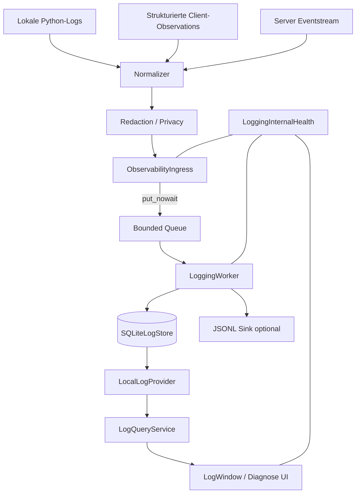
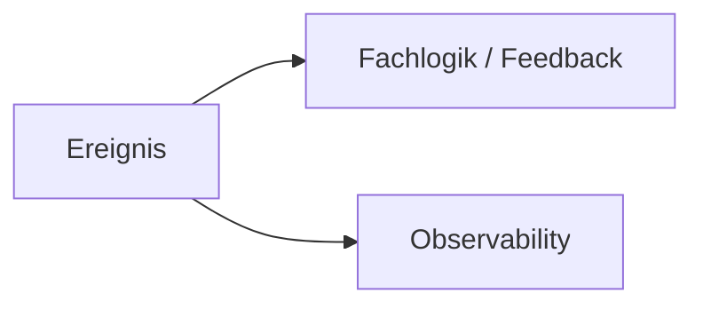
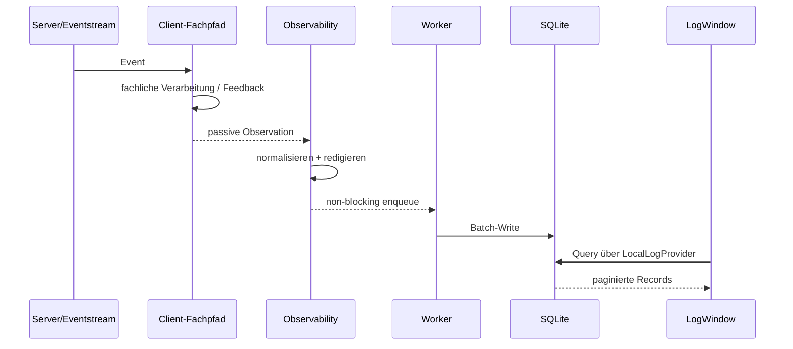

# Logging & Observability V1

**Produktdokumentation – RealtimeSTT Client**  
**Stand:** 20.08.2026  
**Referenzstand der Implementierung:** bis einschließlich `d9369c5` (`feat(observability): polish logging diagnostics UI`)

## Zweck

Logging & Observability V1 schafft im Desktopclient eine eigenständige, fehlertolerante Diagnoseachse. Sie sammelt lokale Python-Logs, ausgewählte strukturierte Client-Ereignisse und Live-Ereignisse des Servers, normalisiert sie in ein gemeinsames Datenmodell, persistiert sie lokal und macht sie über eine Query-Schicht und eine Diagnoseoberfläche nutzbar.

Der wichtigste Grundsatz lautet:

> **Observability beobachtet die Anwendung. Sie steuert sie nicht.**

Ein Fehler im Logging darf weder Audio, WebSocket-Verarbeitung, Controller, Feedback, Textinjektion noch den fachlichen Lifecycle verändern.

V1 wurde bewusst **vor** dem großen Umbau der Triggerarchitektur umgesetzt. Ziel war nicht, schon jetzt jedes spätere Komfort- und Admin-Feature zu liefern, sondern eine belastbare diagnostische Grundlage zu schaffen, mit der die Trigger-Migration nachvollziehbar und forensisch prüfbar wird.

---

## 1. Was V1 heute leistet

V1 umfasst:

- ein kanonisches Log-/Observability-Datenmodell;
- Normalisierung für drei Eingangsarten:
  - Python-`LogRecord`,
  - Server-/Eventstream-Ereignisse,
  - strukturierte Client-Observations;
- Redaction und Privacy-Regeln;
- einen nicht blockierenden, begrenzten Ingress;
- Health-Zustände und Zähler;
- einen separaten Worker;
- SQLite als lokale persistente Wahrheit;
- optionalen JSONL-Sink;
- Replay-Deduplizierung für Serverevents;
- Retention nach Alter und maximaler Eintragszahl;
- Query-Abstraktion über `LogQueryService`;
- lokalen Provider für SQLite;
- History- und Live-Ansicht;
- Filter nach Quelle, Channel, Level, Typ, Komponente und Korrelationsfeldern;
- Detail- und Raw-Ansicht;
- Logging-/Diagnose-Einstellungen im Client;
- Tests für Failure Isolation, Backpressure, Redaction, Dedupe, Query, Retention und Runtime-Isolation.

Nicht Teil von V1 sind insbesondere globale Serverhistorie, Admin-Authentifizierung, serverweite Admin-Einstellungen, der LED-Controller als eigener Observability-Producer, externe Collector und umfassende Forensik-/Analytics-Funktionen.

---

## 2. Architektur in einem Bild



### Architekturregel: Fan-out statt Vermittlung

Observability liegt **neben** dem fachlichen Pfad:



Nicht:

```text
Ereignis → Observability → Fachlogik
```

Damit kann Observability ausfallen, ohne zur Laufzeit-Autorität zu werden.

---

## 3. Datenfluss

Ein typischer Serverevent-Durchlauf:



Der fachliche Clientpfad wartet nicht auf SQLite oder Dateizugriffe.

---

## 4. Kanonisches Record-Modell

Alle Quellen werden in dasselbe logische Schema überführt. Wichtige Dimensionen bleiben getrennt:

| Dimension | Bedeutung |
|---|---|
| `producer_kind` / `producer_id` | Wer hat den Record erzeugt? |
| `scope` | `session`, `instance` oder `global` |
| `channel` | fachliche Log-Kategorie, z. B. `system`, `audit`, `transcription`, `performance` |
| `level` | `DEBUG` bis `CRITICAL` |
| `type` | strukturierter Ereignistyp |
| `component` | technische Komponente / Loggername |
| `session_id` | Session-Korrelation |
| `generation` | Verbindungs-/Sessiongeneration |
| `activation_id` | diagnostische Activation-Zuordnung |
| `segment_id` | Segment-Korrelation |
| `command_id` | Client-/Server-Command-Korrelation |
| `event_id` | serverseitige Eventidentität |
| `correlation_id` | generische fachliche Korrelation |
| `message` | menschenlesbarer Kurztext |
| `details` | strukturierte Zusatzdaten |
| `raw` | optionaler Original-Payload innerhalb der Privacy-Regeln |

Wichtig ist die bewusste Trennung von `source`, `channel`, `level`, `type` und `component`. Ein `WARNING` ist kein Eventtyp, ein `audit`-Record ist keine Quelle und der Loggername ist nicht die fachliche Kategorie.

### Besonderheit `activation_id`

Bis die Triggerarchitektur vollständig migriert ist, ist `activation_id` **diagnostisch, nicht autoritativ**. Der Wert wird gespeichert, weil er für die Fehlersuche nützlich ist – gerade auch dann, wenn die aktuelle Zuordnung falsch ist. Er darf aber nicht zur fachlichen Gruppierung oder Lifecycle-Entscheidung benutzt werden.

---

## 5. Persistenz und Live-Ansicht

SQLite ist in V1 die lokale persistente Wahrheit.

Der Worker schreibt Records gebündelt. Der Leser arbeitet über eine eigene kurzlebige Read-only-Verbindung. Die UI greift nicht direkt auf SQLite zu, sondern ausschließlich über Provider und Query-Service.

### Warum kein Memory-Ringbuffer?

Ein früher Entwurf sah zusätzlich einen Memory-Ringbuffer für Live-Daten vor. Er wurde bewusst gestrichen.

Die Live-Ansicht verwendet stattdessen eine Tail-Abfrage auf dem Store:

```sql
WHERE id > :last
ORDER BY id
LIMIT :limit
```

Dadurch:

1. benutzen Live- und History-Modus dieselbe Provider-Abstraktion;
2. bleibt die UI vom Worker entkoppelt;
3. zeigt die UI nur Daten, die tatsächlich persistiert wurden;
4. entfällt eine zusätzliche Komponente mit Locking, Eigentümerfrage und eigener Konfiguration.

Das ist ein bewusstes Architektur-Simplifying, kein Funktionsverlust.

---

## 6. History und Live

### History

- paginiert;
- standardmäßig neueste Records zuerst;
- Filterung erfolgt im Query-Layer;
- Raw-Daten werden nicht für die gesamte Tabelle geladen;
- ältere Seiten werden deterministisch nachgeladen.

### Live

- tailende Store-Abfrage;
- neue Records werden fortlaufend ergänzt;
- kein Memory-Ringbuffer;
- kein Record-Signal direkt vom Worker an die UI;
- History und Live werden in V1 nicht zu einer einzigen gemischten Liste verschmolzen.

Diese Trennung vermeidet komplizierte Deduplizierungs- und Reordering-Logik beim Filterwechsel.

---

## 7. Datenschutz und Redaction

Privacy ist Teil des Datenmodells und nicht nachträgliche Kosmetik.

Grundregeln:

- Secrets, Tokens und API-Keys dürfen nicht persistent im Store oder Sink landen.
- Audio-Payloads werden nicht als Diagnoseinhalt persistiert.
- Transkriptionsinhalt wird nur gespeichert, wenn die entsprechende Policy dies erlaubt.
- `store_transcription_content` ist standardmäßig deaktiviert.
- `raw` ist optional und wird ebenfalls redigiert.
- Python-Logging übernimmt keine beliebigen `args`, lokalen Variablen oder `repr()`-Dumps.
- interne Loggingfehler dürfen keine rekursive Log-Schleife auslösen.

---

## 8. Backpressure und Fehlerisolation

Der Ingress verwendet genau **eine** bounded Queue.

Standard:

```text
queue_size = 8192
watermark  = 75 %
```

Regel:

```text
< 75 %       → Records normal annehmen
>= 75 %      → nur priorisierte Records annehmen
Queue voll   → verwerfen und zählen
```

Wichtige Zähler:

- `enqueued`
- `written`
- `deduplicated`
- `dropped_watermark`
- `dropped_queue_full`
- `dropped_shutdown`
- `malformed`
- `store_errors`
- `sink_errors`
- `retention_errors`
- `worker_errors`
- `queue_depth`
- `db_bytes`

Health-Zustände umfassen u. a. `ok`, `dropping`, degradierte Store-/Sink-Zustände sowie `failed_store`, `failed_worker` und `disabled`.

Die entscheidende Eigenschaft bleibt:

> **Ein Loggingfehler ist ein Diagnoseproblem – kein Runtimefehler des STT-Clients.**

---

## 9. Deduplizierung

Serverevents werden anhand ihrer stabilen Eventidentität dedupliziert.

In SQLite gilt sinngemäß:

```sql
UNIQUE (producer_id, event_id)
WHERE event_id IS NOT NULL
```

Damit werden Replay-Events mit derselben Serveridentität nicht als zweiter Datensatz gespeichert. Lokale Clientrecords ohne `event_id` werden dadurch nicht versehentlich dedupliziert.

---

## 10. Bestehendes `client.log` bleibt erhalten

Das bisherige Datei-/Konsolenlogging wurde nicht durch Observability ersetzt.

Das ist Absicht:

- es ist eine unabhängige Rückfallebene;
- bei einem ausgefallenen Observability-Worker bleibt eine Diagnosequelle vorhanden;
- V1 sollte nicht gleichzeitig das bestehende Logging umbauen und das neue System einführen.

Eine spätere Reduktion des klassischen Logs kann nach längerem Realbetrieb neu bewertet werden.

---

## 11. Konfiguration

Observability liegt als Unterabschnitt unter `logging`.

Beispiel der V1-Konfiguration:

```yaml
logging:
  level: INFO
  log_dir: ...
  max_bytes: 5242880
  backup_count: 3
  stdout: true
  json_format: true
  channel_levels: {}

  observability:
    enabled: true
    level: INFO
    store_enabled: true
    db_path:
    retention_days: 14
    max_entries: 200000
    max_db_bytes: 268435456
    queue_size: 8192
    batch_size: 200
    flush_interval_s: 0.5
    file_sink_enabled: false
    file_sink_dir:
    store_transcription_content: false
    store_raw_payload: true
```

Nicht jede Low-Level-Option wird in der UI angeboten. Betriebsnahe Parameter wie Queue- und Batchgröße bleiben bewusst in `config.yaml`.

Eine reine Observability-Konfigurationsänderung darf keinen Audio-Neustart und keinen STT-Reconnect auslösen.

---

## 12. Dokumentationssatz

Diese Datei ist der Einstieg. Vertiefungen:

- [`ARCHITEKTUR_UND_ENTSCHEIDUNGEN.md`](ARCHITEKTUR_UND_ENTSCHEIDUNGEN.md) – Architektur, Invarianten und begründete Entscheidungen
- [`BETRIEB_UND_DIAGNOSE.md`](BETRIEB_UND_DIAGNOSE.md) – Bedienung, Diagnoseworkflow, Health und Troubleshooting
- [`STATUS_AUSBLICK_REFERENZEN.md`](STATUS_AUSBLICK_REFERENZEN.md) – aktueller Abschlussstatus, bewusste Restpunkte, nächste Ausbaustufen und Projektartefakte
