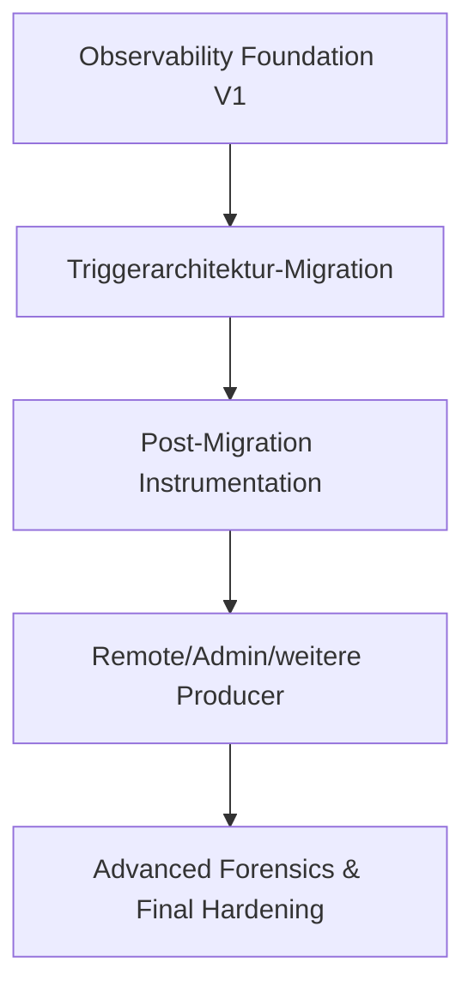

# Logging & Observability V1 – Status, Ausblick und Referenzen

**Produktdokumentation – RealtimeSTT Client**  
**Dokumentationsstand:** 20.08.2026

## 1. Status dieses ersten Ausbauteils

Der vorgezogene erste Logging-/Observability-Ausbauteil ist als **belastbarer Arbeitsstand** akzeptiert.

Wichtig ist die präzise Formulierung:

> Der Stand wird für die Fortsetzung des Gesamtprojekts akzeptiert, ohne zu behaupten, dass jede formale Restprüfung eines vollständigen `G-OBS-V1 PASS` zu 100 % abgeschlossen wurde.

Der Grund ist eine bewusste Projektentscheidung: Die unmittelbar folgende Migration der Triggerarchitektur verändert mehrere der Integrationspfade, deren letzte Randfälle sonst jetzt isoliert und kurz darauf erneut getestet werden müssten.

Die wesentliche Architektur, der Store, Query, UI, Failure Isolation und die automatisierten Regressionen wurden weitreichend umgesetzt und geprüft. Die praktische Sichtprüfung der Diagnoseoberfläche verlief soweit plausibel.

---

# 2. Umgesetzte V1-Arbeitspakete

| Paket | Ergebnis |
|---|---|
| OBS-000 | Architektur-/Contract-Freeze und Baseline |
| OBS-010 | Canonical Model, Redaction, Normalizer und Contracts |
| OBS-020 | Ingress, Backpressure, Health und Python-Logging-Handler |
| OBS-030 | Worker, SQLite-Store, Retention und JSONL-Sink |
| OBS-040 | Server-Live-Adapter und strukturierte Client-Hooks |
| OBS-050 | Local Query, Diagnose-UI und Settings |
| OBS-060 | Hardening, Failure-/Performance-Evidence und Baseline-Checkpoint |
| UI-Polish | Nachbesserungen an Diagnose-UI, Query/Provider und Logger-Komponentenname `eventstream` |

---

# 3. Wichtige lokale Commits

| Commit | Bedeutung |
|---|---|
| `b363346` | OBS-010 + OBS-020 Foundation |
| `cb0b81f` | OBS-030 Persistenz und Worker |
| `91a7b7f` | OBS-040 Observation Hooks |
| `7fc6ca6` | OBS-050 Local Log View |
| `8eea774` | OBS-060 Hardening/Evidence Checkpoint |
| `d9369c5` | Logging Diagnostics UI Polish |

Diese Dokumentation beschreibt den Produktstand bis einschließlich `d9369c5`.

---

# 4. Teststand beim UI-/Checkpoint-Abschluss

Der zuletzt berichtete saubere Stand umfasste:

```text
Fokussierte Suite:
197 passed
305 subtests passed

Gesamte Client-Suite:
1191 passed
862 subtests passed

compileall:
erfolgreich

git diff --check:
sauber
```

Der tracked Working Tree war danach sauber; bewusst unversionierte Arbeits-/Promptdateien blieben außerhalb der Produktcommits.

Die Testzahlen sind **Momentaufnahmen**, keine normative Mindestzahl. Bei zukünftigen Gates ist immer die dann vollständige vorhandene Suite auszuführen.

---

# 5. Bewusst verbleibende Punkte

## 5.1 Kein künstliches „100-%-Gate“

Die letzten manuellen Produktionsprüfungen wurden nicht vollständig als formales Gesamtprotokoll nachgezogen.

Das ist transparent dokumentiert und kein stiller PASS.

## 5.2 Initial deaktiviert → zur Laufzeit aktiviert

Bekannter Randfall:

```text
Start mit observability.enabled = false
→ später auf true
```

Der letzte Gate-Review sah hier eine Abweichung von der vorgesehenen `IMMEDIATE`-Semantik, weil bei initial deaktivierter Komposition Worker/Store nicht vollständig aufgebaut werden.

Dieser Punkt bleibt zur späteren Korrektur bzw. erneuten Validierung sichtbar.

## 5.3 `activation_id` bleibt vorerst diagnostisch

Bis zur Triggerarchitektur-Migration darf `activation_id` nicht als fachliche Wahrheit zur Gruppierung benutzt werden.

## 5.4 UI-Endpolish

Weitere Komfort-/Power-User-Funktionen können nachgezogen bzw. gegen den aktuellen UI-Stand erneut abgenommen werden, darunter Bereichsauswahl/Kopieren, JSON-Kopierfunktionen, stärkere Live-/History-Unterscheidung und erweiterte Typfilterung.

---

# 6. Warum jetzt die Triggerarchitektur folgt

V1 hat genau den Zweck erreicht, der den Vorzug rechtfertigte:



Mit V1 kann die Migration anhand strukturierter Records, IDs, Health und History untersucht werden, statt ausschließlich Konsolenlogtexte zu vergleichen.

---

# 7. Geplanter weiterer Observability-Ausbau

Nach Stabilisierung der Triggerarchitektur ist der Workstream bereits in weitere Pakete aufgeteilt:

| Paket | Ziel |
|---|---|
| OBS-100 | Post-Trigger Instrumentation Completion |
| OBS-110 | Server Control, Admin Auth & Capabilities |
| OBS-120 | Remote Server History & Global Logs |
| OBS-130 | Serverweite Admin-Settings im Desktopclient |
| OBS-140 | LED-Controller als Observability-Producer |
| OBS-150 | Erweiterte Sinks / Storage Backends |
| OBS-160 | Advanced Query / UX |
| OBS-170 | Cross-Source Correlation / Forensics |
| OBS-180 | Final Hardening, Dokumentation und Gesamtacceptance |

Die Leitregel bleibt:

> V1 muss spätere Funktionen nicht implementieren, darf ihre Schnittstellen aber nicht verbauen.

---

# 8. Produktcode – zentrale Stellen

## Kern

```text
core/observability/
├── models.py
├── redaction.py
├── normalizer.py
├── ingress.py
├── health.py
├── worker.py
├── manager.py
├── adapters/
├── storage/
├── sinks/
└── query/
```

## Integration

Wichtige Integrationsstellen liegen u. a. in:

```text
core/logging_setup.py
core/config.py
core/controller.py
core/stt_session.py
core/session_coordinator.py
core/event_stream.py
core/audio_capture.py
ui/application.py
ui/settings_dialog.py
ui/logs/
```

---

# 9. Normative und planerische Projektartefakte

Die Produktdokumentation ersetzt die Arbeits-/Evidence-Unterlagen nicht. Für forensische Details, Vertragsfragen und historische Entscheidungen gelten insbesondere die vorhandenen Projektartefakte.

## Normative Freeze-Unterlagen

```text
ARBEITSDATEIEN/10_AKTUELL/LOGGING_OBSERVABILITY/00_NORMATIV/
├── LOGGING_ARCHITEKTUR_FREEZE_V1.md
├── LOGGING_CONTRACTS_FREEZE_V1.md
└── LOGGING_DECISIONS_FREEZE_V1.md
```

Dort sind Architektur, genaue Feld-/Query-/Config-Verträge und begründete Freeze-Entscheidungen festgehalten.

## Planung

```text
ARBEITSDATEIEN/10_AKTUELL/LOGGING_OBSERVABILITY/20_PLANUNG/
```

Relevant ist insbesondere der Logging-Gesamtplan einschließlich der Work Packages. Für OBS-060:

```text
.../LOGGING_GESAMTPLAN/workpackages/
WP-OBS-060_V1_HARDENING_EVIDENCE_BASELINE.md
```

Die Gesamtimplementierungsplanung liegt im Logging-Gesamtplan, u. a. in:

```text
00_LOGGING_GESAMTIMPLEMENTIERUNGSPLAN.md
```

## Ausführung / Fortschritt

```text
ARBEITSDATEIEN/10_AKTUELL/LOGGING_OBSERVABILITY/30_AUSFUEHRUNG/
├── LOGGING_V1_CHECKLISTE.md
├── Prompts/
└── runs/
```

Der wichtigste letzte V1-Hardening-Run:

```text
runs/RUN-OBS-060-01_2026-08-18/
```

## Evidence

```text
ARBEITSDATEIEN/10_AKTUELL/LOGGING_OBSERVABILITY/40_EVIDENCE/
├── OBS-000/
├── OBS-010/
├── OBS-020/
├── OBS-030/
├── OBS-040/
├── OBS-050/
└── OBS-060/
```

Diese Verzeichnisse enthalten Tests, Probes, Failure-Injection, Gate-Reviews und weitere Nachweise.

## Projektsteuerung

```text
ARBEITSDATEIEN/00_STEUERUNG/
├── CURRENT_STATE.md
├── MASTERPLAN.md
├── LOG_VERLAUF.md
├── OFFENE_PUNKTE.md
└── ARBEITSPROZESS.md
```

`LOG_VERLAUF.md` ist historisch/append-only zu behandeln.

---

# 10. Welche Quelle ist wofür maßgeblich?

Für spätere Arbeit ist folgende Trennung hilfreich:

| Frage | Primärquelle |
|---|---|
| Wie soll die Architektur grundsätzlich funktionieren? | `LOGGING_ARCHITEKTUR_FREEZE_V1.md` |
| Welche Felder, Configs, Query-/Store-Verträge gelten exakt? | `LOGGING_CONTRACTS_FREEZE_V1.md` |
| Warum wurde eine Variante gewählt oder verworfen? | `LOGGING_DECISIONS_FREEZE_V1.md` |
| Was war pro Arbeitspaket zu tun? | Logging-Gesamtplan / Work Packages |
| Was wurde tatsächlich getestet? | `40_EVIDENCE/OBS-xxx/` |
| Wo steht der aktuelle Projektstand? | `CURRENT_STATE.md` |
| Wie entwickelte sich der Stand historisch? | `LOG_VERLAUF.md` |
| Wie benutzt ein Entwickler/Betreiber das Produktfeature? | diese Produktdokumentation |

---

# 11. Dokumentationsziel für Teil B

Nach der Triggerarchitektur-Migration sollte diese Produktdokumentation nicht komplett ersetzt, sondern erweitert werden.

Besonders nachzuziehen sind dann:

- endgültiger Activation-/Trigger-ID-Vertrag;
- aktualisierte Eventtyp-Landkarte;
- Remote-Provider und Serverhistorie;
- Admin-/Auth-Vertrag;
- LED-Controller-Producer;
- Cross-Source-Forensik;
- finale Betriebs- und Privacy-Abnahme;
- Upgrade-/DB-Migrationshinweise;
- endgültige UI- und Exportfunktionen.

Damit bleibt V1 als nachvollziehbare Architekturgrundlage erhalten und die spätere Dokumentation zeigt klar, was additiv hinzugekommen ist.
