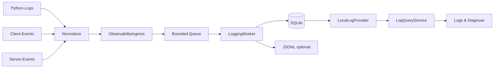

# Logging & Observability V1 – Dokumentationsindex

**Produkt:** RealtimeSTT Desktop Client  
**Dokumentationsstand:** 21.08.2026  
**Geltungsbereich:** vorgezogene Observability Foundation / Teil A vor der Triggerarchitektur-Migration

Diese Dokumentation beschreibt das Logging-/Observability-Subsystem als **Produkt**, nicht als Projektbericht. Die Arbeitsakten, Gates und Evidence bleiben die tiefere Nachweis- und Entscheidungsquelle; hier geht es darum, das fertige System verständlich, entwickelbar und betreibbar zu dokumentieren.

> **Statushinweis:** Teil A ist als belastbarer Arbeitsstand akzeptiert. Die Dokumentation behauptet bewusst kein formal vollständig nachgeholtes `G-OBS-V1 PASS`. Einige Restprüfungen und Erweiterungen werden nach der Triggerarchitektur-Migration erneut bewertet.

## Schnellnavigation

| Wenn du wissen willst … | Lies |
|---|---|
| Was das System macht und warum es existiert | [01_UEBERBLICK_UND_ZIELBILD.md](01_UEBERBLICK_UND_ZIELBILD.md) |
| Wie die Komponenten zusammenarbeiten | [02_ARCHITEKTUR_UND_DATENFLUSS.md](02_ARCHITEKTUR_UND_DATENFLUSS.md) |
| Wie ein kanonischer Logrecord aufgebaut ist | [03_CANONICAL_LOG_RECORD.md](03_CANONICAL_LOG_RECORD.md) |
| Welche Quellen, Producer, Channels und Levels es gibt | [04_QUELLEN_PRODUCER_CHANNELS.md](04_QUELLEN_PRODUCER_CHANNELS.md) |
| Welche strukturierten Client-Events existieren | [05_EVENT_KATALOG_CLIENT.md](05_EVENT_KATALOG_CLIENT.md) |
| Welche Server-Events und Logstream-Nachrichten relevant sind | [06_SERVER_EVENTS_UND_LOGSTREAM.md](06_SERVER_EVENTS_UND_LOGSTREAM.md) |
| Wie IDs und Metadaten zur Korrelation zusammenhängen | [07_KORRELATION_IDS_UND_METADATEN.md](07_KORRELATION_IDS_UND_METADATEN.md) |
| Wann und wie neuer Code geloggt werden soll | [08_LOGGING_FUER_ENTWICKLER.md](08_LOGGING_FUER_ENTWICKLER.md) |
| Konkrete Instrumentierungsbeispiele | [09_INSTRUMENTIERUNGS_COOKBOOK.md](09_INSTRUMENTIERUNGS_COOKBOOK.md) |
| Wie die PySide-Oberfläche und der Settings-Dialog funktionieren | [10_PYSIDE_UI_UND_SETTINGS.md](10_PYSIDE_UI_UND_SETTINGS.md) |
| Wie Query, Filter, History und Live funktionieren | [11_QUERY_FILTER_HISTORY_LIVE.md](11_QUERY_FILTER_HISTORY_LIVE.md) |
| Wo Logs gespeichert werden und welche Ausgabeformate existieren | [12_PERSISTENZ_SINKS_AUSGABEFORMATE.md](12_PERSISTENZ_SINKS_AUSGABEFORMATE.md) |
| Wie Backpressure, Health und Failure Isolation funktionieren | [13_HEALTH_BACKPRESSURE_FAILURE_ISOLATION.md](13_HEALTH_BACKPRESSURE_FAILURE_ISOLATION.md) |
| Welche Konfigurationsfelder existieren | [14_KONFIGURATION_REFERENZ.md](14_KONFIGURATION_REFERENZ.md) |
| Wie man das System praktisch untersucht | [15_BETRIEB_TROUBLESHOOTING.md](15_BETRIEB_TROUBLESHOOTING.md) |
| Welche Garantien durch Tests abgesichert werden | [16_TESTS_VALIDIERUNG_GARANTIEN.md](16_TESTS_VALIDIERUNG_GARANTIEN.md) |
| Warum zentrale Architekturentscheidungen so getroffen wurden | [17_ARCHITEKTURENTSCHEIDUNGEN.md](17_ARCHITEKTURENTSCHEIDUNGEN.md) |
| Wo die ursprünglichen Pläne, Contracts, Runs und Evidence liegen | [18_PROJEKTARTEFAKTE_REFERENZEN.md](18_PROJEKTARTEFAKTE_REFERENZEN.md) |
| Was nach der Trigger-Migration noch folgt | [19_AUSBLICK_TEIL_B.md](19_AUSBLICK_TEIL_B.md) |

## Das System in einem Bild

Die wichtigste Regel:

> **Observability beobachtet. Sie entscheidet nichts über den fachlichen Ablauf.**
