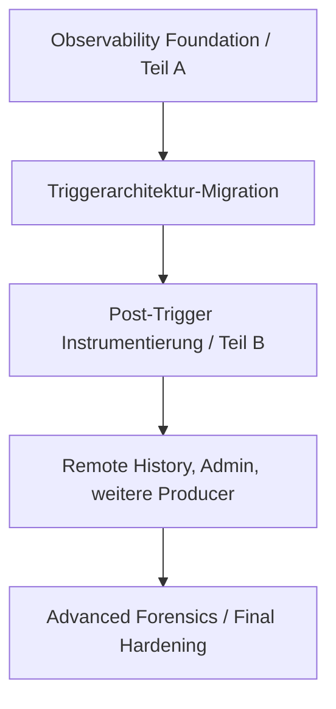

# Überblick und Zielbild

## Kurz und einfach erklärt

Stell dir die Anwendung wie ein Auto vor. Motor, Lenkung und Bremsen sorgen dafür, dass das Auto fährt. Das Logging ist eher **Armaturenbrett, Fahrtenschreiber und Diagnosegerät**.

Es darf sehen und sich merken, was passiert. Es darf aber nicht entscheiden, ob aufgenommen, gestoppt, verbunden oder Text eingefügt wird.

Wenn das Diagnosegerät kaputtgeht, soll das Auto trotzdem weiterfahren. Genau so ist dieses Logging gebaut.

## Warum dieses Subsystem gebaut wurde

RealtimeSTT besitzt mehrere gleichzeitig arbeitende Pfade:

- WebSocket-Verbindung zum STT-Server;
- Eventstream;
- Audioaufnahme;
- Trigger und Commands;
- Serverzustände;
- Transkriptionen;
- Textinjektion;
- Feedback, Sound und LED;
- Settings und Reconnect.

Ein reines Textlog beantwortet bei Race Conditions nur schwer:

```text
Was passierte zuerst?
Welcher Serverevent gehörte zu welcher Session?
Welcher Command wurde bestätigt?
War ein Event Replay oder Live?
Gehörten zwei Meldungen wirklich zur selben Activation?
```

Dafür wurde strukturierte Observability benötigt.

## Warum Teil A vor der Triggerarchitektur kam

Die Trigger-Migration verändert gerade die Bereiche, die diagnostisch schwierig sind: Triggerquelle, Activation Lifecycle, IDs, Recording, Finalisierung, Reconnect und Feedback-Korrelation.



Teil A macht den Umbau beobachtbar; Teil B vervollständigt das System danach.

## Was V1 / Teil A enthält

- gemeinsames Canonical-Record-Modell;
- drei Normalisierungseingänge;
- Python-Logs als Quelle;
- strukturierte Client-Events;
- passive Übernahme von Server-/Eventstream-Daten;
- bounded, non-blocking Ingestion;
- Worker und Batching;
- SQLite-Persistenz;
- Replay-Deduplizierung;
- Retention;
- optionalen JSONL-Sink;
- Query-Abstraktion;
- History und Live;
- PySide-Diagnosefenster;
- Logging-/Diagnose-Einstellungen;
- Health-/Fehlerzähler;
- Failure-/Regressionstests.

## Was V1 bewusst nicht ist

V1 ist nicht:

- die fachliche Zustandsmaschine;
- Ersatz für `/ws/transcribe`;
- Quelle für Finaltext;
- Ersatz für Feedback/LED/Sound;
- globale Serveradministration;
- Remote-Server-History für beliebige Sessions;
- zentraler Collector;
- vollständiger Forensik-/Analytics-Stack.

## Zwei Diagnosewelten

### Klassisch

```text
logger.info / warning / exception
→ Console / client.log
```

### Observability

```text
Python-Log / Client-Event / Server-Event
→ CanonicalLogRecord
→ SQLite / Query / LogWindow
```

`client.log` bleibt absichtlich als unabhängige Rückfallebene bestehen.

## Leitlinien

1. Observability Only.
2. Fan-out statt Vermittlung.
3. Non-Blocking.
4. Bounded Memory.
5. Failure Isolation.
6. Struktur statt Textparsing.
7. Source Preservation.
8. Replay Safety.
9. Query Independence.
10. Erweiterbarkeit.

## Besonderheit `activation_id`

Vor der Trigger-Migration ist `activation_id` diagnostisch wertvoll, aber nicht in jeder Situation fachlich zuverlässig. Observability soll Widersprüche sichtbar machen und sie nicht durch clientseitiges Erraten verstecken.
