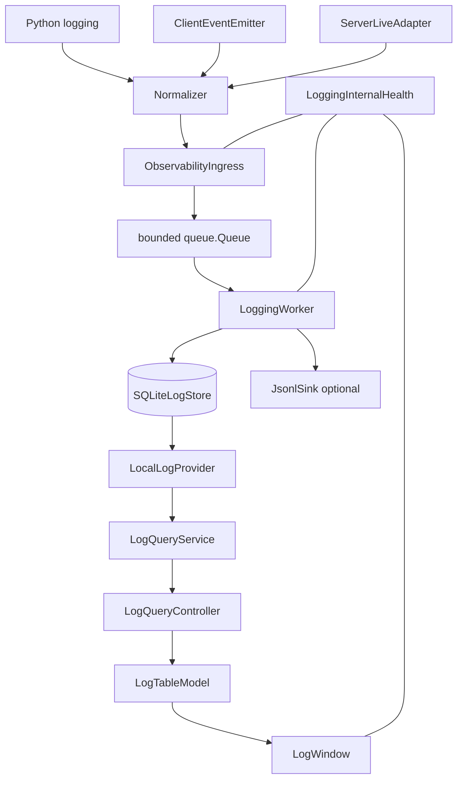
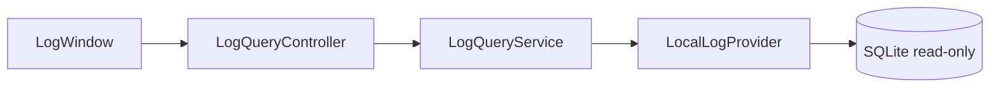
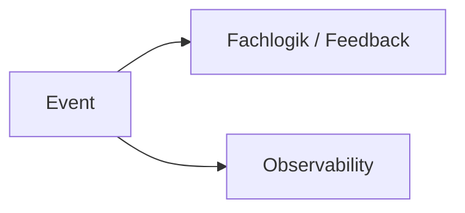
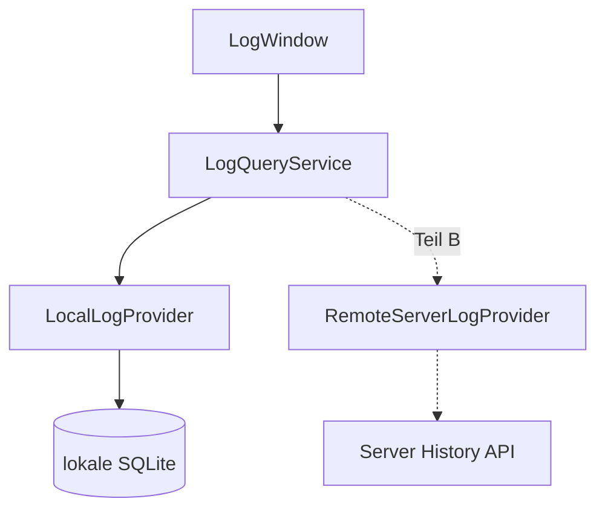

# Architektur und Datenfluss

## Kurz und einfach erklärt

Mehrere Stellen können etwas melden. Diese Meldungen laufen durch einen **Übersetzer**, der sie in dasselbe Format bringt. Danach kommen sie in eine **Warteschlange**, damit die Anwendung nicht warten muss. Ein separater Arbeiter schreibt sie in die Datenbank.

Die Oberfläche liest nicht direkt aus diesen inneren Bauteilen, sondern fragt eine Suchschicht.

```text
Lieferanten → Etiketten → Annahme → Warteschlange → Lager → Auskunft → Benutzer
```

## Komponentenübersicht



## Modulstruktur

```text
core/observability/
├── models.py
├── redaction.py
├── normalizer.py
├── ingress.py
├── health.py
├── worker.py
├── manager.py
├── adapters/
│   ├── python_logging.py
│   ├── client_events.py
│   └── server_live.py
├── storage/
│   ├── base.py
│   └── sqlite.py
├── query/
│   ├── base.py
│   ├── local.py
│   └── service.py
└── sinks/
    ├── base.py
    └── jsonl_file.py

ui/logs/
├── log_window.py
├── log_page.py
├── log_table_model.py
├── log_filter_bar.py
├── log_detail_view.py
└── log_query_controller.py
```

## Schichtung

```text
models <- redaction <- normalizer <- ingress <- worker <- manager

storage kennt nur Models
sinks kennen nur Models
query kennt Models + Store-Abstraktion
adapters kennen Ingress + Normalizer

ui/logs importiert Query, nicht sqlite3/storage
core/** importiert kein PySide6
```

## Schreibpfad

1. Producer erzeugt Information.
2. Normalizer baut `CanonicalLogRecord`.
3. Ingress prüft Aktivierung, Level, Health und Backpressure.
4. `put_nowait` übergibt an eine bounded Queue.
5. Worker zieht Batches.
6. Worker schreibt SQLite und optional JSONL.
7. Worker aktualisiert Health/Retention.

Kein Producer wartet auf DB-I/O.

## Lesepfad



Der Lesepfad geht nicht rückwärts durch Worker oder Ingress.

## Fan-out statt Vermittlung



Nicht:

```text
Event → Observability → Fachlogik
```

## Threading

Getrennt werden insbesondere:

- Audio-/Runtime-Threads;
- WebSocket-/Eventstream-Pfade;
- Qt-Mainthread;
- LoggingWorker;
- Query-Zugriffe.

Hot Paths führen kein synchrones Logging-I/O aus.

## Shutdown

Beim Shutdown werden neue Records begrenzt, Restqueue innerhalb des Budgets geflusht, Store/Sink geschlossen und nicht mehr flushbare Records als `dropped_shutdown` gezählt. Logging darf den Anwendungs-Shutdown nicht unbegrenzt blockieren.

## Erweiterungspunkt



Darum kennt die UI SQLite nicht direkt.
