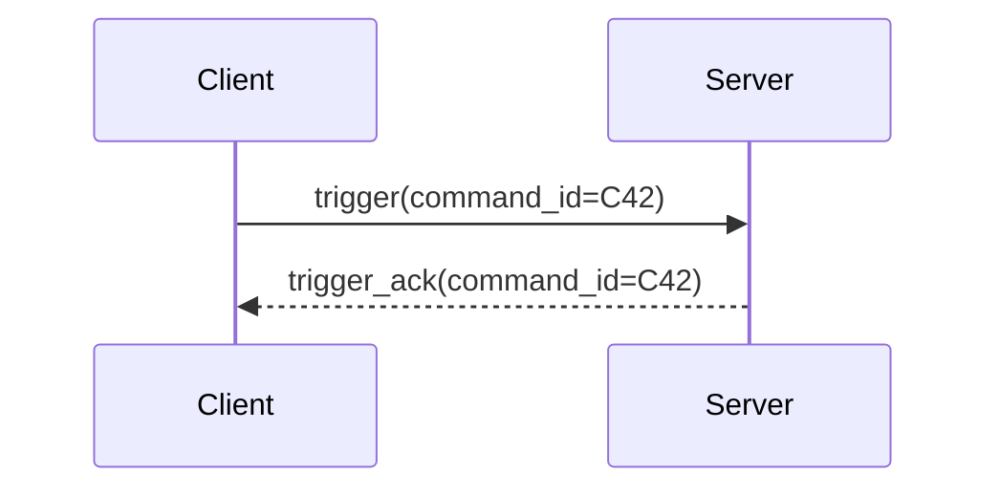

# Korrelation, IDs und Metadaten

## Kurz und einfach erklärt

Stell dir 500 Fotos einer Veranstaltung vor. Nur anhand der Uhrzeit ist schwer zu erkennen, welche Fotos zum selben Programmpunkt gehören.

Darum bekommen Vorgänge „Nummernschilder“:

- Session-ID;
- Command-ID;
- Segment-ID;
- Event-ID;
- usw.

Die Logs können dadurch sagen:

> Diese Einträge gehören wirklich zusammen.

---

## 1. Warum Zeitstempel allein nicht reichen

Threads, Netzwerk und Replay machen Reihenfolgen kompliziert.

Bevorzugte Beweiskette:

```text
stabile IDs
→ Cursor/Sequence
→ Generation
→ Zeitstempel ergänzend
```

---

## 2. `record_id`

**Erzeuger:** lokale Observability  
**Bedeutung:** dieser konkrete lokale Speichereintrag.

Nicht zur Cross-System-Deduplizierung verwenden.

---

## 3. `event_id`

**Erzeuger:** Server  
**Bedeutung:** stabile Identität des Serverereignisses.

Hauptverwendung:

```text
producer_id + event_id
→ Replay-Dedupe
```

---

## 4. `server_cursor`

**Erzeuger:** Servereventjournal  
**Bedeutung:** Position im Journal.

Nicht mit `event_id` verwechseln.

---

## 5. `session_id`

**Owner:** STT-Sessionvertrag  
**Lebensdauer:** eine Session.

Verbindet z. B.:

- Connection;
- Serverevents;
- Trigger;
- Transkription;
- Clientobservations.

Python-Logging übernimmt die Session-ID nur, wenn sie am Logpunkt explizit vorliegt.

---

## 6. `generation`

**Owner:** Client-Verbindungslogik  
**Zweck:** alte und neue Transportgenerationen trennen.

Wichtig bei:

- Reconnect;
- stale Acks;
- verspäteten Events;
- Sessionwechsel.

---

## 7. `activation_id`

**Owner:** fachlicher Activation-Vertrag  
**V1-Hinweis:** vor der Trigger-Migration nur diagnostisch zuverlässig.

Nicht clientseitig erraten.

---

## 8. `segment_id`

**Owner:** Server-/Transkriptionssession  
**Zweck:** einzelne Äußerung innerhalb einer Session.

---

## 9. `transcription_id`

Kennzeichnet einen fachlichen Transkriptionsvorgang, insbesondere serverseitig.

Nicht jeder Clientrecord besitzt sie.

---

## 10. `command_id`

Verbindet Request und Ack.



---

## 11. `correlation_id`

Generische Korrelation für Vorgänge ohne eigene Domänen-ID.

Beispiel Settings Apply:

```text
client.settings.apply_started
client.settings.runtime_apply
client.settings.apply_completed
```

alle mit derselben `correlation_id`.

---

## 12. Beispiel einer Korrelationskette

```text
session_id = S1
generation = 4
command_id = C9
```

```text
client.hotkey.pressed
    ↓
client.command.requested      correlation=X
    ↓
client.trigger.sent           session=S1 generation=4 command=C9
    ↓
client.trigger.ack_received   session=S1 generation=4 command=C9
    ↓
Serverevent                   session=S1 ...
```

Nicht jede Zeile braucht jede ID.

---

## 13. Keine erfundenen Metadaten

Falsch:

```text
"Es gibt gerade Session S1, also schreibe ich S1 in jeden Logrecord."
```

Richtig:

```text
"Dieser konkrete Vorgang trägt nachweislich S1."
```

Eine fehlende ID ist forensisch besser als eine falsche.

---

## 14. Zeitfelder

### `source_timestamp`

Zeitpunkt der Quelle.

### `received_at`

Zeitpunkt, an dem der lokale Canonical Record entstand/einging.

Bei Netzwerk, Replay und Backlog können die Werte auseinanderliegen – genau das kann diagnostisch interessant sein.

---

## 15. Replay-Metadaten

Replay behält:

- serverseitige Eventidentität;
- Cursor;
- ursprünglichen Zeitpunkt;
- Replaykennzeichen.

Der lokale Verarbeitungszeitpunkt bleibt davon getrennt.

---

## 16. Nach der Trigger-Migration

OBS-100 soll insbesondere:

- endgültige Trigger-/Activation-IDs prüfen;
- serverautoritativen Activation-Lifecycle instrumentieren;
- stale Generationen sichtbar machen;
- neue strukturierte Lifecycle-Events ergänzen.

Dann wird auch die Rolle von `activation_id` neu bewertet.
