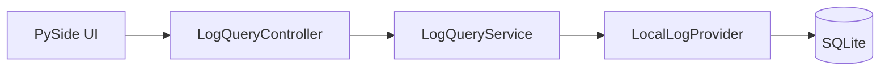

# PySide-Oberfläche und Logging-Einstellungen

## Kurz und einfach erklärt

Die Datenbank wäre für normale Benutzung unpraktisch. Die Oberfläche macht daraus eine **durchsuchbare Ereignisliste**:

- oben wählt man aus, was man sehen möchte;
- in der Mitte stehen die Treffer;
- unten kann man einen einzelnen Eintrag genauer ansehen.

Im normalen Einstellungsdialog legt man zusätzlich fest, ob und wie das Diagnosesystem Daten sammelt und speichert.

---

## 1. Harte Architekturgrenze

Die UI ist nur Benutzeroberfläche.

Sie:

- schreibt nicht direkt nach SQLite;
- besitzt nicht den `LoggingWorker`;
- verarbeitet nicht selbst das Server-WebSocket-Protokoll;
- importiert nicht `sqlite3`;
- steuert keinen fachlichen Lifecycle.



Damit bleibt Qt eine Darstellungsschicht.

---

## 2. UI-Module

```text
ui/logs/
├── log_window.py
├── log_page.py
├── log_table_model.py
├── log_filter_bar.py
├── log_detail_view.py
└── log_query_controller.py
```

### `LogWindow`

Nicht-modales Fenster. Die Diagnose kann offenbleiben, während die Hauptanwendung weiterläuft.

### `LogPage`

Komponiert Filter, Tabelle, Detailbereich und Status.

### `LogTableModel`

`QAbstractTableModel` statt `QTableWidget`.

Das ist wichtig für:

- große Datenmengen;
- saubere Model/View-Trennung;
- kontrolliertes Nachladen;
- Tests ohne vollständige Widget-Datenhaltung.

### `LogFilterBar`

Übersetzt Benutzereingaben in `QueryFilter`.

### `LogDetailView`

Zeigt strukturierte Details und Raw-Payload.

### `LogQueryController`

Verbindet Qt-Signale und den Live-Timer mit dem UI-neutralen `LogQueryService`.

---

## 3. Haupttabelle

Die V1-Tabelle zeigt sieben Hauptspalten:

```text
Zeit
Quelle
Channel
Level
Typ
Component
Meldung
```

Das ist bewusst nur die kompakte Sicht. IDs und weitere Metadaten stehen im Detailbereich.

---

## 4. Details und Raw

Beim Anklicken eines Records:

```text
Tabelle
   ↓
ausgewählter Record
   ↓
Details + Raw
```

Raw wird **lazy** nachgeladen.

Warum? Wenn 500 Tabellenzeilen sichtbar sind, wäre es unnötig, für alle großen Originalpayloads in den UI-Speicher zu laden, obwohl vielleicht nur einer geöffnet wird.

---

## 5. History und Live

### History

> „Zeig mir, was bereits gespeichert wurde.“

### Live

> „Zeig mir neue Records, während die Anwendung läuft.“

Beide Modi haben bewusst unterschiedliche Sortier-/Nachladesemantik. Sie werden in V1 nicht zu einer einzigen komplizierten Mischliste verschmolzen.

Ausführlich: [11_QUERY_FILTER_HISTORY_LIVE.md](11_QUERY_FILTER_HISTORY_LIVE.md).

---

## 6. Auto-Scroll

Im Live-Modus kann die Ansicht neuen Records automatisch folgen.

Der Benutzer muss Auto-Scroll abschalten können, damit beim Lesen eines älteren Eintrags die Tabelle nicht ständig wegspringt.

---

## 7. Filterbereich

Die Oberfläche bietet bzw. basiert auf Filtern für:

- Quelle;
- Channel;
- Level;
- Typ/Typ-Präfix;
- Freitext;
- Session;
- Activation;
- Segment;
- Korrelation;
- Replay.

Die Filterung wird nicht durch komplettes Laden aller Records und anschließendes lokales Qt-Filtern realisiert. Die Query-Schicht begrenzt bereits die Datenmenge.

---

## 8. Kontextaktionen

Ein Record kann Ausgangspunkt für kontextbezogene Filter sein:

```text
nur diese Session
nur diese Activation
nur dieses Segment
nur diesen Eventtyp
```

Bei `activation_id` muss bis zur Trigger-Migration sichtbar bleiben, dass die Zuordnung diagnostisch und nicht in allen Fällen fachlich autoritativ ist.

---

## 9. Statuszeile verstehen

Beispiel:

```text
Provider: available
289 Zeilen
neueste unten
Logging: ok
geschrieben 739
dedupliziert 0
verworfen 0
Queue 0
```

`geschrieben` und `Zeilen` müssen nicht gleich sein:

- `geschrieben` ist ein kumulativer Worker-/Health-Zähler;
- `Zeilen` ist nur die aktuell geladene/gefilterte Tabellenansicht;
- Pagination, Filter und Retention beeinflussen die sichtbare Zahl.

---

## 10. Settings-Tab „Logging & Diagnose“

Nutzernahe Einstellungen:

- Observability aktiviert;
- Level;
- Store aktiviert;
- Retention Days;
- Max Entries;
- File Sink aktiviert;
- File Sink Directory;
- Transkriptinhalt speichern;
- Raw-Payload speichern;
- Diagnosehistorie löschen;
- Logs anzeigen.

Low-Level-Parameter bleiben bewusst in `config.yaml`.

---

## 11. Settings-Ownership

Die Settings-UI besitzt weder Worker noch Store.

Konzeptionell:

```text
Benutzer ändert Setting
→ Config/Apply-Kette
→ Observability-Komposition übernimmt erlaubte Runtimeänderung
```

Nicht:

```text
SettingsWidget
→ schließt selbst SQLite
→ startet selbst Worker
```

---

## 12. Apply-Regel

Eine reine Observability-Änderung darf keinen:

```text
STT-Reconnect
Audio-Neustart
```

auslösen.

Einige Store-nahe Werte sind deshalb restartgebunden, statt im laufenden Worker komplex umgebaut zu werden.

---

## 13. Bekannter V1-Randfall

Der Übergang:

```text
Client startet mit Observability = false
→ Benutzer aktiviert sie später im laufenden Prozess
```

ist im akzeptierten V1-Stand noch nicht vollständig gemäß der ursprünglich eingefrorenen `IMMEDIATE`-Semantik implementiert, weil bei initial deaktivierter Komposition Worker/Store nicht vollständig aufgebaut sind.

Dieser Punkt gehört als bekannter Rest in die Produktdokumentation und soll nicht durch reine UI-Kosmetik verdeckt werden.

---

## 14. Bereits festgehaltene UI-Nachbesserungen

### Freie rechteckige Auswahl

Wie in einer Tabellenkalkulation:

```text
beliebiger zusammenhängender Bereich
aus Zeilen × Spalten
```

nicht nur ganze Zeilen oder Spalten.

### Kopieren als TSV

`Ctrl+C` soll den markierten Rechteckbereich als tabellarisches TSV kopieren.

### „Als JSON kopieren“

Wenn mindestens eine Zelle einer Zeile betroffen ist:

```text
→ vollständigen zugrunde liegenden Record dieser Zeile kopieren
```

Mehrere betroffene Zeilen:

```text
→ JSON-Array vollständiger Records
```

### History und Live stärker unterscheiden

Mögliche Lösung:

- deutlichere visuelle Kennzeichnung;
- oder separate Tabs.

Ziel: ohne genaues Hinsehen muss erkennbar sein, in welchem Modus man arbeitet.

### Typauswahl

Typ/Typ-Präfix soll über bekannte vorhandene Typen auswählbar sein.

### Freitext

- breiteres Eingabefeld;
- Suche soll ausdrücklich auch `type` berücksichtigen.

Diese Punkte sind UX-/Power-User-Erweiterungen, keine Voraussetzung der grundlegenden Store-/Ingress-Architektur.

---

## 15. UI-Fehler bleiben UI-/Query-Fehler

Wenn eine Query fehlschlägt:

```text
LogWindow zeigt Diagnosefehler
```

nicht:

```text
STT-Session bricht ab
```

Diese Grenze ist Teil der Failure Isolation.
