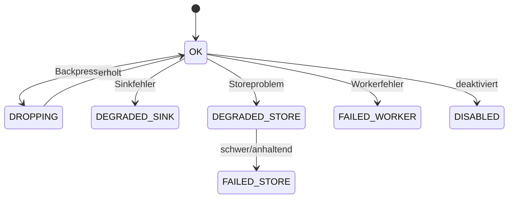

# Health, Backpressure und Failure Isolation

## Kurz und einfach erklärt

Das Logging darf nicht die Hauptanwendung ausbremsen.

Wenn sehr viele Meldungen kommen, verhält es sich wie ein Eingang mit begrenzter Warteschlange:

- wichtige Dinge werden bevorzugt;
- weniger wichtige Dinge dürfen kontrolliert verloren gehen;
- Verluste werden gezählt;
- die Hauptanwendung wartet nicht.

Und wenn die Logdatenbank kaputt ist, soll die Spracherkennung trotzdem weiterlaufen.

---

## 1. Prioritäten

Drei Ziele lassen sich unter extremer Last nicht absolut gleichzeitig garantieren:

```text
niemals blockieren
begrenzten Speicher verwenden
niemals einen Record verlieren
```

V1 priorisiert:

1. Runtime nicht blockieren.
2. Speicher begrenzen.
3. wichtige Records bevorzugen.
4. Verluste sichtbar zählen.

---

## 2. Eine bounded Queue

Standard:

```text
queue_size = 8192
watermark = 75 %
```

---

## 3. Wasserstandsregel

```text
Füllstand < 75 %
    → HIGH und LOW annehmen

Füllstand >= 75 %
    → HIGH annehmen
    → LOW verwerfen
    → dropped_watermark++

Queue voll
    → verwerfen
    → dropped_queue_full++
```

---

## 4. Prioritätsidee

HIGH umfasst insbesondere wichtige, nicht replayte strukturierte Records sowie Warn-/Auditfälle.

Replay wird unter Last bewusst niedriger priorisiert, weil:

- seine Eventidentität bereits existiert;
- es historisch ist;
- eine Replayflut Live-Diagnose sonst verdrängen könnte.

---

## 5. Health-Zustände

V1 kennt sinngemäß:

```text
OK
DROPPING
DEGRADED_SINK
DEGRADED_STORE
FAILED_STORE
FAILED_WORKER
DISABLED
```



Das Diagramm erklärt die Semantik und ist keine 1:1-Abbildung jeder internen Transition.

---

## 6. Zähler

| Zähler | Bedeutung |
|---|---|
| `enqueued` | vom Ingress angenommen |
| `written` | tatsächlich in Store geschrieben |
| `deduplicated` | per Event-ID-Dedupe unterdrückt |
| `dropped_watermark` | wegen Wasserstand verworfen |
| `dropped_queue_full` | Queue komplett voll |
| `dropped_shutdown` | beim Shutdown nicht mehr flushbar |
| `malformed` | Normalisierung/Serialisierung gescheitert |
| `store_errors` | Storefehler |
| `sink_errors` | File-Sink-Fehler |
| `retention_errors` | Cleanupfehler |
| `worker_errors` | Workerfehler |
| `queue_depth` | aktueller Füllstand |
| `db_bytes` | beobachtete DB-Größe |

---

## 7. Warum Drops erlaubt sind

Bei Last ist:

```text
ein Diagnoseeintrag fehlt
```

besser als:

```text
Diktat hängt, weil Logging auf I/O wartet
```

Observability ist sekundär zum Produktpfad.

---

## 8. Failure Isolation

Das explizite Ziel:

```text
Logging kaputt
→ Audio funktioniert
→ /ws/transcribe funktioniert
→ Controller funktioniert
→ Feedback funktioniert
→ Textfluss bleibt fachlich intakt
```

---

## 9. Typische Fehlerfälle

### SQLite read-only

```text
Storefehler sichtbar
Health degradiert/failed
Runtime weiter
```

### SQLite locked

Worker darf keinen Runtime-Producer blockieren.

### DB-Pfad ungültig

Observability darf fehlschlagen; Hauptanwendung nicht.

### JSONL-Sink kaputt

Optionaler Sink kann degradieren, während SQLite weiterläuft.

### Queue voll

Kontrollierter Drop + Zähler.

### Workerexception

Health sichtbar, kein Runtime-Exceptiondurchschlag.

### Queryfehler

Logfenster zeigt Providerproblem, STT bleibt aktiv.

---

## 10. Emergency-Ausgang

Interne Loggingfehler dürfen nicht wieder normal geloggt werden und dadurch Rekursion erzeugen:

```text
Loggingfehler
→ normaler Logger
→ Loggingfehler
→ normaler Logger
→ ...
```

Darum existiert ein begrenzter interner/Emergency-Pfad.

Er soll:

- nicht rekursiv;
- rate-limited;
- defensiv gegen fehlendes/defektes `stderr`

sein.

---

## 11. Kein Tray-Spam

Ein kaputtes Diagnosesystem ist normalerweise kein Grund, den Benutzer fortlaufend mit Benachrichtigungen zu unterbrechen.

Wer die Diagnoseoberfläche öffnet, kann Health dort sehen.

---

## 12. Recovery

Transient fehlerhafte Store-/Workerzustände können sich erholen.

OBS-060 hat insbesondere Recoverypfade gehärtet, ohne eine zweite Runtimeautorität einzuführen.

---

## 13. Shutdown

Restqueue innerhalb kontrollierten Budgets flushen.

Nicht mehr schreibbare Records:

```text
dropped_shutdown++
```

Nicht endlos auf Logging warten.

---

## 14. Health ist keine fachliche Wahrheit

Auch:

```text
FAILED_STORE
```

bedeutet nicht:

```text
STT muss stoppen
```

Health beschreibt nur die Beobachtungsinfrastruktur.

---

## 15. Hot-Path-Regeln

Kritisch:

- Audio callback;
- Audio process/send loop;
- WebSocket receive;
- Eventstream receive;
- Qt-Mainloop.

Dort:

```text
kein SQLite-I/O
kein File-I/O
keine unbounded Queue
keine Record-pro-Frame-Flut
```
