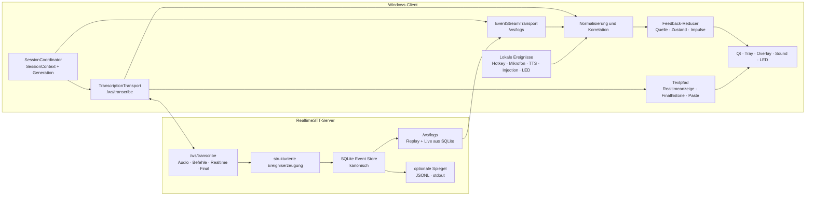

# AP07 – Verbindliche Gesamtplanung für das Feedback- und Eventsystem

> **Status:** verbindlicher Paket- und Architekturvertrag  
> **Beschlossen am:** 2. August 2026  
> **Geltungsbereich:** erforderliche Serverhärtung, Clientintegration und Benutzerfeedback  
> **Implementierungsstand:** M0–M9 abgenommen; M10-Fehlerkampagne in Arbeit
> **Ersetzt:** alle Konzept-, Vorschlags-, Stellungnahme- und Auftragsstände unter
> `docs/2026-07-30_PROJEKT_EVENT_FEEDBACK_SYSTEM/zwischenstaende_bis_2026-08-01/`

## 1. Zweck und Verbindlichkeit

Dieses Dokument zieht die bisherige Diskussion zu einer einzigen, konsistenten
Planungsgrundlage zusammen. Es beschreibt, was fachlich und architektonisch
beschlossen ist, welche Teile bereits existieren, welche Servervoraussetzungen
noch fehlen und wie der Desktop-Client danach grundsätzlich aufgebaut sein
muss.

Es ist der verbindliche Detailvertrag für AP07. Die Reihenfolge der Umsetzung
und die kleinen Arbeitsschritte stehen ergänzend in
`AP07_FEEDBACK_EVENTSYSTEM_IMPLEMENTIERUNGSPLAN.md`.

Bei Widersprüchen gilt folgende Rangfolge:

1. `AGENTS.md` und die dort festgelegten dauerhaften Projektregeln,
2. der tatsächlich implementierte und getestete Code für den Iststand,
3. `server-docs-for-client-development/` für den tatsächlich freigegebenen
   Serverprotokollvertrag,
4. `docs/IMPLEMENTATION_ROADMAP.md` für Paketfolge und Zielarchitektur,
5. dieses Dokument für den Detailvertrag von AP07,
6. der AP07-Implementierungsplan für die Ausführungsreihenfolge,
7. historische Dateien nur als Entstehungsnachweis.

Wichtig ist die Trennung zwischen Entscheidung und Verfügbarkeit: Die hier
beschriebene Zielarchitektur ist beschlossen. Noch nicht in
`server-docs-for-client-development/` dokumentierte Serverfelder dürfen der
Clientimplementierung aber nicht als bereits verfügbar unterstellt werden. Die
Serverhärtung, Produktivverifikation und anschließende Synchronisierung des
Serververtrags sind deshalb verpflichtende Vorstufen.

---

## 2. Kurzfassung der endgültigen Entscheidung

Der Client verwendet zwei WebSocket-Verbindungen mit klar getrennten Aufgaben:

- `/ws/transcribe` überträgt Audio und Befehle und liefert Realtime- sowie
  Finaltext und unmittelbare Transport-/Protokollsignale.
- `/ws/logs` liefert nach erfolgreicher SQLite-Persistenz den strukturierten,
  wiederaufnehmbaren serverseitigen Feedback- und Lebenszyklusstrom.

Im Normalbetrieb ist `/ws/logs` die einzige serverseitige Quelle für Sounds,
LED-Wirkungen und fachliches Statusfeedback. `/ws/transcribe` ist dafür keine
zweite parallele Normalquelle. Es kann nur in einem ausdrücklich erkannten
degradierten Zustand eine kleine, fest definierte Menge vorhandener
Timeline-/Statussignale als Übergangs-Fallback liefern.

Lokale Tatsachen wie Hotkeybetätigung, Mikrofonzustand, Textinjektion,
Sprachausgabe und LED-Gerätefehler entstehen weiterhin ausschließlich im
Client. Ein zentraler Feedback-Reducer führt Serverereignisse und lokale
Tatsachen zu einer einzigen sichtbaren Wirkung zusammen.

Die Zuordnung von Ereignissen zu Ausgabewirkungen ist deklarativ in der
versionierten YAML-Konfiguration des Clients beschrieben. Kanonische,
namespacete Ereignisschlüssel unterscheiden mindestens `server.*` und
`client.*`. Jeder bekannte Ereignistyp kann unabhängig eine LED-Wirkung,
einen Sound und/oder eine freigegebene In-App-Aktion auslösen. Das Mapping ist
damit weder auf Serverereignisse beschränkt noch im Reducer, in Qt oder im
LED-Adapter fest verdrahtet.

Der Servereventstrom wird vor der Clientintegration auf SQLite-first gehärtet:
Ein strukturiertes Ereignis darf erst nach erfolgreichem Commit mit seinem
endgültigen Cursor über `/ws/logs` ausgeliefert werden. Live und Replay lesen
damit aus derselben kanonischen Quelle.

---

## 3. Problem, das diese Architektur löst

Die Transkriptionsverbindung ist ein zeitkritischer Hochlastpfad. Über sie
laufen Audioframes, Befehle, Status, Realtime-Ergebnisse und Finaltexte. Unter
hoher Last oder Queue-Druck soll Benutzerfeedback nicht allein davon abhängen,
ob ein zusätzliches flüchtiges Statussignal auf diesem Pfad rechtzeitig
ankommt.

Ein zweiter Eventstrom ist deshalb nicht bloß Logansicht oder Historie. Seine
Aufgabe ist eine zuverlässige, geordnete und nach einem Verbindungsabbruch
wiederaufnehmbare Übermittlung der serverseitigen Lebenszyklusereignisse.

Der bisherige Serverentwurf erzeugt jedoch Ereignisse und reicht sie unabhängig
an Store, Live-Publisher, JSONL und Standardausgabe weiter. Dadurch kann ein
Liveevent existieren, obwohl sein SQLite-Commit fehlgeschlagen ist. Ein solcher
Pfad kann nicht gleichzeitig als zuverlässige Livequelle und als
wiederaufnehmbare Historie gelten. Diese Inkonsistenz wird durch SQLite-first
beseitigt.

### 3.1 Bewusst verworfene Alternativen

| Alternative | Entscheidung und Grund |
| --- | --- |
| Nur `/ws/transcribe` verwenden | Verworfen. Der Audio-/Realtimepfad trägt bereits hohe und zeitkritische Last; der geplante zuverlässige Eventstrom würde ungenutzt bleiben. |
| `/ws/logs` nur für Historie/Diagnose verwenden | Verworfen. Die zweite Verbindung ist ausdrücklich als zuverlässige primäre Übermittlung serverseitiger Feedbackereignisse vorgesehen. |
| Beide WebSockets im Normalbetrieb gleichzeitig Feedback auslösen lassen | Verworfen. Zwei parallele Wahrheiten erzeugen Doppelimpulse und schwer beweisbare Rennen. |
| Live zuerst senden und später best effort in SQLite speichern | Verworfen. Ein Liveevent ohne späteren Replaydatensatz verletzt den Zuverlässigkeitsvertrag. |
| Nur „wichtige“ Events zuverlässig, andere best effort | Verworfen. Ereignismenge wird bei der Erzeugung begrenzt; alle tatsächlich angebotenen strukturierten Events folgen demselben Storevertrag. |
| Finaltext aus Serverevents rekonstruieren | Verworfen. Text bleibt wegen Latenz, Datenschutz und bestehendem Integrationsvertrag ausschließlich auf `/ws/transcribe`. |
| History-HTTP-Polling als normaler Livepfad | Verworfen. History ist Diagnose-/Reparaturergänzung, kein Ersatz für den Live-WebSocket. |
| Separater Clientdienst/Adminprozess | Verworfen. Beide Transporte gehören in den bestehenden asyncio-Core; die festgelegte Projektphase enthält keinen Admin-Service. |

SQLite-first bedeutet keine Ende-zu-Ende-Exactly-once-Zustellung bis zum
Bildschirm. Bei einem Verbindungsabbruch kann ein committed Ereignis erneut
ankommen. Die Kombination aus committed Cursor, `eventId`, Replay und
clientseitiger Deduplizierung liefert eine wiederaufnehmbare, mindestens
einmalige Übermittlung ohne doppelte Benutzerwirkung.

---

## 4. Planungs-Iststand am 2. August 2026

> **Fortschrittsabgleich vom 9. August 2026:** Die nachfolgend als fehlend
> beschriebenen Servervoraussetzungen wurden mit AP07-S1/S2 umgesetzt,
> getestet, produktiv ausgerollt und in die Clientkopie des Serververtrags
> übernommen. M0–M3 sind abgenommen. M4 ergänzt die transportneutralen
> Clientmodelle, die typisierte Konfiguration einschließlich YAML-Mapping und
> den Cursorstore. M5 ergänzt den isolierten Eventstreamtransport und
> Protokollprocessor. M6 bindet beide WebSockets über einen generationgebundenen
> `SessionContext` und `DualSessionCoordinator` zusammen. M7 ergänzt
> Normalisierung, reinen Reducer, impulsfreies Replay und kontrollierten,
> duplikatsicheren STT-Fallback. M8 bindet Qt, Tray, Overlay und Sound über die
> aufgelöste YAML-Policy an. M9 ergänzt den isolierten ReSpeaker-XVF3800-
> USB-Adapter. Die automatisierte M10-Härtung und sichere Live-Smokes sind
> grün; die eingriffs- und bedienabhängige reale Matrix bleibt offen.
> Der Abnahmenachweis für M0–M3 steht unter
> `docs/2026-07-30_PROJEKT_EVENT_FEEDBACK_SYSTEM/zwischenstaende_bis_2026-08-01/2026-08-09_AP07_M0_BIS_M3_ABNAHME_ABSCHLUSSBERICHT.md`.

### 4.1 Client

Der Client besitzt bereits einen gehärteten, getesteten Core mit:

- `STTSession` für `/ws/transcribe`, Handshake, Ping/Pong und Reconnect,
- `STTController` mit generationgebundenem Session- und Diktatzustand,
- Realtime- und Finaltextverarbeitung,
- lokaler Transkripthistorie und serialisierter Textinjektion,
- PySide6-Shell im Main Thread und asyncio-Core in einem separaten Thread,
- Tray, Overlay, Hotkey- und Wake-Word-Betrieb,
- optionalem Soundfeedback,
- 264 zuletzt erfolgreich ausgeführten automatischen Tests.

Noch nicht vorhanden sind:

- ein produktiver `/ws/logs`-Transport im Client,
- persistierter Eventcursor und Replaysteuerung,
- die zentrale Quellenauswahl zwischen Eventstrom und Fallback,
- ein normalisiertes Feedbackmodell für Server- und lokale Ereignisse,
- ReSpeaker-LED-Anbindung,
- der vollständig integrierte Dual-WebSocket-Lifecycle.

Der bestehende Core wird nicht vorsorglich neu geschrieben. Änderungen an ihm
sind nur zulässig, soweit AP07 sie nachweislich zur Integration benötigt und
durch Tests absichert.

### 4.2 Server

Der Server besitzt bereits:

- strukturierte Event-Envelopes und die Channels `system`, `audit`,
  `transcription` und `performance`,
- einen SQLite-Eventstore mit Cursor,
- `/ws/logs` mit Sessionauthentifizierung, Filterung, Replay, Livephase,
  Keepalive und Ping/Pong,
- `GET /api/logs/events` für berechtigte historische Abfragen,
- `hello.logAccess` zur Übergabe eines sessiongebundenen Zugangs,
- Konfigurationsschalter zur Begrenzung der Ereigniserzeugung.

Noch nicht erfüllt ist der erforderliche Zuverlässigkeitsvertrag:

- Der Hub verteilt derzeit unabhängig an Store und Live-Publisher.
- Liveausgabe kann einem erfolgreichen SQLite-Commit vorauslaufen.
- Ein Storefehler kann zu einem nur flüchtig existierenden Liveevent führen.
- Sink-Queues verwenden Best-Effort- und Drop-Mechanismen.
- Ein leerer finaler STT-Text wird aktuell übersprungen, ohne einen terminalen
  fachlichen Zustand zu erzeugen.
- Die kanonische Serverdokumentation im Client enthält den neuen Logstream noch
  nicht vollständig.

Diese Punkte sind Servervoraussetzungen, keine Aufgaben, die der Client lokal
kaschieren soll.

---

## 5. Gesamtarchitektur



Die beiden WebSockets sind technisch getrennt, gehören aber fachlich zu genau
einem `SessionContext`. Sie dürfen nicht als zwei unabhängige Sitzungen mit
eigenen Wahrheiten über denselben Diktatvorgang implementiert werden.

---

## 6. Verbindliche Verantwortungsgrenzen

### 6.1 `/ws/transcribe`

Autoritativ für:

- Sessionaufbau und effektive Sessionkonfiguration,
- `start`, `stop`, `clear`, Ping und sonstige STT-Befehle,
- binäre Audioübertragung,
- Realtime-Text,
- Finaltext,
- unmittelbare Zulassungs-, Transport- und Protokollfehler,
- generationgebundene Bestätigung, ob die Transkriptionssession technisch
  betriebsbereit ist.

Nicht autoritativ im Normalbetrieb für:

- fachliche Feedbackimpulse wie Aufnahmebeginn/-ende, Abschluss oder
  Transkriptionsfehler,
- ReSpeaker-LED-Effekte,
- wiederaufnehmbaren serverseitigen Lebenszyklus.

Realtime- und Finaltext werden niemals aus `/ws/logs` rekonstruiert. Der
Datenschutzmodus des Eventsystems darf daher Texte ausblenden, ohne den
Textpfad des Desktop-Clients zu beschädigen.

### 6.2 `/ws/logs`

Autoritativ im Normalbetrieb für:

- strukturierte serverseitige Transkriptionslebenszyklen,
- geordnete Liveereignisse nach SQLite-Commit,
- Replay nach dem zuletzt sicher verarbeiteten Cursor,
- erkennbare Retention-, Cursor- und Storeprobleme,
- Rekonstruktion des aktuellen fachlichen Zustands nach Reconnect.

Der Client abonniert für die normale Session nur die eigenen zulässigen
Ereignisse, insbesondere den Channel `transcription`. Globale Adminereignisse
und fremde Sessions gehören nicht in den Desktop-Normalbetrieb.

### 6.3 Lokaler Client

Autoritativ für:

- Hotkey gedrückt und lokale Befehlsannahme,
- Mikrofon geöffnet, verloren oder wiederhergestellt,
- Audiopakete lokal verfügbar oder verworfen,
- Textinjektion angenommen, erfolgreich oder fehlgeschlagen,
- lokale Sprachausgabe aktiv oder beendet,
- LED-Gerät vorhanden, nicht vorhanden oder gestört,
- UI-Lifecycle und lokale Konfigurationsfehler.

Lokale Ereignisse werden nicht künstlich über den Server gespiegelt, nur um sie
anschließend zurückzulesen.

---

## 7. Serverziel: ein einheitliches SQLite-first-Zuverlässigkeitsmodell

### 7.1 Verbindlicher Datenfluss

Für jedes tatsächlich erzeugte strukturierte Ereignis gilt:

```text
Ereignis fachlich erzeugen
    → Datenschutz/Schema validieren
    → atomar in SQLite speichern
    → endgültigen Cursor aus dem Commit erhalten
    → Commit-Wakeup auslösen
    → /ws/logs liest committed Datensätze aus SQLite
    → optionale JSONL-/stdout-Spiegel nachgelagert bedienen
```

Kein normales `log.event` darf vor oder ohne erfolgreichen SQLite-Commit
ausgeliefert werden.

### 7.2 Warum nicht Best Effort für manche Events?

Alle **erzeugten strukturierten Events**, die über den zuverlässigen Eventstrom
angeboten werden, erhalten dieselbe Persistenz- und Auslieferungsregel. Eine
zweite Zuverlässigkeitsklasse im selben Protokoll würde Clientlogik,
Lückenerkennung und Replay unnötig komplizieren.

Hohe Ereignismengen werden an der Quelle begrenzt:

- `performance_logging_enabled` entscheidet, ob Performanceevents entstehen.
- `realtime_log_detail=off|summary|events` begrenzt Realtime-Detailereignisse.
- Datenschutzoptionen entscheiden, welche Inhalte überhaupt erzeugt werden.

Ein deaktiviertes Ereignis ist bewusst nicht Teil des Vertrags. Ein erzeugtes
Ereignis darf dagegen nicht still auf dem Weg zum kanonischen Store verloren
gehen.

### 7.3 Optionale Spiegel

JSONL und Standardausgabe sind nachgelagerte Beobachtungsziele. Ihr Ausfall darf
den SQLite-Eventstrom nicht beschädigen. Spiegel dürfen eigene Drop- oder
Fehlerzähler besitzen, erzeugen aber keine falsche Lücke in der kanonischen
Clienthistorie.

### 7.4 Storeausfall

Bei fehlgeschlagenem Commit gilt:

- Das betroffene Ereignis wird nicht als normales Liveevent gesendet.
- Der Eventstore wechselt in einen sichtbaren degradierten Zustand.
- Bestehende `/ws/logs`-Verbindungen erhalten, soweit technisch möglich, einen
  maschinenlesbaren Fehler und werden kontrolliert beendet.
- Neue Eventverbindungen werden mit `event_store_unavailable` abgewiesen.
- `hello.logAccess` darf keine scheinbar verfügbare zuverlässige Verbindung
  versprechen.
- `/ws/transcribe` bleibt für Audio und Text funktionsfähig.
- Der Client wechselt kontrolliert in seinen begrenzten Fallback.

Nicht committed Ereignisse sind nicht replaybar. Der Ausfallzeitraum muss daher
sichtbar bleiben; der Client darf ihn nicht als vollständig nachgelieferte
Historie darstellen.

### 7.5 Live und Replay aus derselben Quelle

`/ws/logs` verwendet keine flüchtige Payloadqueue als Wahrheit. Eine
Commit-Benachrichtigung signalisiert nur, dass ein neuer Wasserstand vorliegen
kann. Der Handler liest alle Datensätze seit seinem eigenen Scan-Cursor aus
SQLite nach. Mehrere Commits dürfen zu einem Wakeup zusammenfallen, ohne Events
zu verlieren.

---

## 8. Zielvertrag des Eventprotokolls

Die endgültigen Feldnamen müssen nach Serverimplementierung in
`server-docs-for-client-development/` synchronisiert werden. Mindestens
folgende Semantik ist verbindlich.

### 8.1 Event-Envelope

Ein strukturiertes Ereignis enthält mindestens:

- `schemaVersion`,
- eindeutige `eventId`,
- globalen committed `cursor`,
- `timestamp`,
- `channel`, `event` und `severity`,
- `serverInstanceId`,
- soweit anwendbar `transport`, `clientId`, `sessionId`, `requestId`,
  `transcriptionId` und `segmentId`,
- strukturiertes `data`-Objekt.

Unbekannte zusätzliche Felder werden tolerant ignoriert. Pflichtfelder,
ungültige Typen und unbekannte Hauptnachrichtentypen führen zu definierten
Protokollfehlern, nicht zu ungeprüften UI-Aktionen.

### 8.2 Handshake und Zugriff

Die Transkriptions-`hello`-Nachricht liefert `logAccess` mit mindestens:

- Verfügbarkeit und gegebenenfalls maschinenlesbarem Nichtverfügbarkeitsgrund,
- `websocketPath` und optionalem Historypfad,
- sessiongebundenem Token ohne Übergabe in der URL,
- zugehöriger `sessionId` und Ablaufzeit,
- Protokollversion, Auslieferungsmodus und Replayverfügbarkeit.

Die erste Nachricht auf `/ws/logs` ist `subscribe`. Der Server antwortet mit
`log.hello` und `log.subscribed`. Der Client prüft ausdrücklich:

- `logProtocolVersion=2` für den SQLite-first-Vertrag,
- `deliveryMode=sqlite_first`,
- Sessionbindung,
- `serverInstanceId`,
- `oldestCursor` und `latestCursor`,
- Replayverfügbarkeit.

Ein älterer oder nicht SQLite-first arbeitender Server wird nicht still als
vollwertige zuverlässige Quelle behandelt.

### 8.3 Replay-/Live-Übergang

Der Server:

1. registriert die Commit-Benachrichtigung,
2. erfasst einen committed Replay-Wasserstand,
3. liefert `(afterCursor, replayWatermark]` aus SQLite mit `replay=true`,
4. sendet `log.replay_completed`,
5. liest anschließend neue committed Datensätze mit `replay=false` nach.

Der Client wechselt erst nach gültigem `log.replay_completed` in den Zustand
`LIVE`. Bis dahin löst kein Replayevent einen alten einmaligen Sound oder
LED-Impuls aus.

### 8.4 Cursormodell

- Der Cursor ist global für den Store, nicht lückenlos pro Session oder Filter.
- Cursorsprünge durch fremde Sessions oder nicht abonnierte Channels sind
  normal.
- `eventId` dient der Identität; `cursor` dient Reihenfolge und Fortsetzung.
- Ein Cursor vor `oldestCursor` ist eine Retentionlücke und muss explizit
  gemeldet werden.
- Ein Cursor größer als der aktuellen Storegrenze ist ein definierter
  `cursor_ahead`-Fall; der Client setzt ihn nicht unbemerkt zurück.
- Ein neuer `serverInstanceId` bedeutet einen neuen Prozess, aber nicht
  zwingend einen neuen Store oder einen auf null gesetzten Cursor.

### 8.5 Terminalität einer Transkription

Jede begonnene Transkription erreicht genau einen terminalen fachlichen
Zustand, beispielsweise:

- `transcription.completed`,
- `transcription.failed`,
- `transcription.cancelled` oder `transcription.rejected`,
- `transcription.discarded` mit `reason=empty_final`.

Ein leerer finaler Text erzeugt kein leeres Finaltextframe, darf aber nicht
einfach ohne terminales Event verschwinden.

---

## 9. Clientkomponenten und Grenzen

Die genaue Dateiaufteilung darf an bestehende Modulgrenzen angepasst werden.
Die folgenden Verantwortlichkeiten dürfen jedoch nicht vermischt werden.

### 9.1 `EventStreamTransport`

Verantwortlich für:

- Aufbau und Ende von `/ws/logs`,
- Tokenübergabe im ersten Subscribe-Frame,
- Ping/Pong, Timeouts und Reconnect,
- Nachrichtenrahmen und Größenlimits,
- rohe Protokollnachrichten an den Processor weitergeben.

Nicht verantwortlich für UI, Sound, LED oder fachliche Zustände.

### 9.2 `EventProtocolProcessor`

Verantwortlich für:

- Validierung von `log.hello`, `log.subscribed`, `log.event`,
  `log.replay_completed`, `log.gap`, `log.error`, `log.pong` und Keepalive,
- Protokollversion und Delivery-Mode prüfen,
- Live-/Replaykennzeichnung,
- Cursor- und Instanzkonsistenz,
- normalisierte technische Ergebnisse erzeugen.

### 9.3 `EventCursorStore`

Verantwortlich für:

- letzten **erfolgreich verarbeiteten** Cursor lokal atomar speichern,
- Bindung an Serveridentität/Endpoint und Protokollmetadaten,
- korrupte oder unplausible Zustände sichtbar verwerfen,
- keinen Cursor vor erfolgreicher fachlicher Verarbeitung bestätigen.

Der lokale Cursor ist keine zweite Eventhistorie. Eine kleine atomare
Metadatendatei oder geeignete bestehende lokale Persistenz genügt.

### 9.4 `SessionCoordinator`

Verantwortlich für genau einen gemeinsamen `SessionContext`:

- Clientgeneration,
- aktuelle Transkriptions-`sessionId`,
- `logAccess` und Tokenlebensdauer,
- Zustände beider Verbindungen,
- Start, Reconnect, Tokenwechsel und Shutdown,
- Aktivierung der zulässigen Feedbackquelle.

Der Coordinator startet den Eventstream erst, wenn ein gültiger Logzugang aus
der aktuellen Transkriptionssession vorliegt. Ein neuer
Transkriptions-Handshake invalidiert die alte Sessionbindung und führt zu einem
kontrollierten Neuabonnement.

### 9.5 `EventNormalizer` und Korrelation

Serverevents und lokale Tatsachen werden auf stabile interne Modelle
abgebildet. Korrelation nutzt in absteigender Stärke:

1. `eventId` für dasselbe Serverevent,
2. `transcriptionId`,
3. `sessionId` plus `segmentId`,
4. aktuelle Clientgeneration und eng definierte Fallbackkorrelation.

Zeitfenster allein sind keine ausreichende Primäridentität.

### 9.6 `FeedbackReducer`

Der Reducer erhält ausschließlich normalisierte Ereignisse. Er entscheidet:

- dauerhaften fachlichen Zustand,
- einmaligen Impuls,
- aktive Quelle,
- Priorität bei gleichzeitigen lokalen und serverseitigen Störungen,
- welche Wirkung an UI, Sound und LED ausgegeben wird.

Er kennt keine WebSocket-Frames und öffnet keine Geräte selbst.

### 9.7 `FeedbackMapping`

Das Feedback-Mapping wird als typisierter Abschnitt der bestehenden
`config.yaml` geladen und ist die einzige deklarative Quelle für die
Zuordnung kanonischer Ereignistypen zu Ausgabewirkungen. Es gilt für:

- normalisierte Serverereignisse wie `server.transcription.completed`,
- lokale Clientereignisse wie `client.microphone.lost`,
  `client.injection.failed` oder `client.hotkey.accepted`,
- technische Clientzustände wie Eventstream-Degradation, soweit sie als
  kanonisches lokales Ereignis modelliert sind.

Ein Mappingeintrag darf null bis drei voneinander unabhängige Wirkungen
enthalten:

- `led`: bekannte Effekt-ID und validierte Effektparameter,
- `sound`: bekannte Cue-/Asset-ID und validierte Wiedergabeparameter,
- `app`: bekannte In-App-Aktions-ID, zum Beispiel ein Tray-/Indikatorzustand
  oder ein erlaubter Overlayhinweis.

Die Konfiguration referenziert ausschließlich freigegebene deklarative IDs.
Sie führt keinen Python-Code aus, importiert keine Plugins und leitet keine
Aktion durch Stringsuche in menschenlesbaren Logmeldungen ab. Unbekannte
Ereignis-, Effekt-, Cue- oder Aktions-IDs werden bei der
Konfigurationsvalidierung sichtbar abgelehnt. Dauerzustand, Impuls und
Replaypolicy bleiben fachliche Entscheidungen des Reducers; die YAML-Datei
bestimmt ausschließlich, welche Adapterwirkung ein zulässiges normalisiertes
Ergebnis erhält.

### 9.8 Output-Adapter

Qt, Sound und ReSpeaker-LED sind getrennte Adapter. Ein defekter oder fehlender
LED-Ring darf den Eventstrom, die Transkription, Textinjektion oder UI nicht
beenden. Sounds bleiben nicht blockierend und Fehler werden lokal begrenzt.

---

## 10. Zustandsmodell

Die Zustände sind orthogonal. Ein einziger Sammelenum darf nicht gleichzeitig
Transport, Replay, Diktat, Feedbackquelle und Gerätefehler ausdrücken.

### 10.1 Transkriptionsverbindung

```text
STOPPED → CONNECTING → HANDSHAKING → READY
                    ↘ DEGRADED / BACKOFF ↗
READY → DISCONNECTED → BACKOFF → CONNECTING
```

Der vorhandene AP5-Vertrag bleibt gültig: Ein unterbrochenes Diktat wird nicht
automatisch wiederaufgenommen und altes Audio wird nicht replayt.

### 10.2 Eventverbindung

```text
UNAVAILABLE
    → CONNECTING
    → SUBSCRIBING
    → REPLAYING
    → LIVE
    → DEGRADED / BACKOFF
```

### 10.3 Feedbackquelle

```text
EVENT_STREAM | STT_FALLBACK | LOCAL_ONLY
```

### 10.4 Fachlicher Feedbackzustand

Mindestens:

```text
IDLE
WAITING_FOR_WAKE_WORD
STARTING
RECORDING
FINALIZING
COMPLETED
FAILED
INTERRUPTED
```

Kurzzeitige Zustände wie `COMPLETED` können nach ihrer Wirkung wieder in einen
stabilen Zustand übergehen. Die konkrete Präsentation ist Policy, nicht
Transportzustand.

---

## 11. Eine serverseitige Feedbackquelle zur selben Zeit

### 11.1 Normalbetrieb

Sobald der Eventstream `LIVE` ist:

- kommen serverseitige fachliche Zustände und Impulse ausschließlich aus
  `/ws/logs`,
- vorhandene `/ws/transcribe`-Timeline-/Statusmeldungen dürfen weiterhin den
  technischen Corevertrag erfüllen,
- sie lösen aber keine parallelen Sounds oder LED-Effekte aus.

### 11.2 Replay

Während `REPLAYING`:

- werden Ereignisse validiert, dedupliziert und zur Zustandsrekonstruktion
  verarbeitet,
- werden keine vergangenen Start-, Stop-, Wakeword-, Abschluss- oder
  Fehlersounds abgespielt,
- werden keine alten Kurzzeit-LED-Effekte abgespielt,
- wird keine vergangene Overlaydauer nachgeholt,
- wird der Cursor erst nach erfolgreicher Verarbeitung fortgeschrieben.

Nach `log.replay_completed` wird der rekonstruierte Dauerzustand veröffentlicht
und die Quelle atomar auf `EVENT_STREAM` umgeschaltet.

### 11.3 Kontrollierter Fallback

Fallback wird aktiviert, wenn der Eventstrom nachweislich nicht nutzbar ist,
zum Beispiel:

- `logAccess.available=false`,
- inkompatible Protokollversion oder falscher Delivery-Mode,
- Storeausfall,
- Eventverbindung nach Timeout getrennt,
- expliziter Gap, der nicht sofort geschlossen werden kann.

Im Fallback werden nur vorab definierte, bereits vorhandene Signale von
`/ws/transcribe` normalisiert. Er ist keine vollständige zweite
Eventimplementierung. Zulässig sind insbesondere sichere Aufnahme-/Ende- und
Fehlerübergänge, die der bestehende Core ohnehin benötigt.

Beim späteren Wiederaufbau bleibt der Fallback während des Replays aktiv. Erst
nach vollständig verarbeitetem Replay wird atomar zurück auf den Eventstrom
geschaltet. Nachgelieferte Ereignisse dürfen keinen zweiten Impuls auslösen.

Wenn auch `/ws/transcribe` nicht bereit ist, bleibt nur `LOCAL_ONLY`. Der Client
zeigt dann lokale Tatsachen und Verbindungsstörung, erfindet aber keinen
serverseitigen Aufnahmezustand.

---

## 12. Dauerzustände und einmalige Impulse

Jedes normalisierte Feedbackereignis wird als eine oder beide Wirkungen
klassifiziert.

### Dauerzustand

Beispiele:

- Eventstream verbindet oder replayt,
- Wake-Word-Wartephase,
- Aufnahme aktiv,
- finale Verarbeitung läuft,
- Mikrofon oder Server nicht verfügbar,
- LED-Gerät fehlt.

Dauerzustände können aus Replay rekonstruiert werden.

### Einmaliger Impuls

Beispiele:

- Wakeword erkannt,
- Aufnahme hat tatsächlich begonnen,
- Aufnahme wurde beendet,
- Transkription abgeschlossen,
- Transkription fehlgeschlagen,
- Textinjektion fehlgeschlagen.

Impulse werden nur für neue Liveereignisse oder neue lokale Tatsachen erzeugt.
Sie werden nach `eventId` beziehungsweise fachlicher Korrelation dedupliziert.

---

## 13. Fachliche Mindestabbildung

Die exakten Servernamen werden vor Implementierung aus der synchronisierten
Protokolldokumentation übernommen. Semantisch muss mindestens Folgendes
abgedeckt sein:

| Server-/Clienttatsache | Dauerzustand | Liveimpuls | Replaywirkung |
| --- | --- | --- | --- |
| Eventstream verbindet/replayt | technische Degradation sichtbar | keiner | Zustand aktualisieren |
| Wakeword erkannt | Übergang zur Aufnahmebereitschaft | Wakeword-Bestätigung | kein Impuls |
| Aufnahme begonnen | `RECORDING` | Startfeedback | Zustand rekonstruieren |
| Aufnahme beendet | `FINALIZING` oder Follow-up | Stopfeedback nach Policy | Zustand rekonstruieren |
| finale Verarbeitung begonnen | `FINALIZING` | optional keiner | Zustand rekonstruieren |
| Transkription abgeschlossen | stabiler Folge-/Idlezustand | Abschlussfeedback | kein Impuls |
| Transkription verworfen, leer | stabiler Folge-/Idlezustand | dezentes/kein Feedback nach Policy | kein Impuls |
| Transkription fehlgeschlagen | `FAILED` | Fehlerfeedback | keine alte Fehlermeldung abspielen |
| Transport getrennt | Verbindung gestört | einmaliger lokaler Hinweis | nicht anwendbar |
| Mikrofon verloren | lokale Störung | lokaler Fehlerimpuls | nicht anwendbar |
| Paste fehlgeschlagen | lokale Injectionstörung | lokaler Fehlerimpuls | nicht anwendbar |

Textinhalt, Performancewerte und freie Logmeldungen lösen keine
Feedbackwirkung durch Stringsuche aus.

---

## 14. Threading und Nebenläufigkeit

Die vorhandenen Technologieentscheidungen bleiben unverändert:

- Qt, Tray, Overlay und Gerätepresentation laufen ausschließlich im Main
  Thread.
- Beide WebSocket-Transporte und der Feedback-Core laufen in der bestehenden
  asyncio-Loop im separaten Core-Thread.
- Audio bleibt im sounddevice-/Verarbeitungsthread und verwendet die bereits
  gehärtete thread-sichere Übergabe.
- Textinjektion bleibt in ihrer serialisierten Workerqueue.
- Änderungen erreichen Qt nur über die bestehende Signalbrücke.

Beide WebSockets müssen gemeinsam beendet werden können. Shutdown ist
idempotent, cancellation-sicher und darf keine nicht-daemonisierten Threads
oder offenen Tasks zurücklassen.

Bounded Queues bleiben zulässig, aber ihre Semantik muss sichtbar sein:

- Transportkontrollnachrichten dürfen nicht still hinter Diagnosedaten
  verhungern.
- Ein lokaler Clientüberlauf führt zu Degradation und Replay ab dem letzten
  verarbeiteten Cursor, nicht zu einer erfundenen erfolgreichen Verarbeitung.
- UI-Journal und Performanceanzeige dürfen eigene begrenzte Ansichten besitzen,
  ohne den zuverlässigen Verarbeitungsweg zu blockieren.

---

## 15. Konfiguration

Neue Einstellungen werden in die vorhandene typisierte `AppConfig` und die
deklarativen Metadaten integriert. Keine zweite Wertquelle entsteht.

Das Feedback-Mapping liegt als eigener typisierter YAML-Abschnitt in der
versionierten `config.yaml`. Projektdefaults und per-user Overrides durchlaufen
dieselbe vollständige Kandidatenvalidierung wie die übrige `AppConfig`.
Server- und lokale Clientereignisse verwenden denselben Schematyp, bleiben
durch ihre Namespaces aber eindeutig unterscheidbar.

Mindestens erforderlich:

- Eventstream grundsätzlich aktiviert,
- Reconnect-/Handshake-/Replay-Timeouts,
- maximale Nachrichtengröße und lokale Queuegrenzen,
- Cursorpersistenz aktiv,
- Fallbackpolicy fest und nicht als beliebige Benutzerkombination,
- einzelne Sound- und LED-Wirkungen aktivierbar,
- vollständiges Mapping bekannter `server.*`- und `client.*`-Ereignisse auf
  die Ausgabekanäle `led`, `sound` und `app`,
- LED-Geräteauswahl beziehungsweise automatische Erkennung mit sicherem
  `unavailable`-Zustand.

Sicherheitsrelevante Grenzen wie Schema-/Protokollprüfung, Sessionfilterung und
Tokenbehandlung sind nicht abschaltbar.

Tokens, Transcriptinhalte und sensible Eventdaten dürfen nicht in normale
Clientlogs gelangen. Das Zugriffstoken wird nur im Speicher gehalten und nicht
in URL, Cursorstore oder Konfigurationsdatei persistiert.

---

## 16. Historie und Diagnose

Die vorhandene lokale Transkripthistorie bleibt von der Servereventhistorie
getrennt:

- Finaltexte und Pasteversuche bleiben in `core/history.py`.
- Der Eventcursor ist nur Fortsetzungsmetadatum.
- Eine optionale UI-Diagnoseansicht verwendet einen begrenzten Ringpuffer oder
  gezielte Historyabfragen.
- Eine vollständige lokale Kopie aller Serverevents ist für AP07 nicht nötig.
- Der normale Sessionclient benötigt keinen Adminzugang.

`GET /api/logs/events` ist kein Ersatz für den Live-WebSocket. Es kann für
gezielte Diagnose oder eine explizite Gap-Reparatur verwendet werden, sofern
der synchronisierte Serververtrag dies für Sessiontokens zulässt. Andernfalls
bleibt Replay ausschließlich Aufgabe von `/ws/logs`.

---

## 17. Fehler- und Prioritätsregeln

1. Sicherheit und ehrlicher Zustand haben Vorrang vor dekorativem Feedback.
2. Ein fehlender LED-Ring beeinträchtigt keine Transkription.
3. Ein Soundfehler beeinträchtigt weder Reducer noch UI.
4. Ein Eventstreamfehler beeinträchtigt nicht den Audio-/Textpfad.
5. Ein Transkriptionsverbindungsfehler beendet ein laufendes Diktat gemäß AP5.
6. Ein Server-Storeausfall wird sichtbar und aktiviert Fallback; er wird nicht
   als vollständige Historie kaschiert.
7. Ein unbekanntes Event wird protokolliert/begrenzt ignoriert, nicht geraten.
8. Ein ungültiges Pflichtfeld erzeugt einen technischen Fehlerzustand, keine
   Teilwirkung.
9. Veraltete Generationen, Sessions und Tokens werden verworfen.
10. Nach Recovery gewinnt der Eventstrom erst nach abgeschlossenem Replay.

---

## 18. Scope und Nicht-Ziele

### Bestandteil von AP07

- Serverhärtung SQLite-first einschließlich terminalem Empty-Final-Event,
- Deployment- und Liveverifikation des Serververtrags,
- Synchronisierung der Serverdokumentation in den Client,
- zweiter WebSocket-Transport und Cursor-Replay,
- gemeinsamer Dual-Session-Coordinator,
- Normalisierung, Deduplizierung und Quellenauswahl,
- Integration in bestehende UI- und Soundpfade,
- ReSpeaker-LED als ausfallisolierter Ausgabeadapter,
- automatisierte Tests, gezielte Live-/Fehlerprüfungen und Dokumentationsabschluss.

### Nicht Bestandteil

- Austausch von Python, PySide6, asyncio-Threadmodell oder Win32-Hotkeys,
- lokaler Fallback-STT-Server,
- Admin-Service im Desktop-Client,
- Einfügen von Realtime-Text,
- Ableitung von Aktionen aus menschenlesbaren Logstrings,
- vollständige lokale Spiegelung der Servereventdatenbank,
- automatische Wiederaufnahme eines durch Disconnect beendeten Diktats,
- ungeplanter Umbau funktionierender Engine- oder Schedulerkomponenten,
- allgemeine AP08-Härtung wie Autostart, Packaging, Multi-Monitor/DPI und
  umfassende Geräte-Hot-Plug-Heilung, soweit sie nicht für die isolierte
  LED-Integration zwingend benötigt wird.

---

## 19. Abnahmekriterien der Gesamtarchitektur

AP07 ist erst abgeschlossen, wenn alle folgenden Aussagen belegt sind.

### Server

- Jedes ausgelieferte normale `log.event` wurde vorher erfolgreich in SQLite
  committed und besitzt den dort vergebenen Cursor.
- Replay und Live lesen aus derselben committed Quelle.
- Storeausfall erzeugt keine scheinbar durable Liveausgabe.
- Recovery, Retention, Cursor-ahead, gefilterte Cursorsprünge und
  Prozessneustart sind definiert und getestet.
- Jede begonnene Transkription besitzt genau einen terminalen Zustand,
  einschließlich `empty_final`.
- Optionale Spiegel können ausfallen, ohne den kanonischen Eventstrom zu
  beschädigen.
- Aktive Server- und Cliententwicklungsdokumentation entspricht dem Produktivcode.

### Client

- Beide WebSockets laufen unter einem gemeinsamen generationgebundenen
  `SessionContext`.
- Text und Audio bleiben ausschließlich auf dem Transkriptionspfad.
- Im Zustand `LIVE` existiert genau eine serverseitige Feedbackquelle.
- Replay rekonstruiert Dauerzustände, löst aber keine alten Impulse aus.
- Fallback wird nur bei nachgewiesener Eventstromdegradation aktiv und nach
  Replay atomar beendet.
- Doppelte oder nachgelieferte Events erzeugen keine doppelten Sounds oder
  LED-Effekte.
- Cursor wird erst nach erfolgreicher Verarbeitung atomar persistiert.
- Token, Session- und Generationwechsel sind abgesichert.
- LED- und Soundausfälle bleiben lokal isoliert.
- Das YAML-Mapping kann für Server- und lokale Clientereignisse getrennte oder
  kombinierte LED-, Sound- und In-App-Wirkungen festlegen; ungültige IDs
  werden vor Laufzeitübernahme abgelehnt.
- Qt bleibt im Main Thread; beide WebSockets laufen im Core-Thread; Shutdown
  hinterlässt keine Tasks oder Threads.
- Der vorhandene Finaltext-, Historien- und Textinjektionspfad bleibt
  regressionsfrei.

### Verifikation

- neue fokussierte Unit- und Integrationstests sind grün,
- die vollständigen Server- und Clienttestsuiten sind grün,
- `compileall` ist in beiden Pythonprojekten grün,
- ein echter Dual-WebSocket-Lauf gegen den vorgesehenen Server ist belegt,
- Reconnect mit Replay, Eventstreamausfall mit Fallback und Recovery ohne
  Doppelimpuls sind real oder mit kontrollierter Fehlerinjektion belegt,
- ein normaler Hotkey- und Wake-Word-Diktatpfad funktioniert weiterhin,
- Dokumentation, `task.md`, Roadmap und `ÜBERGABE.md` sind synchron.

---

## 20. Offene Detailentscheidungen

Die Architektur selbst ist nicht mehr offen. Folgende Details werden erst im
jeweiligen Arbeitsschritt anhand realer Hardware oder des implementierten
Serververtrags festgelegt, ohne die Architektur neu zu verhandeln:

- konkrete Sounddateien, Lautstärken und feine Feedbackpolicy,
- konkrete ReSpeaker-Ansteuerungsbibliothek nach einem isolierten Hardware-Spike,
- genaue Dateinamen neuer Clientmodule im Rahmen bestehender Konventionen,
- exakte Timeoutdefaults nach Messung des produktiven Replays,
- ob eine kleine Diagnoseansicht bereits in AP07 vollständig sichtbar gemacht
  oder nur technisch vorbereitet wird,
- konkrete Health-Gesamtbewertung des Servers bei Eventstoredegradation.

Jede Entscheidung wird kleinstmöglich getroffen, getestet und bei
Architekturwirkung in Roadmap oder einem ADR dokumentiert.

---

## 21. Maßgebliche Quellen

### Aktive Clientquellen

- `AGENTS.md`
- `docs/ARBEITSWEISE_UND_DOKUMENTATIONSORDNUNG.md`
- `docs/PROJEKTUEBERSICHT.md`
- `docs/IMPLEMENTATION_ROADMAP.md`
- `task.md`
- `ÜBERGABE.md`
- `server-docs-for-client-development/`
- tatsächlicher Clientcode und Tests

### Für die Servervorstufe zusätzlich

- tatsächlicher Code und Tests unter `P:\DockerProjekte\voice-stt-server`
- aktive Serverdokumentation, insbesondere `docs/structured-logging.md` und
  `docs/client-development/`
- historische Serverbelege unter
  `docs/.archiv/neues_logging_event_system/` nur zur Einordnung

### Historische Entstehungsbelege

Alle früheren AP07-Diskussionsstände befinden sich unter:

`docs/2026-07-30_PROJEKT_EVENT_FEEDBACK_SYSTEM/zwischenstaende_bis_2026-08-01/`

Sie sind ausdrücklich nicht mehr implementierungsleitend.
