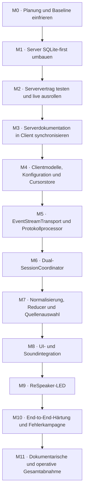

# AP07 – Implementierungsplan für das Feedback- und Eventsystem

> **Status:** verbindlicher Ausführungsfahrplan; M0–M9 abgenommen, M10 in Arbeit
> **Stand:** 9. August 2026  
> **Architekturvertrag:** `AP07_FEEDBACK_EVENTSYSTEM_GESAMTPLANUNG.md`  
> **Ziel:** vollständige Umsetzung in abgegrenzten, einzeln abnehmbaren Meilensteinen

## 1. Anwendung dieses Plans

Dieser Plan zerlegt AP07 in kleine Arbeitspakete. Er ist kein Auftrag, alle
Meilensteine in einer einzigen Sitzung ohne Zwischenabnahme umzusetzen.

Für jeden Meilenstein gilt:

1. Nur den ausdrücklich freigegebenen Meilenstein bearbeiten.
2. Pflichtlektüre nach den Regeln des jeweiligen Repositorys erneut lesen.
3. Iststand und betroffene Schnittstellen prüfen.
4. Relevante Baseline-Tests vor der ersten Codeänderung ausführen.
5. Den kleinsten vollständigen Änderungsschnitt implementieren.
6. Fokussierte Tests ergänzen und ausführen.
7. Die vollständige Regression des betroffenen Repositorys ausführen.
8. Dokumentation und Statusdateien synchronisieren.
9. Abnahmekriterien belegen und stoppen.

Ein späterer Meilenstein darf erst beginnen, wenn sein Eingangstor erfüllt ist.
Besonders wichtig: Die Clientimplementierung des zuverlässigen Eventstroms
beginnt nicht gegen einen nur angenommenen Serververtrag.

---

## 2. Gesamtfolge



Aktueller Fortschritt:

| Meilenstein | Status | Nachweis |
| --- | --- | --- |
| M0 | abgeschlossen | Server- und Clientbaseline grün |
| M1 | abgeschlossen | SQLite-first-Serverimplementierung und Regression abgenommen |
| M2 | abgeschlossen | produktiver Live-/SQLite-/Replay- und Zwei-Session-Nachweis |
| M3 | abgeschlossen | lokaler Serververtrag gegen Produktivstand geprüft |
| M4 | abgeschlossen | Clientmodelle, YAML-Mapping, Konfiguration und Cursorpersistenz; 285 Clienttests grün |
| M5 | abgeschlossen | isolierter EventStreamTransport und Protokollprocessor; 308 Clienttests grün |
| M6 | abgeschlossen | generationgebundener Dual-SessionCoordinator; 322 Clienttests grün |
| M7 | abgeschlossen | Normalisierung, Reducer, Replay und Fallback; 352 Clienttests grün |
| M8 | abgeschlossen | Qt-, Tray-, Overlay- und Soundintegration; 365 Clienttests grün |
| M9 | abgeschlossen | ReSpeaker-XVF3800-USB-LED-Adapter; 378 Clienttests grün |
| M10 | in Arbeit | Automatisierung, isolierte Serverkampagne, Build und Hardware-Smokes grün; gesprochene Bedien-/Langlaufmatrix offen |

Der detaillierte Abnahmenachweis liegt unter
`docs/2026-07-30_PROJEKT_EVENT_FEEDBACK_SYSTEM/zwischenstaende_bis_2026-08-01/2026-08-09_AP07_M0_BIS_M3_ABNAHME_ABSCHLUSSBERICHT.md`.

### Paketkennungen

| Kennung | Repository | Ergebnis |
| --- | --- | --- |
| AP07-S1 | Server | SQLite-first EventHub und Storezustand |
| AP07-S2 | Server | Protokollhärtung, Empty-Final und Produktivnachweis |
| AP07-C0 | Client | synchronisierter Serververtrag und Baseline |
| AP07-C1 | Client | Modelle, Konfiguration, Cursorpersistenz |
| AP07-C2 | Client | `/ws/logs`-Transport und Processor |
| AP07-C3 | Client | gemeinsamer Dual-Session-Lifecycle |
| AP07-C4 | Client | Feedback-Reducer, Replay und Fallback |
| AP07-C5 | Client | Qt-/Soundintegration |
| AP07-C6 | Client | ReSpeaker-LED-Adapter |
| AP07-C7 | beide | End-to-End-Härtung und Abschluss |

---

## 3. M0 – Planung, Quellen und Baselines einfrieren

### Ziel

Sicherstellen, dass Server- und Clientbearbeiter vom selben Zielbild und vom
nachweisbaren Iststand ausgehen.

### Schritte

1. Dieses Gesamtkonzept und diesen Implementierungsplan vollständig lesen.
2. In beiden Repositorys Arbeitsbaum, Branch/Commit und lokale Änderungen
   erfassen, ohne fremde Änderungen zu überschreiben.
3. Server:
   - Archiv-/Aktionsregeln lesen,
   - neue Aktion `sqlite_first_eventstream` registrieren,
   - datierten Serverplan und Soll-/Ist-Prüfpfad anlegen.
4. Client:
   - `AGENTS.md`, Dokumentationsordnung, Projektübersicht, Roadmap, Übergabe und
     `task.md` lesen,
   - den noch unsynchronisierten Serververtrag ausdrücklich als Blocker für
     Implementierung, nicht für Planung, markieren.
5. Relevante Servermodule und Tests vollständig lesen:
   - `VoiceSTT_server/event_logging.py`,
   - relevante Abschnitte aus `api_fastapi_server/server.py`,
   - `tests/unit/test_server_operations.py`,
   - relevante Logstream-/Lifecycle-Tests.
6. Bestehende Servergesamtsuite und `compileall` als Baseline ausführen.
7. Bestehende Clientgesamtsuite mit der Projekt-`venv` und `compileall` als
   Baseline ausführen.
8. Ergebnisse mit Datum, Commit/Dateistand und bekannten erwarteten Warnungen
   dokumentieren.

### Ausgangstor

- Beide Baselines sind grün oder jeder vorbestehende Fehler ist reproduzierbar
  und ausdrücklich abgegrenzt.
- Es gibt keine ungeklärten lokalen Änderungen in den konkret zu ändernden
  Dateien.
- Der Serveraktionsordner ist entsprechend den Serverregeln vorbereitet.

---

## 4. M1 / AP07-S1 – Server auf SQLite-first umbauen

### Ziel

SQLite wird zur einzigen kanonischen Quelle für jedes über `/ws/logs`
ausgelieferte normale Ereignis.

### 4.1 Store und Cursor

1. Cursorvergabe aus dem flüchtigen Hub entfernen.
2. `SQLiteEventStore.append()` als atomare Wahrheit verwenden:
   - Datensatz innerhalb einer Transaktion einfügen,
   - Commit erfolgreich abschließen,
   - erst danach den endgültigen Cursor zurückgeben.
3. Sicherstellen, dass ein fehlgeschlagener Commit keinen Cursor als committed
   veröffentlicht.
4. `latest_cursor()` ausschließlich aus committed Storezustand ableiten.
5. `oldest_cursor()` ergänzen, damit Retentionlücken prüfbar werden.
6. Verhalten bei leerem Store und nach Prozessneustart definieren.
7. Gleichzeitige Emits testen: eindeutige, monoton steigende committed Cursor.

### 4.2 EventHub

1. `StructuredEventHub.emit()` auf folgende Reihenfolge umstellen:
   - Envelope ohne endgültigen Cursor bilden,
   - Datenschutz und Schema anwenden,
   - synchron/atomar in SQLite committen,
   - committed Envelope mit Cursor erhalten,
   - Commit-Wakeup auslösen,
   - optionale Spiegel nachgelagert bedienen.
2. Den bisherigen unabhängigen Live-Payload-Publishpfad entfernen oder so
   ersetzen, dass er niemals kanonische Wahrheit ist.
3. Eventstore als zwingende Voraussetzung für `log_live_enabled=true`
   validieren.
4. Storezustände mindestens als `ready`, `degraded` und `recovering`/`ready`
   modellieren.
5. Storefehler entprellt und ohne rekursives Erzeugen weiterer nicht
   speicherbarer Events sichtbar machen.
6. Recovery testen: Der nächste erfolgreiche Commit darf den Store wieder
   `ready` setzen, ohne das verlorene Ereignis nachträglich zu erfinden.

### 4.3 Optionale Spiegel

1. JSONL und stdout erst nach Commit bedienen.
2. Ihre Queues und Dropzähler ausdrücklich als Spiegelzustand benennen.
3. Einen langsamen/defekten Spiegel simulieren.
4. Belegen, dass SQLite-Cursor, Replay und `/ws/logs` vollständig bleiben.
5. Keine `log.gap`-Meldung für einen reinen Spiegelverlust erzeugen.

### 4.4 Lastbegrenzung

1. Vorhandene Schalter für Performance- und Realtime-Detailereignisse prüfen.
2. Konfiguration `off|summary|events` vollständig validieren.
3. Belegen, dass deaktivierte Ereignisse gar nicht erzeugt werden.
4. Belegen, dass erzeugte Ereignisse nicht aufgrund ihrer Eventklasse eine
   schwächere Persistenz erhalten.

### Fokussierte Tests

- Commit erfolgt nachweisbar vor Subscriber-Sichtbarkeit.
- Commitfehler: kein normales Publish, Cursor unverändert, Store degradiert.
- parallele Emits: keine doppelten Cursor.
- Spiegelüberlast: Store und Eventstrom vollständig.
- Recovery: neue Ereignisse wieder committed und sichtbar.
- Konfigurationsfehler bei Live ohne Store.
- High-Watermark und ältester Cursor vor/nach Retention.

### Ausgangstor

- Alle fokussierten Tests grün.
- Servergesamtsuite und `compileall` grün.
- Soll-/Ist-Dokumentation beschreibt keine bekannte Abweichung unbewertet.

---

## 5. M2 / AP07-S2 – `/ws/logs`, Terminalität und Serverdeployment

### Ziel

Der externe Serververtrag wird lückenlos, messbar und produktiv verfügbar.

### 5.1 Logstream-Handshake

1. `log.hello` um Protokollversion, `deliveryMode=sqlite_first`,
   `replayAvailable`, `serverInstanceId`, `oldestCursor` und `latestCursor`
   ergänzen.
2. `hello.logAccess` entsprechend ergänzen.
3. Bei Storedegradation `available=false` mit maschinenlesbarem Grund liefern.
4. Sessiontoken weiterhin nur im Subscribe-Frame akzeptieren, nicht in URL.
5. Session- und Adminscoping unverändert absichern.

### 5.2 Replay und Live

1. Commit-Wakeup abonnieren, bevor der Replay-Wasserstand erfasst wird.
2. Replay seitenweise aus SQLite bis zum Wasserstand lesen.
3. Jedes Replayevent mit `replay=true` kennzeichnen.
4. `log.replay_completed` mit eindeutigem Wasserstand senden.
5. Livephase ausschließlich durch Nachlesen aus SQLite bedienen.
6. Scan-Cursor auch bei gefilterten, nicht sichtbaren globalen Cursorn
   fortschreiben.
7. Coalesced Wakeups, Keepalive und Ping/Pong testen.
8. Verbindungsabbruch an mehreren Replaypositionen simulieren.

### 5.3 Cursor- und Fehlerfälle

1. Negativen `afterCursor` eindeutig behandeln und dokumentieren.
2. `cursor_ahead` definieren und testen.
3. Retentionlücke mit `log.gap(reason=retention)` sichtbar machen.
4. Storeausfall bestehenden Subscribers mitteilen und Verbindung mit 1011
   kontrolliert schließen.
5. Nach Recovery neue Subscription und Replay testen.
6. Globalen Cursor mit Session-/Channelfiltern testen; Sprünge sind kein Gap.

### 5.4 Leerer Finaltext

1. Den bisherigen `continue`-Pfad in der Textworker-Schleife ersetzen.
2. Eine dedizierte generationgebundene Abschlussroutine erstellen.
3. Segment genau einmal finalisieren.
4. `transcription.discarded(reason=empty_final)` erzeugen.
5. Kein leeres Finaltextframe senden.
6. Realtime-Zusammenfassung und wartenden Sessionzustand sauber abschließen.
7. Doppelterminalität, alte Generation und Disconnectrennen testen.

### 5.5 Aktive Serverdokumentation

Mindestens synchronisieren:

- `docs/structured-logging.md`,
- `docs/client-development/README.md`,
- WebSocketprotokoll,
- Eventkurzreferenz,
- Eventkatalog/Chronologie,
- HTTP/Auth,
- Robustheit/Sicherheit,
- Konfiguration und gegebenenfalls Release Notes.

Die Dokumentation muss den Produktivcode beschreiben, keine zukünftige Absicht.

### 5.6 Deployment und Liveabnahme

1. Geänderten Serverstand kontrolliert deployen.
2. Laufenden Commit/Image-/Containerstand nachweisen.
3. `/health` und Loggingstatus prüfen.
4. Eine echte Session öffnen und `hello.logAccess` prüfen.
5. `/ws/logs` abonnieren und ein reales Transkriptionsereignis auslösen.
6. Für dasselbe Event SQLite-Eintrag, Cursor und Liveausgabe korrelieren.
7. Verbindung trennen und Replay ab vorherigem Cursor prüfen.
8. Sessionfilterung mit mindestens zwei Sessions testen.
9. Storeausfall soweit sicher über kontrollierte Fehlerinjektion oder
   Integrationstest belegen; keine produktiven Daten gefährden.
10. Keine Tokens, Secrets oder Transkriptinhalte im Bericht ausgeben.

### Ausgangstor

- Servergesamtsuite und `compileall` grün.
- Produktivserver meldet den neuen Vertrag.
- SQLite-first-Reihenfolge und Replay sind live belegt.
- Aktive Serverdokumentation ist abgeschlossen.
- Verbleibende Abweichungen sind ausdrücklich akzeptiert oder blockieren M3.

---

## 6. M3 / AP07-C0 – Kanonischen Serververtrag in den Client übernehmen

### Ziel

Der Client implementiert ausschließlich gegen eine lokale, verbindliche und
verifizierte Kopie des tatsächlich ausgerollten Serververtrags.

### Schritte

1. Produktive Serverversion/Commit mit den aktiven Serverdocs abgleichen.
2. Vollständiges `docs/client-development/`-Paket aus dem Serverrepository nach
   `server-docs-for-client-development/` synchronisieren.
3. Keine manuellen Mischstände einzelner Seiten erzeugen.
4. README-Stand, Protokollversion und Logstreamseiten prüfen.
5. Mit `rg` sicherstellen, dass `/ws/logs`, `logAccess`, `sqlite_first`,
   Replay, Gap, Cursor und `transcription.discarded` dokumentiert sind.
6. Client-Gesamtplanung gegen den finalen Vertrag vergleichen.
7. Nur echte unvermeidbare Abweichungen dokumentieren; keine stillen
   Architekturänderungen vornehmen.
8. Clientbaseline mit der Projekt-`venv` erneut ausführen.

### Ausgangstor

- `server-docs-for-client-development/` entspricht dem Livevertrag.
- Alle für M4–M7 benötigten Felder und Fehlerfälle sind dokumentiert.
- Clientbaseline ist grün.

---

## 7. M4 / AP07-C1 – Clientmodelle, Konfiguration und Cursorpersistenz

### Ziel

Stabile transportneutrale Grundlagen schaffen, ohne bereits eine zweite
WebSocketverbindung in den Controller zu integrieren.

### 7.1 Modelle

1. Immutable/defensive Modelle für Event-Envelope, Logkontrollnachrichten,
   Verbindungsstatus und normalisierte Feedbackereignisse definieren.
2. Orthogonale Enums für:
   - Eventverbindungszustand,
   - Feedbackquelle,
   - Live/Replay-Ursprung,
   - Dauerzustand und Impulsart.
3. Pflicht-/Optionalfelder exakt aus dem Serververtrag übernehmen.
4. Unbekannte zusätzliche Daten tolerant erhalten oder ignorieren.
5. Keine UI-Typen in Coremodellen verwenden.
6. Kanonische Ereignisschlüssel mit getrennten Namespaces für `server.*` und
   `client.*` sowie transportneutrale Ausgabebeschreibungen für `led`,
   `sound` und `app` definieren.

### 7.2 Konfiguration

1. `core/config.py` um typisierte Eventstream- und Feedbackparameter ergänzen.
2. URL aus bestätigtem `websocketPath` und sicherer Serverbasis bilden.
3. Bounds für Timeouts, Queuegrößen und Nachrichtengröße validieren.
4. `core/settings_metadata.py` nur für tatsächlich benutzerrelevante Optionen
   erweitern.
5. Per-user Override, Kandidatenvalidierung und Rollbackpfad testen.
6. Tokens ausdrücklich von Persistenz und Logging ausschließen.
7. In der bestehenden `config.yaml` einen versionierten, typisierten
   `feedback_mappings`-Abschnitt einführen. Jeder bekannte kanonische
   Server- oder Clientereignistyp kann dort null bis drei unabhängige
   Wirkungen (`led`, `sound`, `app`) erhalten.
8. Nur bekannte Effekt-, Cue- und In-App-Aktions-IDs zulassen. Freie
   Python-Aufrufe, Pluginimporte und Stringsuche in Logmeldungen sind keine
   gültige Mappingsemantik.
9. Projektdefaults und per-user Overrides vollständig validieren; ein
   fehlerhaftes Mapping darf nicht teilweise übernommen werden.

### 7.3 Cursorstore

1. Kleinen `EventCursorStore` im lokalen Anwendungsdatenverzeichnis anlegen.
2. Daten mindestens an Endpoint/Serverkennung und Protokollversion binden.
3. Atomare Speicherung über temporäre Datei plus `os.replace` oder eine
   gleichwertig sichere bestehende Persistenztechnik verwenden.
4. Erst nach erfolgreicher normalisierter Verarbeitung committen.
5. Korrupte Datei, unbekannte Version, Cursor < 0 und Cursor-ahead sicher
   behandeln.
6. Threadzugriff auf die bestehende Coregrenze begrenzen.

### Voraussichtlich betroffene Dateien

- `core/config.py`
- `core/settings_metadata.py`
- neue fokussierte Module, zum Beispiel `core/event_models.py` und
  `core/event_cursor_store.py`
- `config.yaml`
- `tests/test_config.py`
- neue `tests/test_event_models.py` und `tests/test_event_cursor_store.py`
- neue `tests/test_feedback_mapping.py`

### Ausgangstor

- [x] Modelle und Persistenz sind ohne Netzwerk vollständig getestet.
- [x] Das YAML-Mapping deckt Server- und lokale Clientereignisse ab und lehnt
  unbekannte Ereignis-/Wirkungs-IDs deterministisch ab.
- [x] Bestehende Konfigurations- und Gesamttests bleiben grün.
- [x] Keine UI- oder WebSocketkopplung wurde vorweggenommen.

**Abnahme am 9. August 2026:** 32 fokussierte Modell-, Mapping-,
Konfigurations- und Cursorstore-Tests sowie die vollständige Suite mit 285
Tests sind erfolgreich; `compileall` über Anwendung, Core, UI, Skripte und
Tests ist grün. Damit ist das Eingangstor für M5 erfüllt.

---

## 8. M5 / AP07-C2 – EventStreamTransport und Protokollprocessor

### Ziel

`/ws/logs` kann isoliert verbunden, validiert, replayt und wiederverbunden
werden, ohne UI oder fachliche Feedbackwirkung.

### 8.1 Transport

1. Neues Transportmodul nach dem Stil von `core/stt_session.py` anlegen, ohne
   Audio- oder Textlogik zu kopieren.
2. Lifecycle `connect → hello/subscribe → replay → live → reconnect → stop`
   implementieren.
3. Subscribe-Token ausschließlich als erste JSON-Nachricht senden.
4. Textframes, maximale Nachrichtengröße und ungültige Binärframes behandeln.
5. Ping/Pong und Keepalive überwachen.
6. Reconnectbackoff an vorhandene AP5-Prinzipien angleichen, aber
   Eventverbindung und Transkriptionsverbindung getrennt abbrechbar halten.
7. `stop()` idempotent und cancellation-sicher machen.

### 8.2 Processor

1. Alle dokumentierten `log.*`-Nachrichtentypen streng validieren.
2. Protokollversion und `deliveryMode` prüfen.
3. `serverInstanceId`, Sessionbindung und Wasserstände speichern.
4. Replayevents und Liveevents getrennt ausgeben.
5. `eventId`-Deduplizierung begrenzt halten.
6. Globalen Cursor nicht auf Lückenlosigkeit pro Filter prüfen.
7. Retentiongap, Cursor-ahead, Storefehler und Authfehler in typisierte
   Ergebnisse übersetzen.
8. Cursor erst nach Bestätigung durch den nachfolgenden Verarbeitungsweg
   persistieren.

### 8.3 Isolierte Integrationstests

Mit einem deterministischen Fake-WebSocket/Testsserver prüfen:

- normaler Handshake, leerer Replay, Liveevent,
- mehrseitiger Replay und Liveübergang ohne Lücke,
- Disconnect vor/während/nach `log.replay_completed`,
- doppelte Events,
- globale Cursorsprünge durch Filter,
- Retentiongap und Cursor-ahead,
- Store-unavailable und Close 1011,
- ungültiges JSON, falsche Typen, unbekannte Frames, Oversize,
- Tokenablauf und Sessionwechsel,
- Shutdown während Connect, Replay und Backoff,
- keine verlorenen Tasks oder nicht abgeholten Exceptions.

### Voraussichtlich betroffene Dateien

- neue `core/event_stream.py`
- neue `core/event_protocol.py`
- Cursor-/Modellmodule aus M4
- neue `tests/test_event_stream.py`
- neue `tests/test_event_protocol.py`

### Ausgangstor

- [x] Transport ist isoliert vollständig testbar.
- [x] Es gibt noch keine direkte Qt-, Sound- oder LED-Abhängigkeit.
- [x] Vollständige Clientregression und `compileall` sind grün.

**Abnahme am 9. August 2026:** 23 fokussierte Transport-/Protokolltests
einschließlich Warnungsprüfung sowie die vollständige Suite mit 308 Tests sind
erfolgreich. `compileall` über Anwendung, Core, UI, Skripte und Tests ist grün.
Damit ist das Eingangstor für M6 erfüllt.

---

## 9. M6 / AP07-C3 – Gemeinsamer Dual-SessionCoordinator

### Ziel

Beide Verbindungen gehören zu einer einzigen aktuellen Clientgeneration und
werden gemeinsam kontrolliert, ohne den bestehenden STT-Core neu zu bauen.

### Schritte

1. Bestehenden `STTController`- und `STTSession`-Lifecycle erneut vollständig
   lesen.
2. Kleinste geeignete Integrationsgrenze bestimmen:
   - Coordinator im Controller,
   - oder dediziertes Modul, das vom Controller besessen wird.
3. `SessionContext` mit Generation, `sessionId`, `logAccess`, Eventstatus und
   Tokenablauf einführen.
4. Nach gültigem Transkriptions-`hello` den Logzugang übernehmen.
5. Eventstream nur für dieselbe aktuelle Session starten.
6. Bei Transkriptionsreconnect:
   - alte Logsession stoppen,
   - alte Tokens/Events invalidieren,
   - neuen Handshake abwarten,
   - Eventstream neu abonnieren.
7. Eventstreamreconnect unabhängig erlauben, solange Session und Token noch
   gültig sind.
8. Tokenablauf und Server-`available=false` behandeln.
9. Gemeinsamen Shutdown so erweitern, dass beide Transporte exakt einmal
   beendet werden.
10. Bestehende Audio-, Start-, Stop-, Finaltext- und Injectionpfade unverändert
    weiterführen.

### Race-/Lifecycle-Tests

- Logzugang trifft nach bereits ersetzter Generation ein.
- STT reconnectet, während Logstream replayt.
- Logstream reconnectet, während ein Diktat läuft.
- Shutdown während doppeltem Connect.
- Konfigurationswechsel Hotkey/Wake Word erzeugt neue Session und neues Token.
- Altes Liveevent nach Sessionwechsel wird verworfen.
- Eventstreamfehler beendet nicht den STT-Runloop.
- STT-Fehler beendet das laufende Diktat weiterhin gemäß AP5.
- Start/Stop-Zähler und Taskanzahl bleiben deterministisch.

### Voraussichtlich betroffene Dateien

- `core/controller.py`
- `core/stt_session.py` nur bei nachweislich nötiger Handshakegrenze
- neues `core/session_coordinator.py` oder eng begrenzte Controllerergänzung
- `app.py`
- `tests/test_controller.py`
- `tests/test_stt_session.py`
- `tests/test_app.py`
- neue Coordinator-Tests

### Ausgangstor

- Dual-Lifecycle ist automatisiert race-sicher.
- Der bestehende Corevertrag und alle 264 Altprüfungen bleiben grün.
- Noch keine doppelte Feedbackwirkung ist an UI angebunden.

**Abnahme am 9. August 2026:** Ein dediziertes, vom `STTController` besessenes
Modul koordiniert genau eine Eventverbindung mit der aktuellen
Transkriptionsgeneration. 14 neue M6-Prüfungen decken Session-/Tokenbindung,
STT-Reconnect während Replay, unabhängige Event-Reconnectzustände,
`available=false`, Tokenablauf, stale und In-Flight-Events, doppelten Connect,
isolierte Eventfehler und idempotenten gemeinsamen Shutdown ab. 59 relevante
Prüfungen waren zusätzlich mit `-W error` grün; die vollständige Suite bestand
322 Tests. `compileall` über Anwendung, Core, UI und Tests ist grün. Der
bestehende Audio-, Finaltext-, Historien- und Injectionpfad wurde nicht
verändert. Damit ist das Eingangstor für M7 erfüllt.

---

## 10. M7 / AP07-C4 – Normalisierung, Reducer, Replay und Fallback

### Ziel

Aus technischen Nachrichten entsteht genau eine konsistente fachliche
Feedbackwahrheit.

### 10.1 Normalisierung

1. Servereventnamen in stabile interne Ereignisse abbilden.
2. Lokale Coretatsachen in dasselbe interne Modell überführen.
3. Eventidentität und fachliche Korrelation implementieren.
4. Alte Session-/Generation-/Transkriptionsidentitäten verwerfen.
5. Keine menschenlesbaren Messagefelder auswerten.
6. Server- und lokale Clienttatsachen auf die in M4 definierten kanonischen
   `server.*`-/`client.*`-Schlüssel abbilden.

### 10.2 Reducer

1. Reinen, deterministischen Reducer ohne I/O implementieren.
2. Dauerzustand und Impulse getrennt zurückgeben.
3. Quellenauswahl `EVENT_STREAM`, `STT_FALLBACK`, `LOCAL_ONLY` modellieren.
4. Prioritäten lokaler Geräte-/Injectionfehler gegenüber Serverzuständen
   festlegen.
5. Unbekannte Events begrenzt ignorieren.
6. Nach der fachlichen Reducerentscheidung die konfigurierte Mappingwirkung
   auflösen; keine LED-, Sound- oder In-App-Zuordnung im Reducercode
   festverdrahten.

### 10.3 Live-/Replaypolicy

1. Replay darf Dauerzustände aktualisieren.
2. Replay darf keine Impulse erzeugen.
3. `log.replay_completed` veröffentlicht den rekonstruierten Zustand atomar.
4. Liveevent erzeugt höchstens einen Impuls.
5. Doppeltes `eventId` und semantisches Duplikat erzeugen keinen zweiten
   Impuls.

### 10.4 Fallbackpolicy

1. Kleine erlaubte Fallback-Mappingtabelle aus vorhandenen
   `/ws/transcribe`-Timeline-/Statusereignissen definieren.
2. Fallback nur aktivieren, wenn Eventstream nicht `LIVE` und der Grund
   klassifiziert ist.
3. Während Eventreplay Fallback weiterverwenden.
4. Nach Replay atomar auf Eventstream umschalten.
5. Nachgelieferte Fallback-Duplikate unterdrücken.
6. Bei Ausfall beider Verbindungen nur lokale Zustände anzeigen.

### Testmatrix

- vollständiger normaler Lebenszyklus Hotkey,
- vollständiger normaler Lebenszyklus Wake Word,
- Replay eines bereits abgeschlossenen Vorgangs,
- Replay eines zum Disconnectzeitpunkt laufenden Vorgangs,
- Liveevent unmittelbar am Replay-Wasserstand,
- Eventstreamausfall vor Aufnahme, während Aufnahme und während Finalisierung,
- Recovery mit nachgeliefertem gleichen Ereignis,
- Retentiongap mit sichtbarer Unsicherheit,
- leerer Finaltext/`transcription.discarded`,
- Serverfehler plus lokaler Mikrofonfehler,
- Pastefehler nach erfolgreicher Transkription,
- unbekanntes Event und ungültiges Pflichtfeld,
- 10.000+ sequentielle Events ohne unbeschränktes Deduplizierungswachstum.

### Voraussichtlich betroffene Dateien

- neue `core/feedback_models.py`
- neue `core/feedback_reducer.py`
- neue `core/event_normalizer.py`
- `core/controller.py`
- vorhandenes `ui/feedback.py` erst über neutrale Ausgaben, nicht als Reducer
- neue fokussierte Tests

### Ausgangstor

- Die Ein-Quellen-Regel ist durch Tests belegt.
- Replay erzeugt nachweislich keine Impulse.
- Fallback/Recovery erzeugt keine Doppelwirkung.
- Vollständige Clientregression ist grün.

**Abnahme am 9. August 2026:** Die exakten strukturierten Serverevents und
lokalen Clienttatsachen werden strikt in ein gemeinsames kanonisches Modell
normalisiert. Der reine Reducer trennt Dauerzustand und Impuls, behandelt
Replay impulsfrei, wählt genau eine Serverquelle und führt den begrenzten
STT-Fallback bei Recovery ohne Doppelwirkung zurück. Event-ID- und semantische
Deduplizierung sowie der Katalog unbekannter Events sind speicherbegrenzt; der
zustandsbehaftete Orchestrator serialisiert parallele Eingaben. Die Wirkung
wird ausschließlich über das typisierte YAML-Mapping aufgelöst. 30 fokussierte
M7-Tests, 183 relevante Prüfungen mit `-W error`, die vollständige Suite mit
352 Tests sowie `compileall` und `git diff --check` sind grün. Damit ist das
Eingangstor für M8 erfüllt.

---

## 11. M8 / AP07-C5 – Qt-, Tray-, Overlay- und Soundintegration

### Ziel

Der neue fachliche Zustand wird sichtbar und hörbar, ohne Transportdetails in
die UI zu tragen.

### Schritte

1. Bestehende `ui/core_bridge.py`, `ui/presentation.py`, `ui/feedback.py`,
   Tray- und Overlaygrenzen vollständig lesen.
2. Neue Reducerausgaben über Qt-Signale in den Main Thread übertragen.
3. Vorhandenes Farbkonzept bewahren:
   - Hotkey grün,
   - Wake Word blau,
   - weißer Rand für Sprachwartephase,
   - Gelb für äußere Störung,
   - Rot für tatsächlichen Fehler.
4. Eventstreamdegradation als technische Nebeninformation integrieren, ohne
   den Modusstatus zu verfälschen.
5. Soundpolicy auf normalisierte Impulse umstellen.
6. Sound- und In-App-Wirkungen ausschließlich aus dem in M4 typisierten
   YAML-Mapping konsumieren; lokale Clientereignisse sind dabei gleichwertige
   Eingaben neben Serverereignissen.
7. Sicherstellen, dass die alten Timeline-/Statussignale im Normalbetrieb
   keine parallelen Sounds mehr auslösen.
8. Soundfehler abfangen und begrenzen.
9. Einstellungsdialog nur um notwendige Optionen erweitern.
10. Headless-Modus ohne Qt-/Soundzwang erhalten.

### Tests

- Qt-Signale nur im Main Thread verarbeitet.
- Jeder Liveimpuls erzeugt höchstens einen Soundauftrag.
- Replay erzeugt keinen Soundauftrag.
- Fallback und Rückkehr erzeugen keine Doppelaufträge.
- Eventstreamstatus verändert nicht fälschlich Diktat-/Betriebsmodusfarbe.
- Sound deaktiviert/Asset fehlt/Backendfehler bleiben nicht fatal.
- Tray, Overlay, Einstellungen und Headless-Start regressionsfrei.

### Voraussichtlich betroffene Dateien

- `ui/core_bridge.py`
- `ui/presentation.py`
- `ui/feedback.py`
- `ui/tray.py`
- `ui/overlay.py`
- `ui/settings_dialog.py`
- `ui/application.py`
- entsprechende UI- und Bridge-Tests

### Ausgangstor

- Offscreen-Qt-Tests grün.
- Bestehendes Farb-/Bedienkonzept bleibt erhalten.
- Ein manueller Lauf ohne LED zeigt korrekte Zustände und Sounds.

**Abnahme am 9. August 2026:** Reducerausgaben werden über ein eigenes queued
Qt-Signal ausschließlich im Main Thread verarbeitet. Das aufgelöste
`app.action` steuert Tray und Overlay, ohne das bestehende grün/blaue
Betriebsmoduskonzept zu überschreiben; Eventstreamdegradation erscheint als
technische Zusatzinformation. Sounds werden nur aus `sound.cue` und den sieben
konfigurierbaren Assetpfaden erzeugt. Replay, unveröffentlichte Entscheidungen
und alte Command-Completion-Signale erzeugen keinen Soundauftrag. Fehlende
Assets und Backendfehler bleiben nicht fatal, werden begrenzt und als lokales
`client.sound.failed` wieder in den Reducer geführt. 13 neue M8-Prüfungen, 232
relevante Prüfungen mit `-W error`, die vollständige Suite mit 365 Tests,
`compileall`, `git diff --check`, Offscreen-Qt-Zustandsprüfungen und ein realer
Qt-Soundbackend-Smoke mit einem lokalen Windows-WAV sind grün. Damit ist das
Eingangstor für M9 erfüllt.

---

## 12. M9 / AP07-C6 – ReSpeaker-LED als isolierter Ausgabeadapter

### Ziel

Der LED-Ring visualisiert normalisierte Zustände und Impulse, ohne eine neue
fachliche Zustandsmaschine oder eine harte Hardwareabhängigkeit einzuführen.

### 12.1 Hardware-Spike

1. Tatsächliches ReSpeaker-Modell, USB-/HID-Schnittstelle und vorhandene
   Treiber auf dem Zielsystem feststellen.
2. Minimalen read-only beziehungsweise ungefährlichen LED-Smoke durchführen.
3. Geeignete Bibliothek hinsichtlich Python 3.12, Lizenz, Wartbarkeit und
   Shutdown prüfen.
4. Ergebnis als kurze technische Entscheidung dokumentieren.
5. Keine allgemeine Audio-Hot-Plug-Lösung aus AP08 vorwegnehmen.

### 12.2 Adapter

1. Kleine abstrakte LED-Schnittstelle definieren.
2. ReSpeaker-Implementierung und `NullLedAdapter` bereitstellen.
3. Dauerzustand und Kurzzeitoverlay getrennt darstellen.
4. Letzten Dauerzustand nach einem Impuls wiederherstellen.
5. Updates koaleszieren; keine unbeschränkte Hardwarequeue.
6. Gerätefehler drosseln und lokalen `LED_UNAVAILABLE`-Zustand melden.
7. Shutdown setzt einen sicheren Endzustand und blockiert nicht.

### 12.3 Mapping

1. Den LED-Kanal des in M4 eingeführten YAML-Mappings konsumieren; keine
   zweite fest verdrahtete LED-Mappingtabelle anlegen.
2. Die konfigurierten Effekt-IDs an das bestehende UI-Farbkonzept angleichen.
3. Aufnahme, Wakeword, Finalisierung, Störung und Fehler eindeutig, aber nicht
   alarmistisch unterscheiden.
4. Replay rekonstruiert nur Dauerzustand.
5. Liveimpulse dürfen kurz überlagern.
6. Lokale TTS-/Injection-/Geräteprioritäten bleiben Teil derselben
   namespaceten Mapping- und Reducerpolicy.

### Tests und manuelle Abnahme

- Fake-Adapter: Reihenfolge, Koaleszierung, Overlayrückkehr, Shutdown.
- Hardware fehlt beim Start.
- Hardware wird während Lauf unzugänglich.
- Adapter wirft wiederholt Fehler, Core bleibt stabil.
- Replay erzeugt keine alte Lichtanimation.
- realer LED-Smoke für jeden Dauerzustand und mindestens einen Impuls.

### Ausgangstor

- Client funktioniert vollständig mit und ohne ReSpeaker.
- Hardwarefehler bleiben isoliert.
- Manuelle Hardwarematrix und Lizenzquelle sind dokumentiert.

**Abnahme am 9. August 2026:** Das Zielgerät wurde als ReSpeaker XVF3800 mit
`VID_2886/PID_001A`, Control-Interface 3 und Firmware `2.0.10` nachgewiesen.
Der eigene minimale USB-Adapter konsumiert ausschließlich den konfigurierten
`led`-Kanal, während ein einzelner Worker Updates koalesziert, Livepulse
überlagert, den letzten Dauerzustand wiederherstellt und zeitlich begrenzt mit
`off` beendet. Fehlendes oder während der Laufzeit verlorenes Gerät bleibt
isoliert und wird gedrosselt als `client.led.unavailable` gemeldet; Replay
erzeugt weder alten Sound noch alte Lichtpulse. 13 neue M9-Prüfungen, 254
relevante Prüfungen mit `-W error`, die vollständige Suite mit 378 Tests,
`compileall` und `git diff --check` sind grün. Der reale Hardware-Smoke deckte
sechs Dauerzustände und `success_pulse → recording → off` ab. Der
PyInstaller-Onefile-Build enthält PyUSB/libusb und bestand den Versions-Smoke
(74.752.880 Byte, SHA-256
`7ff28d7851d6b1aa42569c4aab3fb733aabd4f9b2c63569f60aca5faaf6c4c08`).
Die technische Entscheidung und Lizenzquellen stehen in
`docs/decisions/ADR-003_RESPEAKER_XVF3800_USB_LED_ADAPTER.md`. Damit ist das
Eingangstor für M10 erfüllt.

---

## 13. M10 / AP07-C7 – End-to-End-Härtung und Fehlerkampagne

### Ziel

Das Gesamtsystem unter realistischen Ausfällen, Last und Reconnects beweisen.

### 13.1 Automatisierte Gesamttests

1. Vollständige Servertestsuite.
2. Server-`compileall`.
3. Vollständige Clienttestsuite über `.\venv\Scripts\python.exe`.
4. Client-`compileall` über `app.py`, `core/`, `ui/` und `tests/`.
5. ResourceWarnings und hängende Tasks für neue fokussierte Tests als Fehler
   behandeln.
6. Testlauf wiederholen, um Reihenfolge-/Race-Flakiness zu erkennen.

### 13.2 Reale Ablaufmatrix

Mindestens:

1. Hotkey: Start → Aufnahme → Realtime → Final → Historie → Paste.
2. Wake Word: Erkennung → Aufnahme → Finalisierung → Follow-up.
3. Eventstreamdisconnect bei Idle, Aufnahme und Finalisierung.
4. Reconnect mit Replay und genau einem sichtbaren Impuls.
5. Eventstoredegradation/Fault-Injection → Fallback → Recovery → Replay → Live.
6. Transkriptionsdisconnect: Diktat endgültig beendet, kein Audio-Replay.
7. Wechsel Hotkey ↔ Wake Word mit jeweils neuem Logtoken.
8. langer Lauf mit hoher Realtime-Aktivität und aktivierter sinnvoller
   Ereignisbegrenzung.
9. Serverprozessneustart mit persistentem Store und neuem `serverInstanceId`.
10. Retentionlücke und ehrliche Benutzer-/Diagnoseanzeige.
11. leeres Finalergebnis mit terminalem `discarded`-Event.
12. Clientstart ohne ReSpeaker und mit defektem Soundasset.
13. sauberer Shutdown während Replay und während Reconnectbackoff.

### 13.3 Mess- und Abnahmepunkte

- kein normales Liveevent ohne SQLite-Nachweis,
- keine Doppelimpulse,
- keine alten Replayimpulse,
- keine unbeschränkt wachsenden Queues oder Deduplizierungssets,
- kein UI-Zugriff aus dem Core-Thread,
- keine Token-/Transcriptleaks in Logs,
- keine verwaisten Threads oder Tasks,
- Audio-/Realtime-/Finaltextlatenz durch den zweiten WebSocket nicht
  wesentlich verschlechtert,
- Eventstream kann nach Rückstand vollständig aus dem Store aufholen.

### Nachweisstand 9. August 2026

- Clientgesamtsuite zweimal mit 396 Tests, fokussierte AP07-/Reconnect-Suite
  mit 227 Tests und `-W error` grün.
- Servergesamtsuite zweimal mit 379 Tests, 13 Skips und 78 Subtests grün.
- Storedegradation, Retention, Replay/WebSocket und persistenter Neustart über
  zwei echte Betriebssystemprozesse in einer isolierten lokalen Instanz grün.
- ReSpeaker-Effektpfad real bis zum abschließenden `off`, Adapterfehlerpfade
  und PyInstaller-Onefile-Build einschließlich Prozessabschluss grün.
- Noch offen: gesprochene Hotkey-/Wake-Word-Abläufe, sichtbarer STT-Disconnect,
  stilles Final und längere Latenz-/Ressourcenbeobachtung.

### Ausgangstor

- Alle automatisierten und vorgeschriebenen manuellen Prüfungen bestanden.
- Jede Abweichung ist belegt, minimal und ausdrücklich akzeptiert.
- Keine kritische offene Lücke in Persistenz, Replay, Fallback oder Shutdown.

---

## 14. M11 – Dokumentarische und operative Gesamtabnahme

### Ziel

Der implementierte Stand ist ohne Chatkontext reproduzierbar und der nächste
Bearbeiter findet genau eine aktuelle Wahrheit.

### Schritte

1. Server:
   - Aktionsregister auf `Abgeschlossen` setzen,
   - Implementierungsvergleich und gegebenenfalls Abweichungsdokument
     abschließen,
   - aktive Fachdocs und Release Notes synchronisieren.
2. Client:
   - `docs/IMPLEMENTATION_ROADMAP.md` auf tatsächlichen AP07-Status setzen,
   - `docs/PROJEKTUEBERSICHT.md` aktualisieren,
   - `task.md` mit Tests, manuellen Restpunkten und Status aktualisieren,
   - `ÜBERGABE.md` mit Start, Konfiguration, Protokoll und Diagnose aktualisieren,
   - README nur bei benutzerrelevanten Start-/Installationsänderungen ändern.
3. Paketvertrag und Implementierungsplan mit dem tatsächlichen Ergebnis
   abgleichen; unerfüllte Kriterien nicht als erledigt markieren.
4. Dateilinks und Querverweise automatisiert prüfen.
5. Laufzeitdaten, Tokens, Logs, SQLite-Dateien und Hardwarediagnosen auf
   Repositorysicherheit prüfen.
6. Finalen Teststand mit exakten Befehlen und Ergebnissen dokumentieren.
7. AP07 erst dann als `[ABGESCHLOSSEN]` markieren.
8. Nach Abschluss stoppen; AP08 nicht automatisch beginnen.

### Endzustand

- Server und Client laufen mit dem dokumentierten Dual-WebSocket-Vertrag.
- `/ws/logs` ist im Normalbetrieb die einzige serverseitige Feedbackquelle.
- SQLite-first, Replay, Fallback, Sound und LED sind belegt.
- Alte AP07-Zwischenstände bleiben nur als historischer Nachweis erhalten.
- AP08 „Härtung und Polish“ ist der nächste getrennte Paketblock.

---

## 15. Durchgängige Test- und Qualitätsregeln

Diese Regeln gelten in jedem Meilenstein:

- Kein Test wird nur gelöscht oder abgeschwächt, weil er einen echten
  Vertragsbruch sichtbar macht.
- Ersetzte Best-Effort-Erwartungen werden durch neue SQLite-first-Erwartungen
  ersetzt und begründet.
- Zeitkritische Nebenläufigkeitstests verwenden Events/Barrieren statt
  willkürlicher Sleeps.
- Netzwerk- und Hardwaretests besitzen Fakes für deterministische Unit-Tests;
  reale Smokes ergänzen, ersetzen sie aber nicht.
- Testdatenbanken und temporäre Cursorstores liegen in Testverzeichnissen, nie
  im Repository oder echten lokalen Anwendungsdatenverzeichnis.
- `.env`, Zugangstoken und Transcriptinhalte werden nicht ausgegeben.
- Keine fachfremden Refactorings in demselben Paket verstecken.
- Bei Fehlern iterativ debuggen, bis fokussierte und vollständige Regression
  grün sind.

---

## 16. Fortschrittsvorlage pro Meilenstein

Für jede Übergabe wird knapp dokumentiert:

```text
Meilenstein:
Status:
Ausgangscommit/-stand:
Geänderte Dateien:
Erfüllte Schritte:
Fokussierte Tests:
Gesamttests:
Compileall:
Manuelle/Live-Prüfungen:
Bekannte Abweichungen:
Offene Abnahmekriterien:
Nächster zulässiger Meilenstein:
```

Ein Meilenstein mit offenen Pflichtkriterien ist `[BLOCKIERT]` oder
`[IN ARBEIT]`, nicht abgeschlossen.
