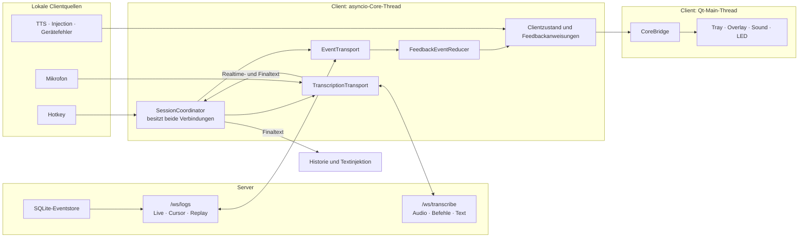

# Einfacher Clientaufbau mit zwei WebSocket-Verbindungen

> **Datum:** 1. August 2026  
> **Status:** einfache, nicht bindende Architekturübersicht  
> **Zweck:** schnell verständliche Grundlage für die spätere Clientplanung

## 1. Grundidee in einem Satz

Der Client verwendet zwei getrennte WebSockets:

```text
/ws/transcribe = Audio und Text
/ws/logs       = zuverlässige serverseitige Ereignisse und Feedback
```

Beide Verbindungen gehören immer zu derselben STT-Session und werden an einer gemeinsamen Stelle im Client verwaltet.

---

## 2. Der gesamte Aufbau



---

## 3. Aufgabe der ersten Verbindung

### `/ws/transcribe`

Diese Verbindung transportiert:

- Mikrofon-Audio zum Server,
- `start`, `stop`, `clear` und `ping`,
- Realtime-Text,
- Finaltext,
- unmittelbare technische Sessionfehler.

Sie ist die Wahrheit für Audio, Text und die technische Funktionsfähigkeit der Transkriptionssession.

Sie löst im Normalbetrieb nicht parallel dieselben Sounds und LED-Effekte aus wie der Eventstream.

---

## 4. Aufgabe der zweiten Verbindung

### `/ws/logs`

Diese Verbindung transportiert kleine strukturierte Ereignisse:

- Wake Word erkannt,
- Aufnahme begonnen,
- Aufnahme beendet,
- Transkription begonnen,
- Transkription abgeschlossen,
- Transkription fehlgeschlagen,
- Transkription abgelehnt oder abgebrochen,
- Follow-up-Fenster begonnen oder beendet.

Jedes normale Event ist bereits in SQLite gespeichert. Dadurch kann es nach einer Unterbrechung über seinen Cursor erneut abgerufen werden.

Diese Verbindung ist im Normalbetrieb die Hauptquelle für serverseitige Sounds, LED-Zustände und andere Feedbackreaktionen.

---

## 5. Die gemeinsame Sessionverwaltung

Der `SessionCoordinator` besitzt beide Verbindungen und hält ihren gemeinsamen Kontext:

```text
SessionContext
    generation
    sessionId
    logAccessToken
    lastProcessedCursor
    transcriptionTransportState
    eventTransportState
```

Der Ablauf beim Verbindungsaufbau:

```text
1. /ws/transcribe verbinden
2. hello empfangen
3. sessionId und logAccess übernehmen
4. /ws/logs für dieselbe sessionId verbinden
5. Replay bis zum aktuellen Cursor durchführen
6. Eventstream wird LIVE
7. serverseitiges Feedback kommt jetzt ausschließlich aus /ws/logs
```

Bei einer neuen `/ws/transcribe`-Verbindung entsteht eine neue Sessiongeneration. Alte Logevents dürfen den Zustand dieser neuen Session nicht verändern.

---

## 6. Genau eine Feedbackquelle zur selben Zeit

Beide WebSockets können denselben fachlichen Vorgang erwähnen. Deshalb gilt:

```text
Eventstream ist LIVE
    → Feedback nur aus /ws/logs

Eventstream ist REPLAYING
    → Zustand rekonstruieren
    → keine alten Sounds oder Kurzzeiteffekte

Eventstream ist DEGRADED oder nicht verfügbar
    → kontrollierter Fallback auf ausgewählte /ws/transcribe-Ereignisse
```

Es gibt niemals zwei parallele Auslöser für denselben Sound oder LED-Impuls.

Der Client besitzt dafür einen einfachen Modus:

```text
FeedbackSourceMode
    EVENT_STREAM
    TRANSCRIBE_FALLBACK
```

Der Wechsel zurück zu `EVENT_STREAM` erfolgt erst nach abgeschlossenem Replay.

---

## 7. Der Feedback-Reducer

Der `FeedbackEventReducer` verarbeitet nur bereits validierte strukturierte Events.

Er unterscheidet zwei Wirkungen:

### Dauerzustand

Beispiele:

- wartet auf Wake Word,
- Aufnahme läuft,
- Transkription läuft,
- bereit,
- Fehler.

Ein Replay darf einen Dauerzustand wiederherstellen.

### Einmaliger Impuls

Beispiele:

- Wake-Word-Ton,
- Start-/Stoppeffekt,
- Erfolgston,
- Fehlerton.

Ein Replay darf keinen alten Impuls erneut auslösen.

```text
Liveevent
    → Zustand ändern
    → optional Impuls auslösen

Replayevent
    → Zustand rekonstruieren
    → niemals vergangenen Impuls auslösen
```

---

## 8. Lokale Ereignisse bleiben lokal

Nicht jedes Feedback kommt vom Server.

| Ereignis | Autoritative Quelle |
|---|---|
| Hotkey wurde erkannt | Windows-Client |
| Mikrofon konnte geöffnet werden | `AudioCapture` |
| Mikrofon wurde verloren | `AudioCapture` |
| TTS beginnt oder endet | lokaler TTS-Dienst |
| Text wurde eingefügt oder Injection schlug fehl | `TextInjectionQueue` |
| ReSpeaker ist verfügbar oder ausgefallen | LED-Adapter |

Diese Tatsachen werden mit dem serverseitigen Feedbackzustand zusammengeführt, aber niemals aus Serverlogs erraten.

---

## 9. Textpfad und Feedbackpfad bleiben getrennt

```text
Finaltext aus /ws/transcribe
    → Transkripthistorie
    → TextInjectionQueue
    → Zielanwendung
```

```text
transcription.completed aus /ws/logs
    → FeedbackEventReducer
    → Status / Sound / LED
```

Der Text wird niemals aus `/ws/logs` rekonstruiert. Dadurch funktioniert der Client auch dann korrekt, wenn der Server aus Datenschutzgründen keinen Text in strukturierten Events speichert.

---

## 10. Verhalten bei Störungen

### `/ws/transcribe` fällt aus

- Audioübertragung stoppt.
- Das aktive Diktat wird beendet.
- Der Client verbindet sich kontrolliert neu.
- Die neue Verbindung erzeugt eine neue Sessiongeneration.
- Der alte Eventstream darf die neue Session nicht steuern.

### `/ws/logs` fällt aus

- Audio und Text laufen weiter.
- Der Client merkt sich den letzten vollständig verarbeiteten Cursor.
- Er verbindet den Eventstream neu.
- Der Server liefert fehlende gespeicherte Events per Replay.
- Replay korrigiert Zustände, spielt aber keine alten Sounds ab.

### SQLite ist auf dem Server ausgefallen

- `/ws/logs` meldet `event_store_unavailable` und wird kontrolliert geschlossen.
- Der Client wechselt sichtbar in `TRANSCRIBE_FALLBACK`.
- Audio und Finaltext bleiben über `/ws/transcribe` funktionsfähig.
- Nach Serverwiederherstellung verbindet sich der Eventstream neu und replayt den verfügbaren Stand.

---

## 11. Einfache Modulaufteilung

Die vorhandene Clientarchitektur wird erweitert, nicht vollständig ersetzt.

```text
core/
├── stt_session.py
│     /ws/transcribe, Audio, Befehle, Text
│
├── server_event_stream.py
│     /ws/logs, Subscribe, Cursor, Replay, Reconnect
│
├── server_event_protocol.py
│     Envelopevalidierung und Protokollnachrichten
│
├── feedback_models.py
│     Zustände und Impulse
│
└── controller.py
      gemeinsamer SessionCoordinator und bestehender Core-Lifecycle

ui/
├── core_bridge.py
├── presentation.py
├── feedback.py
└── led.py
```

Es wird kein separater Prozess und kein Admin-Service eingeführt.

---

## 12. Die fünf wichtigsten Regeln

1. Beide WebSockets gehören zu genau einem gemeinsamen `SessionContext`.
2. `/ws/transcribe` ist für Audio und Text zuständig.
3. `/ws/logs` ist im Normalbetrieb die einzige serverseitige Feedbackquelle.
4. Replay rekonstruiert Zustände, löst aber keine alten Impulse aus.
5. Lokale Clienttatsachen bleiben unabhängig und werden erst in der Feedbackpolicy zusammengeführt.

Damit bleibt der Aufbau trotz zweier Verbindungen übersichtlich:

```text
Audio und Text       → Transkriptionsverbindung
Serverfeedback       → Eventverbindung
lokale Tatsachen     → Client
alles zusammenführen → ein Controller
anzeigen             → Qt, Sound und LED
```
