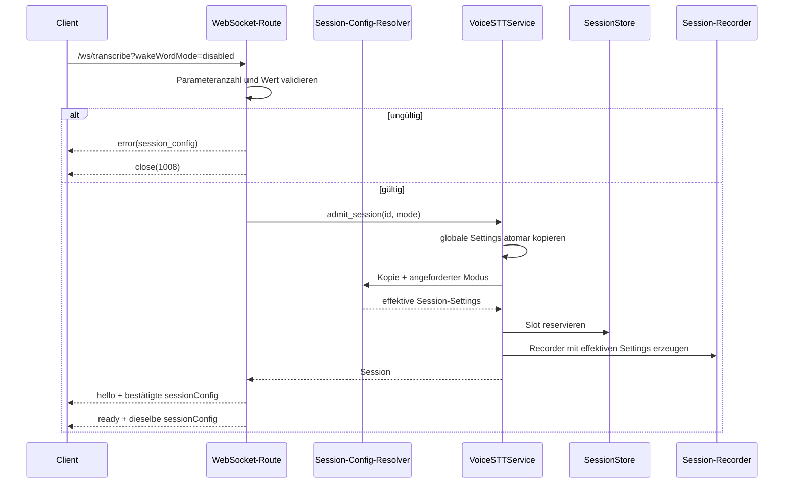

# Evaluierungsauftrag – Sessionlokaler Wake-Word-Override

> **Status:** nicht bindender Evaluierungsauftrag; keine Entscheidung und kein
> Implementierungsauftrag  
> **Stand:** 25. Juli 2026  
> **Adressat:** Agent beziehungsweise Entwickler des VoiceSTT-/RealtimeSTT-Servers  
> **Clientbezug:** E-07; getrennt von und nicht blockierend für AP4  
> **Erwartetes Ergebnis:** technisch belegte Machbarkeits- und
> Aufwandseinschätzung mit konkreten Codefundstellen

## 1. Zweck

Zu prüfen ist, ob der Server beim Erzeugen einer WebSocket-Session einen eng
begrenzten, ausschließlich sessionlokalen Wake-Word-Override unterstützen kann.

Der Prüfgegenstand ist ausdrücklich **nicht**:

- ein allgemeines Sessionprofil-System;
- eine freie per-Session-Konfiguration aller Recorderparameter;
- eine Mutation bereits laufender Recorder;
- eine Persistenz von Sessionprofilen;
- ein Client-Adminbereich;
- eine Implementierung im Rahmen dieses Prüfauftrags.

Gesucht wird die kleinstmögliche Servererweiterung, mit der eine neu erzeugte
Session entweder:

- die globalen Wake-Word-Einstellungen unverändert erbt; oder
- ausschließlich für ihren eigenen Recorder ohne Wake-Word-Gate arbeitet.

Optional ist zu bewerten, ob auch ein sessionlokales Aktivieren des Wake Words
mit vertretbarem Zusatzaufwand möglich wäre.

## 2. Produktkontext

Der Desktop-Client soll später zwei selten gewechselte Betriebsarten anbieten:

### Hotkey-Modus

- Der Client hält das lokale Aufnahme-Gate geschlossen.
- Ein erster Hotkeydruck startet Capture, `start` und Audioübertragung.
- Ein zweiter Hotkeydruck beendet Capture und sendet `stop`.
- Der Serverrecorder darf kein zusätzliches Wake Word verlangen.

### Wake-Word-Modus

- Der Client öffnet Capture und Streaming langfristig.
- Nach `ready` sendet er einmal `start` und danach kontinuierlich Audio.
- Der serverseitige Recorder hält das Wake-Word-Gate geschlossen, bis das
  Wake Word erkannt wurde.

Das gewünschte Verhalten lässt sich als zwei unabhängige Gates beschreiben:

| Server-Gate | Client-Gate | Ergebnis |
|---|---|---|
| Wake Word an | Hotkey an | beide Trigger erforderlich; nicht gewünscht |
| Wake Word aus | Hotkey aus | kein Trigger-Gate; nicht gewünscht |
| Wake Word aus | Hotkey an | Hotkey-Modus |
| Wake Word an | Hotkey aus | Wake-Word-Modus |

## 3. Bereits dokumentierte Serverfakten

Die Prüfung soll diese Aussagen am tatsächlichen Servercode verifizieren:

1. Jede angenommene WebSocket-Verbindung besitzt einen eigenen Recorder mit
   eigenem Wake-, VAD-, Segment- und Pufferzustand.
2. Beim Sessionaufbau erhält der Recorder eine Kopie der zu diesem Zeitpunkt
   gültigen `newSessionOnly`-Einstellungen.
3. Die Wake-Word-Felder gehören zu `newSessionOnly`.
4. Änderungen der globalen Wake-Konfiguration verändern bereits erzeugte
   Recorder nicht.
5. Dadurch können heute bereits gleichzeitig Sessions mit unterschiedlichen
   Wake-Konfigurationen existieren:

   ```text
   Wake global an → Session A erzeugen
   Wake global aus → Session B erzeugen
   Ergebnis: A bleibt an, B ist aus
   ```

6. Der produktive WebSocket akzeptiert gegenwärtig nur `start`, `stop`,
   `clear`, `ping`, `metrics` und Binäraudio.
7. Der WebSocket-Handler ist derzeit nicht authentifiziert.
8. `hello.settings` wird nach der aktuellen Dokumentation aus globalen
   öffentlichen Settings und nicht zwingend aus der effektiven Recorderkopie
   serialisiert.

Maßgebliche Ausgangsdokumente:

- `server-docs-for-client-development/01-session-und-server-scope.md`
- `server-docs-for-client-development/02-websocket-protokoll.md`
- `server-docs-for-client-development/06-http-api-und-authentifizierung.md`
- `server-docs-for-client-development/08-protokollabgrenzung.md`
- `server-docs-for-client-development/09-betriebsmodi-und-serverkonfiguration.md`

Die Codeprüfung hat Vorrang, falls Dokumentation und Implementierung
voneinander abweichen.

## 4. Kernhypothese

Wenn unterschiedliche globale Snapshots bereits gleichzeitig in voneinander
isolierten Sessionrecordern funktionieren, benötigt ein eng begrenzter
Wake-Word-Override möglicherweise keine grundlegende Serverneustrukturierung.

Die voraussichtlich fehlende Verbindung wäre dann:

```text
Sessionwunsch vor Admission/Recorderkonstruktion lesen
    → globale Settings kopieren
    → nur Wake-Felder der Sessionkopie anpassen
    → Recorder mit dieser Kopie erzeugen
    → effektiven Sessionzustand veröffentlichen
```

Diese Hypothese ist anhand des tatsächlichen Konstruktions- und
Admission-Pfades zu bestätigen oder mit konkreten Codegründen zu widerlegen.

## 5. Abgrenzung zum verworfenen Profilentwurf

Der frühere Entwurf verlangte benannte, serverseitig definierte Profile und
eine breitere Auswahl beziehungsweise Isolation von Sessionparametern. Dieser
Entwurf liegt verworfen unter:

`docs/archive/2026-07-25_SERVER_SESSION_PROFILE_SPECIFICATION_VERWORFEN.md`

Aus dessen Aufwand darf nicht ohne erneute Codeprüfung auf den Aufwand des
jetzt untersuchten Minimalfalls geschlossen werden.

Der Minimalfall betrifft zunächst nur das Wake-Word-Gate eines neu erzeugten
Recorders.

## 6. Zu untersuchende Vertragsvarianten

### Variante A – Vererben oder für diese Session deaktivieren

Beispielhafte Semantik:

```text
activationMode=inherit
activationMode=hotkey
```

- `inherit`: unveränderte globale Recorderkopie;
- `hotkey`: Wake Word ausschließlich in der Sessionkopie deaktivieren;
- globale Settings und andere Sessions bleiben unverändert.

Diese Variante ist der bevorzugte Minimalprüfpunkt. Der Server könnte global
mit vollständiger Wake-Konfiguration betrieben werden. Wake-Word-Sessions
erben sie; Hotkey-Sessions schalten nur ihr eigenes Gate aus.

### Variante B – Drei Zustände

Beispielhafte Semantik:

```text
wakeWordMode=inherit
wakeWordMode=disabled
wakeWordMode=enabled
```

Zu prüfen ist, woher `enabled` eine vollständige Wake-Konfiguration erhält,
wenn die globale Konfiguration zuvor deaktiviert wurde und Backend/Wörter
dadurch leer sind.

Mögliche Quellen, nur zur Bewertung:

- bestehende globale Wake-Konfiguration, sofern vollständig;
- ein einzelnes serverseitiges Default-Wake-Preset;
- vollständige validierte Wake-Konfiguration im Sessionwunsch.

Ein allgemeines Profil- oder Presetsystem ist nicht Teil des Minimalauftrags.

### Variante C – Globale Provisionierung als heutiger Fallback

Ohne Serveränderung ist bereits möglich:

```text
Wake global an
    → Wake-Session erzeugen und verifizieren
    → Wake global wieder aus
    → bestehende Wake-Session behalten
```

Diese Variante dient als Vergleichsbasis. Sie besitzt globale Race-,
Reconnect- und Absturzrisiken und ist nicht automatisch die bevorzugte
Zielarchitektur.

## 7. Transportfrage

Der Override muss vor der Recorderkonstruktion bekannt sein. Der Server-Agent
soll anhand des tatsächlichen Codes vergleichen:

1. Queryparameter beim WebSocket-Upgrade;
2. eigener nicht geheimer Request-Header;
3. WebSocket-Subprotocol;
4. erste Initialisierungsnachricht vor `hello`;
5. kurzlebiges, zuvor über HTTP ausgestelltes Sessiontoken.

Bewertungskriterien:

- Wie früh ist der Wert im bestehenden Admission-Pfad verfügbar?
- Muss die Recordererzeugung verschoben werden?
- Bleibt der bestehende Browserclient kompatibel?
- Bleibt das Verhalten ohne Parameter exakt unverändert?
- Wie werden ungültige Werte vor `hello` abgewiesen?
- Entsteht eine unnötige zweite Protokollvariante?

Für den Minimalfall erscheint ein nicht geheimer Queryparameter wie
`activationMode=hotkey` als naheliegender Kandidat. Dies ist keine
Vorentscheidung.

## 8. Authentifizierung und Bedrohungsmodell

### Ausgangshypothese

Ein ausschließlich sessionlokaler Override verändert:

- keine globalen Serverwerte;
- keine fremde Session;
- keine persistierte Konfiguration;
- keine Modell- oder Workerzuordnung.

Der WebSocket erlaubt einem erreichbaren Client bereits heute:

- einen Sessionplatz zu belegen;
- `start` zu senden;
- Mikrofon-Audio zu übertragen;
- Inferenzarbeit auszulösen, sobald der konfigurierte Recorder dies zulässt.

Deshalb ist eine Adminauthentifizierung für den lokalen Wake-Override nicht
automatisch gerechtfertigt.

### Verbindlich zu prüfende Sicherheitsfragen

1. Wird Wake Word im Produkt als Zugriffskontrolle oder nur als
   Aktivierungskomfort behandelt?
2. Erlaubt `disabled` zusätzliche Inferenzlast, die ohne Override bei global
   aktivem Wake Word nicht erzeugt werden könnte?
3. Entsteht daraus ein praktisch relevantes zusätzliches DoS-Risiko gegenüber
   dem ohnehin unauthentifizierten WebSocket?
4. Kann der Override Daten, Audio oder Zustände anderer Sessions sichtbar
   machen?
5. Kann er geteilte Worker oder globale Recorderdefaults mutieren?
6. Gibt es Proxy-, Netzwerk- oder Browserannahmen, die eine
   Sessionauthentifizierung voraussetzen?

### Erwartete Entscheidung

Der Server-Agent soll eine der folgenden Aussagen mit Code- und
Bedrohungsnachweis wählen:

- **Keine zusätzliche Authentifizierung erforderlich:** Der Override ist eine
  normale sessionlokale Verhaltenswahl.
- **Authentifizierung nur für den Override erforderlich:** Konkretes
  Zusatzrisiko benennen und kleinstmöglichen Mechanismus vorschlagen.
- **WebSocket insgesamt benötigt Authentifizierung:** Dies ist ein getrenntes
  Sicherheitsvorhaben und darf nicht stillschweigend allein dem Wake-Override
  zugerechnet werden.

Eine Authentifizierung darf nicht nur deshalb verlangt werden, weil die
vergleichbare heutige Umgehung über eine Admin-API läuft.

## 9. Konkreter Codeprüfplan

Der Server-Agent soll lesend und nachvollziehbar:

1. den untersuchten Serverstand eindeutig benennen:
   - produktive RealtimeSTT-Version;
   - lokale VoiceSTT-Entwicklungsversion;
   - Commit beziehungsweise genauer Arbeitsstand;
2. die Route für `WS /ws/transcribe` lokalisieren;
3. den vollständigen Pfad von WebSocket-Upgrade über Admission bis zur
   Recorderkonstruktion verfolgen;
4. zeigen, an welcher Stelle die globale Settings-Kopie erzeugt wird;
5. zeigen, welche konkrete Settings-Struktur an
   `RecorderBackedRealtimeSession` beziehungsweise den Recorder übergeben wird;
6. die Ableitung `wake_word_enabled` aus Backend, Wörtern und weiteren Feldern
   verfolgen;
7. prüfen, ob Wake-Modelle oder Wake-Konfigurationen tatsächlich
   recorderlokal oder teilweise global geteilt werden;
8. prüfen, ob das Leeren der Wake-Felder in nur einer Settings-Kopie
   nebenwirkungsfrei ist;
9. die Quelle von `hello.settings` bestimmen;
10. feststellen, wie ein effektiver sessionbezogener Wert korrekt in `hello`
    oder einem neuen expliziten Feld veröffentlicht werden könnte;
11. bestehende Validierungsfunktionen für Wake-Konfiguration identifizieren;
12. bestehende Tests für parallele Recorder mit unterschiedlichen
    Konfigurationen suchen;
13. den kleinsten möglichen Patchumfang nach Dateien und Funktionen benennen;
14. Auswirkungen auf Browserclient, Admin-API, Reconnect und bestehende
    WebSocket-Clients bewerten.

## 10. Fragen, die der Prüfbericht beantworten muss

1. Unterstützt der Recorder-/Sessionpfad intern bereits gleichzeitig
   unterschiedliche Wake-Konfigurationen?
2. Beweist die globale Snapshot-Folge „A an, B aus“ diese Isolation auch im
   produktiven Pfad?
3. Wo genau müsste ein sessionlokaler Override eingespeist werden?
4. Reicht eine modifizierte Settings-Kopie oder greifen Wake-Komponenten später
   erneut auf globale Settings zu?
5. Ist ein reines `disabled` technisch deutlich einfacher als ein
   sessionlokales `enabled`?
6. Welche Wake-Felder müssen gemeinsam geändert werden, damit kein
   inkonsistenter Recorder entsteht?
7. Muss der Override vor Admission, vor Recorderkonstruktion oder erst vor
   `start` feststehen?
8. Kann ein Queryparameter ohne Änderung des bestehenden Handshakeablaufs
   genutzt werden?
9. Wie meldet der Server ungültige Werte?
10. Wie wird der effektive Sessionmodus verlässlich veröffentlicht?
11. Bricht die Änderung bestehende Clients ohne neuen Parameter?
12. Ist zusätzliche Authentifizierung fachlich erforderlich? Wenn ja, welches
    konkrete zusätzliche Risiko wird verhindert?
13. Welche Tests beweisen, dass globale Settings und fremde Sessions
    unverändert bleiben?
14. Welcher Aufwand entsteht getrennt für:
    - `inherit|hotkey`;
    - `inherit|disabled|enabled`;
    - allgemeine Sessionprofile?
15. Welche Teile des früher genannten „grundlegenden Serverumbaus“ treffen
    nachweislich auch auf den engen Wake-Override zu?
16. Empfiehlt der Server-Agent den Minimaloverride, die globale
    Provisionierung oder keine der beiden Varianten?

## 11. Erwartete Aufwandseinstufung

Der Prüfbericht soll eine der Stufen wählen:

| Stufe | Bedeutung |
|---|---|
| klein | begrenzte Änderung im Admission-/Recorderpfad und gezielte Tests |
| mittel | mehrere Serverkomponenten oder Protokoll-/Hello-Anpassungen, aber keine Architekturablösung |
| groß | neue Authentifizierungs-, Token-, Profil- oder Persistenzarchitektur erforderlich |

Die Einstufung muss getrennt für den Minimaloverride und ein allgemeines
Sessionprofil-System erfolgen.

## 12. Spätere Abnahmekriterien, falls die Variante angenommen wird

Diese Kriterien sind noch kein Implementierungsauftrag. Sie definieren, was
eine spätere Umsetzung mindestens beweisen müsste.

### Kompatibilität

- Ein Client ohne Override verhält sich exakt wie bisher.
- Unbekannte oder ungültige Werte werden eindeutig abgewiesen.
- Browser- und bestehende Desktop-Clients bleiben funktionsfähig.

### Isolation

- Globale Wake-Konfiguration bleibt unverändert.
- Eine bestehende Wake-Session bleibt nach Erzeugung einer Hotkey-Session im
  Wake-Modus.
- Eine Hotkey-Session beeinflusst keine andere Session.
- Parallele Sessions melden und zeigen ihren jeweils effektiven Zustand.

### Hotkey-Session

- Bei global aktiviertem Wake Word kann eine neue Hotkey-Session ohne
  Wake-Gate erzeugt werden.
- Nach `start` führt Sprache ohne Wake Word zu Realtime- und Finaltext.
- Der Override gilt nur bis zum Disconnect.
- Bei Reconnect muss er erneut angefordert werden.

### Wake-Session

- Eine unverändert erbende Session erreicht bei global aktivem Wake Word
  `wakeword_wait`.
- Audio wird in `wakeword_wait` kontinuierlich verarbeitet.
- Wake-Erkennung, Aufnahme und Finaltext funktionieren unverändert.

### Protokollwahrheit

- Der Client erhält den effektiven Sessionmodus eindeutig.
- Die Meldung stammt aus der Recorder-/Sessionkopie und nicht nur aus einem
  später möglicherweise geänderten globalen Snapshot.

### Sicherheit

- Keine fremde Session oder globale Einstellung wird mutiert.
- Falls keine Authentifizierung verwendet wird, dokumentiert ein Test oder
  Threat-Model-Review, warum dadurch kein unvertretbarer neuer Zugriff
  entsteht.
- Falls Authentifizierung verwendet wird, erscheinen Secrets weder in URL noch
  Logs oder Fehlermeldungen.

## 13. Erwartetes Ergebnisformat des Server-Agenten

Der Server-Agent soll liefern:

1. **Kurzurteil:** machbar oder nicht machbar;
2. **untersuchter Stand:** Version/Commit und betroffene Servervariante;
3. **Codepfad:** Dateien, Klassen, Funktionen und Datenfluss;
4. **Minimalvorschlag:** kleinster technisch korrekter Vertrag;
5. **Authentifizierungsurteil:** erforderlich oder nicht, jeweils begründet;
6. **Aufwand:** getrennt nach Minimaloverride und allgemeinem Profilsystem;
7. **Risiken und offene Punkte;**
8. **konkreter Testplan;**
9. **Empfehlung für das weitere Vorgehen.**

Der Agent soll in dieser Evaluierungsrunde keinen Produktivcode ändern, sofern
er nicht separat ausdrücklich damit beauftragt wird.

## 14. Verhältnis zum Client-Arbeitsplan

- E-07 bleibt offen.
- Es wird noch kein ADR angenommen.
- Die entfernte Clientoption `session.mode` wird nicht wieder eingeführt.
- Es wird noch kein Admin-Service implementiert.
- AP4 Controller-Integration läuft unabhängig weiter.
- AP4 muss lediglich den bestehenden Serververtrag einschließlich
  `wakeword_wait` korrekt verarbeiten.
- Eine spätere Client- oder Serverumsetzung erhält ein eigenes Arbeitspaket
  beziehungsweise eine ausdrückliche Scope-Erweiterung.

Erst nach dem Serverprüfbericht wird entschieden, ob:

- der Minimaloverride weiterverfolgt wird;
- die globale Admin-Provisionierung verwendet wird;
- nur ein global persistenter Betriebsmodus unterstützt wird;
- oder die Modusidee zurückgestellt wird.

---

## 15. Server-Stellungnahme und Prüfergebnis

> **Prüfstatus:** abgeschlossen; reine Code- und Machbarkeitsprüfung, keine
> Implementierung  
> **Prüfdatum:** 25. Juli 2026  
> **Kurzurteil:** Der bevorzugte Minimaloverride
> `inherit | disabled` beziehungsweise `inherit | hotkey` ist technisch
> eindeutig machbar und als **kleine Änderung** einzustufen. Er benötigt kein
> Sessionprofil-, Persistenz-, Token- oder Adminsystem.

### 15.1 Entscheidung in einem Satz

Der Server kann beim WebSocket-Aufbau eine Kopie der globalen Settings erzeugen,
in dieser Kopie ausschließlich `wakeword_backend` und `wake_words` leeren und
den bereits existierenden sessioneigenen Recorder damit konstruieren. Danach
greifen Wake-Gate, Follow-up, Status und Recorder ausschließlich auf diese
Sessionkopie beziehungsweise die daraus erzeugten Recorderattribute zu.

Die Kernhypothese dieses Evaluierungsauftrags ist damit bestätigt.

### 15.2 Aufwandseinstufung

| Variante | Einstufung | Realistische Größenordnung |
|---|---|---:|
| nur Vererben oder Wake Gate sessionlokal deaktivieren | **klein** | funktionaler Patch etwa 4–8 Stunden; produktionsreif einschließlich Vertrag, Tests und Dokumentation etwa 1,5–3 Personentage |
| drei Zustände mit zuverlässigem sessionlokalem Aktivieren | mittel | etwa 3–5 Personentage, sofern ein einzelnes serverseitiges Wake-Preset eingeführt wird |
| freie Wake-Konfiguration pro Session | mittel bis groß | zusätzliche Validierung, Modellauflösung und Sicherheitsvertrag; nicht für den Minimalfall empfohlen |
| allgemeines Sessionprofilsystem | groß | weiterhin ungefähr 6–9 Personentage für eine konservative produktionsreife Version |

Der frühere Aufwand des allgemeinen Profilsystems darf nicht auf diesen
Minimaloverride übertragen werden. Von den dort identifizierten großen Themen
entfallen hier:

- Profilkatalog und Profilpersistenz;
- breiter Recorderparametervertrag;
- Shared-Worker-Fähigkeitsmatrix;
- per-Job-Prompts und Engine-Overrides;
- Modell-/Pfadkatalog als Sessionvertrag;
- Runtime-Profilverwaltung;
- allgemeine Ressourcenobergrenzen pro Profil.

Erhalten bleiben lediglich:

- frühe Auswahl vor Recordererzeugung;
- ehrliche sessionbezogene Rückmeldung;
- eng begrenzte Validierung;
- Isolationstests;
- eine dokumentierte Sicherheitsentscheidung.

## 16. Untersuchter Serverstand

Geprüft wurde der lokale VoiceSTT-Entwicklungsstand unter:

```text
P:\DockerProjekte\voice-stt-server
```

Relevante Kennzeichnung:

| Merkmal | Wert |
|---|---|
| produktiver Einstiegspunkt | `VoiceSTT_server.server` |
| eigentliche FastAPI-Implementierung | `api_fastapi_server.server` |
| FastAPI-App-Version | `2.0.0` |
| Git-Branch | `master` |
| Basiscommit | `a89fabb` |
| Arbeitsstand | umfangreich vom Basiscommit abweichender, nicht eingecheckter VoiceSTT-Entwicklungsstand |

Der produktive Einstiegspunkt re-exportiert `create_app`, `ServerSettings`,
`parse_args`, `settings_from_args` und `main` aus
`api_fastapi_server.server`. Es existiert damit für diese Prüfung kein
abweichender zweiter Produktionspfad.

Die Client-Ausgangsdokumentation nennt teilweise
`server-docs-for-client-development/`. Im geprüften Serverworkspace liegt sie
aktuell unter:

```text
docs/client-development/
```

## 17. Nachgewiesener Codepfad

### 17.1 WebSocket bis Session

Der produktive Ablauf ist:

```text
WS /ws/transcribe
  → websocket_transcribe()
  → neue session_id
  → VoiceSTTService.admit_session()
  → SessionStore.reserve()
  → RecorderBackedRealtimeSession()
  → Settingskopie
  → _create_recorder()
  → SessionStore.add()
  → WebSocket accept / hello
```

Konkrete Fundstellen in `api_fastapi_server/server.py`:

| Fundstelle | Bedeutung |
|---|---|
| Zeile 4693, `websocket_transcribe()` | Route `WS /ws/transcribe` |
| Zeile 4695 | Admission findet derzeit vor `manager.connect()` und `hello` statt |
| Zeile 3002, `admit_session()` | reserviert Slot und konstruiert Session |
| Zeile 2817, `SessionStore` | Sessionreservierung und Isolation |
| Zeile 1801, `RecorderBackedRealtimeSession` | produktiver sessioneigener Recorderpfad |
| Zeile 1804 | `self.settings = replace(service.settings)` |
| Zeile 1846, `_create_recorder()` | Recorderargumente werden aus `self.settings` gebaut |

Der Querywert ist bereits in `websocket.query_params` verfügbar, bevor
`service.admit_session(session_id)` aufgerufen wird. Der Recorder muss für einen
Queryparameter deshalb nicht zeitlich verschoben werden.

### 17.2 Wake-Werte sind bereits `newSessionOnly`

`NEW_SESSION_RUNTIME_SETTINGS` in `api_fastapi_server/server.py` enthält:

```text
wakeword_backend
wake_words
wake_words_sensitivity
wake_word_activation_delay
wake_word_timeout
wake_word_buffer_duration
wake_word_followup_window
openwakeword_model_paths
openwakeword_inference_framework
```

Das vorhandene Adminverhalten und die Sessionkopie beruhen somit bereits auf
der Annahme, dass diese Werte nur für neu erzeugte Recorder gelten.

### 17.3 Übergabe an den Recorder

`RecorderBackedRealtimeSession._create_recorder()` liest alle Wake-Werte aus
`self.settings` und übergibt sie an den sessioneigenen
`AudioToTextRecorder`:

```text
wakeword_backend
openwakeword_model_paths
openwakeword_inference_framework
wake_words
wake_words_sensitivity
wake_word_activation_delay
wake_word_timeout
wake_word_buffer_duration
```

`wake_word_followup_window` wird nicht als Bibliotheksparameter übergeben,
sondern von der FastAPI-Session selbst in
`_start_wakeword_followup_window()` verwendet. Auch dort erfolgt der Zugriff
über `self.settings`.

### 17.4 Recorderinterne Aktivierungsableitung

In `VoiceSTT/core/initialization.py` wird pro Recorder gesetzt:

```python
recorder.use_wake_words = bool(
    init_args["wake_words"]
    or normalized_wakeword_backend in OPENWAKEWORD_BACKENDS
)
```

Wird in genau der Sessionkopie gesetzt:

```python
wakeword_backend = ""
wake_words = ""
```

dann gilt:

```text
normalized_wakeword_backend == ""
recorder.use_wake_words == false
setup_wakeword_detection() lädt kein Wake-Backend
```

Damit sind diese zwei Stringfelder für den Minimaloverride ausreichend. Die
übrigen Wake-Tuningwerte dürfen unverändert in der Sessionkopie verbleiben; sie
sind bei deaktiviertem Gate inaktiv.

Es ist insbesondere nicht nötig:

- `openwakeword_model_paths` zu verändern;
- Sensitivität oder Timeouts zu nullen;
- Follow-up-Werte zu mutieren;
- globale Settings zu ändern;
- ein geladenes ASR-Modell umzuschalten.

### 17.5 Wake-Komponenten sind recorderlokal

OpenWakeWord oder Porcupine werden von
`VoiceSTT/core/wakeword.py:setup_wakeword_detection()` auf der jeweiligen
Recorderinstanz initialisiert:

```text
recorder.owwModel
recorder.porcupine
recorder.wake_words_list
recorder.wake_words_sensitivities
```

Diese Instanzen werden nicht aus einem globalen Wake-Worker bezogen.

Die schweren ASR-Engines bleiben dagegen wie bisher gemeinsame
`SharedEngineWorker`. Der Wake-Override verändert deren Modell, Queue,
Scheduler oder Enginekonfiguration nicht.

### 17.6 Spätere Wake-Entscheidungen lesen nicht erneut global

Die FastAPI-Session verwendet nach der Konstruktion:

- `self.settings.wake_word_enabled()` in `_waiting_state_locked()`;
- `self.settings.wake_word_enabled()` und
  `self.settings.wake_word_followup_window` für Follow-up;
- Recorderattribute für Detection, Timeout und Aufnahme-Gate;
- `self.settings` in `publish_status()` und `snapshot()`.

Es wurde im Sessionpfad kein späterer Rückgriff auf
`service.settings.wakeword_backend` oder `service.settings.wake_words`
gefunden.

Eine modifizierte Settingskopie reicht daher aus.

## 18. Ausführbarer Isolationsnachweis

Zusätzlich zur statischen Codeprüfung wurde der vorhandene
`FakeRecorder`-Testpfad mit folgender Sequenz ausgeführt:

```text
globale Settings: OpenWakeWord + hey_jarvis
→ Session A erzeugen
→ globale Backend-/Words-Werte leeren
→ Session B erzeugen
→ beide Sessions gleichzeitig inspizieren
```

Ergebnis:

```json
{
  "session_a_enabled": true,
  "session_a_backend": "openwakeword",
  "session_a_words": "hey_jarvis",
  "session_b_enabled": false,
  "session_b_backend": "",
  "session_b_words": "",
  "global_enabled": false,
  "recorder_a_backend": "openwakeword",
  "recorder_b_backend": ""
}
```

Damit ist auf dem produktiven Session-/Recorderkonstruktionspfad belegt:

- Session A behält ihre alte Wake-Konfiguration;
- Session B erhält die neue direkte Konfiguration;
- beide Recorderargumente unterscheiden sich gleichzeitig;
- die globale Änderung mutiert Session A nicht.

Der Nachweis verwendet einen Fake Recorder und lädt kein reales
OpenWakeWord-Modell. Für die spätere Abnahme sollte zusätzlich ein optionaler
Real-Backend-Test ausgeführt werden. Für die Besitz- und Kopiersemantik ist der
vorliegende Nachweis bereits eindeutig.

## 19. Bewertung der Vertragsvarianten

### 19.1 Variante A – Vererben oder deaktivieren

Diese Variante wird empfohlen.

Semantik:

| Wert | Effekt |
|---|---|
| Parameter fehlt | exakt heutiges Verhalten |
| `inherit` | globale Settings unverändert kopieren |
| `disabled` beziehungsweise `hotkey` | in der Sessionkopie Backend und Wörter leeren |

Der Server sollte in seinem Vertrag vorzugsweise das tatsächlich kontrollierte
Server-Gate benennen und nicht die gesamte Clientbedienung.

Technisch präziser als `activationMode=hotkey` wäre daher:

```text
wss://…/ws/transcribe?wakeWordMode=disabled
```

Optional explizit:

```text
wss://…/ws/transcribe?wakeWordMode=inherit
```

Der Client bildet darauf ab:

```text
Clientmodus hotkey   → wakeWordMode=disabled
Clientmodus wake_word → Parameter fehlt oder wakeWordMode=inherit
```

`activationMode=hotkey` ist ebenfalls implementierbar. `wakeWordMode` ist
jedoch enger, weil der Server nicht überprüfen kann, ob der Client tatsächlich
einen Hotkey als lokales Gate verwendet.

### 19.2 Variante B – `inherit | disabled | enabled`

`disabled` ist genauso einfach wie in Variante A.

`enabled` hat im heutigen Datenmodell kein zuverlässiges Verhalten, wenn die
globale Wake-Konfiguration zuvor über `PUT /api/wake-word` deaktiviert wurde.
Der Endpunkt leert:

```text
wakeword_backend
wake_words
```

Danach fehlt der Session die vollständige Quelle für:

- Backend;
- Wörter beziehungsweise Modell-ID;
- gegebenenfalls Modellpfad;
- Framework und Tuning.

Mögliche Definitionen von `enabled`:

1. **Nur Assertion:** `enabled` ist nur erlaubt, wenn der globale Snapshot
   bereits Wake-fähig ist. Dann bietet der Wert gegenüber `inherit` keinen
   wesentlichen Nutzen.
2. **Serverseitiges Wake-Preset:** Der Server speichert eine vollständige,
   inaktive Wake-Konfiguration getrennt vom globalen Enabled-Zustand. Das ist
   machbar, aber ein neuer Konfigurationsbaustein.
3. **Freie Sessionparameter:** Der Client liefert Backend, Wörter, Pfade und
   Tuning. Das verlässt bewusst den Minimalfall und benötigt deutlich strengere
   Validierung.

Empfehlung:

```text
Version 1 unterstützt ausschließlich inherit | disabled.
Der Server wird global mit der vollständigen Wake-Konfiguration betrieben.
Hotkey-Sessions deaktivieren ihr eigenes Gate.
Wake-Sessions erben.
```

Damit wird kein `enabled` benötigt.

### 19.3 Variante C – globale Admin-Provisionierung

Die heutige Sequenz funktioniert technisch, besitzt aber gegenüber dem
Minimaloverride klare Nachteile:

- globale Schreiboperation;
- Admin-Key im Desktop-Client;
- Race zwischen Admin-PUT und Sessionerzeugung;
- Absturz kann globalen Zustand hinterlassen;
- paralleler Browser erhält möglicherweise den falschen Modus;
- Reconnect muss die globale Sequenz wiederholen;
- der Admin-Key erlaubt weit mehr als die Betriebsmoduswahl.

Sobald der Minimaloverride verfügbar ist, ist globale Provisionierung für diese
konkrete Moduswahl nicht mehr die bevorzugte Lösung.

## 20. Transportbewertung

| Transport | Bewertung | Begründung |
|---|---|---|
| Queryparameter | **empfohlen** | vor Admission verfügbar, kein Handshakeumbau, Browser kompatibel, kein Secret |
| eigener Request-Header | nicht empfohlen | Desktop möglich, Browser-WebSocket kann keine beliebigen Header setzen |
| WebSocket-Subprotocol | technisch möglich, semantisch unpassend | Subprotocol sollte ein Protokoll und keine Recorderoption wählen |
| erste Initialisierungsnachricht | deutlich aufwendiger | Recorder wird heute vor `accept`/`hello` erzeugt; Admission müsste zweistufig werden |
| HTTP-Sessiontoken | unverhältnismäßig | Tokenstore, Ablauf, Auth und zusätzliche Roundtrips ohne Nutzen für den Minimalfall |

### Empfohlene Queryregeln

- Parametername: `wakeWordMode`;
- Parameter fehlt: `inherit`;
- erlaubte Werte exakt `inherit` und `disabled`;
- Groß-/Kleinschreibung nicht normalisieren;
- leerer oder unbekannter Wert ist ungültig;
- mehrfacher Parameter ist ungültig;
- Querywert ist kein Secret;
- keine Backend-, Wort-, Modell- oder Pfadparameter im WebSocket-Query.

Das Fehlen des Parameters erhält bestehendes Verhalten exakt.

## 21. Minimaler Serververtrag

### 21.1 Erfolgreicher Aufbau

Empfohlene Erweiterung von `hello`:

```json
{
  "type": "hello",
  "sessionId": "…",
  "settings": {
    "wake_word_enabled": false
  },
  "sessionConfig": {
    "version": 1,
    "requestedWakeWordMode": "disabled",
    "effectiveWakeWordEnabled": false
  }
}
```

Bei fehlendem Parameter:

```json
{
  "sessionConfig": {
    "version": 1,
    "requestedWakeWordMode": "inherit",
    "effectiveWakeWordEnabled": true
  }
}
```

Wichtig:

- `settings` muss aus `session.settings.public_dict()` und nicht aus den später
  eventuell geänderten globalen Settings serialisiert werden;
- `sessionConfig` wird aus derselben Sessionkopie gebildet;
- `status.wakeWordEnabled` und `metrics.wakeWordEnabled` müssen denselben Wert
  liefern.

Der direkte, sessionbezogene `ready`-Payload sollte dieselben effektiven
Sessionwerte wiederholen. Der serverweite Ready-Broadcast kann weiterhin
profilneutral bleiben, weil er keine `sessionId` besitzt.

### 21.2 Ungültiger Wert

Empfohlener Fehler:

```json
{
  "type": "error",
  "where": "session_config",
  "code": "invalid_wake_word_mode",
  "message": "Invalid wake word mode."
}
```

Danach:

```text
WebSocket Close 1008
```

Die Prüfung sollte vor `SessionStore.reserve()` und vor Recordererzeugung
erfolgen. Ein ungültiger Wert belegt dann keinen Slot und lädt kein
Wake-Backend.

## 22. Kleinstmöglicher Patchumfang

### Sicher betroffen

| Datei | Änderung |
|---|---|
| `api_fastapi_server/server.py` | Query validieren, Sessionkopie auflösen, Kopie in Admission/Sessionkonstruktor einspeisen, sessionbezogenes `hello`/direktes `ready` |
| `tests/unit/test_fastapi_server_protocol.py` | Resolver-/Validierungsvertrag |
| `tests/unit/test_fastapi_server_multi_user.py` | parallele Wake-/Direct-Sessions und WebSocketvertrag |
| `docs/client-development/01-session-und-server-scope.md` | neuer enger Override |
| `docs/client-development/02-websocket-protokoll.md` | Query und Fehlervertrag |
| `docs/client-development/03-server-events-kurzreferenz.md` | `sessionConfig` |
| `docs/client-development/04-server-events-katalog-und-chronologie.md` | Hello-/Ready-Semantik |
| `docs/client-development/09-betriebsmodi-und-serverkonfiguration.md` | Clientmodus ohne Admin-Provisionierung |

### Nicht erforderlich

- keine Änderung an `VoiceSTT/core/wakeword.py`;
- keine Änderung an den ASR-Engineadaptern;
- kein neues Datenbank-/Persistenzmodul;
- kein Profilkatalog;
- keine Modellregistry-Erweiterung;
- kein Admin-UI-Endpunkt;
- kein Umbau des Schedulers;
- keine Änderung der OpenAI-kompatiblen HTTP-API;
- keine Änderung des alten Zwei-Port-Servers.

Eine saubere Umsetzung kann vollständig im FastAPI-Integrationslayer bleiben.

## 23. Authentifizierungsurteil

### Entscheidung

Für den ausschließlich sessionlokalen Wert `inherit | disabled` ist **keine
zusätzliche Adminauthentifizierung erforderlich**, sofern Wake Word ausdrücklich
nur als Aktivierungskomfort und nicht als Zugriffs- oder Berechtigungsgrenze
verstanden wird.

### Begründung

Der unauthentifizierte WebSocket erlaubt einem erreichbaren Client bereits:

- Session- und Recordererzeugung;
- Belegung eines Sessionplatzes;
- `start`;
- Audioübertragung;
- Nutzung der geteilten ASR-Worker nach Aktivierung.

Das Wake Word ist kein Secret und wird im Produkt dokumentiert. Ein Angreifer
könnte es ohnehin als Audio senden. Der Override:

- verändert keine globale Einstellung;
- verändert keine fremde Session;
- gibt keine fremden Audiodaten oder Transkripte frei;
- wechselt kein ASR-Modell;
- erweitert keine globalen Limits;
- persistiert nichts.

### Tatsächliches Zusatzrisiko

`disabled` erleichtert das Erzeugen von Inferenzlast, weil kein Wake-Audio
vorausgehen muss. Das ist ein kleiner inkrementeller DoS-Unterschied.

Das bestehende System begrenzt diesen Pfad bereits durch:

- `max_sessions`;
- `max_active_speakers`;
- Audio-Paketgrößen;
- Session- und globale Queuegrenzen;
- Realtime-Koalescing;
- Final-Queuegrenzen.

Wenn die öffentliche Erreichbarkeit trotzdem als unvertretbar gilt, sollte der
WebSocket insgesamt authentifiziert oder auf Proxy-/Netzwerkebene geschützt
werden. Nur den Wake-Override mit dem Admin-Key zu schützen, während der
eigentliche Audio-/Inferenzkanal unauthentifiziert bleibt, wäre kein kohärentes
Sicherheitsmodell.

### Bedingung

Falls Wake Word zukünftig als Sicherheitskontrolle interpretiert wird, ändert
sich das Urteil. Dann benötigt nicht nur der Override, sondern der gesamte
WebSocketzugriff eine echte Clientauthentifizierung. Diese Entscheidung ist ein
getrenntes Sicherheitsvorhaben.

## 24. Technische Risiken und offene Punkte

### 24.1 `hello.settings` ist heute global

Der aktuelle Handler sendet:

```python
"settings": settings.public_dict()
```

Dabei ist `settings` die globale Appkonfiguration. Für den Override wäre diese
Antwort falsch, sobald global Wake aktiv, die Session aber deaktiviert ist.

Die Korrektur auf:

```python
"settings": session.settings.public_dict()
```

ist zwingender Teil des Minimalpatches und für Clients ohne Override
kompatibel.

### 24.2 Unterschiedliche Enabled-Ableitungen

`ServerSettings.wake_word_enabled()` verlangt derzeit gleichzeitig:

```text
wakeword_backend nicht leer
UND wake_words nicht leer
```

Der Recorder aktiviert OpenWakeWord dagegen bereits, wenn:

```text
wake_words nicht leer
ODER Backend ein OpenWakeWord-Alias ist
```

Dadurch kann bei einer OpenWakeWord-Konfiguration mit Backend und Modellpfad,
aber leeren `wake_words`, der Recorder aktiv sein, während
`wake_word_enabled()` falsch meldet.

Das aktuelle VPS-Profil ist nicht betroffen, weil es
`wake_words: hey_jarvis` setzt. Vor Veröffentlichung eines allgemeinen
effektiven Wake-Status sollte die Ableitung dennoch vereinheitlicht oder die
Serverkonfiguration verbindlich auf nichtleere Wörter validiert werden.

Für `disabled` ist die Abschaltung sicher, weil sowohl Backend als auch Wörter
geleert werden.

### 24.3 Flache Settingskopie

`dataclasses.replace()` erstellt eine flache Kopie. Für die beiden zu
ändernden Strings ist das vollständig ausreichend; Strings sind unveränderlich.

Ein `deepcopy` ist für diesen Minimalfall nicht technisch notwendig. Er wäre
erst bei freien verschachtelten Session-Overrides relevant.

### 24.4 Gleichzeitige Adminänderung

Globale Runtimeupdates und Sessionkopie sind aktuell nicht gemeinsam atomar.
Der `disabled`-Override bleibt dennoch sicher, weil beide Gatefelder nach der
Kopie eindeutig geleert werden.

Eine erbende Session kann bereits heute während einer genau gleichzeitigen
Adminänderung einen Zwischenzustand kopieren. Das ist ein bestehendes Problem,
nicht durch den Override verursacht. Ein gemeinsamer Settingslock wäre eine
sinnvolle, aber nicht zwingende Härtung außerhalb des Minimalpatches.

### 24.5 Query in Logs

`wakeWordMode=disabled` ist kein Secret. Der Wert kann in Proxy- oder
Accesslogs erscheinen. Backendpfade, Modellnamen, Admin-Keys oder andere
Konfiguration dürfen deshalb nicht Bestandteil dieses Queryvertrags werden.

### 24.6 Browserkompatibilität

Der bestehende Browserclient verwendet keinen Parameter und erbt damit
unverändert die globale Wake-Konfiguration.

Soll der Browser später Hotkeybetrieb anfordern, kann er denselben
Queryparameter verwenden. Benutzerdefinierte WebSocket-Header wären dagegen
im Browser nicht verfügbar.

## 25. Testplan für eine spätere Implementierung

### 25.1 Reiner Resolver

- fehlender Parameter ergibt `inherit`;
- explizites `inherit` kopiert globale Settings unverändert;
- `disabled` leert nur Backend und Wörter;
- globale Settings bleiben byte-/wertgleich;
- andere Wake-Tuningwerte bleiben in der Sessionkopie erhalten;
- leerer, unbekannter, mehrfacher und anders geschriebener Wert wird abgelehnt;
- OpenWakeWord- und Porcupine-Ausgangskonfigurationen werden beide sicher
  deaktiviert.

### 25.2 Session- und Recorderisolation

- Session A erbt global aktives Wake Word;
- Session B fordert `disabled`;
- beide existieren gleichzeitig;
- Recorder A erhält Backend/Wörter;
- Recorder B erhält leere Backend-/Words-Werte;
- `start` meldet für A `wakeword_wait`;
- `start` meldet für B `listening`;
- `clear`, `stop` und erneutes `start` ändern den jeweiligen Modus nicht;
- Disconnect von B verändert A nicht;
- Reconnect ohne Parameter erbt wieder den globalen Zustand.

### 25.3 WebSocketvertrag

- bestehender Pfad ohne Query liefert unverändertes Verhalten;
- `hello.settings` stammt aus der Sessionkopie;
- `hello.sessionConfig` ist konsistent;
- direktes `ready` wiederholt die Sessionkonfiguration;
- `status.wakeWordEnabled` und `metrics.wakeWordEnabled` stimmen überein;
- ungültiger Wert liefert Fehler und Close 1008;
- ungültiger Wert erzeugt keinen Recorder;
- ungültiger Wert erhöht keine aktive oder reservierte Sessionzahl.

### 25.4 Verhalten

- Hotkey-Session erzeugt nach `start` und Sprache ohne Wake Word Realtime- und
  Finaltext;
- Wake-Session ignoriert normale Sprache vor Wake-Erkennung;
- Wake-Session verarbeitet Audio während `wakeword_wait`;
- Wake-Erkennung, Aufnahme, Timeout und Follow-up bleiben unverändert;
- parallele Finals und Realtime-Ergebnisse bleiben dem Eigentümer zugeordnet.

### 25.5 Sicherheit und Regression

- Override ist ohne Admin-Key nutzbar, wenn diese Vertragsentscheidung
  angenommen wird;
- keine globale Admin-API wird aufgerufen;
- Query enthält kein Secret;
- fremde Sessions und globale Settings bleiben unverändert;
- vorhandene FastAPI-Protokoll-, Multi-User-, OpenAI- und Operations-Tests
  bleiben grün;
- optionaler Real-OpenWakeWord-E2E-Test mit dem produktiven Modell.

## 26. Aktuelle Testbaseline

Ausgeführt wurde:

```powershell
.\.venv\Scripts\python.exe -m unittest -v `
  tests.unit.test_fastapi_server_protocol `
  tests.unit.test_fastapi_server_multi_user
```

Ergebnis:

```text
Ran 50 tests
OK
```

Diese 50 Tests decken den bestehenden Protokoll-, Session-, Wake-Callback-,
Follow-up-, Admission- und Multi-User-Baselinepfad ab. Spezifische
Query-Override-Tests existieren noch nicht.

## 27. Direkte Antworten auf die Prüffragen

1. **Unterschiedliche Wake-Konfigurationen gleichzeitig?**  
   Ja. Jede Session besitzt eine eigene Settingskopie und einen eigenen
   Recorder.

2. **Beweist die Folge A an, B aus die Isolation?**  
   Ja für Settingsbesitz, Recorderargumente und späteren Sessionzugriff. Ein
   zusätzlicher Real-Wake-E2E-Test bleibt für die Endabnahme sinnvoll.

3. **Wo wird der Override eingespeist?**  
   Im WebSocket-Handler vor `admit_session()`, anschließend als effektive
   Settingskopie an `RecorderBackedRealtimeSession`.

4. **Reicht eine modifizierte Kopie?**  
   Ja. Der spätere Sessionpfad liest keine globalen Wake-Werte erneut.

5. **Ist `disabled` deutlich einfacher als `enabled`?**  
   Ja. `disabled` benötigt nur zwei leere Strings; `enabled` benötigt eine
   vollständige Wake-Konfigurationsquelle.

6. **Welche Felder müssen geändert werden?**  
   `wakeword_backend` und `wake_words`. Weitere Werte dürfen unverändert
   bleiben.

7. **Wann muss der Wert feststehen?**  
   Vor Recorderkonstruktion. Idealerweise wird er zusätzlich vor
   Sessionreservierung validiert.

8. **Ist ein Queryparameter ohne Handshakeumbau möglich?**  
   Ja. Er ist vor der heutigen Admission verfügbar.

9. **Wie werden ungültige Werte gemeldet?**  
   Empfohlen: `error(where=session_config, code=invalid_wake_word_mode)` und
   Close 1008 vor Recordererzeugung.

10. **Wie wird der effektive Modus veröffentlicht?**  
    `hello.settings` aus der Sessionkopie plus explizites `sessionConfig`;
    direktes `ready`, Status und Metriken müssen konsistent sein.

11. **Brechen bestehende Clients?**  
    Nein. Ein fehlender Parameter behält exakt den bestehenden Pfad; unbekannte
    zusätzliche Responsefelder müssen Clients ohnehin ignorieren.

12. **Ist zusätzliche Authentifizierung erforderlich?**  
    Nein, sofern Wake Word kein Security-Gate ist. Andernfalls muss der gesamte
    WebSocket authentifiziert werden.

13. **Welche Tests beweisen Isolation?**  
    Resolver-, Zwei-Session-, WebSocket-, Status-/Metrik- und
    Verhaltens-E2E-Tests gemäß Abschnitt 25.

14. **Getrennter Aufwand?**  
    Minimaloverride klein, zuverlässiges `enabled` mittel, allgemeine Profile
    groß.

15. **Welche Teile des grundlegenden Umbaus bleiben?**  
    Nur frühe Auflösung, ehrliche Rückmeldung, Validierung und Tests. Keine
    Profil-, Persistenz-, Modell- oder Workerarchitektur.

16. **Welche Variante wird empfohlen?**  
    Global vollständige Wake-Konfiguration beibehalten und den engen
    sessionlokalen `inherit | disabled`-Override implementieren.

## 28. Abschließende Empfehlung

Der Minimaloverride sollte weiterverfolgt werden.

Empfohlene Zielentscheidung:

```text
Serverdefault:
vollständige globale Wake-Word-Konfiguration aktiv

Wake-Word-Client:
kein Override / inherit

Hotkey-Client:
wakeWordMode=disabled
```

Diese Lösung:

- beseitigt die globale Admin-Race-Sequenz;
- benötigt keinen Admin-Key im normalen Desktop-Client;
- erhält Browser- und Altclientverhalten;
- erlaubt gleichzeitig Wake- und Hotkey-Sessions;
- verändert keine gemeinsamen ASR-Ressourcen;
- ist auf wenige klar identifizierte Serverstellen begrenzt;
- besitzt einen überschaubaren, direkt testbaren Vertrag.

Von einem dreiwertigen `enabled` oder einem allgemeinen Sessionprofil-System
sollte für diesen Anwendungsfall abgesehen werden. Beide lösen Probleme, die
für den beschriebenen Betrieb nicht erforderlich sind.

---

## 29. Konkreter Implementierungsplan bis zur Produktionsreife

Dieser Abschnitt übersetzt die technische Bewertung in einen ausführbaren
Projektplan. Er beschreibt nicht nur den Funktionspatch, sondern den gesamten
Weg bis zu einer belastbaren Freigabe für den produktiven Desktop- und
Browserbetrieb.

### 29.1 Zielzustand

Nach Abschluss der Arbeiten gilt:

1. Ein Client kann beim Aufbau von `/ws/transcribe` optional
   `wakeWordMode=disabled` übergeben.
2. Fehlt der Parameter, verhält sich der Server exakt wie bisher
   (`inherit`).
3. Der Override wirkt ausschließlich auf die neu entstehende Session.
4. Die globale Serverkonfiguration wird weder verändert noch persistiert.
5. Bereits bestehende und parallel laufende Sessions werden nicht beeinflusst.
6. Der Recorder der Session wird von Anfang an mit der effektiven
   Sessionkonfiguration erzeugt.
7. `hello`, `ready`, `status` und Sessionmetriken melden denselben effektiven
   Zustand.
8. Ein ungültiger Modus erzeugt keinen Recorder und belegt keinen
   Sessionplatz.
9. Ein neuer Client kann eindeutig erkennen, ob der Server den Vertrag
   unterstützt und tatsächlich angewendet hat.
10. Der alte Browserclient und bestehende Clients ohne Parameter bleiben
    kompatibel.

### 29.2 Bewusste Nicht-Ziele

Nicht Bestandteil dieser Implementierung sind:

- kein allgemeines Sessionprofil-System;
- kein sessionlokales Überschreiben beliebiger Servereinstellungen;
- kein Umschalten einer laufenden Session;
- kein zuverlässiges `enabled`, wenn der globale Serverzustand deaktiviert
  ist;
- keine sessionlokale Wahl von Wake-Word-Modell, Phrase oder Sensitivität;
- keine Speicherung des Overrides in der Runtime-Konfiguration;
- keine Einführung eines Admin-Keys für normale WebSocket-Sessions;
- keine Änderung der gemeinsamen ASR-Modell- oder Schedulerarchitektur.

Diese Grenzen sind Teil des Sicherheits- und Wartbarkeitskonzepts. Eine spätere
Erweiterung benötigt eine neue Vertrags- und Risikoentscheidung und darf nicht
unbemerkt in diesen Patch hineinwachsen.

## 30. Vor Implementierungsbeginn festzuschreibender Vertrag

Die folgenden Entscheidungen sollten als verbindlich behandelt werden. Die
Implementierung darf erst beginnen, wenn sie im Ticket beziehungsweise
Änderungsauftrag festgehalten sind.

| Thema | Festlegung |
|---|---|
| Endpunkt | `GET`-Upgrade auf `/ws/transcribe` |
| Transport | WebSocket-Queryparameter |
| Parameter | `wakeWordMode` |
| Erlaubte Werte | `inherit`, `disabled` |
| Fehlender Parameter | entspricht `inherit` |
| Leerer Parameter | ungültig |
| Mehrfacher Parameter | ungültig |
| Groß-/Kleinschreibung | strikt; nur die dokumentierten Kleinbuchstaben |
| Unbekannter Wert | Fehlerereignis und Close-Code `1008` |
| Prüfzeitpunkt | vor Sessionreservierung und Recordererzeugung |
| Gültigkeitsdauer | gesamte Lebensdauer genau dieser Session |
| Änderung während der Session | nicht unterstützt |
| Persistenz | keine |
| Authentifizierung | keine zusätzliche Admin-Authentifizierung |
| Vertragsversion | `sessionConfig.version = 1` |
| Kompatibilität | kein Parameter ergibt das bisherige Verhalten |

### 30.1 Warum ungültige Werte nicht auf `inherit` zurückfallen dürfen

Ein stiller Fallback wäre besonders beim Desktop-Hotkey problematisch. Ein
Tippfehler wie `wakeWordMode=disable` könnte andernfalls eine Session öffnen,
die entgegen der Clientannahme auf ein Wake Word wartet. Der Server muss den
Aufbau deshalb eindeutig ablehnen.

### 30.2 Kanonische erfolgreiche Rückmeldung

Der Server bestätigt den tatsächlich angewendeten Zustand:

```json
{
  "type": "hello",
  "sessionId": "…",
  "settings": {
    "wake_word_enabled": false,
    "wakeword_backend": "",
    "wake_words": ""
  },
  "sessionConfig": {
    "version": 1,
    "requestedWakeWordMode": "disabled",
    "effectiveWakeWordEnabled": false
  }
}
```

Für eine geerbte Session kann `effectiveWakeWordEnabled` abhängig von der
globalen Konfiguration `true` oder `false` sein. Der angeforderte Modus bleibt
in beiden Fällen `inherit`.

### 30.3 Kanonische Ablehnung

```json
{
  "type": "error",
  "where": "session_config",
  "code": "invalid_wake_word_mode",
  "message": "Invalid wake word mode.",
  "allowedValues": ["inherit", "disabled"]
}
```

Anschließend schließt der Server die Verbindung mit WebSocket-Code `1008`.
Der Fehler enthält keine intern übergebene Python-Ausnahme und keine
Serverpfade.

## 31. Zielarchitektur

Die Auflösung gehört zwischen Transportvalidierung und Sessionerzeugung:



### 31.1 Verantwortungsgrenzen

**WebSocket-Route**

- liest ausschließlich den Transportparameter;
- prüft Syntax, Anzahl und erlaubte Werte;
- formuliert den Protokollfehler;
- übergibt eine bereits normalisierte Admission-Option.

**Session-Config-Resolver**

- kennt die Semantik von `inherit` und `disabled`;
- arbeitet auf einer Kopie;
- verändert keine globalen Settings;
- liefert den angeforderten und den effektiven Zustand.

**VoiceSTTService**

- erstellt den konsistenten Settings-Snapshot;
- reserviert den Sessionplatz;
- erzeugt die Session genau einmal;
- stellt atomare Abgrenzung zu administrativen Settingsänderungen her.

**RecorderBackedRealtimeSession**

- erhält fertige effektive Settings;
- löst keine Transportsemantik auf;
- verwendet während ihrer gesamten Lebensdauer dieselbe Konfiguration.

**Protokollserialisierung**

- liest `settings` aus der Session und nicht aus dem globalen Serverobjekt;
- benutzt für alle Sessionereignisse dieselbe Quelle der Wahrheit.

## 32. Abhängigkeiten und Freigabestufen


Jede Phase besitzt ein Exit-Gate. Eine nachfolgende Phase beginnt erst, wenn
das Gate der vorherigen Phase erfüllt ist. Besonders wichtig ist die
Reihenfolge Server vor Desktop-Client: Ein alter Server ignoriert unbekannte
Queryparameter möglicherweise und könnte deshalb eine Hotkey-Session mit
aktivem Wake Word öffnen. Der Client muss die Serverbestätigung prüfen.

## 33. Phase 0 – Arbeitsgrundlage und Baseline

### Zweck

Einen reproduzierbaren Ausgangspunkt schaffen, bevor Code geändert wird.

### Voraussetzungen

- Die in diesem Dokument festgelegte Zweizustandslösung ist freigegeben.
- Es ist geklärt, welcher Serverbranch und welcher Clientbranch das
  Releaseziel bilden.
- Unabhängige, bereits vorhandene Änderungen sind von diesem Feature
  abgegrenzt.

Der aktuell untersuchte Serverarbeitsbaum enthält umfangreiche nicht
committete Änderungen. Vor einer Implementierung muss deshalb entweder ein
sauberer Featurebranch aus dem beabsichtigten Stand erstellt oder der aktuelle
Stand bewusst als Baseline gesichert werden. Andernfalls wäre später nicht
belastbar unterscheidbar, welche Änderung zu diesem Feature gehört.

### Arbeitsschritte

1. Zielcommit und Zielbranch protokollieren.
2. Bestehende Änderungen inventarisieren und fremde Änderungen nicht
   überschreiben.
3. Relevante Tests ohne Featureänderung ausführen:

   ```powershell
   .\.venv\Scripts\python.exe -m unittest -v `
     tests.unit.test_fastapi_server_protocol `
     tests.unit.test_fastapi_server_multi_user
   ```

4. Vorhandene Server- und Clientprotokolldokumentation als Baseline sichern.
5. Den endgültigen Vertrag aus Abschnitt 30 in ein Implementierungsticket
   übernehmen.
6. Festlegen, wie das Release versioniert und zurückgerollt wird
   (Image-Tag beziehungsweise Commit-ID).

### Ergebnisartefakte

- dokumentierter Baseline-Commit;
- grünes Baseline-Testprotokoll;
- freigegebener Protokollvertrag;
- klarer Änderungsumfang.

### Exit-Gate P0

- Die beiden schnellen Testsuiten sind grün.
- Der Arbeitsstand ist reproduzierbar.
- Es gibt keine offene Entscheidung zu Parametername, Werten oder
  Fehlersemantik.

### Aufwand

Etwa 0,25 bis 0,5 Personentage, abhängig von der Bereinigung beziehungsweise
Sicherung des aktuellen Arbeitsbaums.

## 34. Phase 1 – Sessionkonfiguration als internes Datenmodell

### Zweck

Die Semantik testbar machen, ohne sie an FastAPI oder einen realen Recorder zu
koppeln.

### Vorgesehene Codeänderungen

In `api_fastapi_server/server.py` werden kleine, ausdrücklich benannte
Bausteine eingeführt:

```text
VALID_SESSION_WAKE_WORD_MODES = {"inherit", "disabled"}

SessionAdmissionOptions
    requested_wake_word_mode

ResolvedSessionConfig
    settings
    requested_wake_word_mode
    effective_wake_word_enabled

parse_session_wake_word_mode(...)
resolve_session_config(...)
```

Die konkreten Namen können sich dem vorhandenen Stil anpassen. Die
Verantwortlichkeiten dürfen aber nicht wieder in der WebSocket-Route oder im
Recorder vermischt werden.

### Arbeitsschritte

1. Eine unveränderliche Admission-Option mit Default `inherit` definieren.
2. Eine reine Validierungsfunktion implementieren:
   - kein Wert beziehungsweise fehlender Parameter → `inherit`;
   - `inherit` → gültig;
   - `disabled` → gültig;
   - leer, mehrfach oder unbekannt → definierter Validierungsfehler.
3. Eine reine Auflösungsfunktion implementieren:
   - erstellt eine `dataclasses.replace(...)`-Kopie;
   - lässt bei `inherit` alle Wake-Werte unverändert;
   - setzt bei `disabled` mindestens `wakeword_backend=""` und
     `wake_words=""`;
   - ermittelt `effectiveWakeWordEnabled` aus genau dieser Kopie.
4. Sicherstellen, dass die Eingangssettings niemals mutiert werden.
5. Keine generische Dictionary-Override-Funktion einführen. Eine
   Allowlist mit genau einem fachlichen Modus ist absichtlich sicherer.

### Tests in dieser Phase

In `tests/unit/test_fastapi_server_protocol.py`:

- fehlender Wert wird `inherit`;
- explizites `inherit` wird akzeptiert;
- `disabled` wird akzeptiert;
- `""`, `enabled`, `off`, `true`, Großschreibung und beliebige Werte werden
  abgelehnt;
- der Resolver verändert das Eingangsobjekt nicht;
- `inherit` übernimmt aktive globale Wake-Konfiguration;
- `inherit` übernimmt auch global deaktivierte Konfiguration;
- `disabled` leert Backend und Wörter;
- nicht zum Wake-Word gehörende Settings bleiben identisch.

### Exit-Gate P1

- Alle Resolver- und Validierungstests sind grün.
- Der Resolver besitzt keine FastAPI-, Recorder-, Persistenz- oder
  Schedulerabhängigkeit.
- Ein Code-Review bestätigt die enge Allowlist.

### Aufwand

Etwa 0,25 bis 0,5 Personentage.

## 35. Phase 2 – Admission, Sessionerzeugung und WebSocket-Vertrag

### Zweck

Den validierten Modus vor der Recordererzeugung in die bestehende
Sessionpipeline einspeisen.

### Arbeitsschritte im Service

1. `VoiceSTTService.admit_session(...)` um eine benannte Admission-Option
   erweitern.
2. Innerhalb der Admission einen konsistenten Snapshot von
   `service.settings` erstellen.
3. Den Resolver auf diesen Snapshot anwenden.
4. Erst nach erfolgreicher Auflösung den Platz in `SessionStore` reservieren.
5. `RecorderBackedRealtimeSession` so ändern, dass sie die bereits
   aufgelösten Settings erhält.
6. Verhindern, dass der Konstruktor anschließend nochmals unbemerkt die
   globalen Settings kopiert und damit den Override verliert.
7. Den aufgelösten Vertrag als Sessionmetadaten aufbewahren.

Empfohlene Richtung:

```text
admit_session(session_id, options=...)
  -> atomarer Basissnapshot
  -> resolve_session_config(...)
  -> reserve(...)
  -> RecorderBackedRealtimeSession(
       service,
       session_id,
       settings=resolved.settings,
       session_config=resolved.contract
     )
```

### Arbeitsschritte in der WebSocket-Route

1. `websocket.query_params.getlist("wakeWordMode")` verwenden, damit ein
   mehrfacher Parameter erkannt wird.
2. Die Parameterprüfung vor `service.admit_session(...)` durchführen.
3. Bei ungültigem Wert:
   - WebSocket annehmen, damit der strukturierte Fehler gesendet werden kann;
   - kanonisches `error`-Ereignis senden;
   - mit `1008` schließen;
   - sofort zurückkehren.
4. Bei gültigem Wert Admission starten.
5. Das bestehende Sessionlimit weiterhin mit `1013` behandeln.
6. `hello.settings` aus `session.settings.public_dict()` erzeugen.
7. `sessionConfig` in `hello` ergänzen.
8. Den direkt gesendeten `ready`-Payload aus derselben Sessionquelle erzeugen.

### Notwendige Payload-Hilfsfunktion

Um Abweichungen zwischen `hello`, direktem `ready` und späterem `ready` zu
verhindern, sollte die Sessionkonfiguration an einer Stelle serialisiert
werden, beispielsweise:

```text
session.session_config_dict()
```

Die Funktion liefert nur stabile öffentliche Felder. Interne
Konfigurationsobjekte oder Backendinstanzen dürfen nicht serialisiert werden.

### Exit-Gate P2

- `disabled` erreicht nachweislich den Recorder.
- Kein globaler Wert wird verändert.
- Ungültige Werte erreichen weder `reserve()` noch den Recorderfactory.
- `hello` und direktes `ready` bestätigen identische effektive Werte.
- Verbindungen ohne Parameter erzeugen byte-semantisch das bisherige
  Verhalten; zusätzliche additive Felder sind zulässig.

### Aufwand

Etwa 0,5 bis 0,75 Personentage.

## 36. Phase 3 – Konsistenz, Parallelität und verzögertes Ready

### Zweck

Die Funktion nicht nur im idealen Sofortpfad, sondern bei parallelen
Adminänderungen, Modellladevorgängen und mehreren Sessions korrekt machen.

### 36.1 Atomarer Settings-Snapshot

`VoiceSTTService` besitzt bereits `_settings_lock`, verwendet ihn im
untersuchten Stand für `update_settings(...)` und die Sessionkopie jedoch
nicht konsequent.

Für dieses Feature müssen mindestens folgende Operationen relativ zueinander
atomar sein:

- administrative Änderung der globalen Wake-Felder;
- Erstellen des Basissnapshots einer neuen Session.

Vorgehen:

1. Den Mutationsabschnitt von `update_settings(...)` mit `_settings_lock`
   schützen.
2. Die Sessionkopie in `admit_session(...)` unter demselben Lock erstellen.
3. Logging und Dateipersistenz möglichst außerhalb des Locks ausführen, um
   die Admission nicht durch I/O zu blockieren.
4. Bestehende aktive Sessions weiterhin nicht nachträglich verändern.
5. Einen Konkurrenztest ergänzen, der Wake-Updates und Sessionadmission
   überlappt.

Es ist nicht erforderlich, sämtliche Serverreader im Rahmen dieses Features
umzubauen. Der für die Session relevante Snapshot muss aber entweder den alten
oder den neuen vollständigen Wake-Zustand sehen und niemals eine
Zwischenkombination.

### 36.2 Korrektur des verzögerten Ready-Pfads

Die Formulierung in Abschnitt 21, ein serverweiter Ready-Broadcast könne
„profilneutral“ bleiben, muss für die konkrete Implementierung präzisiert
werden: Der aktuelle `_ready_worker(...)` broadcastet globale `settings`.
Damit ist der Payload im Ist-Zustand nicht profilneutral.

Produktionsreif sind zwei mögliche Lösungen:

**Empfohlene Lösung**

- einen gemeinsamen Builder für sessionbezogene Ready-Payloads erstellen;
- nach dem Laden des Schedulers über die aktiven Sessions iterieren;
- jeder Session einzeln ein Ready-Ereignis mit ihren effektiven Settings und
  ihrer `sessionConfig` senden.

**Zulässige, aber protokolländernde Alternative**

- aus dem globalen Ready-Broadcast alle sessionabhängigen Settings entfernen;
- nur Modellbereitschaft und globale Limits broadcasten.

Die empfohlene Lösung ist kompatibler, weil bestehende Clients weiterhin
`settings` im Ready-Ereignis erhalten.

### 36.3 Einheitliche Quelle für Status und Metriken

Folgende Ausgaben müssen aus `session.settings` beziehungsweise den
Sessionmetadaten lesen:

- `hello.settings`;
- direktes und verzögertes `ready.settings`;
- `status.wakeWordEnabled`;
- `status.wakeWord`;
- Ergebnis des WebSocket-Kommandos `metrics`;
- interne Session-Snapshots.

Globale HTTP-Endpunkte wie `/api/settings` und `/api/wake-word` bleiben
bewusst global.

### Exit-Gate P3

- Zwei parallele Sessions können unterschiedliche effektive Wake-Zustände
  besitzen.
- Ein globales Adminupdate nach Session A verändert Session A nicht.
- Session B übernimmt anschließend den neuen globalen Zustand.
- Ein später Ready-Broadcast überschreibt die Sicht einer
  `disabled`-Session nicht mit globalen Wake-Werten.
- ThreadSanitizer steht für Python hier nicht zur Verfügung; der deterministisch
  synchronisierte Konkurrenztest ist deshalb verpflichtend.

### Aufwand

Etwa 0,5 bis 0,75 Personentage.

## 37. Phase 4 – Vollständige automatisierte Testmatrix

### Zweck

Den Protokollvertrag, die Isolation und die Rückwärtskompatibilität
reproduzierbar beweisen.

### 37.1 Unit-Tests für den Resolver

| Fall | Global | Request | Erwartung |
|---|---|---|---|
| A | Wake aktiv | Parameter fehlt | Session aktiv |
| B | Wake aktiv | `inherit` | Session aktiv |
| C | Wake aktiv | `disabled` | Session deaktiviert |
| D | Wake deaktiviert | Parameter fehlt | Session deaktiviert |
| E | Wake deaktiviert | `inherit` | Session deaktiviert |
| F | Wake deaktiviert | `disabled` | Session deaktiviert |
| G | Wake aktiv | ungültig | Validierungsfehler |

Zusätzliche Invarianten:

- globale Settings bleiben nach jedem Fall unverändert;
- alle Nicht-Wake-Felder bleiben in der Sessionkopie erhalten;
- `effectiveWakeWordEnabled` entspricht
  `session.settings.wake_word_enabled()`.

### 37.2 Service- und Recorder-Tests

Mit dem bestehenden `FakeRecorder`:

1. Session A als `inherit` bei global aktivem Wake Word öffnen.
2. Session B gleichzeitig als `disabled` öffnen.
3. Recorder A erhält Backend und Phrase.
4. Recorder B erhält leeres Backend und leere Phrase.
5. Beide verwenden dieselben vorgesehenen ASR-Schedulerressourcen.
6. Das Schließen von B beeinflusst A nicht.
7. Eine dritte geerbte Session bleibt entsprechend dem globalen Zustand.

### 37.3 WebSocket-Vertragstests

Mit `FastAPI TestClient`:

- Verbindung ohne Query bleibt möglich;
- `?wakeWordMode=inherit` wird bestätigt;
- `?wakeWordMode=disabled` wird bestätigt;
- `hello.settings`, `hello.sessionConfig` und `ready` stimmen überein;
- `status` und `metrics` melden denselben Zustand;
- leerer, mehrfacher und unbekannter Parameter liefern
  `invalid_wake_word_mode`;
- abgelehnte Konfiguration schließt mit `1008`;
- abgelehnte Konfiguration erhöht nicht `activeSessions`;
- das bestehende Sessionlimit liefert weiterhin `1013`;
- andere Queryparameter verändern den Vertrag nicht;
- URL-Decodierung erzeugt keine Umgehung der Allowlist.

### 37.4 Lifecycle-Tests

- `start` einer `disabled`-Session führt in den normalen Listening-Pfad;
- `start` einer geerbten Wake-Session führt in `wakeword_wait`;
- `stop`, `clear`, Disconnect und Reconnect räumen beide Modi sauber auf;
- ein Reconnect muss den Modus neu übergeben;
- ein Modus kann nicht durch ein Textkommando während der Session geändert
  werden;
- Modell-Idle-Unload und späteres Reload erzeugen sessionkorrekte
  Ready-Payloads.

### 37.5 Parallelitäts- und Regressionstests

- Sessionadmission parallel zu `PUT /api/wake-word`;
- mindestens 50 bis 100 schnelle abwechselnde Admissions mit `inherit` und
  `disabled`;
- keine vermischten Backend-/Phrase-Paare;
- keine verlorenen Reservierungen;
- keine Recorderleaks nach Ablehnungen;
- die vollständige vorhandene Unit-Test-Suite ausführen, nicht nur die zwei
  geänderten Module;
- optionaler Real-Engine-Test mit dem vorhandenen Audiofixture;
- Browserclient-Smoke-Test ohne Query.

### Exit-Gate P4

- Alle neuen Tests sind grün.
- Die gesamte vorhandene Unit-Test-Suite ist grün.
- Der optionale Real-Engine-Test ist auf der Zielhardware mindestens einmal
  erfolgreich gelaufen.
- Testfehler werden iterativ behoben; bekannte rote Tests werden nicht als
  „unabhängig“ akzeptiert, ohne Ursache und Freigabe zu dokumentieren.

### Aufwand

Etwa 0,5 bis 1 Personentag.

## 38. Phase 5 – Clientintegration und öffentliche Dokumentation

### Zweck

Sicherstellen, dass der Desktop-Client die neue Funktion korrekt verwendet
und ein Server-Client-Mismatch nicht stillschweigend zu falschem Verhalten
führt.

### 38.1 Reihenfolge

1. Server mit neuem Vertrag ausrollen.
2. Serverfunktion manuell und automatisiert verifizieren.
3. Erst danach einen Client veröffentlichen, der
   `wakeWordMode=disabled` verwendet.

Der Grund: Ein alter Server kann den unbekannten Queryparameter ignorieren.
Ohne Prüfung der Antwort könnte der Client fälschlich annehmen, Wake Word sei
deaktiviert.

### 38.2 Desktop-Client

Der Client sollte:

- im Hotkey-Modus `wakeWordMode=disabled` an die WebSocket-URL anhängen;
- im Wake-Word-Modus den Parameter vorzugsweise weglassen und damit
  rückwärtskompatibel erben;
- Queryparameter mit einem URL-Builder statt Stringverkettung erzeugen;
- den Modus über automatische Reconnects hinweg beibehalten;
- einen Moduswechsel durch kontrolliertes Schließen und Neuerstellen der
  Session umsetzen;
- nach `hello` prüfen:
  - `sessionConfig.version >= 1`;
  - `requestedWakeWordMode == "disabled"`;
  - `effectiveWakeWordEnabled == false`;
- bei fehlender oder widersprüchlicher Bestätigung die Hotkey-Aufnahme nicht
  stillschweigend starten;
- eine verständliche Meldung „Server unterstützt sessionlokalen
  Wake-Word-Override nicht“ anzeigen;
- keinen Admin-Key für diesen Flow abfragen oder speichern.

Ein möglicher expliziter Legacy-Fallback über die globale Admin-API darf nur
als separat aktivierte Kompatibilitätsoption existieren. Er darf nicht
automatisch erfolgen, weil er wieder die ursprünglichen globalen Race
Conditions erzeugt.

### 38.3 Browserclient

- Kein Parameter: unverändertes Verhalten.
- Optional kann später eine Betriebsmodusauswahl ergänzt werden.
- Der Browser benötigt weder einen Custom Header noch einen Admin-Key.
- Ein Browser-Smoke-Test muss bestätigen, dass die bisherige URL weiterhin
  funktioniert.

### 38.4 Dokumentationsänderungen

**Serverrepository**

- `api_fastapi_server/README.md`
  - Queryparameter;
  - Beispiele;
  - Fehler- und Close-Code;
  - additive `sessionConfig`-Felder.
- `RELEASE_NOTES.md`
  - neues rückwärtskompatibles Feature;
  - bewusste Beschränkung auf `inherit | disabled`.

**Cliententwicklungsdokumentation**

- `01-session-und-server-scope.md`
  - globaler Default versus Sessionoverride;
- `02-websocket-protokoll.md`
  - URI, Werte, Validierung und Fehler;
- `03-server-events-kurzreferenz.md`
  - `sessionConfig`;
- `04-server-events-katalog-und-chronologie.md`
  - Hello-/Ready-Reihenfolge und Reconnect;
- `05-client-zustandsmodell.md`
  - Moduswechsel erzeugt neue Session;
- `07-robustheit-grenzen-und-sicherheit.md`
  - Serverbestätigung zwingend prüfen;
- `09-betriebsmodi-und-serverkonfiguration.md`
  - endgültiger Hotkey-/Wake-Word-Flow.

### Exit-Gate P5

- Server- und Clientdokumentation beschreiben denselben Vertrag.
- Ein Clienttest beweist die URI-Erzeugung und Antwortvalidierung.
- Ein alter Browserclient bleibt funktionsfähig.
- Ein neuer Client erkennt einen alten Server und bricht den Hotkey-Flow
  kontrolliert ab.

### Aufwand

Serverdokumentation etwa 0,25 Personentage. Die eigentliche Clientänderung und
deren Tests sind im Clientprojekt zusätzlich zu schätzen; bei vorhandener
zentraler WebSocket-Verbindungslogik typischerweise 0,25 bis 0,75
Personentage.

## 39. Phase 6 – Beobachtbarkeit, CI und Releaseartefakt

### 39.1 Beobachtbarkeit ohne sensible Daten

Der Override enthält kein Secret. Trotzdem sollten keine vollständigen
Querystrings unnötig in Logs dupliziert werden.

Empfohlene strukturierte Auditfelder:

```text
event: websocket.connected
sessionId: …
requestedWakeWordMode: inherit | disabled
effectiveWakeWordEnabled: true | false
```

Bei Ablehnung:

```text
event: websocket.session_config_rejected
code: invalid_wake_word_mode
```

Der ungültige Rohwert sollte höchstens längenbegrenzt und escaped geloggt
werden. Für den Betrieb reichen normalerweise Fehlercode und Clientadresse.

Sinnvolle aggregierte Metriken:

- aktive Sessions nach effektivem Wake-Zustand;
- Anzahl abgelehnter Sessionkonfigurationen;
- bestehende Session-/Speaker-/Queue-Grenzen.

Nicht sinnvoll sind unbeschränkte Labels mit Session-ID oder beliebigen
Querywerten, weil sie hohe Metrikkardinalität erzeugen.

### 39.2 CI-Mindeststandard

Im untersuchten Repository ist kein eigentlicher Testworkflow unter
`.github/workflows` vorhanden. Für eine belastbare Produktionsfreigabe sollte
mindestens ein automatischer Gate eingerichtet oder die äquivalente
bestehende externe CI dokumentiert werden.

Pflicht-Gate pro Änderung:

1. unterstützte Python-Version installieren;
2. Abhängigkeiten installieren;
3. vollständige Unit-Test-Suite ausführen;
4. Testresultat dem Commit eindeutig zuordnen;
5. bei Fehlern kein Releaseartefakt erzeugen.

Der Real-Engine-Test ist wegen Modellgröße und Laufzeit besser als
manueller/nightly Job geeignet, nicht zwingend für jeden kleinen Commit.

### 39.3 Releaseartefakt

- unveränderliches Image beziehungsweise Paket bauen;
- Commit-ID und Buildzeit einbetten oder separat protokollieren;
- Artefakt zuerst in Staging verwenden;
- genau dasselbe Artefakt später in Produktion promoten;
- vorheriges bekannt gutes Artefakt für Rollback verfügbar halten.

### Exit-Gate P6

- Automatische Tests blockieren ein fehlerhaftes Release.
- Logs zeigen Modus und effektiven Zustand ohne Secrets.
- Das Releaseartefakt ist auf einen Commit zurückführbar.
- Ein bekannt gutes Rollbackartefakt existiert.

### Aufwand

Etwa 0,5 bis 1 Personentag, wenn CI und Artefaktpromotion neu eingerichtet
werden müssen; deutlich weniger bei bereits externer Automatisierung.

## 40. Phase 7 – Staging-, Last- und Sicherheitsprüfung

### Zweck

Das Verhalten mit realem Wake-Backend, echter Netzwerkverbindung und
Zielhardware bestätigen.

### 40.1 Staging-Szenarien

1. Server global mit vollständiger OpenWakeWord-Konfiguration starten.
2. Wake-Session ohne Parameter verbinden.
3. Hotkey-Session mit `disabled` parallel verbinden.
4. In beiden Sessions Audio senden.
5. Prüfen:
   - Wake-Session transkribiert erst nach Wake Word;
   - Hotkey-Session benötigt kein Wake Word;
   - Transkripte und Statusereignisse bleiben sessionisoliert.
6. Globale Wake-Einstellung während einer laufenden Session ändern.
7. Neue Sessions öffnen und Snapshot-Semantik prüfen.
8. Scheduler/Modelle entladen und neu laden; spätes `ready` prüfen.
9. Reconnects und abrupte Disconnects simulieren.
10. Maximales Sessionlimit erreichen und anschließend sauberen Abbau prüfen.

### 40.2 Last- und Ressourcenprüfung

Der Override selbst verändert keine gemeinsamen ASR-Modelle. Trotzdem ist zu
prüfen:

- zusätzlicher Speicher einer Wake-Session gegenüber einer
  `disabled`-Session;
- keine Wake-Modellinitialisierung für `disabled`;
- keine steigende Thread- oder Recorderzahl nach wiederholten Verbindungen;
- keine Verschlechterung von Admission- oder Ready-Latenz;
- stabile Queue- und Drop-Metriken unter parallelem Audio;
- bestehende Grenzwerte greifen weiterhin.

Empfohlener kurzer Soak-Test:

- mindestens 30 bis 60 Minuten;
- wiederholte Verbindungswechsel;
- mindestens eine Wake- und eine Hotkey-Session parallel;
- periodische Prüfung von Prozessspeicher, Threads, aktiven Sessions und
  Fehlerlogs.

### 40.3 Sicherheitsprüfung

- unbekannte und überlange Querywerte;
- mehrfacher Parameter;
- ungewöhnliche URL-Codierungen;
- schnelles Wiederholen ungültiger Handshakes;
- keine Reservierung und kein Recorder bei Ablehnung;
- WebSocket-Origin-, TLS- und Netzgrenzen entsprechend dem vorhandenen
  Deployment prüfen;
- Reverse-Proxy-Limits für Verbindungen und Requests prüfen.

Wake Word darf nicht als Authentifizierungs- oder Autorisierungsgrenze
behandelt werden. Ist der Server außerhalb eines vertrauenswürdigen Netzes
erreichbar, muss der WebSocket insgesamt angemessen geschützt werden. Ein
Admin-Key nur für den Override würde dieses Grundproblem nicht lösen.

### Exit-Gate P7

- Alle Staging-Szenarien sind protokolliert erfolgreich.
- Keine Session- oder Recorderleaks.
- Keine widersprüchlichen Sessionereignisse.
- Ressourcenwerte bleiben innerhalb der bestehenden Betriebsgrenzen.
- Es gibt keine ungeklärten Fehler oder Warnungen im Log.

### Aufwand

Etwa 0,5 Personentage aktive Arbeit plus 30 bis 60 Minuten Soak-Laufzeit.

## 41. Phase 8 – Produktionsrollout und Rückfallstrategie

### 41.1 Rolloutreihenfolge

1. Aktuelle Runtime-Konfiguration und verwendetes Image sichern.
2. Serverartefakt mit Override deployen.
3. `/health` und `/api/metrics` prüfen.
4. Legacy-Verbindung ohne Query prüfen.
5. Manuelle Testverbindung mit `inherit` prüfen.
6. Manuelle Testverbindung mit `disabled` und Antwortvalidierung prüfen.
7. Zunächst nur einen Desktop-Client für den neuen Flow aktivieren.
8. Logs und Metriken beobachten.
9. Erst danach weitere Clients beziehungsweise Browseroberflächen umstellen.

### 41.2 Canary-Kriterien

Der Canary gilt als erfolgreich, wenn:

- keine erhöhte WebSocket-Fehlerrate auftritt;
- `disabled` immer mit `effectiveWakeWordEnabled=false` bestätigt wird;
- keine unerwarteten `1008`-Ablehnungen regulärer Clients auftreten;
- aktive Sessions nach Disconnect auf null beziehungsweise den erwarteten
  Wert zurückgehen;
- Wake-Word-Sessions unverändert funktionieren;
- CPU, Speicher und Queuezeiten im erwarteten Bereich bleiben.

### 41.3 Rollback

Die Funktion besitzt zwei Rückfallebenen:

**Clientseitiger Sofortrückfall**

- neuen Clientmodus deaktivieren;
- `wakeWordMode` nicht mehr senden;
- Server arbeitet wieder im bisherigen globalen Verhalten.

**Serverseitiger Rückfall**

- vorheriges unveränderliches Image deployen;
- Runtime-Konfiguration wiederverwenden;
- Healthcheck, Legacy-WebSocket und Wake Word prüfen.

Da der Override nichts persistiert und keine Datenmigration erzeugt, ist kein
Datenrollback erforderlich.

### 41.4 Kein zusätzlicher Feature-Schalter als Voraussetzung

Ein neuer persistierter Server-Feature-Schalter würde Konfigurationsoberfläche,
Tests und Dokumentation erneut vergrößern. Für diese additive Funktion ist er
nicht zwingend:

- ohne Query bleibt das Verhalten unverändert;
- der Client kann die Nutzung sofort stoppen;
- das Serverimage kann zurückgerollt werden.

Ein Schalter sollte nur eingeführt werden, wenn der konkrete
Deploymentprozess keinen schnellen Image-Rollback erlaubt.

### Exit-Gate P8

- Canary erfolgreich.
- Rollbackweg praktisch geprüft oder mindestens in der Zielumgebung
  verifiziert.
- Server- und Clientversionen sind dokumentiert.
- Produktivfreigabe ist ausdrücklich erteilt.

## 42. Phase 9 – Stabilisierung nach dem Rollout

### Beobachtungszeitraum

Mindestens mehrere reale Nutzungssitzungen beziehungsweise 24 bis 72 Stunden,
je nach Nutzungsfrequenz.

### Zu beobachten

- Verbindungs- und Close-Codes;
- Ablehnungen mit `invalid_wake_word_mode`;
- aktive Sessions und Recorderabbau;
- Wake-Word-Zustandsübergänge;
- Speicher- und Threadentwicklung;
- Queuealter, Drops und Transkriptionslatenz;
- Reconnectverhalten des Desktop-Clients;
- Abweichungen zwischen angefordertem und bestätigtem Modus.

### Abschluss

Nach dem Beobachtungszeitraum:

1. Logs und Metriken auswerten.
2. Eventuelle Abweichungen reproduzieren und beheben.
3. Regressionstests erneut ausführen.
4. Dokumentation an tatsächlich ausgelieferten Vertrag angleichen.
5. Implementierung als stabil markieren.
6. Folgeideen wie `enabled` oder weitere Sessionparameter in separate
   Vorhaben verschieben.

### Exit-Gate P9

- Keine ungeklärten produktiven Fehler.
- Keine Leaks oder Zustandsvermischungen.
- Dokumentation, Client und Server entsprechen demselben Vertrag.
- Rolloutnotizen und Testnachweise sind archiviert.

## 43. Datei- und Arbeitspaketmatrix

| Datei oder Bereich | Konkrete Aufgabe | Phase |
|---|---|---|
| `api_fastapi_server/server.py` | Moduskonstanten, Parser, Resolver und Sessionvertrag | P1 |
| `api_fastapi_server/server.py` | Admission erhält aufgelöste Sessionsettings | P2 |
| `api_fastapi_server/server.py` | Queryvalidierung, `1008`, `hello` und direktes `ready` | P2 |
| `api_fastapi_server/server.py` | Settings-Lock und sessionbezogenes spätes `ready` | P3 |
| `api_fastapi_server/server.py` | Auditfelder und aggregierte Metriken | P6 |
| `tests/unit/test_fastapi_server_protocol.py` | Parser-, Resolver- und Serialisierungstests | P1/P4 |
| `tests/unit/test_fastapi_server_multi_user.py` | Isolation, WebSocket, Lifecycle und Parallelität | P2–P4 |
| `tests/unit/test_fastapi_server_multi_user_asr_integration.py` | optionaler Real-Engine-Nachweis | P4/P7 |
| `api_fastapi_server/README.md` | öffentlicher Serververtrag | P5 |
| `RELEASE_NOTES.md` | Releasehinweis und Kompatibilitätsgrenze | P5 |
| Client-WebSocket-Builder | Modus als Query setzen | P5 |
| Client-Handshakeauswertung | Serverbestätigung erzwingen | P5 |
| Client-Reconnect/State | Modus über Reconnect halten, Wechsel durch neue Session | P5 |
| `docs/client-development/01…09` | Scope, Protokoll, Events, Zustände und Betrieb | P5 |
| CI-Konfiguration | vollständige Unit-Tests als Release-Gate | P6 |
| Deploymentartefakt | unveränderlicher Build und Rollbackversion | P6/P8 |

## 44. Definition of Done

Die Implementierung ist nicht bereits dann fertig, wenn der Queryparameter im
Happy Path funktioniert. Sie ist erst produktionsreif, wenn alle folgenden
Punkte erfüllt sind.

### Funktional

- [ ] `inherit` und `disabled` funktionieren wie spezifiziert.
- [ ] Fehlender Parameter ist vollständig rückwärtskompatibel.
- [ ] Ungültige Werte werden vor Admission mit `1008` abgelehnt.
- [ ] `disabled` initialisiert kein Wake-Word-Backend für diese Session.
- [ ] Globaler Zustand und andere Sessions bleiben unverändert.
- [ ] Moduswechsel erfolgt ausschließlich durch eine neue Session.

### Protokoll

- [ ] `sessionConfig.version` ist vorhanden.
- [ ] Angeforderter und effektiver Zustand werden bestätigt.
- [ ] `hello`, jedes `ready`, `status` und `metrics` sind widerspruchsfrei.
- [ ] Ein neuer Client erkennt alte oder inkompatible Server.
- [ ] Fehlercode und Close-Code sind dokumentiert und getestet.

### Robustheit und Sicherheit

- [ ] Settings-Snapshot und Adminupdate sind für die Session konsistent.
- [ ] Mehrfachparameter und kodierte ungültige Werte werden abgelehnt.
- [ ] Ablehnungen belegen keinen Slot und erzeugen keinen Recorder.
- [ ] Keine neuen Secrets oder Admin-Credentials im Desktop-Flow.
- [ ] Keine unbeschränkten Metriklabels oder unbereinigten Logwerte.
- [ ] Reconnect, Disconnect, Clear, Stop und Modellreload sind geprüft.

### Qualität

- [ ] Neue Unit-, WebSocket-, Isolations- und Konkurrenztests sind grün.
- [ ] Die vollständige vorhandene Testsuite ist grün.
- [ ] Real-Engine-Smoke-Test auf Zielhardware ist erfolgreich.
- [ ] Browser-Legacy-Smoke-Test ist erfolgreich.
- [ ] Server- und Clientcode wurden gegengelesen.
- [ ] Server- und Clientdokumentation sind aktualisiert.

### Betrieb

- [ ] CI beziehungsweise dokumentiertes automatisches Release-Gate ist grün.
- [ ] Build ist unveränderlich und einem Commit zugeordnet.
- [ ] Staging- und Soak-Test sind erfolgreich.
- [ ] Health-, Metrik- und Logprüfung sind definiert.
- [ ] Canary und Rollbackweg sind geprüft.
- [ ] Stabilisierungszeitraum ohne ungeklärte Befunde abgeschlossen.

## 45. Aufwand, kritischer Pfad und empfohlene Umsetzungsschnitte

### 45.1 Aufwand

| Block | Schätzung |
|---|---:|
| Baseline und Vertragsabschluss | 0,25–0,5 PT |
| Resolver, Admission und WebSocket | 0,75–1,25 PT |
| Konsistenz, Ready-Pfad und Beobachtbarkeit | 0,5–0,75 PT |
| Tests und Regression | 0,5–1 PT |
| Serverdokumentation | ca. 0,25 PT |
| CI, Release und Staginghärtung | 0,5–1 PT |
| Desktop-Clientintegration | zusätzlich ca. 0,25–0,75 PT |

Damit bleibt der reine produktionsreife Serverpatch grundsätzlich im zuvor
genannten Rahmen von ungefähr 1,5 bis 3 Personentagen, wenn CI und
Releaseprozess bereits belastbar vorhanden sind. Für den vollständigen Weg
einschließlich gegebenenfalls neu aufzubauender CI, Stagingprüfung,
Rolloutvorbereitung und Clientintegration sollte konservativ mit etwa 3 bis 5
Personentagen gerechnet werden.

Soak- und Beobachtungszeiten verlängern die Kalenderdauer, sind aber nur zu
einem kleinen Teil aktive Arbeitszeit.

### 45.2 Kritischer Pfad

```text
Vertrag
  -> Resolver
  -> Admission vor Recorder
  -> sessionbezogene Protokollantworten
  -> verzögertes Ready korrigieren
  -> Isolations- und Regressionstests
  -> Serverdeployment
  -> Client prüft Bestätigung
  -> Canary
  -> Stabilisierung
```

Der kritischste technische Punkt ist nicht das Leeren der beiden Wake-Felder,
sondern die durchgehende Konsistenz aller späteren Protokollereignisse. Der
kritischste Rolloutpunkt ist die Reihenfolge Server vor Client.

### 45.3 Empfohlene kleine Änderungsschnitte

Wenn getrennte Commits beziehungsweise Reviews gewünscht sind:

1. **Vertrag und Resolver mit Unit-Tests**
2. **Admission und Recorderübergabe**
3. **WebSocketvalidierung und sessionbezogene Payloads**
4. **Settings-Snapshot und verzögertes Ready**
5. **WebSocket-, Isolations- und Konkurrenztests**
6. **Beobachtbarkeit und Dokumentation**
7. **Clientintegration**
8. **Release- und Rolloutnachweise**

Jeder Schnitt sollte für sich testbar sein. Der Server darf jedoch erst nach
den Schnitten 1 bis 6 als Featureversion veröffentlicht werden.

## 46. Empfohlene endgültige Projektentscheidung

Die Umsetzung sollte freigegeben werden, wenn der tatsächliche Bedarf
weiterhin genau aus diesen beiden Betriebsarten besteht:

```text
Wake-Word-Betrieb:
globale vollständige Wake-Konfiguration + Session inherit

Hotkey-Betrieb:
dieselbe globale Serverkonfiguration + Session disabled
```

Der Plan liefert einen kleinen fachlichen Override, behandelt ihn aber mit
denselben Qualitätsanforderungen wie eine größere Protokolländerung:
frühzeitige Validierung, eindeutige Bestätigung, Sessionisolation,
Parallelitätsschutz, automatisierte Regression, kontrollierter Rollout und
beobachtbare Stabilisierung.

Eine spätere Erweiterung auf `enabled`, eigene Wake-Phrasen oder allgemeine
Sessionprofile darf erst nach einer neuen Spezifikation erfolgen. Insbesondere
benötigt `enabled` eine verlässliche Quelle für ein vollständiges Wake-Profil
und ist daher kein kostenloser dritter Enumwert.
