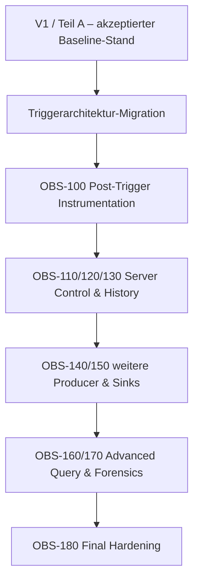

# Ausblick – Logging / Observability Teil B

## Kurz und einfach erklärt

Teil A hat das Fundament gebaut: Daten sammeln, vereinheitlichen, speichern, durchsuchen und anzeigen.

Nach dem großen Umbau der Triggerarchitektur wird das Haus weitergebaut:

- endgültige Trigger-/Activation-Instrumentierung;
- Serverhistorie direkt im Client;
- Adminfunktionen;
- LED als eigene Quelle;
- weitere Ausgabeziele;
- tiefere forensische Vergleiche.

Dieser Ausbau wurde absichtlich **nicht vor** die Triggerarchitektur gezogen.

---

## 1. Reihenfolge



---

## 2. OBS-100 – Post-Trigger Instrumentation Completion

Nach der Trigger-Migration wird die Instrumentierung an den endgültigen Lifecycle angepasst.

Besonders:

- serverautoritative Activation;
- First-Trigger-Lock;
- Manual/Wake-Word-Kollisionen;
- Finish;
- Cancel;
- Follow-up;
- Timeout;
- Generation/Stale Events;
- endgültige `activation_id`-Semantik.

Der Clientevent-Katalog wird danach systematisch aktualisiert.

---

## 3. OBS-110 – Server Control, Admin Auth & Capabilities

Ziel:

- administrativen Zugriff sauber vom normalen Sessionclient trennen;
- capability-basiert arbeiten;
- Credentials nicht in normale Clientpfade mischen.

---

## 4. OBS-120 – Remote Server History & Global Logs

Heute:

```text
LogQueryService → LocalLogProvider
```

Später:

```text
LogQueryService
├→ LocalLogProvider
└→ RemoteServerLogProvider
```

Damit kann dieselbe UI – abhängig von Berechtigung – auch Serverhistorie abfragen.

---

## 5. OBS-130 – Serverweite Admin-Settings

Serverweite Logging-/Retention-/Channel-Einstellungen sollen capability- und auth-basiert in den Desktopclient integrierbar sein.

Wichtige Trennung:

```text
lokale Clientsettings
≠ Sessionsettings
≠ serverweite Adminsettings
```

---

## 6. OBS-140 – LED-Controller als eigener Producer

LEFX/ReSpeaker ist heute teilweise über lokale Python-Logger sichtbar.

Später kann der LED-Controller als explizite Observability-Quelle angebunden werden:

```text
LED Source
→ Adapter
→ CanonicalLogRecord
```

ohne den Core an eine konkrete Transportart zu koppeln.

---

## 7. OBS-150 – Erweiterte Sinks / Storage

Mögliche spätere Ziele:

- weitere Dateiformate;
- Remote Collector;
- externe Storage-Backends.

V1 bleibt bewusst bei SQLite + optional JSONL.

---

## 8. OBS-160 – Advanced Query / UX

Hier gehören Komfortfunktionen hin, die den Triggerumbau nicht verzögern sollen.

Bereits notiert:

- freie rechteckige Zellselektion;
- TSV-Copy;
- vollständige Records als JSON kopieren;
- stärkere Live-/History-Trennung bzw. Tabs;
- Typ-Dropdown;
- erweiterte Freitextsuche;
- weitere Analyse-/Exporthilfen.

---

## 9. OBS-170 – Cross-Source Correlation / Forensics

Ziel:

```text
Clientrecord
↔ Serverevent
↔ Triggercommand
↔ Activation
↔ Recording
↔ Final
↔ Feedback / LED
```

systematisch vergleichen.

Bevorzugte Beweisquellen:

- IDs;
- Cursor;
- Generation;
- Sequenzen;
- Zeitstempel ergänzend.

---

## 10. OBS-180 – Final Hardening, Dokumentation & Acceptance

Gesamtabschluss mit u. a.:

- vollständiger Testmatrix;
- DB-Migrationen;
- Retention;
- Large-History-Performance;
- Multi-Provider-Verhalten;
- Authfehlern;
- Remote History;
- LED Producer;
- Crash/Restart;
- Packaging;
- Upgrade von V1-DB;
- finaler Dokumentation;
- manueller UX-Abnahme;
- finaler Traceability und Evidence.

---

## 11. Leitregel für Teil B

> **V1 musste Teil B nicht implementieren, durfte seine Schnittstellen aber nicht verbauen.**

Darum existieren bereits:

- Canonical Model;
- Provider-Abstraktion;
- getrennte Producerdimension;
- Query-Service;
- Store-/Sink-Protokolle;
- strukturierte IDs;
- getrennte UI-/Core-Schichten.

Teil B soll diese Architektur erweitern, nicht ersetzen.

---

## 12. Nächster Hauptschritt

Vor Teil B steht die **einheitliche serverseitige Triggerarchitektur**.

Teil A ist mit `OBS-CLOSE-001` kontrolliert abgeschlossen und archiviert (`CONTROLLED CLOSED / ACCEPTED PRE-TRIGGER BASELINE`, `G-OBS-V1 NOT PASSED`). Teil B ist im Masterplan als `DEFERRED / POST-TRIGGER` verankert und beginnt mit `OBS-100`, sobald die Trigger-/Session-Migration stabil genug ist, um die Post-Migration-Instrumentierung sinnvoll abzuschließen.
